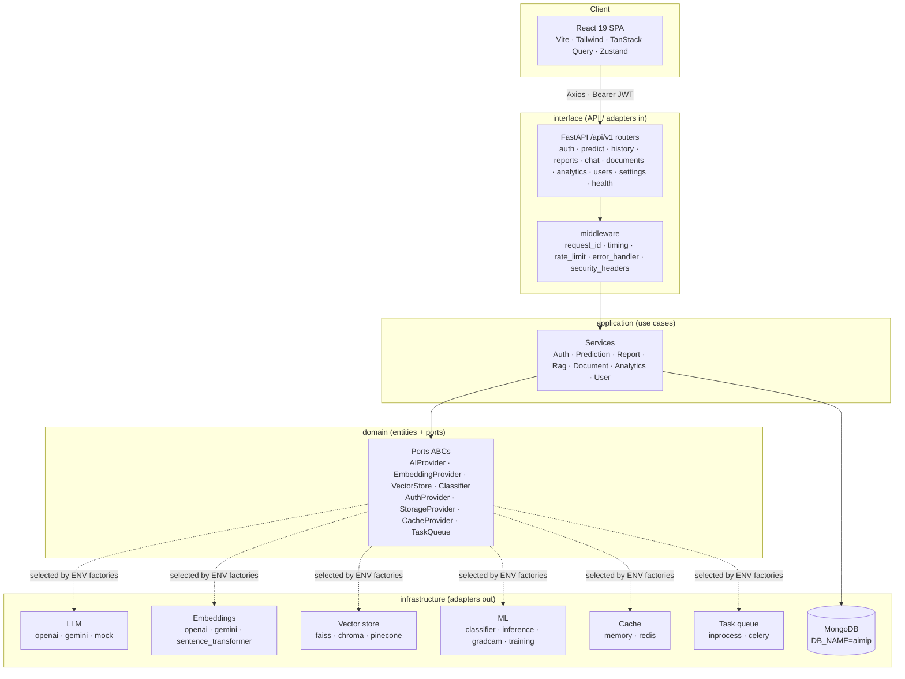

# Advanced AI Medical Intelligence Platform (AIMIP)

> Explainable, LLM-assisted chest X-ray decision support — classify, explain,
> report, and answer, behind enterprise-grade auth, architecture, and observability.

[](.github/workflows/ci.yml)
[](LICENSE)
[](docs/34_Developer_Guide.md)
[](docs/34_Developer_Guide.md)

AIMIP is an enterprise AI healthcare SaaS for clinical **decision-support** (it is
**not** a medical device). It classifies chest X-rays for pneumonia, explains the
result with Grad-CAM, drafts an LLM medical report, and answers grounded medical
questions through a RAG knowledge assistant — all behind JWT auth, persisted in
MongoDB, with a premium React frontend, analytics, containerization, CI, and
observability.

> **Clinical disclaimer.** AIMIP outputs are **informational, not a diagnosis**. A
> licensed clinician must review all results. No PHI should be uploaded without
> consent. The platform is **not** FDA/CE cleared.

---

## Table of contents

- [Overview](#overview)
- [Features](#features)
- [Architecture](#architecture)
- [Tech stack](#tech-stack)
- [Screenshots](#screenshots)
- [Quickstart](#quickstart)
- [Environment configuration](#environment-configuration)
- [AI / ML capabilities](#ai--ml-capabilities)
- [API summary](#api-summary)
- [Docker & deployment](#docker--deployment)
- [Project structure](#project-structure)
- [Documentation index](#documentation-index)
- [Roadmap](#roadmap)
- [Disclaimer](#disclaimer)
- [License](#license)

---

## Overview

The platform delivers one complete clinical pipeline —
**upload → classify → Grad-CAM → LLM report → persist → review** — and a second
knowledge surface — **ingest medical PDFs → embed → retrieve → grounded answer
with citations**. It is built on a Clean / Hexagonal (Ports & Adapters)
architecture so that every external dependency (LLM, embeddings, vector store,
model architecture, cache, task queue, auth, storage) is a swappable adapter
chosen at startup from environment variables. Business logic depends only on
ports; a provider change is a `.env` change, not a refactor.

See the [Project Vision](docs/01_Project_Vision.md) and
[Software Requirements Specification](docs/02_Software_Requirements_Specification.md)
for scope, success metrics, and non-functional targets.

---

## Features

- **Pneumonia classification** — chest X-ray → `NORMAL` / `PNEUMONIA` with
  softmax confidence and full probabilities, on `densenet121` (default) or
  `efficientnet_b0`.
- **Out-of-distribution guard** — non-chest-X-ray uploads are flagged
  (`ood_flag`) and a confident label is suppressed.
- **Explainable AI (Grad-CAM)** — original, heatmap, and overlay images served as
  URLs, hooked on the classifier's target layer.
- **LLM medical report** — structured Markdown report (summary, findings, possible
  condition, medical explanation, recommendations, risk level, disclaimer) via a
  provider-agnostic `AIProvider`.
- **RAG knowledge assistant** — ingest WHO/NIH/research PDFs, hybrid retrieval
  (dense + BM25) with reranking, grounded answers with citations, and a refusal
  gate for out-of-scope questions.
- **Auth & RBAC** — JWT access/refresh with rotation, lockout, and roles
  (`user` / `doctor` / `admin`).
- **Analytics** — overview, trends, disease distribution, confidence distribution,
  and recent-activity dashboards.
- **Enterprise foundations** — RFC 7807 errors, structured logging, Prometheus
  metrics, rate limiting, audit logging, 12-factor config, and CI.

---

## Architecture

Clean / Hexagonal (Ports & Adapters). Dependency direction:
`domain ← application ← infrastructure ← interface`.



Full detail: [System Architecture](docs/03_System_Architecture.md) ·
[Design Patterns](docs/09_Design_Patterns.md) ·
[Ports & Adapters](docs/10_Ports_And_Adapters.md).

---

## Tech stack

**Backend** — Python 3.11+ (target 3.11, **not** 3.12), FastAPI, Pydantic v2 +
pydantic-settings, Motor (async MongoDB), PyTorch + torchvision, Pillow,
opencv-python-headless, NumPy, scikit-learn, PyMuPDF (fitz),
sentence-transformers, faiss-cpu, chromadb, openai, google-generativeai,
python-jose[cryptography], passlib[bcrypt], python-multipart, uvicorn[standard],
redis, celery, prometheus-client, structlog, httpx; pytest, pytest-asyncio, ruff,
mypy. *(TensorFlow and LlamaIndex are intentionally not used.)*

**Frontend** — React 19, Vite, TypeScript, TailwindCSS, Framer Motion, TanStack
Query, Zustand, React Hook Form + Zod, Axios, React Router v6, Recharts,
Lucide-react, ESLint + Prettier, Vitest + React Testing Library.

**Infra** — MongoDB Atlas, Redis, Docker + docker-compose, nginx, GitHub Actions.
*(Docker is not installed on the current dev machine; container artifacts are
authored and run later.)*

---

## Screenshots

Placeholder references — replace with captured images under `docs/assets/`.

| View | Image |
|------|-------|
| Dashboard | `docs/assets/screenshot-dashboard.png` |
| Prediction + Grad-CAM | `docs/assets/screenshot-prediction.png` |
| Generated report | `docs/assets/screenshot-report.png` |
| Knowledge Assistant (RAG) | `docs/assets/screenshot-chat.png` |
| Analytics | `docs/assets/screenshot-analytics.png` |


See [Frontend Design System](docs/32_Frontend_Design_System.md) for the visual
language (medical palette, glassmorphism, dark mode, WCAG 2.1 AA).

---

## Quickstart

Prerequisites: Python **3.11+**, Node **20+/npm**, MongoDB, and (optionally) Redis.
Full walkthrough: [Developer Guide](docs/34_Developer_Guide.md).

**Backend**

```bash
cd backend
python -m venv .venv
source .venv/Scripts/activate      # Windows PowerShell: .\.venv\Scripts\Activate.ps1
pip install -r requirements.txt
cp .env.example .env               # PowerShell: Copy-Item .env.example .env
uvicorn app.main:app --reload      # http://localhost:8000  (/docs, /health/live)
```

**Frontend**

```bash
cd frontend
npm install
cp .env.example .env               # PowerShell: Copy-Item .env.example .env
npm run dev                        # http://localhost:5173
```

**Seed, ingest, train, test**

```bash
cd backend
python scripts/seed_db.py          # baseline data + indexes + admin
python scripts/ingest_docs.py      # ingest PDFs from PDF_PATH into the RAG index
python scripts/train.py            # optional; pretrained-inference fallback otherwise
pytest --cov=app                   # unit + integration + contract, coverage >= 80%
```

The defaults boot fully offline (`LLM_PROVIDER=mock`,
`EMBEDDING_PROVIDER=sentence_transformer`, `CACHE_PROVIDER=memory`,
`TASK_QUEUE=inprocess`). Hitting a wall? See
[Troubleshooting](docs/36_Troubleshooting.md).

---

## Environment configuration

Configuration is 12-factor and **fails fast** — e.g. `LLM_PROVIDER=openai` with an
empty `OPENAI_API_KEY` raises at startup. Selected essentials:

| Variable | Default | Purpose |
|----------|---------|---------|
| `ENV` | `development` | `development` / `staging` / `production` |
| `CORS_ORIGINS` | `http://localhost:5173` | Allowed frontend origins |
| `API_V1_PREFIX` | `/api/v1` | Versioned API prefix |
| `LLM_PROVIDER` | `openai` | `openai` / `gemini` / `mock` |
| `EMBEDDING_PROVIDER` | `openai` | `openai` / `gemini` / `sentence_transformer` |
| `VECTOR_DB` | `faiss` | `faiss` / `chroma` / `pinecone` |
| `MODEL_ARCH` | `densenet121` | `densenet121` / `efficientnet_b0` |
| `CACHE_PROVIDER` | `memory` | `memory` / `redis` |
| `TASK_QUEUE` | `inprocess` | `inprocess` / `celery` |
| `MONGODB_URI` / `DB_NAME` | `mongodb://localhost:27017` / `aimip` | Primary datastore |
| `REDIS_URL` | `redis://localhost:6379/0` | Cache / Celery broker |
| `JWT_SECRET` / `ACCESS_TOKEN_EXPIRE_MINUTES` | `change-me` / `30` | Auth |
| `MODEL_PATH` | `./data/weights/model.pt` | Classifier checkpoint |
| `MAX_UPLOAD_SIZE` / `ALLOWED_IMAGE_TYPES` | `10485760` / `image/png,image/jpeg` | Upload guards |
| `RAG_TOP_K` / `RAG_MIN_SCORE` | `5` / `0.2` | Retrieval & refusal gate |
| `VITE_API_BASE_URL` | `http://localhost:8000/api/v1` | Frontend → API base |

Full reference: [Environment Configuration](docs/31_Environment_Configuration.md).

---

## AI / ML capabilities

- **Model & dataset** — torchvision `densenet121` (default, ImageNet-pretrained)
  with a 2-class `[NORMAL, PNEUMONIA]` head; alt `efficientnet_b0`. Input
  224×224, ImageNet mean/std. Trained on the Kaggle **"Chest X-Ray Images
  (Pneumonia)"** dataset (Kermany et al.). See
  [Machine Learning Pipeline](docs/12_Machine_Learning_Pipeline.md).
- **Training** — transfer learning (freeze → fine-tune head → optional unfreeze),
  AdamW, class-weighted cross-entropy, early stopping; metrics accuracy,
  precision, recall, F1, AUROC, confusion matrix; checkpoint → `MODEL_PATH`.
  Optional — a pretrained-inference fallback lets the app run without training.
- **Inference** — runs in a threadpool executor (never blocks the event loop);
  returns predicted class, confidence, and full probabilities, with an **OOD
  guard**.
- **Grad-CAM** — forward/backward hooks on the classifier target layer; original,
  heatmap, and overlay PNGs under `GRADCAM_PATH`, served as URLs. See
  [Explainability (Grad-CAM)](docs/13_Explainability_GradCAM.md).
- **RAG** — PyMuPDF load → clean → chunk → embed → vector store → hybrid retrieve
  → rerank → grounded answer with citations; refuses below `RAG_MIN_SCORE`. See
  [RAG Knowledge Assistant](docs/15_RAG_Knowledge_Assistant.md).
- **LLM report** — a Builder assembles the structured report through `AIProvider`.
  See [Report Generation](docs/14_Report_Generation.md).

---

## API summary

Versioned under `/api/v1`. Errors use RFC 7807
`{type, title, status, detail, instance, errors?}`; lists use
`{items, page, size, total, pages}`; auth via `Authorization: Bearer <access>`.
Full contract: [API Design](docs/18_API_Design.md).

| Area | Endpoints |
|------|-----------|
| **Auth** | `POST /auth/register` · `POST /auth/login` · `POST /auth/refresh` · `POST /auth/logout` · `GET /auth/me` |
| **Predict** | `POST /predict` (multipart `file`, `Idempotency-Key`) · `GET /predict/{id}` |
| **History** | `GET /history?page&size&from&to` |
| **Reports** | `GET /reports/{prediction_id}` · `POST /reports/{prediction_id}/regenerate` |
| **Chat / RAG** | `POST /chat` · `GET /chat/sessions` · `GET /chat/sessions/{id}` |
| **Documents** | `POST /documents` · `GET /documents` · `DELETE /documents/{id}` |
| **Analytics** | `GET /analytics/overview` · `/analytics/trends?interval=day\|week` · `/analytics/disease-distribution` · `/analytics/confidence-distribution` · `/analytics/recent-activity` |
| **Users (admin)** | `GET /users` · `GET /users/{id}` · `PATCH /users/{id}` · `DELETE /users/{id}` |
| **Settings** | `GET /settings` · `PATCH /settings` |
| **Ops (no prefix)** | `GET /health/live` · `GET /health/ready` · `GET /metrics` · `GET /docs` |

Roles: `user`, `doctor`, `admin` — enforced via `require_role(...)`. See
[Authorization & RBAC](docs/20_Authorization_RBAC.md).

---

## Docker & deployment

Docker is **optional** and not installed on the current dev machine; the stack
runs natively for development. The container path — `backend/Dockerfile`,
`frontend/Dockerfile`, `nginx.conf`, and `docker-compose.yml` (api, frontend,
mongo, redis) — is authored and validated in CI, then run in the target
environment where nginx serves the SPA and reverse-proxies `/api/v1`.

- [Containerization (Docker)](docs/28_Containerization_Docker.md)
- [Deployment & Infrastructure](docs/29_Deployment_And_Infrastructure.md)
- [CI/CD Pipeline](docs/27_CI_CD_Pipeline.md)

---

## Project structure

Monorepo: `backend/` (Clean/Hexagonal FastAPI app + ML + workers + scripts),
`frontend/` (React 19 SPA), `docs/` (numbered docs 00–37), `data/` (gitignored
uploads/gradcam/vector_index/pdfs/weights), plus `docker-compose.yml`,
`.github/workflows/ci.yml`, and root project files.

```
AI_Prediction_System/
├── backend/    app/{core,domain,application,infrastructure,interface,workers} · tests · scripts
├── frontend/   src/{app,pages,features,components,hooks,lib,store,styles,types}
├── docs/       00–37 numbered docs
├── data/       uploads/ gradcam/ vector_index/ pdfs/ weights/   (gitignored)
├── docker-compose.yml · .github/workflows/ci.yml
└── README.md · CHANGELOG.md · CONTRIBUTING.md · LICENSE · .gitignore
```

Full map: [Project Structure](docs/06_Project_Structure.md).

---

## Documentation index

All 38 numbered documents (00–37) live in [`docs/`](docs/).

| # | Document |
|---|----------|
| 00 | [Project Roadmap](docs/00_Project_Roadmap.md) |
| 01 | [Project Vision](docs/01_Project_Vision.md) |
| 02 | [Software Requirements Specification](docs/02_Software_Requirements_Specification.md) |
| 03 | [System Architecture](docs/03_System_Architecture.md) |
| 04 | [Architecture Decision Records](docs/04_Architecture_Decision_Records.md) |
| 05 | [Domain Model](docs/05_Domain_Model.md) |
| 06 | [Project Structure](docs/06_Project_Structure.md) |
| 07 | [Backend Architecture](docs/07_Backend_Architecture.md) |
| 08 | [Frontend Architecture](docs/08_Frontend_Architecture.md) |
| 09 | [Design Patterns](docs/09_Design_Patterns.md) |
| 10 | [Ports & Adapters](docs/10_Ports_And_Adapters.md) |
| 11 | [Provider Adapters](docs/11_Provider_Adapters.md) |
| 12 | [Machine Learning Pipeline](docs/12_Machine_Learning_Pipeline.md) |
| 13 | [Explainability (Grad-CAM)](docs/13_Explainability_GradCAM.md) |
| 14 | [Report Generation](docs/14_Report_Generation.md) |
| 15 | [RAG Knowledge Assistant](docs/15_RAG_Knowledge_Assistant.md) |
| 16 | [Data Management](docs/16_Data_Management.md) |
| 17 | [Database Design](docs/17_Database_Design.md) |
| 18 | [API Design](docs/18_API_Design.md) |
| 19 | [Authentication (JWT)](docs/19_Authentication_JWT.md) |
| 20 | [Authorization & RBAC](docs/20_Authorization_RBAC.md) |
| 21 | [Security Design](docs/21_Security_Design.md) |
| 22 | [Error Handling & Logging](docs/22_Error_Handling_And_Logging.md) |
| 23 | [Observability](docs/23_Observability.md) |
| 24 | [Caching Strategy](docs/24_Caching_Strategy.md) |
| 25 | [Task Queue & Workers](docs/25_Task_Queue_And_Workers.md) |
| 26 | [Testing Strategy](docs/26_Testing_Strategy.md) |
| 27 | [CI/CD Pipeline](docs/27_CI_CD_Pipeline.md) |
| 28 | [Containerization (Docker)](docs/28_Containerization_Docker.md) |
| 29 | [Deployment & Infrastructure](docs/29_Deployment_And_Infrastructure.md) |
| 30 | [Performance & Scalability](docs/30_Performance_And_Scalability.md) |
| 31 | [Environment Configuration](docs/31_Environment_Configuration.md) |
| 32 | [Frontend Design System](docs/32_Frontend_Design_System.md) |
| 33 | [Project Report](docs/33_Project_Report.md) |
| 34 | [Developer Guide](docs/34_Developer_Guide.md) |
| 35 | [Contribution Guide](docs/35_Contribution_Guide.md) |
| 36 | [Troubleshooting](docs/36_Troubleshooting.md) |
| 37 | [Future Roadmap](docs/37_Future_Roadmap.md) |

---

## Roadmap

Delivery is phased: **Phase 0** foundations & documentation, **Phase 1** MVP
vertical slice (auth → classify → Grad-CAM → report → UI), **Phase 2** capability
expansion (RAG, documents, analytics, provider adapters), **Phase 3** hardening &
deployment (security, observability, containers, DR). See the
[Project Roadmap](docs/00_Project_Roadmap.md) and post-1.0 direction in the
[Future Roadmap](docs/37_Future_Roadmap.md).

---

## Disclaimer

AIMIP is a clinical **decision-support** tool, **not** a medical device. Its
outputs are **informational and not a diagnosis** — a licensed clinician must
review all results. No PHI should be uploaded without consent, and the platform is
**not** FDA/CE cleared.

---

## License

Released under the [MIT License](LICENSE). Copyright (c) 2026 DTable Analytics.
