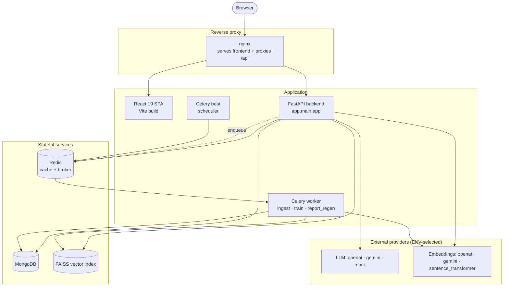

# Advanced AI Medical Intelligence Platform (AIMIP)

> Explainable chest X-ray pneumonia screening, LLM-authored medical reports, and a grounded RAG knowledge assistant — as an enterprise, decision-support SaaS.

[](.github/workflows/ci.yml)
[](LICENSE)
[](backend/requirements.txt)
[](frontend/package.json)
[](https://fastapi.tiangolo.com/)
[](https://react.dev/)
[](docker-compose.yml)

---

## Overview

**AIMIP** is a full-stack, production-hardened platform that turns a chest X-ray upload into an
explainable pipeline: a PyTorch classifier predicts `NORMAL` vs `PNEUMONIA`, **Grad-CAM** renders
the visual evidence, an **LLM** drafts a structured medical report, and a **retrieval-augmented
knowledge assistant** answers clinical-knowledge questions strictly from a curated corpus of vetted
medical PDFs. Everything sits behind JWT auth with role-based access, is persisted in MongoDB, and
ships with a premium React 19 frontend, analytics, Docker packaging, CI, and observability.

The codebase was built across six phases — **foundation → prediction pipeline (Grad-CAM + LLM
reports) → premium React frontend → RAG knowledge assistant → model training pipeline → production
hardening** (Docker / CI / security / observability) — on a Clean / Hexagonal architecture whose
providers are all swappable through environment variables.

> **Medical disclaimer.** AIMIP is a **clinical decision-support** platform, **not a medical
> device**. All outputs (predictions, Grad-CAM overlays, reports, chat answers) are **informational,
> not a diagnosis**; a licensed clinician must review every result. No PHI should be uploaded without
> consent. The platform is **not FDA/CE cleared**.

---

## Features

- **AI prediction + Explainable AI (Grad-CAM).** Chest X-ray classification (`NORMAL` /
  `PNEUMONIA`) with softmax confidence and full class probabilities, run in a threadpool so it never
  blocks the event loop. An **OOD guard** flags non-chest-X-ray uploads. Grad-CAM produces original,
  heatmap, and overlay PNGs served as URLs.
- **LLM medical reports.** A Builder assembles a structured report — `summary`, `findings`,
  `possible_condition`, `medical_explanation`, `recommendations`, `risk_level`, `disclaimer` — as
  Markdown, generated through the `AIProvider` port and regenerable on demand.
- **RAG knowledge assistant.** Ingest medical PDFs (WHO / NIH / research), then ask grounded
  questions. Hybrid retrieval (dense + BM25 → rerank) yields **cited** answers and **refuses** when
  the top score falls below `RAG_MIN_SCORE` ("insufficient context") — it never answers ungrounded.
- **Analytics.** Overview KPIs, prediction trends, disease distribution, confidence distribution,
  and recent activity — scoped to the caller's data for `user`, platform-wide for `doctor`/`admin`.
- **Auth & RBAC.** JWT access/refresh with rotation and reuse detection, account lockout, and three
  roles (`user`, `doctor`, `admin`) enforced by a `require_role(...)` dependency; privileged access
  to PHI is written to an append-only audit log.
- **Provider abstraction.** LLM, embeddings, vector store, model architecture, auth, storage, cache,
  and task queue are all **ports** selected by ENV — swap OpenAI↔Gemini, faiss↔chroma, memory↔redis,
  in-process↔celery with a `.env` change and no code edits.
- **Model training pipeline.** Transfer-learning trainer (DenseNet-121 / EfficientNet-B0) with class
  weights, early stopping, full evaluation, artifacts, and a model registry the inference engine
  auto-loads from.
- **Observability & security.** Structured JSON logs, Prometheus `/metrics`, health probes, request
  IDs, rate limiting, gzip, request-size caps, security headers, CORS, and trusted-host filtering.

---

## Architecture



AIMIP is built on **Clean / Hexagonal (Ports & Adapters)** architecture with the dependency
direction `domain ← application ← infrastructure ← interface`. Business logic (application/domain)
depends only on **ports** — abstract base classes — and **never calls a vendor SDK directly**.
Concrete **adapters** are chosen at startup by **factories** that read ENV, wired once in the
composition root (`core/container.py`) and injected via FastAPI `Depends`. This makes every provider
a plugin selected purely by configuration:

| Port | ENV selector | Adapters |
|------|--------------|----------|
| `AIProvider` | `LLM_PROVIDER` | `openai` · `gemini` · `mock` |
| `EmbeddingProvider` | `EMBEDDING_PROVIDER` | `openai` · `gemini` · `sentence_transformer` |
| `VectorStore` | `VECTOR_DB` | `faiss` · `chroma` · `pinecone` |
| `Classifier` | `MODEL_ARCH` | `densenet121` · `efficientnet_b0` |
| `AuthProvider` | `AUTH_PROVIDER` | `jwt` |
| `StorageProvider` | `STORAGE_PROVIDER` | `mongodb` |
| `CacheProvider` | `CACHE_PROVIDER` | `memory` · `redis` |
| `TaskQueue` | `TASK_QUEUE` | `inprocess` · `celery` |

The full design is documented in the [`docs/`](docs/) suite — see
[System Architecture](docs/03_System_Architecture.md), [Backend Architecture](docs/07_Backend_Architecture.md),
[AI Providers](docs/16_AI_Providers.md), and [RAG Architecture](docs/13_RAG_Architecture.md).

---

## Tech stack

**Backend** — Python 3.11+, FastAPI 0.115, Uvicorn, Pydantic v2 + pydantic-settings, Motor / PyMongo
(async MongoDB), PyTorch 2.5 + torchvision, Pillow, OpenCV (headless), NumPy, scikit-learn, PyMuPDF,
sentence-transformers, faiss-cpu, rank-bm25, chromadb, python-jose + passlib[bcrypt], SlowAPI,
Celery 5 + Redis, prometheus-client, structlog, httpx. Tooling: pytest + pytest-asyncio, ruff, mypy.

**Frontend** — React 19, Vite 6, TypeScript 5.7, TailwindCSS 3, Framer Motion, TanStack Query
(server state), Zustand (UI state), React Hook Form + Zod, Axios, React Router v6, Recharts,
Lucide-react, react-markdown + remark-gfm. Tooling: ESLint, Vitest + React Testing Library.

**Infrastructure** — MongoDB 7, Redis 7, Docker + docker-compose, nginx 1.27 (frontend serve +
reverse proxy), GitHub Actions CI.

---

## Screenshots

| View | Image |
|------|-------|
| Dashboard | `docs/assets/dashboard.png` |
| Prediction + Grad-CAM | `docs/assets/prediction.png` |
| Knowledge Assistant | `docs/assets/assistant.png` |
| Analytics | `docs/assets/analytics.png` |
| End-to-end demo | `docs/assets/demo.gif` |

> Screenshots/GIFs: capture from the running app and place under `docs/assets/`. The paths above are
> references to be filled in — no image files are bundled with this repository yet.

---

## Quick start (local dev)

Prerequisites: Python 3.11+, Node.js 20+. MongoDB and Redis are recommended; without them the app
runs in a **degraded mode** — the default selectors (`CACHE_PROVIDER=memory`, `TASK_QUEUE=inprocess`,
`LLM_PROVIDER=mock`, in-memory/pretrained fallbacks) let the platform boot and serve without external
services or a trained model.

**Backend**

```bash
cd backend
python -m venv .venv
# Windows: .venv\Scripts\activate   |   macOS/Linux: source .venv/bin/activate
pip install -r requirements.txt
cp .env.example .env                 # then edit secrets/selectors
uvicorn app.main:app --reload        # http://localhost:8000  (Swagger at /docs)
```

**Frontend**

```bash
cd frontend
npm install
cp .env.example .env                 # VITE_API_BASE_URL=http://localhost:8000/api/v1
npm run dev                          # http://localhost:5173
```

---

## Docker (one command)

Prerequisite: Docker (with Compose) installed.

```bash
cp .env.example .env                 # then set a strong JWT_SECRET (compose refuses to start without it)
docker compose up --build            # or: make up
# AIMIP is served at http://localhost
```

The stack (`docker-compose.yml`) starts these services:

| Service | Image / build | Role |
|---------|---------------|------|
| `nginx` | nginx:1.27-alpine | Reverse proxy on `:80`; serves the SPA and proxies `/api` |
| `frontend` | `./frontend` | React build (static assets) |
| `backend` | `./backend` | FastAPI API |
| `worker` | `./backend` | Celery worker (queue `aimip`) |
| `beat` | `./backend` | Celery beat scheduler |
| `mongo` | mongo:7 | Application database |
| `redis` | redis:7-alpine | Cache + Celery broker/result backend |

In the Docker profile the defaults favour zero external keys: `LLM_PROVIDER=mock`,
`EMBEDDING_PROVIDER=sentence_transformer`, `CACHE_PROVIDER=redis`, `TASK_QUEUE=celery`, `VECTOR_DB=faiss`.
Set `OPENAI_API_KEY`/`GEMINI_API_KEY` and switch `LLM_PROVIDER`/`EMBEDDING_PROVIDER` for real models.

---

## Model training guide

Training is optional — the inference engine falls back to a pretrained backbone so the app works
without a trained checkpoint or the dataset. The pipeline is driven by
[`backend/scripts/train.py`](backend/scripts/train.py) and
[`backend/configs/training.yaml`](backend/configs/training.yaml).

```bash
cd backend

# Verify the whole pipeline end-to-end with a generated dataset (no download, CPU-friendly)
python scripts/train.py --synthetic --arch densenet121 --epochs 4

# Train on the real Kaggle dataset (place it under data/datasets/chest_xray/{train,val,test}/{NORMAL,PNEUMONIA})
python scripts/train.py --config configs/training.yaml

# Same pipeline, alternate architecture — one flag, no code change
python scripts/train.py --config configs/training.yaml --arch efficientnet_b0

# Best-effort dataset download via kagglehub (requires Kaggle credentials)
python scripts/train.py --download
```

The dataset is Kaggle "Chest X-Ray Images (Pneumonia)" (`paultimothymooney/chest-xray-pneumonia`).
Training uses transfer learning (freeze backbone → fine-tune head → unfreeze), AdamW + weighted
cross-entropy, cosine LR schedule, gradient clipping, and early stopping, then evaluates on a
held-out split (accuracy, precision, recall, F1, ROC-AUC, confusion matrix). Each run writes
artifacts under `data/training/` and appends to the **model registry** (`data/weights/registry.json`).
The inference engine **auto-loads** the newest **approved** registry entry for the active
`MODEL_ARCH` — so training a new model upgrades serving with no code change. See
[Model Training](docs/10_Model_Training.md) and [Model Inference](docs/11_Model_Inference.md).

---

## RAG guide

1. **Upload PDFs** on the **Documents** page (or `POST /documents`, admin-only). Ingestion — load
   (PyMuPDF) → clean → chunk → embed → index — runs asynchronously; poll `GET /documents` for
   `status` (`indexed`/`failed`) and `chunk_count`.
2. **Ask questions** in the **Knowledge Assistant** (or `POST /chat`). Answers are **grounded** with
   `citations[]` (`document_id`, `chunk_id`, `score`) and the assistant **refuses** with an
   "insufficient context" response when retrieval scores fall below `RAG_MIN_SCORE`.

Chunking and retrieval are tuned via `RAG_TOP_K`, `RAG_CHUNK_SIZE`, `RAG_CHUNK_OVERLAP`, and
`RAG_MIN_SCORE`. Full details in [RAG Architecture](docs/13_RAG_Architecture.md),
[Vector Database](docs/14_Vector_Database.md), and [Embedding System](docs/15_Embedding_System.md).

---

## API guide

All application endpoints are versioned under `/api/v1`; operational endpoints are unprefixed.
Errors use RFC 7807 (`application/problem+json`); collections use the
`{items, page, size, total, pages}` envelope. Full contract in [API Design](docs/18_API_Design.md).

| Area | Endpoints |
|------|-----------|
| Auth | `POST /auth/register` · `POST /auth/login` · `POST /auth/refresh` · `POST /auth/logout` · `GET /auth/me` |
| Predict | `POST /predict` (multipart `file`, `Idempotency-Key`) · `GET /predict/{id}` |
| History | `GET /history?page&size&from&to` |
| Reports | `GET /reports/{prediction_id}` · `POST /reports/{prediction_id}/regenerate` |
| Chat / RAG | `POST /chat` · `GET /chat/sessions` · `GET /chat/sessions/{id}` |
| Documents | `POST /documents` · `GET /documents` · `DELETE /documents/{id}` |
| Analytics | `GET /analytics/overview` · `/trends` · `/disease-distribution` · `/confidence-distribution` · `/recent-activity` |
| Users (admin) | `GET /users` · `GET /users/{id}` · `PATCH /users/{id}` · `DELETE /users/{id}` |
| Settings | `GET /settings` · `PATCH /settings` |
| Ops | `GET /health/live` · `GET /health/ready` · `GET /metrics` · `GET /docs` |

Interactive Swagger UI is at **`/docs`** (OpenAPI 3.1, also served as `/openapi.json`); Prometheus
metrics are at **`/metrics`**.

---

## Environment variables

Copy `backend/.env.example` (per-service, canonical) and/or the root `.env.example` (compose secrets)
and fill in values. Config **fails fast** — e.g. `LLM_PROVIDER=openai` with an empty `OPENAI_API_KEY`
raises at startup. Key variables:

| Variable | Purpose | Example / default |
|----------|---------|-------------------|
| `LLM_PROVIDER` | LLM adapter | `openai` \| `gemini` \| `mock` |
| `EMBEDDING_PROVIDER` | Embedding adapter | `openai` \| `gemini` \| `sentence_transformer` |
| `VECTOR_DB` | Vector store | `faiss` \| `chroma` \| `pinecone` |
| `MODEL_ARCH` | Classifier architecture | `densenet121` \| `efficientnet_b0` |
| `AUTH_PROVIDER` / `STORAGE_PROVIDER` | Auth / storage adapters | `jwt` / `mongodb` |
| `CACHE_PROVIDER` / `TASK_QUEUE` | Cache / job adapters | `memory`\|`redis` / `inprocess`\|`celery` |
| `OPENAI_API_KEY` / `GEMINI_API_KEY` | Provider keys | (secret) |
| `LLM_MODEL` / `EMBEDDING_MODEL` | Model ids | `gpt-4o-mini` / `text-embedding-3-small` |
| `MONGODB_URI` / `DB_NAME` / `REDIS_URL` | Data stores | `mongodb://localhost:27017` / `aimip` / `redis://localhost:6379/0` |
| `JWT_SECRET` | Token signing secret (**required**) | long random string |
| `ACCESS_TOKEN_EXPIRE_MINUTES` / `REFRESH_TOKEN_EXPIRE_DAYS` | Token lifetimes | `30` / `7` |
| `CORS_ORIGINS` / `ALLOWED_HOSTS` | CORS + trusted hosts | `http://localhost` / `*` |
| `RATE_LIMIT_ENABLED` / `RATE_LIMIT_PER_MINUTE` / `MAX_REQUEST_BYTES` | Hardening | `true` / `120` / `15728640` |
| `METRICS_ENABLED` / `WARMUP_ON_STARTUP` / `OTEL_ENABLED` | Observability | `true` / `false` / `false` |
| `RAG_TOP_K` / `RAG_CHUNK_SIZE` / `RAG_CHUNK_OVERLAP` / `RAG_MIN_SCORE` | RAG tuning | `5` / `800` / `120` / `0.2` |
| `VITE_API_BASE_URL` | Frontend → API base | `http://localhost:8000/api/v1` |

See the full annotated list in [`backend/.env.example`](backend/.env.example) and
[Environment Configuration](docs/31_Environment_Configuration.md).

---

## Deployment

AIMIP is **12-factor**: all config is environment-driven and the API is stateless and
horizontally scalable. For production:

- Set a **strong `JWT_SECRET`** and point `MONGODB_URI` / `REDIS_URL` at managed instances.
- Lock down `ALLOWED_HOSTS` and `CORS_ORIGINS` to real hostnames.
- Provide provider keys and select real adapters (`LLM_PROVIDER`, `EMBEDDING_PROVIDER`,
  `CACHE_PROVIDER=redis`, `TASK_QUEUE=celery`).
- **Scale** the `backend` (API) and `worker` (Celery) services independently; the `nginx` reverse
  proxy fronts everything.

Runs on any Docker host: **Render**, **Railway**, **Fly.io**, **AWS ECS**, **DigitalOcean App
Platform** — paired with **MongoDB Atlas** and a **managed Redis**. Details in
[Deployment](docs/28_Deployment.md) and [Docker](docs/29_Docker.md).

---

## Project structure

```
AI_Prediction_System/
├── backend/
│   ├── app/
│   │   ├── core/            # config, logging, security, exceptions, container (composition root)
│   │   ├── domain/          # entities, value objects, ports (ABCs)
│   │   ├── application/     # services + DTOs (business logic; depends only on ports)
│   │   ├── infrastructure/  # db, providers/{llm,embeddings,vector_db,cache,task_queue},
│   │   │                    #   ml/{classifier,inference,gradcam,training}, rag, auth, storage
│   │   ├── interface/       # api/v1 routers, schemas, middleware, dependencies
│   │   └── workers/         # celery app + tasks
│   ├── configs/             # training.yaml
│   ├── scripts/             # train.py, seed_db.py, ingest_docs.py
│   ├── tests/{unit,integration,contract}/
│   ├── requirements.txt · Dockerfile · .env.example
├── frontend/
│   ├── src/                 # app, pages, features, components, hooks, lib, store, styles, types
│   ├── package.json · vite.config.ts · nginx.conf · Dockerfile · .env.example
├── docs/                    # 38 numbered docs (00–37) + _CANON.md
├── deploy/nginx/            # nginx.conf + proxy_common.conf
├── data/                    # gitignored: uploads, gradcam, vector_index, pdfs, weights, datasets
├── docker-compose.yml · Makefile · LICENSE · README.md
```

---

## Testing

Backend and frontend gates mirror CI and run together via `make test`.

```bash
# Backend (from backend/)
pytest -q            # 126 tests (unit · integration · contract)
ruff check .         # lint
mypy app tests       # type-check

# Frontend (from frontend/)
npm run lint
npm run typecheck
npm run test:run
npm run build

# Everything at once (from repo root)
make test
```

Every provider port ships a shared **contract test** that all its adapters must pass, and the
`.env`-only provider swap is itself an automated test. CI ([`.github/workflows/ci.yml`](.github/workflows/ci.yml))
runs the backend, frontend, Docker image build, and a security job (pip-audit, npm audit, gitleaks)
on every push and PR to `main`. See [Testing Strategy](docs/27_Testing_Strategy.md).

---

## Documentation

The complete design lives in [`docs/`](docs/):

- [00 — Project Roadmap](docs/00_Project_Roadmap.md)
- [01 — Project Vision](docs/01_Project_Vision.md)
- [02 — Software Requirements Specification](docs/02_Software_Requirements_Specification.md)
- [03 — System Architecture](docs/03_System_Architecture.md)
- [04 — High-Level Architecture](docs/04_High_Level_Architecture.md)
- [05 — Low-Level Architecture](docs/05_Low_Level_Architecture.md)
- [06 — Folder Structure](docs/06_Folder_Structure.md)
- [07 — Backend Architecture](docs/07_Backend_Architecture.md)
- [08 — Frontend Architecture](docs/08_Frontend_Architecture.md)
- [09 — AI Architecture](docs/09_AI_Architecture.md)
- [10 — Model Training](docs/10_Model_Training.md)
- [11 — Model Inference](docs/11_Model_Inference.md)
- [12 — Grad-CAM](docs/12_GradCAM.md)
- [13 — RAG Architecture](docs/13_RAG_Architecture.md)
- [14 — Vector Database](docs/14_Vector_Database.md)
- [15 — Embedding System](docs/15_Embedding_System.md)
- [16 — AI Providers](docs/16_AI_Providers.md)
- [17 — Database Design](docs/17_Database_Design.md)
- [18 — API Design](docs/18_API_Design.md)
- [19 — Authentication](docs/19_Authentication.md)
- [20 — Authorization / RBAC](docs/20_Authorization_RBAC.md)
- [21 — UI/UX Guidelines](docs/21_UI_UX_Guidelines.md)
- [22 — Design System](docs/22_Design_System.md)
- [23 — Security](docs/23_Security.md)
- [24 — Logging](docs/24_Logging.md)
- [25 — Monitoring](docs/25_Monitoring.md)
- [26 — Background Jobs](docs/26_Background_Jobs.md)
- [27 — Testing Strategy](docs/27_Testing_Strategy.md)
- [28 — Deployment](docs/28_Deployment.md)
- [29 — Docker](docs/29_Docker.md)
- [30 — CI/CD](docs/30_CICD.md)
- [31 — Environment Configuration](docs/31_Environment_Configuration.md)
- [32 — Coding Standards](docs/32_Coding_Standards.md)
- [33 — Project Report](docs/33_Project_Report.md)
- [34 — Developer Guide](docs/34_Developer_Guide.md)
- [35 — Contribution Guide](docs/35_Contribution_Guide.md)
- [36 — Troubleshooting](docs/36_Troubleshooting.md)
- [37 — Future Roadmap](docs/37_Future_Roadmap.md)

---

## Roadmap

Planned extensions (full detail in [Future Roadmap](docs/37_Future_Roadmap.md)) include additional
auth providers (OAuth2, Keycloak), blob storage adapters (S3), managed vector stores (Pinecone),
multi-disease classification beyond pneumonia, streaming report generation, and OpenTelemetry
tracing wired to a collector.

---

## License

Released under the **MIT License** — `Copyright (c) 2026 DTable Analytics`. See [LICENSE](LICENSE).

---

> **Disclaimer.** AIMIP is clinical **decision-support**, **not a medical device**. Predictions,
> Grad-CAM overlays, reports, and chat answers are **informational, not a diagnosis**; a licensed
> clinician must review all results. The platform is **not FDA/CE cleared**, and no PHI should be
> uploaded without consent.
