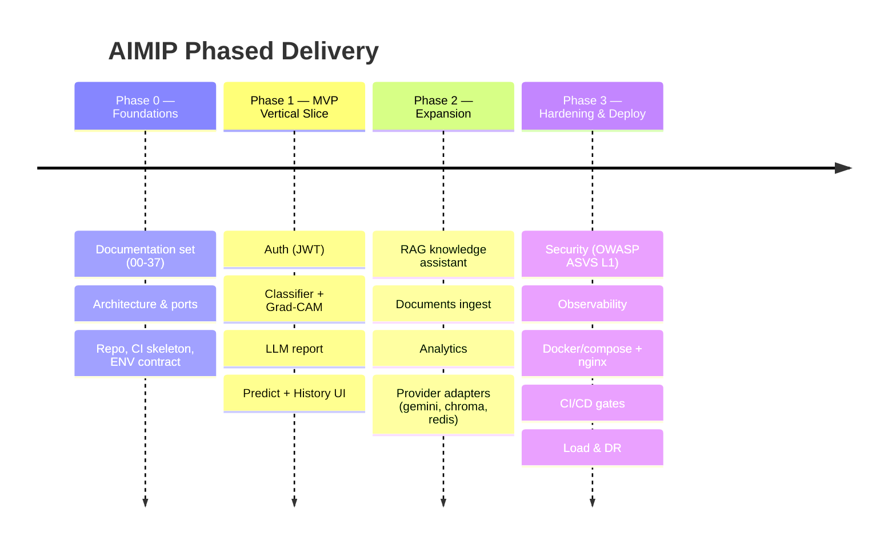
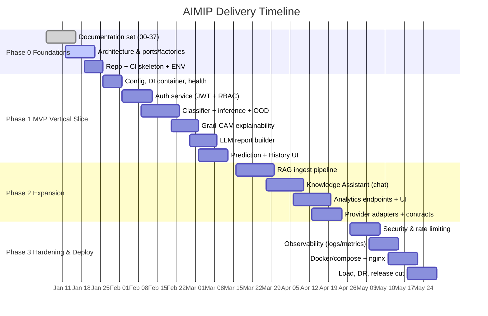
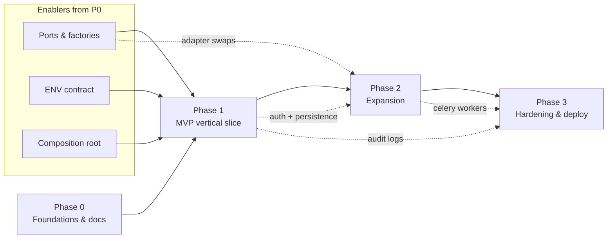

# 00 — Project Roadmap

This roadmap describes the phased delivery plan for the **Advanced AI Medical Intelligence Platform (AIMIP)** — an enterprise clinical **decision-support** SaaS (not a medical device) that classifies chest X-rays for pneumonia, explains the result with Grad-CAM, drafts an LLM medical report, and answers grounded medical questions through a RAG assistant. Delivery is organized so that documentation and architecture are settled first, a thin end-to-end vertical slice proves the whole pipeline early, and subsequent phases widen capability and then harden the system for production. The plan is intentionally sequenced against the Clean/Hexagonal architecture defined in the [CANON](_CANON.md): ports and factories exist from day one so that every later expansion is an adapter swap, not a rewrite.

> **Clinical disclaimer.** AIMIP outputs are informational and are **not** a diagnosis. A licensed clinician must review all results. No PHI is uploaded without consent, and the platform is **not** FDA/CE cleared. See [Project Vision](01_Project_Vision.md) for the full statement.

Related documents: [Project Vision](01_Project_Vision.md) · [Software Requirements Specification](02_Software_Requirements_Specification.md) · [Database Design](17_Database_Design.md) · [API Design](18_API_Design.md) · [Authorization & RBAC](20_Authorization_RBAC.md) · [Environment Configuration](31_Environment_Configuration.md) · [Project Report](33_Project_Report.md) · [Future Roadmap](37_Future_Roadmap.md).

---

## 1. Delivery philosophy

| Principle | How the roadmap applies it |
|-----------|----------------------------|
| Docs-first | Phase 0 fixes the contracts (ENV, endpoints, collections, ports) in the CANON before code, so parallel teams build against one truth. |
| Vertical slice before breadth | The MVP (Phase 1) ships one complete path — upload → classify → Grad-CAM → report → persist → view — instead of many half-finished features. |
| Ports over vendors | Business logic depends only on the ABCs in `domain/ports/`; providers (`LLM_PROVIDER`, `EMBEDDING_PROVIDER`, `VECTOR_DB`, `MODEL_ARCH`, `CACHE_PROVIDER`, `TASK_QUEUE`) are swapped by `.env`, never by refactor. |
| Contract-tested swaps | Every port ships a shared contract test in `tests/contract/`; a provider swap is itself an automated test, which lets later phases add adapters safely. |
| Fail fast | Config validation (e.g. `LLM_PROVIDER=openai` with empty `OPENAI_API_KEY`) raises at startup, catching environment drift before it reaches users. |
| Definition of Done | No phase closes until its exit criteria (below) are met and the relevant NFR targets from the [SRS](02_Software_Requirements_Specification.md) are demonstrated. |

---

## 2. Phase overview

| Phase | Theme | Primary outcome | Indicative duration |
|-------|-------|-----------------|---------------------|
| **0** | Foundations & documentation | Approved architecture, contracts, and runnable skeleton | Weeks 1–3 |
| **1** | MVP vertical slice | One clinician can log in, upload an X-ray, and receive an explained, reported, persisted prediction | Weeks 4–9 |
| **2** | Capability expansion | RAG assistant, document ingest, analytics, alternate providers | Weeks 10–16 |
| **3** | Hardening & deployment | Secure, observable, containerized, load-tested, DR-ready release | Weeks 17–22 |

---

## 3. Gantt schedule

> Dates are indicative planning anchors. Docker is **not** installed on the current dev machine, so container artifacts (Phase 3) are authored and validated in CI, then run in the target environment.

---

## 4. Phase 0 — Foundations & documentation

**Goal.** Establish the single source of truth, the architecture, and a runnable-but-empty skeleton so every later phase is additive.

### 4.1 Deliverables

| # | Deliverable | Detail |
|---|-------------|--------|
| 0.1 | Documentation set | Numbered docs `00`–`37` authored against the [CANON](_CANON.md), including this roadmap, the [Vision](01_Project_Vision.md), the [SRS](02_Software_Requirements_Specification.md), and the [Future Roadmap](37_Future_Roadmap.md). |
| 0.2 | Architecture baseline | Clean/Hexagonal layout `backend/app/{core,domain,application,infrastructure,interface,workers}` with dependency direction `domain ← application ← infrastructure ← interface`. |
| 0.3 | Ports & factories | All eight port ABCs in `domain/ports/` and a `get_<x>_provider(settings)` factory per port under `infrastructure/providers/<x>/factory.py`. |
| 0.4 | ENV contract | `.env.example` for backend and frontend reflecting every canonical variable in [Environment Configuration](31_Environment_Configuration.md). |
| 0.5 | Composition root | `core/config.py` (`Settings`, pydantic-settings), `core/container.py`, `core/logging.py`, `core/security.py`, `core/exceptions.py`. |
| 0.6 | CI skeleton | `.github/workflows/ci.yml` running `ruff`, `mypy`, `pytest`; frontend `eslint`, `prettier`, `vitest`. |
| 0.7 | Health surface | `GET /health/live`, `GET /health/ready`, `GET /metrics`, `GET /docs`. |

### 4.2 Exit criteria

- Every doc `00`–`37` exists, cross-links resolve, and no doc contains TODO/TBD/placeholder text.
- `uvicorn` boots the app factory in `app/main.py`; `/health/live` returns 200 and `/docs` renders.
- All eight factories return the `mock`/in-process default adapters and pass their contract-test scaffold.
- Config **fails fast**: booting with `LLM_PROVIDER=openai` and empty `OPENAI_API_KEY` raises at startup.
- CI is green on an empty-but-structured repository.

---

## 5. Phase 1 — MVP vertical slice

**Goal.** Prove the entire clinical pipeline end-to-end for a single user path, using default providers (`LLM_PROVIDER=mock` acceptable in CI, `openai` in demo), `MODEL_ARCH=densenet121`, `CACHE_PROVIDER=memory`, `TASK_QUEUE=inprocess`.

### 5.1 Milestones, deliverables & exit criteria

| Milestone | Deliverables | Exit criteria |
|-----------|--------------|---------------|
| **M1 — AuthN/Z** | `AuthService`, `jwt` adapter, `users` + `refresh_tokens` collections, `POST /auth/register\|login\|refresh\|logout`, `GET /auth/me`, `require_role`. | Register/login round-trips a `Bearer` access token; refresh rotates and revokes; lockout after `MAX_LOGIN_ATTEMPTS`; RBAC per [doc 20](20_Authorization_RBAC.md). |
| **M2 — Classification** | `Classifier` (`densenet121`), threadpool `inference`, softmax confidence, **OOD guard** → `ood_flag`, `predictions` collection, `POST /predict` (multipart `file`, `Idempotency-Key`). | A chest X-ray returns `predicted_class ∈ {NORMAL, PNEUMONIA}`, `confidence`, full `probabilities`; a non-X-ray sets `ood_flag`; inference never blocks the event loop. |
| **M3 — Explainability** | Grad-CAM hooks on `Classifier.target_layer`; original/heatmap/overlay PNGs under `GRADCAM_PATH`, served as URLs. | `/predict` response includes three Grad-CAM URLs that render in the UI over the source image. |
| **M4 — LLM report** | `ReportService` + Builder producing sections `summary, findings, possible_condition, medical_explanation, recommendations, risk_level, disclaimer`; `reports` collection; `GET /reports/{prediction_id}`, `POST /reports/{prediction_id}/regenerate`. | Every completed prediction yields a Markdown report via `AIProvider` with the mandatory disclaimer and a `risk_level ∈ {low, moderate, high}`. |
| **M5 — Frontend slice** | Pages Landing, Login, Register, Dashboard, Prediction, History, Profile, NotFound; Axios client + interceptors; TanStack Query + Zustand; RHF + Zod. | A clinician completes login → upload → view prediction + Grad-CAM + report → see it in `GET /history` — all through the UI. |

### 5.2 Phase exit criteria

- The full path upload → classify → Grad-CAM → report → persist → history works against `MONGODB_URI`/`DB_NAME=aimip`.
- Prediction end-to-end p95 < 6 s (per NFR in [SRS](02_Software_Requirements_Specification.md)); API p95 < 300 ms excluding model/LLM.
- Backend unit + integration coverage ≥ 80% for shipped modules.
- `audit_logs` records auth and prediction actions; RFC 7807 error envelope returned on failures.

---

## 6. Phase 2 — Capability expansion

**Goal.** Add the knowledge and insight surfaces and prove provider portability by shipping alternate adapters behind the same ports.

### 6.1 Milestones, deliverables & exit criteria

| Milestone | Deliverables | Exit criteria |
|-----------|--------------|---------------|
| **E1 — RAG ingest** | `infrastructure/rag/` loader (PyMuPDF) → cleaner → chunker (`RAG_CHUNK_SIZE`/`RAG_CHUNK_OVERLAP`) → `EmbeddingProvider.embed` → `VectorStore`; `documents` + `embeddings_metadata` collections; `POST /documents` async ingest, `GET /documents`, `DELETE /documents/{id}`; `scripts/ingest_docs.py`. | A WHO/NIH PDF moves `uploaded → processing → indexed` with a non-zero `chunk_count`; vectors persist to `VECTOR_INDEX_PATH`. |
| **E2 — Knowledge Assistant** | `RagService`: hybrid retrieve (dense + BM25) → rerank → grounded answer with citations; `chat_sessions` + `chat_history`; `POST /chat`, `GET /chat/sessions`, `GET /chat/sessions/{id}`; KnowledgeAssistant + Documents pages. | Answers cite `{document_id, chunk_id, score}`; retrieval below `RAG_MIN_SCORE` returns "insufficient context"; `RAG_TOP_K` honored. |
| **E3 — Analytics** | `AnalyticsService`; `GET /analytics/overview\|trends\|disease-distribution\|confidence-distribution\|recent-activity`; Analytics page with Recharts. | Dashboards render live aggregates; `doctor` sees cohort-wide data, `user` sees own only. |
| **E4 — Provider portability** | Adapters: `gemini` (LLM + embeddings), `sentence_transformer` embeddings, `chroma` vector store, `redis` cache, `celery` task queue + `workers/`; shared contract tests. | Switching `LLM_PROVIDER`, `EMBEDDING_PROVIDER`, `VECTOR_DB`, `CACHE_PROVIDER`, or `TASK_QUEUE` via `.env` passes the contract suite with no business-logic change. |

### 6.2 Phase exit criteria

- RAG answers are grounded and refuse out-of-scope questions; citations are clickable to source documents.
- Every port has ≥ 2 passing adapters under `tests/contract/`, and the `.env`-swap test is green.
- Analytics endpoints respect RBAC scoping and paginate via the `{items, page, size, total, pages}` envelope.

---

## 7. Phase 3 — Hardening & deployment

**Goal.** Make the platform production-grade: secure, observable, containerized, and recoverable.

### 7.1 Milestones, deliverables & exit criteria

| Milestone | Deliverables | Exit criteria |
|-----------|--------------|---------------|
| **H1 — Security** | Middleware `request_id, timing, rate_limit, error_handler, security_headers`; input validation; upload guards (`MAX_UPLOAD_SIZE`, `ALLOWED_IMAGE_TYPES`); secret hygiene; append-only `audit_logs`. | OWASP ASVS L1 checklist passes; PHI-access events are audited; rate limits enforced. |
| **H2 — Observability** | `structlog` structured logs, `prometheus-client` metrics at `/metrics`, request tracing/correlation IDs, dashboards + alerts. | Golden-signal dashboards live; alerts on error rate, latency, saturation. |
| **H3 — Containerization** | `backend/Dockerfile`, `frontend/Dockerfile`, `nginx.conf`, `docker-compose.yml` (api, frontend, mongo, redis), CI build/push. | `docker-compose up` in target env brings up the full stack; nginx serves the SPA and reverse-proxies `/api/v1`. |
| **H4 — Release readiness** | Load tests to NFR targets; RPO/RTO runbook; backup/restore of MongoDB Atlas; `CHANGELOG.md`; tagged release. | Availability design meets 99.5%; p95 targets hold under load; DR restore validated; release cut. |

### 7.2 Phase exit criteria

- Full stack runs from `docker-compose.yml` behind nginx with health/readiness gating rollout.
- CI enforces lint, type-check, ≥ 80% coverage, and the provider-swap contract test as merge gates.
- Documented RPO/RTO with a rehearsed restore; MIT `LICENSE` (`Copyright (c) 2026 DTable Analytics`) present.

---

## 8. Cross-phase dependency map

| Dependency | Consumer | Why it blocks |
|------------|----------|---------------|
| Ports & factories (0.3) | All feature phases | No adapter can be added without its port and factory. |
| ENV contract (0.4) | Config fail-fast, every provider | Provider selection and secrets validation depend on canonical variable names. |
| Auth + persistence (M1) | RAG, analytics, documents | Every downstream endpoint requires `Bearer` auth and Mongo repositories. |
| Classifier + report (M2–M4) | Analytics aggregates | Trend/disease/confidence charts read from `predictions`/`reports`. |
| Celery + workers (E4) | Document ingest at scale, report regen | Async jobs power `POST /documents` and `report_regen`. |
| Observability + security (H1–H2) | Release readiness (H4) | Load and DR sign-off require metrics and hardened surfaces. |

---

## 9. Risk register

| ID | Risk | Likelihood | Impact | Category | Mitigation | Owner |
|----|------|-----------|--------|----------|------------|-------|
| R1 | Clinical over-reliance on AI output despite decision-support framing | Medium | High | Clinical/Safety | Mandatory disclaimer in vision/security/report/README; UI requires clinician review acknowledgement; `risk_level` never labeled a diagnosis. | Product + Clinical advisor |
| R2 | LLM hallucination in generated reports | Medium | High | AI quality | Builder constrains sections; report grounded in structured prediction fields; regenerate endpoint; human review required. | ML lead |
| R3 | RAG returns ungrounded answers | Medium | Medium | AI quality | `RAG_MIN_SCORE` refusal gate; citations mandatory; rerank stage; contract tests on retriever. | ML lead |
| R4 | OOD (non-X-ray) images misclassified | Medium | High | AI safety | OOD guard sets `ood_flag`; UI surfaces the flag and suppresses a confident label. | ML lead |
| R5 | Provider lock-in / vendor outage (OpenAI, Gemini) | Medium | Medium | Architecture | Ports + `mock` adapter + alternate providers; `.env`-swap contract test; retries via `httpx`. | Backend lead |
| R6 | PHI/privacy exposure | Low | High | Compliance/Security | Consent-gated uploads; `audit_logs` on PHI access; OWASP ASVS L1; no PHI in logs; secret hygiene. | Security lead |
| R7 | Docker absent on dev machine delays containerization | High | Low | Delivery | Author Docker/compose in Phase 0/3, validate in CI, run in target env; no local Docker dependency for MVP. | DevOps |
| R8 | Model accuracy below clinical usefulness on real data | Medium | Medium | AI quality | Transfer-learning + class weights + early stopping; report AUROC/F1/confusion matrix; pretrained-inference fallback; dataset from Kaggle Kermany et al. | ML lead |
| R9 | Latency exceeds 6 s p95 for predictions | Low | Medium | Performance | Threadpool inference, cache provider, async ingest offloaded to celery; load tests in H4. | Backend lead |
| R10 | Scope creep into medical-device territory | Low | High | Compliance | Explicit non-goals in [Vision](01_Project_Vision.md); no FDA/CE claims; feature gate reviews. | Product |
| R11 | Cost overrun from LLM/embedding API usage | Medium | Medium | Cost | Caching, `RAG_TOP_K` limits, `gpt-4o-mini`/`text-embedding-3-small` defaults, `sentence_transformer` local fallback. | Product + Finance |
| R12 | Migration/index gaps causing slow queries | Low | Medium | Data | Indexes per [Database Design](17_Database_Design.md) (unique email, TTL on refresh tokens); `scripts/seed_db.py`. | Backend lead |

---

## 10. Milestone summary table

| Phase | Milestone | Key deliverable | Exit signal |
|-------|-----------|-----------------|-------------|
| 0 | Docs & skeleton | Docs 00–37, ports, factories, CI | App boots, `/health/live` 200, config fails fast |
| 1 | M1–M5 | Auth, classify, Grad-CAM, report, UI slice | End-to-end prediction visible in History |
| 2 | E1–E4 | RAG, chat, analytics, adapters | Grounded citations + `.env`-swap contract test green |
| 3 | H1–H4 | Security, observability, containers, DR | Compose stack live behind nginx, DR rehearsed |

---

## 11. Governance & change control

- **Source of truth.** Any change to names, endpoints, ENV, collections, or ports updates the [CANON](_CANON.md) first; docs follow.
- **Quality gates.** `ruff`, `mypy`, `pytest` (≥ 80% backend coverage), `eslint`, `prettier`, `vitest` — enforced in `.github/workflows/ci.yml` as merge gates from Phase 0.
- **Definition of Done.** A phase is done only when every listed exit criterion is demonstrated and its NFR targets from the [SRS](02_Software_Requirements_Specification.md) are met.
- **Traceability.** Milestones map to SRS requirements and to endpoints/collections in [API Design](18_API_Design.md) and [Database Design](17_Database_Design.md).

See also: [Project Vision](01_Project_Vision.md) for scope and success metrics, [Project Report](33_Project_Report.md) for the evaluation-panel summary, and [Future Roadmap](37_Future_Roadmap.md) for post-1.0 extensibility.
