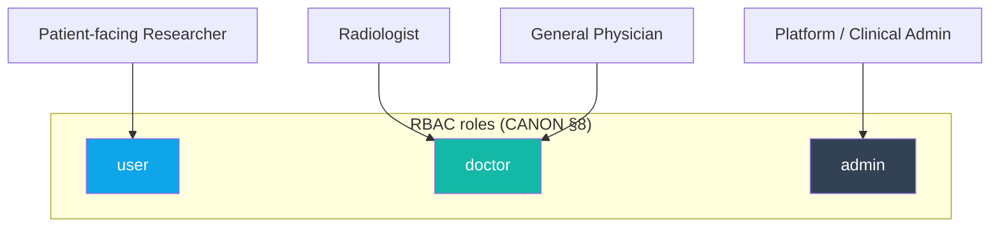
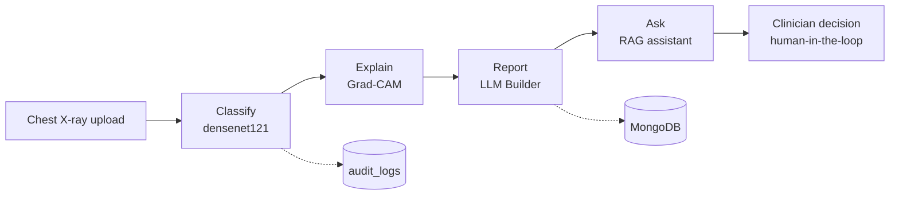

# 01 — Project Vision

The **Advanced AI Medical Intelligence Platform (AIMIP)** is an enterprise AI healthcare SaaS that helps clinical teams move faster and with more confidence on chest-radiograph triage. It classifies chest X-rays for pneumonia, explains each prediction visually with Grad-CAM, drafts a structured medical report with a large language model, and lets clinicians ask grounded questions against a curated medical knowledge base through a Retrieval-Augmented Generation (RAG) assistant — all behind JWT authentication, persisted in MongoDB, and surfaced through a premium React interface. AIMIP is deliberately positioned as **clinical decision-support**: it augments expert judgement, it does not replace it, and it is **not** a medical device.

> **Clinical disclaimer.** AIMIP outputs are **informational, not a diagnosis**. A **licensed clinician must review all results** before any clinical action. No PHI may be uploaded without consent. The platform is **not FDA/CE cleared** and is **not** a medical device. This disclaimer is reproduced in every generated report, in the security documentation, in the project report, and in the README, per the [CANON](_CANON.md).

Related documents: [Project Roadmap](00_Project_Roadmap.md) · [Software Requirements Specification](02_Software_Requirements_Specification.md) · [Database Design](17_Database_Design.md) · [API Design](18_API_Design.md) · [Authorization & RBAC](20_Authorization_RBAC.md) · [Environment Configuration](31_Environment_Configuration.md) · [Project Report](33_Project_Report.md) · [Future Roadmap](37_Future_Roadmap.md).

---

## 1. Problem statement

Chest radiography is among the most frequently ordered imaging studies in the world, and pneumonia is one of its most common and time-critical findings. Yet the path from image to actionable interpretation is strained by well-documented pressures:

| Pain point | Consequence today |
|------------|-------------------|
| Radiologist shortage and rising study volumes | Interpretation backlogs; delayed treatment decisions, especially after hours and in under-resourced settings. |
| Variability between readers | Inconsistent triage; subtle findings missed under time pressure and fatigue. |
| Opaque AI tools | "Black-box" scores clinicians cannot trust or defend; low adoption. |
| Manual report drafting | Repetitive narrative writing consumes clinician time better spent on patients. |
| Fragmented medical knowledge | Guidelines from WHO/NIH/research live in scattered PDFs; answering a bedside question means hunting across sources. |
| Weak auditability | Limited traceability of who saw what and when — a compliance and safety gap. |

**AIMIP's thesis.** A single, explainable, well-governed platform can compress the triage-to-understanding loop: an accurate classifier for the first read, Grad-CAM so the clinician *sees why*, an LLM that drafts the narrative, and a grounded assistant that answers questions with citations — every step logged, authenticated, and framed as support for a human decision-maker.

---

## 2. Vision statement

> To give every clinical team an explainable, trustworthy AI copilot for chest-radiograph triage and medical knowledge — one that accelerates the human expert, defends its reasoning transparently, and never pretends to be the final word.

---

## 3. Target users & personas

### 3.1 Persona — Radiologist (role: `doctor`)

| Attribute | Detail |
|-----------|--------|
| Goals | Fast, defensible first-read triage; visual confirmation of model attention; a draft narrative to edit rather than author from scratch. |
| Key features | `POST /predict`, Grad-CAM overlays, `GET /reports/{prediction_id}`, `POST /reports/{prediction_id}/regenerate`, cohort-wide review across all predictions/reports. |
| Success looks like | Confident acceptance/override of the model in seconds, with the Grad-CAM overlay and confidence supporting the call. |
| Frustrations addressed | Black-box scores (solved by explainability), repetitive report writing (solved by the Builder-generated report). |

### 3.2 Persona — General Physician (role: `doctor`)

| Attribute | Detail |
|-----------|--------|
| Goals | Point-of-care triage support where a radiologist is not immediately available; plain-language explanation and next-step recommendations. |
| Key features | Prediction + `medical_explanation`/`recommendations` report sections; Knowledge Assistant for guideline questions; History of own cases. |
| Success looks like | A grounded, cited answer and a clear risk framing that informs referral or treatment — always pending specialist review. |
| Frustrations addressed | Scattered guidelines (solved by RAG with citations), uncertainty on next steps (solved by structured recommendations). |

### 3.3 Persona — Platform / Clinical Admin (role: `admin`)

| Attribute | Detail |
|-----------|--------|
| Goals | Manage users and roles, curate the knowledge corpus, monitor usage, and preserve auditability and compliance. |
| Key features | `GET/PATCH/DELETE /users`, `GET/PATCH /settings`, document management (`POST/GET/DELETE /documents`), `audit_logs`, analytics. |
| Success looks like | A well-governed tenant: correct role assignments, an indexed and trusted document set, and a complete audit trail of PHI access. |
| Frustrations addressed | Weak auditability (solved by append-only `audit_logs`), knowledge sprawl (solved by curated ingest pipeline). |

### 3.4 Persona — Patient-facing Researcher (role: `user`)

| Attribute | Detail |
|-----------|--------|
| Goals | Explore de-identified predictions and aggregate trends for research and education; query the knowledge base. |
| Key features | Own predictions/history/chat/reports; Analytics (scoped to own data); Knowledge Assistant. |
| Success looks like | Reproducible, cited insights on consented/de-identified data — with no access to other users' clinical records. |
| Frustrations addressed | Lack of structured, queryable AI outputs (solved by persisted predictions + analytics), unsourced answers (solved by citations). |

---

## 4. Value proposition

| Pillar | What AIMIP delivers | Differentiator |
|--------|---------------------|----------------|
| **Accuracy** | Transfer-learned CNN (`densenet121`, alt `efficientnet_b0`) with softmax confidence and full probabilities. | Reported with AUROC/F1/confusion matrix; OOD guard rejects non-X-ray inputs via `ood_flag`. |
| **Explainability** | Grad-CAM original/heatmap/overlay served as URLs. | Clinicians *see why* — trust and defensibility, not a bare score. |
| **Productivity** | LLM-drafted report: `summary, findings, possible_condition, medical_explanation, recommendations, risk_level, disclaimer`. | Editable Markdown draft; regenerate on demand. |
| **Grounded knowledge** | RAG over WHO/NIH/research PDFs with citations. | Refuses below `RAG_MIN_SCORE` ("insufficient context") — no confident fabrication. |
| **Trust & governance** | JWT auth, RBAC, append-only audit logs, RFC 7807 errors, consent-gated uploads. | Compliance-aware by design; OWASP ASVS L1 target. |
| **Portability** | Ports & adapters; provider swap by `.env`. | No vendor lock-in; `mock`/local fallbacks keep the app runnable offline. |

---

## 5. In-scope vs explicit non-goals

### 5.1 In scope (v1.0)

- Chest X-ray **pneumonia** classification (`[NORMAL, PNEUMONIA]`) with confidence and probabilities.
- Grad-CAM explainability (original, heatmap, overlay) saved under `GRADCAM_PATH`.
- OOD guard flagging non-chest-X-ray uploads.
- LLM-generated structured medical **report** with the mandatory disclaimer.
- **RAG** knowledge assistant with citations and a refusal threshold.
- Curated **document ingest** (PyMuPDF → clean → chunk → embed → vector store).
- **Auth** (JWT with refresh rotation, lockout) and **RBAC** (`user`, `doctor`, `admin`).
- **Analytics** (overview, trends, disease/confidence distribution, recent activity).
- Persistence in MongoDB (`DB_NAME=aimip`) across the canonical collections.
- Premium **React** frontend, observability, Docker/compose, CI.

### 5.2 Explicit non-goals

| Non-goal | Rationale |
|----------|-----------|
| Autonomous diagnosis or treatment decisions | AIMIP is decision-support; a licensed clinician makes and owns the decision. |
| FDA / CE regulatory clearance or medical-device claims | Out of scope for v1.0; the platform is explicitly not a medical device. |
| Modalities beyond chest X-ray (CT, MRI, ultrasound) | Focused v1.0 scope; multi-modal is a future direction — see [Future Roadmap](37_Future_Roadmap.md). |
| Native DICOM ingestion / PACS integration | v1.0 accepts `image/png, image/jpeg`; DICOM/FHIR/HL7 are future work. |
| Diseases beyond pneumonia (multi-pathology) | Two-class head in v1.0; expansion is planned but not committed here. |
| EHR write-back or clinical order entry | AIMIP informs; it does not place orders or alter the record of truth. |
| Storing PHI without consent | Prohibited; uploads are consent-gated and PHI access is audited. |
| TensorFlow / LlamaIndex adoption | Intentionally excluded by the tech-stack decision in the [CANON](_CANON.md). |

---

## 6. Success metrics

### 6.1 Product & clinical outcomes

| Metric | Target | Source |
|--------|--------|--------|
| Model AUROC (test set) | ≥ 0.90 | Training eval, Kaggle Kermany et al. dataset |
| Model F1 (PNEUMONIA) | ≥ 0.88 | Confusion matrix / classification report |
| Clinician override rate (calibration signal) | Tracked & trending down as trust builds | `predictions` + review workflow |
| Report edit-to-accept time | Reduced vs manual authoring | Product telemetry |
| RAG grounded-answer rate | ≥ 95% answered-with-citation or explicit refusal | `chat_history.citations`, `RAG_MIN_SCORE` |
| OOD rejection precision | High — non-X-ray inputs flagged | `ood_flag` validation set |

### 6.2 Engineering & operational (from NFRs)

| Metric | Target |
|--------|--------|
| Availability | 99.5% |
| API latency p95 (excl. model/LLM) | < 300 ms |
| Prediction end-to-end p95 | < 6 s |
| Backend test coverage | ≥ 80% |
| Security baseline | OWASP ASVS L1 |
| Config integrity | Fail-fast on invalid provider/secret combinations |

### 6.3 Adoption

| Metric | Intent |
|--------|--------|
| Active clinicians / week | Growing usage among `doctor` role |
| Documents indexed | Growing, trusted knowledge corpus (`documents.status = indexed`) |
| Provider-swap incidents | Zero business-logic changes required (contract test green) |

---

## 7. Guiding principles

1. **Human-in-the-loop, always.** Every output is a draft for a clinician; the UI reinforces review before action.
2. **Explain, don't assert.** Grad-CAM and citations accompany scores and answers so trust is earned, not demanded.
3. **Refuse rather than fabricate.** RAG returns "insufficient context" below `RAG_MIN_SCORE`; the OOD guard flags out-of-domain images.
4. **Portable by construction.** Business logic depends on ports; vendors are adapters chosen by `.env`.
5. **Governed and auditable.** Consent-gated uploads, RBAC, and append-only `audit_logs` for PHI access.
6. **Fail fast, fail loud.** Misconfiguration raises at startup, not in production.

---

## 8. Strategic alignment

| Stakeholder | Value realized |
|-------------|----------------|
| Clinical teams | Faster, explainable triage and less report-writing overhead. |
| Health system / admin | Governed, auditable, cost-aware AI with no vendor lock-in. |
| Researchers | Structured, cited, queryable outputs on consented data. |
| Patients | Faster, more consistent clinician decisions — with a human always accountable. |

---

## 9. Alignment with the delivery plan

The vision is realized incrementally through the phases in the [Project Roadmap](00_Project_Roadmap.md): the MVP vertical slice proves the classify → explain → report → persist loop; expansion adds RAG, documents, analytics, and provider portability; hardening delivers the security, observability, and deployment posture the NFRs require. Requirement-level detail lives in the [SRS](02_Software_Requirements_Specification.md); the evaluation-panel narrative is in the [Project Report](33_Project_Report.md); and the post-1.0 direction (DICOM, FHIR/HL7, multi-tenant, on-prem, MLOps) is set out in the [Future Roadmap](37_Future_Roadmap.md).

> **Reminder.** AIMIP is clinical decision-support, not a medical device. All outputs are informational and require licensed-clinician review; the platform is not FDA/CE cleared.
