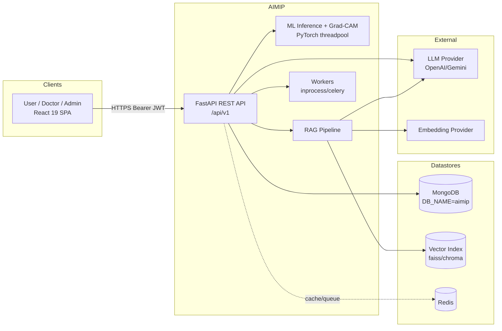
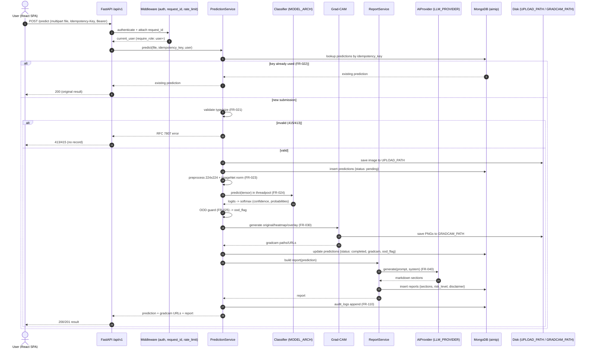
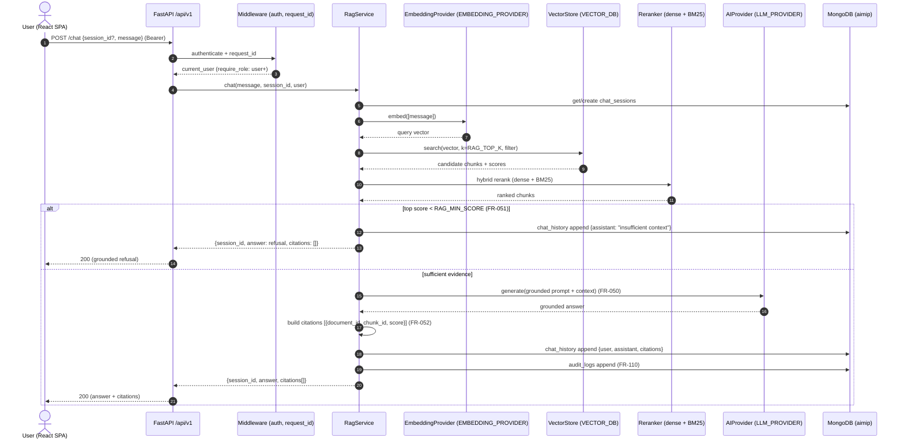

# 02 — Software Requirements Specification (SRS)

**Product:** Advanced AI Medical Intelligence Platform (**AIMIP**)
**Document type:** Software Requirements Specification (IEEE 830-1998 style)
**Status:** Baselined
**Owner:** Principal Software Architect
**Copyright:** Copyright (c) 2026 DTable Analytics — License: MIT

> **Clinical disclaimer.** AIMIP is a clinical **decision-support** system, **not** a
> medical device. All outputs (classification, Grad-CAM heatmaps, generated reports, and
> knowledge-assistant answers) are **informational, not a diagnosis**. A licensed clinician
> **must** review all results before any clinical action. No Protected Health Information
> (PHI) may be uploaded without consent. The platform is **not** FDA/CE cleared.

---

## Table of Contents

1. [Introduction](#1-introduction)
2. [Overall Description](#2-overall-description)
3. [User Stories (by Epic)](#3-user-stories-by-epic)
4. [Functional Requirements](#4-functional-requirements)
5. [Non-Functional Requirements](#5-non-functional-requirements)
6. [External Interface Requirements](#6-external-interface-requirements)
7. [Requirements Traceability Matrix](#7-requirements-traceability-matrix)
8. [Workflows](#8-workflows)
9. [Appendix A — Requirement Priority Legend](#appendix-a--requirement-priority-legend)

---

## 1. Introduction

### 1.1 Purpose

This Software Requirements Specification (SRS) defines the complete functional and
non-functional requirements for the **Advanced AI Medical Intelligence Platform (AIMIP)**,
an enterprise AI healthcare SaaS providing chest X-ray pneumonia **decision-support**.

The document is written for, and is binding upon:

- **Engineering** — backend, frontend, ML, and platform teams who implement and verify the system.
- **QA / Test** — engineers who derive test cases from the numbered requirements below.
- **Product & Clinical stakeholders** — who validate that scope and safety constraints are met.
- **Security, Privacy & Compliance** — who audit the platform against the stated controls.
- **DevOps / SRE** — who operate the system against the stated non-functional targets.

Every requirement in this SRS carries a stable identifier (`FR-###` / `NFR-###`) so it can be
traced through design, code, tests, and release notes. The canonical names, endpoints,
environment variables, and data collections used throughout are drawn verbatim from the
project [CANON](_CANON.md) and must not be altered downstream.

### 1.2 Scope

AIMIP ("the system", "the product", "the platform") delivers the following end-to-end capability:

> **Chest X-ray upload → CNN pneumonia classification `[NORMAL, PNEUMONIA]` → Explainable AI
> (Grad-CAM) → LLM-generated medical report → RAG medical knowledge assistant**, behind JWT
> authentication with Role-Based Access Control (RBAC), persisted in MongoDB, exposed through
> a versioned REST API and a premium React frontend, with analytics, audit logging, Docker
> packaging, CI, and observability.

**In scope:**

- User registration, login, JWT access/refresh with rotation, logout, and RBAC (`user`, `doctor`, `admin`).
- Chest X-ray image upload with validation, Out-Of-Distribution (OOD) rejection, CNN inference, and confidence scoring.
- Grad-CAM explainability artifacts (original, heatmap, overlay).
- LLM-generated structured medical reports with mandatory disclaimer.
- Retrieval-Augmented Generation (RAG) knowledge assistant grounded in ingested medical documents, with citations and refusal-on-low-context.
- Document ingestion (PDF → chunk → embed → index) and lifecycle management.
- Prediction history, analytics dashboards, user administration, and per-user settings.
- Provider portability (LLM, embeddings, vector store, classifier, cache, task queue, auth, storage) selected by environment variables.
- Audit logging of security- and PHI-relevant actions.

**Out of scope:**

- Regulatory clearance (FDA/CE); AIMIP is explicitly **not** a medical device.
- Autonomous diagnosis or treatment decisions without clinician review.
- Imaging modalities other than chest X-ray (e.g., CT, MRI, ultrasound).
- EHR/HL7/FHIR integration, billing, or scheduling (may be future work).
- Model training as a runtime user feature — training is an operator/offline script with a pretrained-inference fallback.

### 1.3 Definitions, Acronyms, and Abbreviations

| Term | Definition |
|------|------------|
| **AIMIP** | Advanced AI Medical Intelligence Platform (this product). |
| **RBAC** | Role-Based Access Control (`user`, `doctor`, `admin`). |
| **JWT** | JSON Web Token; access + refresh tokens signed with `JWT_SECRET`/`JWT_ALGORITHM`. |
| **JTI** | JWT ID; unique identifier of a refresh token, tracked in `refresh_tokens`. |
| **CNN** | Convolutional Neural Network (default `densenet121`, alt `efficientnet_b0`). |
| **Grad-CAM** | Gradient-weighted Class Activation Mapping — explainability heatmap over `Classifier.target_layer`. |
| **XAI** | Explainable AI. |
| **OOD** | Out-Of-Distribution — an upload that is not a chest X-ray; rejected via `ood_flag`. |
| **LLM** | Large Language Model, accessed only through the `AIProvider` port. |
| **RAG** | Retrieval-Augmented Generation — grounded answers with citations from indexed documents. |
| **BM25** | Sparse lexical ranking function used in hybrid retrieval. |
| **PHI** | Protected Health Information. |
| **OOD guard** | Heuristic/threshold check rejecting non-chest-X-ray inputs. |
| **Port** | Abstract interface (ABC) in the domain; concrete implementations are **adapters**. |
| **Adapter** | Concrete provider implementation selected at startup by a factory reading ENV. |
| **DI** | Dependency Injection (FastAPI `Depends` + composition-root container). |
| **DTO** | Data Transfer Object. |
| **RFC 7807** | "Problem Details for HTTP APIs" — the error envelope `{type, title, status, detail, instance, errors?}`. |
| **AUROC** | Area Under the Receiver Operating Characteristic curve. |
| **p95** | 95th percentile latency. |
| **RPO / RTO** | Recovery Point Objective / Recovery Time Objective. |
| **WCAG 2.1 AA** | Web Content Accessibility Guidelines, level AA. |
| **OWASP ASVS L1** | OWASP Application Security Verification Standard, level 1. |
| **TTL** | Time To Live (used on the `refresh_tokens.expires_at` index). |
| **SaaS** | Software as a Service. |

### 1.4 References

Internal documents (relative links; canonical names per [CANON](_CANON.md)):

- [_CANON.md](_CANON.md) — Canonical Source of Truth (authoritative names, ENV, endpoints, collections).
- [17_Database_Design.md](17_Database_Design.md) — MongoDB collections, indexes, schemas.
- [18_API_Design.md](18_API_Design.md) — REST API contracts, error envelope, list envelope.
- [20_Authorization_RBAC.md](20_Authorization_RBAC.md) — roles and permission matrix.
- [21_UI_UX_Guidelines.md](21_UI_UX_Guidelines.md) — design system, pages, accessibility.
- [31_Environment_Configuration.md](31_Environment_Configuration.md) — environment variables and configuration.

External standards & sources:

- IEEE Std 830-1998 — Recommended Practice for Software Requirements Specifications.
- IETF RFC 7807 — Problem Details for HTTP APIs.
- IETF RFC 6749 / RFC 7519 — OAuth 2.0 / JSON Web Token.
- WCAG 2.1 (W3C) — Web Content Accessibility Guidelines, Level AA.
- OWASP ASVS 4.x, Level 1.
- The Twelve-Factor App methodology.
- Kaggle "Chest X-Ray Images (Pneumonia)" dataset (Kermany et al.).
- Selvaraju et al., "Grad-CAM: Visual Explanations from Deep Networks via Gradient-based Localization".

### 1.5 Overview

The remainder of this SRS is organized as follows. **Section 2** describes the product at a
high level: its perspective within a larger architecture, its major functions, its user
classes, operating environment, and constraints. **Section 3** captures requirements as user
stories grouped by epic, each with Given/When/Then acceptance criteria. **Section 4** enumerates
the atomic functional requirements (`FR-###`) by module. **Section 5** enumerates the
non-functional requirements (`NFR-###`). **Section 6** specifies external interfaces (API, data,
UI) with links to the detailed design docs. **Section 7** provides the requirements traceability
matrix. **Section 8** shows the two critical workflows as Mermaid sequence diagrams.

---

## 2. Overall Description

### 2.1 Product Perspective

AIMIP is a **new, self-contained** SaaS product built as a monorepo (backend + frontend +
infra) following a **Clean / Hexagonal (Ports & Adapters)** architecture. The dependency
direction is strictly inward:

```
domain ← application ← infrastructure ← interface
```

Business logic (the `application` and `domain` layers) depends **only** on **ports** (abstract
base classes). Concrete **adapters** are selected at startup by **factories** that read
environment variables. No vendor SDK (OpenAI, Google Generative AI, FAISS, Chroma, PyTorch,
Motor) is ever called from business logic — it is reached exclusively through a port. This
yields **configuration-driven provider portability**: switching a provider is an `.env` change,
validated by an automated test.

**Provider ports and their ENV selectors** (from [CANON](_CANON.md) §3):

| Port (ABC) | ENV var | Adapters |
|------------|---------|----------|
| `AIProvider` | `LLM_PROVIDER` | `openai` · `gemini` · `mock` |
| `EmbeddingProvider` | `EMBEDDING_PROVIDER` | `openai` · `gemini` · `sentence_transformer` |
| `VectorStore` | `VECTOR_DB` | `faiss` · `chroma` · `pinecone` (optional) |
| `Classifier` | `MODEL_ARCH` | `densenet121` · `efficientnet_b0` |
| `AuthProvider` | `AUTH_PROVIDER` | `jwt` (future: oauth2, keycloak) |
| `StorageProvider` | `STORAGE_PROVIDER` | `mongodb` (future: postgres, s3 for blobs) |
| `CacheProvider` | `CACHE_PROVIDER` | `memory` · `redis` |
| `TaskQueue` | `TASK_QUEUE` | `inprocess` · `celery` |

Each port has a factory `get_<x>_provider(settings)` in `infrastructure/providers/<x>/factory.py`
and a shared **contract test** in `tests/contract/` that every adapter must pass.

**System context** (major external actors and dependencies):



### 2.2 Product Functions

At a high level, AIMIP provides:

1. **Authentication & Authorization** — registration, login, refresh-token rotation, logout, `GET /auth/me`, and RBAC enforcement via `require_role(...)`.
2. **Prediction** — multipart image upload, validation, OOD rejection, CNN inference in a threadpool, confidence + full probabilities, idempotency.
3. **Explainability** — Grad-CAM original/heatmap/overlay artifacts saved under `GRADCAM_PATH` and served as URLs.
4. **Report generation** — LLM-produced structured Markdown report (Builder pattern) with a mandatory disclaimer, with regeneration.
5. **Knowledge Assistant (RAG)** — grounded chat over indexed medical documents with citations and refusal below `RAG_MIN_SCORE`.
6. **Document management** — PDF ingestion (load → clean → chunk → embed → index) and lifecycle (list/delete).
7. **History** — paginated, filterable list of a user's predictions.
8. **Analytics** — overview, trends, disease distribution, confidence distribution, recent activity.
9. **User administration** — admin CRUD over users.
10. **Settings** — per-user preferences.
11. **Observability & Ops** — health, readiness, Prometheus metrics, Swagger docs, structured logs, audit logging.

### 2.3 User Classes and Characteristics (Personas)

AIMIP defines three RBAC roles (per [CANON](_CANON.md) §8 and [20_Authorization_RBAC.md](20_Authorization_RBAC.md)).

#### Persona 1 — "Priya", the End User (`user`)

- **Role:** `user`.
- **Technical skill:** moderate; comfortable with web apps, not a clinician.
- **Goals:** upload a chest X-ray, get an explainable classification, read a plain-language report, ask the knowledge assistant follow-up questions, review her own history.
- **Access:** her **own** predictions, history, chat, and reports only. Cannot see other users' data.
- **Frustrations to avoid:** long waits, jargon-only reports, unclear whether a result is a diagnosis (must always see the disclaimer).

#### Persona 2 — "Dr. Rao", the Reviewing Clinician (`doctor`)

- **Role:** `doctor`.
- **Technical skill:** high domain expertise; expects clinical rigor and transparency.
- **Goals:** review predictions and reports across all users for quality assurance and second opinion; inspect Grad-CAM to judge whether the model attended to plausible regions; regenerate reports.
- **Access:** everything a `user` has **plus** read access to **all** predictions and reports for review.
- **Frustrations to avoid:** opaque model behavior, missing confidence/probabilities, no way to see the evidence region.

#### Persona 3 — "Sam", the Platform Administrator (`admin`)

- **Role:** `admin`.
- **Technical skill:** operational/administrative.
- **Goals:** manage user accounts and roles, curate the knowledge base (documents), configure platform settings, and audit access to PHI.
- **Access:** **full** — users, settings, documents, and audit logs, in addition to all `doctor` capabilities.
- **Frustrations to avoid:** inability to deactivate a compromised account quickly, missing audit trail, uncontrolled document ingestion.

| Capability | `user` | `doctor` | `admin` |
|------------|:------:|:--------:|:-------:|
| Register / login / refresh / logout | ✓ | ✓ | ✓ |
| Predict, view own history/reports/chat | ✓ | ✓ | ✓ |
| Read **all** predictions/reports (review) | — | ✓ | ✓ |
| Manage users (`/users`) | — | — | ✓ |
| Manage documents (`/documents`) | — | — | ✓ |
| Read audit logs | — | — | ✓ |
| Platform settings | own | own | own + platform |

### 2.4 Operating Environment

- **Backend runtime:** Python **3.11+** (dev machine 3.11.8; target 3.11, **not** 3.12), FastAPI, Uvicorn, Motor (async MongoDB), PyTorch + torchvision, Pillow, OpenCV (`opencv-python-headless`), NumPy, scikit-learn, PyMuPDF (`fitz`), sentence-transformers, `faiss-cpu`, `chromadb`, `openai`, `google-generativeai`, `python-jose[cryptography]`, `passlib[bcrypt]`, `python-multipart`, `redis`, `celery`, `prometheus-client`, `structlog`, `httpx`. TensorFlow and LlamaIndex are intentionally **not** used.
- **Frontend runtime:** React **19**, Vite, TypeScript, TailwindCSS, Framer Motion, TanStack Query (server state), Zustand (UI state), React Hook Form + Zod, Axios, React Router v6, Recharts, Lucide-react. Served by nginx (also reverse proxy).
- **Data stores:** MongoDB Atlas (`DB_NAME=aimip`), Redis, on-disk vector index under `VECTOR_INDEX_PATH`.
- **Packaging & CI:** Docker + docker-compose, nginx, GitHub Actions. Docker is **not** installed on the current dev machine (files authored; run later).
- **Client environment:** modern evergreen browsers (Chromium, Firefox, Safari) on desktop and tablet; dark mode via `prefers-color-scheme` + toggle.
- **Configuration:** environment variables per [CANON](_CANON.md) §5 / [31_Environment_Configuration.md](31_Environment_Configuration.md). The frontend reads `VITE_API_BASE_URL` (default `http://localhost:8000/api/v1`).

### 2.5 Design and Implementation Constraints

- **DC-1 Architecture.** Clean/Hexagonal (Ports & Adapters); dependency direction `domain ← application ← infrastructure ← interface`. Business logic depends only on ports (ABCs). SOLID throughout. Patterns: Repository, Service layer, Factory, Strategy/Provider, Dependency Injection, Builder (report assembly), Configuration-driven design.
- **DC-2 No SDK leakage.** No vendor SDK may be imported or called from `domain`/`application`. All external capability is reached via a port; adapters live under `infrastructure/providers/*` and `infrastructure/{ml,rag,auth,storage}/`.
- **DC-3 API versioning & envelopes.** All business endpoints live under `API_V1_PREFIX` (`/api/v1`). Errors use **RFC 7807** `{type, title, status, detail, instance, errors?}`; list responses use `{items, page, size, total, pages}`. Auth uses `Authorization: Bearer <access>`.
- **DC-4 Config fails fast.** Invalid configuration must raise at startup (e.g., `LLM_PROVIDER=openai` with empty `OPENAI_API_KEY`).
- **DC-5 Non-blocking inference.** Model inference runs in a threadpool executor and must never block the event loop.
- **DC-6 Python target.** Backend targets Python 3.11 (not 3.12). Pydantic v2 + pydantic-settings.
- **DC-7 Secrets.** Secrets (`JWT_SECRET`, `OPENAI_API_KEY`, `GEMINI_API_KEY`, `PINECONE_API_KEY`, `MONGODB_URI`) come from environment only; never committed. `.env.example` documents keys without values.
- **DC-8 Not a medical device.** The system must present the clinical disclaimer in vision/security/report/README surfaces and must not represent outputs as diagnoses.
- **DC-9 12-factor.** Configuration via environment; stateless API processes; horizontal scalability.
- **DC-10 Licensing.** MIT license; `Copyright (c) 2026 DTable Analytics`.
- **DC-11 Upload limits.** Uploads must respect `MAX_UPLOAD_SIZE` (10 MB) and `ALLOWED_IMAGE_TYPES` (`image/png,image/jpeg`).

### 2.6 Assumptions and Dependencies

- **AS-1** A reachable MongoDB instance is available at `MONGODB_URI` with database `DB_NAME`.
- **AS-2** When `LLM_PROVIDER`/`EMBEDDING_PROVIDER` is `openai` or `gemini`, the corresponding API key (`OPENAI_API_KEY` / `GEMINI_API_KEY`) is present and valid; otherwise startup fails fast (DC-4). The `mock`/`sentence_transformer` adapters allow fully offline operation.
- **AS-3** A trained model checkpoint exists at `MODEL_PATH`; if absent, the **pretrained-inference fallback** (ImageNet-pretrained backbone with a 2-class head) lets the app run without training or the dataset.
- **AS-4** For `CACHE_PROVIDER=redis` or `TASK_QUEUE=celery`, Redis is reachable at `REDIS_URL`. Defaults (`memory`, `inprocess`) require no external broker.
- **AS-5** Users obtain informed consent before uploading any image containing PHI; the platform is a decision-support tool, not a diagnostic authority.
- **AS-6** Clients send well-formed multipart requests and include `Authorization: Bearer <access>` on protected routes and `Idempotency-Key` on `POST /predict`.
- **AS-7** The knowledge base is curated by admins from reputable sources (`WHO|NIH|research|other`); answer quality depends on ingested corpus quality.
- **AS-8** Network egress to the configured LLM/embedding provider is permitted in the deployment environment.

---

## 3. User Stories (by Epic)

Stories use the form **"As a `<role>`, I want `<goal>`, so that `<benefit>`"** with
Given/When/Then acceptance criteria. Each story links to the functional requirements that
implement it.

### Epic A — Authentication & Session

**US-A1 — Register.** As a **user**, I want to create an account with email, password, and full
name, so that I can access the platform.
- **Given** a valid, unregistered email and a password meeting the policy, **when** I `POST /auth/register`, **then** a `users` document is created with a bcrypt `password_hash`, role `user`, `is_active=true`, and I receive a `201` with my profile (no password hash). *(FR-001, FR-010)*
- **Given** an email already present in `users`, **when** I register, **then** I receive an RFC 7807 `409` error and no duplicate is created. *(FR-001)*

**US-A2 — Login.** As a **registered user**, I want to log in, so that I obtain access and
refresh tokens.
- **Given** correct credentials, **when** I `POST /auth/login`, **then** I receive an access token (expiry `ACCESS_TOKEN_EXPIRE_MINUTES`) and a refresh token (expiry `REFRESH_TOKEN_EXPIRE_DAYS`), a `refresh_tokens` record is stored with a unique `jti`, and `last_login` is updated. *(FR-002, FR-003)*
- **Given** wrong credentials, **when** I attempt login `MAX_LOGIN_ATTEMPTS` times, **then** `failed_login_attempts` increments and the account is locked (`locked_until = now + LOCKOUT_MINUTES`), returning `423`/`401` per policy. *(FR-004)*

**US-A3 — Refresh with rotation.** As a **user**, I want my session refreshed, so that I stay
logged in without re-entering credentials.
- **Given** a valid, unrevoked refresh token, **when** I `POST /auth/refresh`, **then** a new access + refresh pair is issued, the old `jti` is revoked (rotation), and reuse of a revoked token is rejected with `401`. *(FR-005)*

**US-A4 — Logout.** As a **user**, I want to log out, so that my refresh token can no longer be used.
- **Given** an authenticated session, **when** I `POST /auth/logout`, **then** the current refresh token's `jti` is marked `revoked=true`. *(FR-006)*

**US-A5 — Who am I.** As an **authenticated user**, I want `GET /auth/me`, so that the frontend
can render my identity and role.
- **Given** a valid access token, **when** I call `GET /auth/me`, **then** I receive my profile including `role`. *(FR-007)*

**US-A6 — Role enforcement.** As the **platform**, I want role checks on every protected route, so
that users cannot exceed their privileges.
- **Given** a `user` token, **when** I call an admin route (e.g., `GET /users`), **then** I receive `403`. *(FR-008)*

### Epic B — Prediction

**US-B1 — Upload & predict.** As a **user**, I want to upload a chest X-ray and get a
classification, so that I understand whether it suggests pneumonia.
- **Given** a PNG/JPEG within `MAX_UPLOAD_SIZE`, **when** I `POST /predict` with `file` and an `Idempotency-Key`, **then** the image is validated and stored under `UPLOAD_PATH`, inference runs, and I receive `predicted_class`, `confidence`, and `probabilities{NORMAL,PNEUMONIA}` plus Grad-CAM URLs and a report reference. *(FR-020, FR-021, FR-023, FR-024)*
- **Given** a file exceeding `MAX_UPLOAD_SIZE` or a disallowed type, **when** I upload, **then** I receive an RFC 7807 `413`/`415` and no `predictions` record is created. *(FR-021)*

**US-B2 — Idempotent submission.** As a **user**, I want repeated identical submissions to be safe,
so that a retry does not create duplicates.
- **Given** a prior request with `Idempotency-Key=K`, **when** I resubmit with the same key, **then** the original prediction is returned rather than a new one being computed. *(FR-022)*

**US-B3 — OOD rejection.** As a **user**, I want non-chest-X-ray images rejected, so that I am not
given a meaningless result.
- **Given** an image that is not a chest X-ray, **when** inference's OOD guard evaluates it, **then** `ood_flag=true` is set and the response clearly indicates the input was out-of-distribution rather than presenting a confident class. *(FR-025)*

**US-B4 — Retrieve a prediction.** As a **user**, I want `GET /predict/{id}`, so that I can revisit a
result.
- **Given** a prediction I own, **when** I call `GET /predict/{id}`, **then** I receive its full record; **given** a prediction I do not own and I am a `user`, **then** I receive `403`/`404`. *(FR-026, FR-008)*

### Epic C — Explainability (Grad-CAM)

**US-C1 — Visual evidence.** As a **doctor**, I want a Grad-CAM overlay, so that I can judge whether
the model attended to clinically plausible regions.
- **Given** a completed prediction, **when** I open it, **then** I can view `gradcam.original`, `gradcam.heatmap`, and `gradcam.overlay` PNGs served as URLs. *(FR-030, FR-031)*
- **Given** an OOD-flagged prediction, **when** explainability is rendered, **then** the UI communicates reduced trust in the heatmap. *(FR-025, FR-031)*

### Epic D — Reports

**US-D1 — Generated report.** As a **user**, I want a plain-language structured report, so that I can
understand the result.
- **Given** a completed prediction, **when** the report is built, **then** it contains sections `summary, findings, possible_condition, medical_explanation, recommendations, risk_level, disclaimer` as Markdown, with `risk_level ∈ {low, moderate, high}` and a mandatory disclaimer. *(FR-040, FR-041)*

**US-D2 — Read report.** As a **user**, I want `GET /reports/{prediction_id}`, so that I can reread my report.
- **Given** a report for a prediction I own, **when** I fetch it, **then** I receive `content_markdown` and structured `sections`. *(FR-042)*

**US-D3 — Regenerate.** As a **doctor**, I want to regenerate a report, so that I can refresh it (e.g.,
after a provider or template change).
- **Given** an existing prediction, **when** I `POST /reports/{prediction_id}/regenerate`, **then** a new report is produced via the current `AIProvider` and persisted with the new `llm_provider`/`llm_model`. *(FR-043)*

### Epic E — Knowledge Assistant (RAG)

**US-E1 — Ask a question.** As a **user**, I want to ask medical questions grounded in the knowledge
base, so that answers are trustworthy.
- **Given** an indexed corpus, **when** I `POST /chat` with `{message}` (optionally `session_id`), **then** I receive `{session_id, answer, citations[]}` where each citation references `{document_id, chunk_id, score}`. *(FR-050, FR-052)*

**US-E2 — Grounded refusal.** As a **user**, I want the assistant to refuse when it lacks evidence, so
that it does not hallucinate.
- **Given** a query whose top retrieval score is below `RAG_MIN_SCORE`, **when** the pipeline runs, **then** the assistant returns an "insufficient context" refusal with no fabricated citations. *(FR-051)*

**US-E3 — Sessions.** As a **user**, I want conversation sessions, so that I can continue a prior thread.
- **Given** prior chats, **when** I call `GET /chat/sessions` and `GET /chat/sessions/{id}`, **then** I see my sessions and their message history with citations. *(FR-053)*

### Epic F — Documents

**US-F1 — Ingest a PDF.** As an **admin**, I want to upload a medical PDF, so that it becomes part of
the knowledge base.
- **Given** a PDF, **when** I `POST /documents`, **then** a `documents` record is created with `status=uploaded`, an async ingest job runs (load → clean → chunk with `RAG_CHUNK_SIZE`/`RAG_CHUNK_OVERLAP` → embed → index), `embeddings_metadata` is written per chunk, `chunk_count` is set, and `status` transitions `uploaded → processing → indexed` (or `failed`). *(FR-060, FR-061, FR-062)*

**US-F2 — List/delete documents.** As an **admin**, I want to list and delete documents, so that I can
curate the corpus.
- **Given** documents exist, **when** I `GET /documents`, **then** I receive a paginated list; **when** I `DELETE /documents/{id}`, **then** the document and its vectors/metadata are removed. *(FR-063, FR-064)*

### Epic G — History

**US-G1 — Browse history.** As a **user**, I want a paginated, date-filterable history, so that I can
find past predictions.
- **Given** past predictions, **when** I `GET /history?page&size&from&to`, **then** I receive a `{items, page, size, total, pages}` envelope scoped to my own records. *(FR-070)*

### Epic H — Analytics

**US-H1 — Dashboard.** As a **doctor**, I want analytics dashboards, so that I can understand usage and
model behavior.
- **Given** prediction data, **when** I call `GET /analytics/overview`, `/analytics/trends?interval=day|week`, `/analytics/disease-distribution`, `/analytics/confidence-distribution`, and `/analytics/recent-activity`, **then** I receive aggregated data suitable for Recharts. *(FR-080–FR-084)*

### Epic I — Admin / Users

**US-I1 — Manage users.** As an **admin**, I want to list, inspect, update, and remove users, so that I
can administer access.
- **Given** admin privileges, **when** I `GET /users`, `GET /users/{id}`, `PATCH /users/{id}` (e.g., role or `is_active`), or `DELETE /users/{id}`, **then** the change is applied and audited; **given** a non-admin, **then** I receive `403`. *(FR-090–FR-093, FR-008, FR-110)*

### Epic J — Settings

**US-J1 — Preferences.** As a **user**, I want to view and update my settings, so that the app matches
my preferences.
- **Given** an authenticated session, **when** I `GET /settings` and `PATCH /settings`, **then** my preferences are returned and persisted. *(FR-100, FR-101)*

### Epic K — Cross-cutting (Audit, Providers, Ops)

**US-K1 — Audit PHI access.** As an **admin**, I want PHI-relevant actions logged, so that access is
accountable.
- **Given** an action touching PHI or security state, **when** it occurs, **then** an append-only `audit_logs` entry records `actor_id, action, resource_type, resource_id, ip, user_agent, metadata, created_at`. *(FR-110)*

**US-K2 — Swap providers by ENV.** As an **operator**, I want to change a provider via `.env`, so that I
can switch vendors without code changes.
- **Given** I change `LLM_PROVIDER`, `EMBEDDING_PROVIDER`, `VECTOR_DB`, `MODEL_ARCH`, `CACHE_PROVIDER`, or `TASK_QUEUE`, **when** the app restarts, **then** the matching factory selects the adapter and all contract tests pass; an invalid combination fails fast. *(FR-111, DC-4)*

**US-K3 — Operate & observe.** As an **SRE**, I want health, readiness, and metrics endpoints, so that I
can operate the platform.
- **Given** the API is running, **when** I call `GET /health/live`, `GET /health/ready`, and `GET /metrics`, **then** I receive liveness, readiness (dependency checks), and Prometheus metrics respectively. *(FR-112, FR-113)*

---

## 4. Functional Requirements

Requirements are grouped by module. Each has: **Description**, **Inputs**, **Processing**,
**Outputs**, **Priority** (see [Appendix A](#appendix-a--requirement-priority-legend)).

### 4.1 Module: Authentication & Authorization

#### FR-001 — User registration
- **Description:** Create a new account via `POST /auth/register`.
- **Inputs:** `email` (unique), `password`, `full_name`.
- **Processing:** Validate email format and password policy; ensure `email` not present in `users`; hash password with bcrypt (`passlib[bcrypt]`); create `users` doc with `role=user`, `is_active=true`, timestamps.
- **Outputs:** `201` with profile (no `password_hash`); `409` on duplicate; RFC 7807 on validation error.
- **Priority:** Must.

#### FR-002 — User login
- **Description:** Authenticate via `POST /auth/login`.
- **Inputs:** `email`, `password`.
- **Processing:** Look up user; verify bcrypt hash; check `is_active` and `locked_until`; on success reset `failed_login_attempts`, set `last_login`, and issue tokens (FR-003).
- **Outputs:** `200` with `{access_token, refresh_token, token_type}`; `401` on bad credentials; `423`/`401` when locked.
- **Priority:** Must.

#### FR-003 — Token issuance
- **Description:** Issue JWT access and refresh tokens via `AuthProvider` (`AUTH_PROVIDER=jwt`).
- **Inputs:** authenticated user id/role.
- **Processing:** `create_access` (exp `ACCESS_TOKEN_EXPIRE_MINUTES`) and `create_refresh` (exp `REFRESH_TOKEN_EXPIRE_DAYS`) signed with `JWT_SECRET`/`JWT_ALGORITHM`; persist `refresh_tokens` row (`jti`, `token_hash`, `user_agent`, `ip`, `expires_at`) with TTL index.
- **Outputs:** signed tokens; stored refresh record.
- **Priority:** Must.

#### FR-004 — Brute-force lockout
- **Description:** Throttle repeated failed logins.
- **Inputs:** failed login attempts per account.
- **Processing:** Increment `failed_login_attempts`; when it reaches `MAX_LOGIN_ATTEMPTS`, set `locked_until = now + LOCKOUT_MINUTES`; block login until expiry.
- **Outputs:** lockout state; RFC 7807 error while locked.
- **Priority:** Must.

#### FR-005 — Refresh with rotation
- **Description:** Exchange a refresh token for a new pair via `POST /auth/refresh`.
- **Inputs:** refresh token.
- **Processing:** `verify` token, ensure `jti` exists and `revoked=false`; `rotate` — issue new pair, revoke old `jti`; reject reuse of a revoked token.
- **Outputs:** new `{access_token, refresh_token}`; `401` on invalid/revoked/reused token.
- **Priority:** Must.

#### FR-006 — Logout
- **Description:** Revoke the active refresh token via `POST /auth/logout`.
- **Inputs:** authenticated session / refresh token.
- **Processing:** Set `revoked=true` on the token's `jti`.
- **Outputs:** `204`/`200`; subsequent refresh with that token fails.
- **Priority:** Must.

#### FR-007 — Current identity
- **Description:** Return the authenticated profile via `GET /auth/me`.
- **Inputs:** access token.
- **Processing:** `get_current_user` dependency decodes token, loads `users` doc.
- **Outputs:** profile with `role`; `401` if token invalid/expired.
- **Priority:** Must.

#### FR-008 — RBAC enforcement
- **Description:** Enforce role permissions on protected routes via `require_role(...)`.
- **Inputs:** access token role claim; route policy.
- **Processing:** Compare user role against required role(s): `user` (own resources), `doctor` (+ read all predictions/reports), `admin` (full). Ownership checks scope `user` reads to own records.
- **Outputs:** allow, or `403` (insufficient role) / `404`/`403` (not owner).
- **Priority:** Must.

#### FR-010 — Password policy & hashing
- **Description:** Enforce a minimum password policy and never store plaintext.
- **Inputs:** candidate password.
- **Processing:** Validate against policy; store only bcrypt `password_hash`.
- **Outputs:** accepted/rejected; hash persisted.
- **Priority:** Must.

### 4.2 Module: Prediction & Inference

#### FR-020 — Image upload endpoint
- **Description:** Accept a chest X-ray via `POST /predict` (multipart `file`, header `Idempotency-Key`).
- **Inputs:** multipart `file`; headers `Authorization`, `Idempotency-Key`.
- **Processing:** Authenticate; validate (FR-021); persist image under `UPLOAD_PATH`; create `predictions` doc `status=pending`.
- **Outputs:** on success, prediction + Grad-CAM URLs + report (see FR-024/FR-030/FR-040).
- **Priority:** Must.

#### FR-021 — Upload validation
- **Description:** Validate file type and size before inference.
- **Inputs:** uploaded file bytes, MIME type, size.
- **Processing:** Reject if MIME not in `ALLOWED_IMAGE_TYPES` (`image/png,image/jpeg`) → `415`; reject if size > `MAX_UPLOAD_SIZE` (10 MB) → `413`; verify the bytes decode as a valid image (Pillow).
- **Outputs:** validated image or RFC 7807 error; no `predictions` record on rejection.
- **Priority:** Must.

#### FR-022 — Idempotency
- **Description:** Deduplicate submissions using `Idempotency-Key`.
- **Inputs:** `Idempotency-Key` header, user id.
- **Processing:** If a `predictions` doc with the same `idempotency_key` for the user exists, return it; else proceed and store the key.
- **Outputs:** original prediction on repeat; new prediction on first use.
- **Priority:** Should.

#### FR-023 — Preprocessing
- **Description:** Transform the image for the CNN.
- **Inputs:** validated image.
- **Processing:** Resize to 224×224, convert to tensor, normalize with ImageNet mean/std.
- **Outputs:** model-ready tensor.
- **Priority:** Must.

#### FR-024 — Inference (non-blocking)
- **Description:** Classify `[NORMAL, PNEUMONIA]` via `Classifier` (`MODEL_ARCH`).
- **Inputs:** preprocessed tensor; loaded weights from `MODEL_PATH` (or pretrained fallback).
- **Processing:** Run `Classifier.predict(tensor)` in a threadpool executor (never blocks the event loop); softmax to obtain `confidence` (max prob) and full `probabilities{NORMAL,PNEUMONIA}`; record `model_arch`, `model_version`; set `status=completed`.
- **Outputs:** `predicted_class`, `confidence`, `probabilities`; persisted in `predictions`.
- **Priority:** Must.

#### FR-025 — OOD rejection
- **Description:** Reject non-chest-X-ray uploads.
- **Inputs:** image / model features.
- **Processing:** Apply heuristic/threshold OOD guard; when out-of-distribution set `ood_flag=true`.
- **Outputs:** `ood_flag` on the prediction; response signals OOD instead of asserting a confident class.
- **Priority:** Must.

#### FR-026 — Retrieve prediction
- **Description:** Return a prediction via `GET /predict/{id}`.
- **Inputs:** prediction id; access token.
- **Processing:** Load `predictions` doc; enforce ownership/role (FR-008).
- **Outputs:** full prediction record; `403`/`404` when not permitted/missing.
- **Priority:** Must.

### 4.3 Module: Explainability (Grad-CAM)

#### FR-030 — Grad-CAM generation
- **Description:** Produce explainability artifacts for each completed prediction.
- **Inputs:** model, input tensor, `Classifier.target_layer`.
- **Processing:** Register forward/backward hooks on `target_layer`; compute gradient-weighted class activation map; render `original`, `heatmap`, and `overlay` PNGs; save under `GRADCAM_PATH`.
- **Outputs:** `gradcam{original, heatmap, overlay}` file paths/URLs on the `predictions` doc.
- **Priority:** Must.

#### FR-031 — Serve Grad-CAM URLs
- **Description:** Expose the three artifacts as retrievable URLs.
- **Inputs:** stored artifact paths.
- **Processing:** Map stored paths to authenticated, ownership-scoped URLs.
- **Outputs:** URLs consumable by the frontend; access restricted per FR-008.
- **Priority:** Must.

### 4.4 Module: Reports

#### FR-040 — Report generation (Builder)
- **Description:** Generate a structured Markdown report via `AIProvider` using the Builder pattern.
- **Inputs:** prediction (class, confidence, probabilities, `ood_flag`), `AIProvider` (`LLM_PROVIDER`, `LLM_MODEL`).
- **Processing:** Assemble a prompt; call `AIProvider.generate(...)`; build sections `summary, findings, possible_condition, medical_explanation, recommendations, risk_level, disclaimer`; derive `risk_level ∈ {low, moderate, high}`; ensure the disclaimer is always present.
- **Outputs:** `reports` doc with `content_markdown`, `sections`, `risk_level`, `llm_provider`, `llm_model`.
- **Priority:** Must.

#### FR-041 — Mandatory disclaimer
- **Description:** Every report must carry the clinical disclaimer.
- **Inputs:** report assembly.
- **Processing:** Inject the non-diagnosis disclaimer into `sections.disclaimer` unconditionally.
- **Outputs:** disclaimer text present in every stored/served report.
- **Priority:** Must.

#### FR-042 — Read report
- **Description:** Return a report via `GET /reports/{prediction_id}`.
- **Inputs:** `prediction_id`; access token.
- **Processing:** Load `reports` by `prediction_id`; enforce ownership/role (FR-008).
- **Outputs:** `content_markdown` + `sections`; `403`/`404` when not permitted/missing.
- **Priority:** Must.

#### FR-043 — Regenerate report
- **Description:** Recreate a report via `POST /reports/{prediction_id}/regenerate`.
- **Inputs:** `prediction_id`; access token (role `doctor`/`admin`, or owner per policy).
- **Processing:** Re-run FR-040 with the current `AIProvider`; persist a new report with current `llm_provider`/`llm_model`.
- **Outputs:** regenerated report; audited (FR-110).
- **Priority:** Should.

### 4.5 Module: Knowledge Assistant (RAG)

#### FR-050 — Grounded chat
- **Description:** Answer questions grounded in the indexed corpus via `POST /chat`.
- **Inputs:** `{session_id?, message}`; access token.
- **Processing:** Create/continue `chat_sessions`; embed query via `EmbeddingProvider`; hybrid retrieve (dense + BM25) top-`RAG_TOP_K` from `VectorStore`; rerank; construct a grounded prompt; call `AIProvider.generate(...)`; persist user + assistant turns in `chat_history` with `citations`.
- **Outputs:** `{session_id, answer, citations[]}` where each citation = `{document_id, chunk_id, score}`.
- **Priority:** Must.

#### FR-051 — Grounded refusal
- **Description:** Refuse when retrieval evidence is insufficient.
- **Inputs:** top retrieval score.
- **Processing:** If the best score < `RAG_MIN_SCORE`, return an "insufficient context" refusal; do **not** fabricate citations or content.
- **Outputs:** refusal answer with empty/authentic citations only.
- **Priority:** Must.

#### FR-052 — Citations
- **Description:** Attach source citations to every grounded answer.
- **Inputs:** retrieved chunks.
- **Processing:** Map each supporting chunk to `{document_id, chunk_id, score}`.
- **Outputs:** `citations[]` in the response and in `chat_history`.
- **Priority:** Must.

#### FR-053 — Sessions & history
- **Description:** List and read chat sessions via `GET /chat/sessions` and `GET /chat/sessions/{id}`.
- **Inputs:** access token; session id.
- **Processing:** Scope to the user's own `chat_sessions`/`chat_history`.
- **Outputs:** session list; per-session message history with citations.
- **Priority:** Should.

### 4.6 Module: Documents & Ingestion

#### FR-060 — Upload document
- **Description:** Accept a PDF via `POST /documents` and enqueue an async ingest job (admin).
- **Inputs:** multipart PDF; metadata (`title`, `source ∈ {WHO,NIH,research,other}`); access token (admin).
- **Processing:** Store the PDF under `PDF_PATH`; create `documents` doc `status=uploaded`; enqueue ingest via `TaskQueue` (`inprocess`/`celery`).
- **Outputs:** `documents` record; job id/handle.
- **Priority:** Must.

#### FR-061 — Ingestion pipeline
- **Description:** Load → clean → chunk → embed → index the PDF.
- **Inputs:** stored PDF; `RAG_CHUNK_SIZE`, `RAG_CHUNK_OVERLAP`; `EmbeddingProvider`, `VectorStore`.
- **Processing:** PyMuPDF (`fitz`) load; clean text; chunk by size/overlap; `EmbeddingProvider.embed(...)`; `VectorStore.add(ids, vectors, metadatas)` then `persist()`; write `embeddings_metadata` per chunk; set `chunk_count`; transition `status` `uploaded → processing → indexed` (or `failed`).
- **Outputs:** indexed vectors; `embeddings_metadata` rows; updated `documents.status` and `chunk_count`.
- **Priority:** Must.

#### FR-062 — Ingestion status
- **Description:** Reflect ingestion progress in `documents.status`.
- **Inputs:** job lifecycle events.
- **Processing:** Update `status` at each stage; record `failed` with error metadata on exception.
- **Outputs:** queryable status field.
- **Priority:** Should.

#### FR-063 — List documents
- **Description:** Paginated document listing via `GET /documents` (admin).
- **Inputs:** pagination params; access token (admin).
- **Processing:** Query `documents`; apply list envelope.
- **Outputs:** `{items, page, size, total, pages}`.
- **Priority:** Must.

#### FR-064 — Delete document
- **Description:** Remove a document and its vectors/metadata via `DELETE /documents/{id}` (admin).
- **Inputs:** document id; access token (admin).
- **Processing:** Delete `documents` doc; remove associated `embeddings_metadata` and vectors from `VectorStore`; `persist()`.
- **Outputs:** `204`; corpus updated; audited (FR-110).
- **Priority:** Must.

### 4.7 Module: History

#### FR-070 — Prediction history
- **Description:** Paginated, date-filterable history via `GET /history?page&size&from&to`.
- **Inputs:** `page`, `size`, `from`, `to`; access token.
- **Processing:** Query `predictions` scoped to the caller (`user` sees own; `doctor`/`admin` per policy); apply date filter and pagination.
- **Outputs:** `{items, page, size, total, pages}`.
- **Priority:** Must.

### 4.8 Module: Analytics

#### FR-080 — Overview
- **Description:** Aggregate KPIs via `GET /analytics/overview`.
- **Inputs:** access token (`doctor`/`admin` per policy).
- **Processing:** Aggregate counts (total predictions, users, documents, class balance) from MongoDB.
- **Outputs:** overview metrics JSON.
- **Priority:** Should.

#### FR-081 — Trends
- **Description:** Time-series via `GET /analytics/trends?interval=day|week`.
- **Inputs:** `interval`.
- **Processing:** Group `predictions` by day/week.
- **Outputs:** series suitable for Recharts.
- **Priority:** Should.

#### FR-082 — Disease distribution
- **Description:** Class distribution via `GET /analytics/disease-distribution`.
- **Inputs:** access token.
- **Processing:** Aggregate `predicted_class` counts (`NORMAL` vs `PNEUMONIA`).
- **Outputs:** distribution JSON.
- **Priority:** Should.

#### FR-083 — Confidence distribution
- **Description:** Confidence histogram via `GET /analytics/confidence-distribution`.
- **Inputs:** access token.
- **Processing:** Bucket `confidence` values.
- **Outputs:** histogram JSON.
- **Priority:** Should.

#### FR-084 — Recent activity
- **Description:** Recent events via `GET /analytics/recent-activity`.
- **Inputs:** access token.
- **Processing:** Return most-recent predictions/actions per policy.
- **Outputs:** recent-activity feed.
- **Priority:** Should.

### 4.9 Module: User Administration

#### FR-090 — List users
- **Description:** `GET /users` (admin).
- **Inputs:** pagination; access token (admin).
- **Processing:** Query `users`; apply list envelope; never return `password_hash`.
- **Outputs:** paginated user list.
- **Priority:** Must.

#### FR-091 — Get user
- **Description:** `GET /users/{id}` (admin).
- **Inputs:** user id; access token (admin).
- **Processing:** Load `users` doc.
- **Outputs:** user profile (no `password_hash`); `404` if missing.
- **Priority:** Must.

#### FR-092 — Update user
- **Description:** `PATCH /users/{id}` (admin) — e.g., `role`, `is_active`.
- **Inputs:** user id; patch body; access token (admin).
- **Processing:** Validate fields; update `users`; audit (FR-110).
- **Outputs:** updated profile.
- **Priority:** Must.

#### FR-093 — Delete user
- **Description:** `DELETE /users/{id}` (admin).
- **Inputs:** user id; access token (admin).
- **Processing:** Remove/deactivate per policy; audit (FR-110).
- **Outputs:** `204`.
- **Priority:** Must.

### 4.10 Module: Settings

#### FR-100 — Read settings
- **Description:** `GET /settings`.
- **Inputs:** access token.
- **Processing:** Return the caller's stored preferences.
- **Outputs:** settings JSON.
- **Priority:** Should.

#### FR-101 — Update settings
- **Description:** `PATCH /settings`.
- **Inputs:** patch body; access token.
- **Processing:** Validate and persist preferences.
- **Outputs:** updated settings JSON.
- **Priority:** Should.

### 4.11 Module: Cross-cutting (Audit, Providers, Ops, Middleware)

#### FR-110 — Audit logging
- **Description:** Append-only audit trail for security- and PHI-relevant actions in `audit_logs`.
- **Inputs:** actor, action, resource, request metadata.
- **Processing:** Write `{actor_id, action, resource_type, resource_id, ip, user_agent, metadata, created_at}`; access to PHI must be logged; records are append-only.
- **Outputs:** persisted audit entries; readable by admin.
- **Priority:** Must.

#### FR-111 — Provider selection via ENV
- **Description:** Select adapters at startup from ENV selectors through factories.
- **Inputs:** `LLM_PROVIDER`, `EMBEDDING_PROVIDER`, `VECTOR_DB`, `MODEL_ARCH`, `AUTH_PROVIDER`, `STORAGE_PROVIDER`, `CACHE_PROVIDER`, `TASK_QUEUE`.
- **Processing:** Each `get_<x>_provider(settings)` factory instantiates the chosen adapter; config fails fast on invalid combinations (e.g., `LLM_PROVIDER=openai` with empty `OPENAI_API_KEY`).
- **Outputs:** wired adapters; startup error on invalid config.
- **Priority:** Must.

#### FR-112 — Health & readiness
- **Description:** `GET /health/live` and `GET /health/ready`.
- **Inputs:** none.
- **Processing:** Liveness returns process health; readiness verifies dependencies (MongoDB, vector store, providers as applicable).
- **Outputs:** `200` when healthy/ready; non-2xx otherwise.
- **Priority:** Must.

#### FR-113 — Metrics & docs
- **Description:** `GET /metrics` (Prometheus) and `GET /docs` (Swagger).
- **Inputs:** none.
- **Processing:** Expose `prometheus-client` metrics; serve OpenAPI/Swagger UI.
- **Outputs:** metrics exposition; interactive API docs.
- **Priority:** Must.

#### FR-114 — Request middleware
- **Description:** Apply `request_id`, timing, rate limiting, error handling (RFC 7807), and security headers to all requests.
- **Inputs:** every HTTP request.
- **Processing:** Attach/propagate `request_id`; record timing; enforce rate limits; map exceptions to RFC 7807; add security headers.
- **Outputs:** consistent envelopes, headers, and structured logs.
- **Priority:** Must.

#### FR-115 — Structured logging
- **Description:** Emit structured logs via `structlog` at `LOG_LEVEL`.
- **Inputs:** application events.
- **Processing:** JSON structured logs with correlation (`request_id`); no secrets or raw PHI in logs.
- **Outputs:** machine-parseable log stream.
- **Priority:** Must.

---

## 5. Non-Functional Requirements

Targets are drawn from [CANON](_CANON.md) §11.

### 5.1 Performance

- **NFR-001 — API latency.** Non-model/LLM API endpoints must respond within **p95 < 300 ms** under nominal load.
- **NFR-002 — Prediction end-to-end.** The full predict pipeline (upload → inference → Grad-CAM → report) must complete within **p95 < 6 s**.
- **NFR-003 — Non-blocking inference.** Model inference runs in a threadpool executor and must not block the FastAPI event loop (DC-5).
- **NFR-004 — Caching.** Cacheable results (e.g., idempotent predictions, hot reads) may use `CacheProvider` (`memory`/`redis`) to meet latency targets.

### 5.2 Scalability

- **NFR-005 — Stateless API.** API processes are stateless and horizontally scalable; no in-process session affinity is required.
- **NFR-006 — Async offloading.** Long-running work (document ingestion, report regeneration, training) is offloaded via `TaskQueue` (`inprocess`/`celery`) so request threads stay responsive.
- **NFR-007 — Pluggable stores.** Vector store and cache can scale independently via provider swap (`VECTOR_DB`, `CACHE_PROVIDER`).

### 5.3 Availability & Reliability

- **NFR-008 — Availability.** Target service availability **99.5%**.
- **NFR-009 — Health probes.** Liveness/readiness endpoints (FR-112) support orchestrated restarts and rollouts.
- **NFR-010 — Graceful degradation.** If the LLM/embedding provider is unavailable, prediction/classification still functions; report/chat degrade with clear errors rather than crashing.
- **NFR-011 — RPO/RTO.** Recovery Point/Time Objectives are documented in the deployment doc; MongoDB Atlas backups underpin them.

### 5.4 Security

- **NFR-012 — Transport & auth.** All protected endpoints require `Authorization: Bearer <access>`; deployments terminate TLS at nginx.
- **NFR-013 — Password storage.** Passwords stored only as bcrypt hashes; never logged or returned.
- **NFR-014 — Token hygiene.** Refresh tokens are rotated on use (FR-005), stored hashed with TTL expiry, and revocable (logout).
- **NFR-015 — Brute-force protection.** Login lockout per `MAX_LOGIN_ATTEMPTS`/`LOCKOUT_MINUTES` (FR-004).
- **NFR-016 — OWASP ASVS L1.** The application meets OWASP ASVS Level 1; input validation, output encoding, and security headers (FR-114) are enforced.
- **NFR-017 — Secrets management.** Secrets come from environment variables only and are never committed (DC-7).
- **NFR-018 — Least privilege.** RBAC (FR-008) enforces least-privilege access; `user` data is isolated by ownership.

### 5.5 Privacy & PHI

- **NFR-019 — PHI consent.** No PHI may be uploaded without consent; the UI surfaces this requirement.
- **NFR-020 — PHI audit.** All access to PHI is recorded in `audit_logs` (FR-110), which is append-only.
- **NFR-021 — Data minimization.** Logs and metrics must not contain raw PHI or secrets (FR-115).
- **NFR-022 — Not a medical device.** The clinical disclaimer appears in vision/security/report/README surfaces and in every generated report (FR-041, DC-8).

### 5.6 Maintainability

- **NFR-023 — Architecture discipline.** Clean/Hexagonal boundaries and SOLID are preserved; no SDK leakage into business logic (DC-2).
- **NFR-024 — Test coverage.** Backend test coverage **≥ 80%**; each port has a shared contract test all adapters pass.
- **NFR-025 — Code quality gates.** `ruff` (lint) and `mypy` (types) pass in CI; frontend uses ESLint + Prettier and Vitest + React Testing Library.
- **NFR-026 — Provider-swap test.** The provider swap via `.env` is covered by an automated test (FR-111).

### 5.7 Portability

- **NFR-027 — Config portability.** Twelve-factor configuration via environment variables ([31_Environment_Configuration.md](31_Environment_Configuration.md)); no environment-specific code paths.
- **NFR-028 — Containerization.** Backend and frontend ship Dockerfiles and run via docker-compose behind nginx.
- **NFR-029 — Runtime constraint.** Backend targets Python 3.11 (not 3.12) (DC-6).
- **NFR-030 — Offline mode.** `mock` LLM, `sentence_transformer` embeddings, `faiss` vector store, `memory` cache, and `inprocess` queue permit fully offline operation.

### 5.8 Observability

- **NFR-031 — Structured logs.** Structured JSON logs with `request_id` correlation (FR-115).
- **NFR-032 — Metrics.** Prometheus metrics exposed at `GET /metrics` (FR-113).
- **NFR-033 — Tracing/timing.** Request timing middleware records latency; distributed tracing hooks are supported (FR-114).

### 5.9 Accessibility & Usability

- **NFR-034 — WCAG 2.1 AA.** The frontend meets WCAG 2.1 Level AA (contrast, keyboard navigation, focus states, ARIA) ([21_UI_UX_Guidelines.md](21_UI_UX_Guidelines.md)).
- **NFR-035 — Dark mode.** Dark mode via `prefers-color-scheme` and a manual toggle.
- **NFR-036 — Feedback states.** Loading skeletons, empty states, and error boundaries are provided for all data views.
- **NFR-037 — Design system.** Medical palette (primary blue `#0EA5E9`, teal `#14B8A6`, risk semantics green/amber/red), glassmorphism cards, Inter typography, 8px spacing scale.

### 5.10 Compliance & Legal

- **NFR-038 — License.** Distributed under MIT; `Copyright (c) 2026 DTable Analytics`.
- **NFR-039 — Disclaimer everywhere.** Decision-support (not diagnosis) disclaimer is mandatory and non-removable in reports; the platform is not FDA/CE cleared (DC-8).

---

## 6. External Interface Requirements

### 6.1 REST API Interface

The full REST contract is specified in [18_API_Design.md](18_API_Design.md). All business
endpoints are versioned under `API_V1_PREFIX` (`/api/v1`). The error envelope is **RFC 7807**
`{type, title, status, detail, instance, errors?}`; list responses use
`{items, page, size, total, pages}`; authentication uses `Authorization: Bearer <access>`.

Endpoint summary (canonical, per [CANON](_CANON.md) §7):

| Group | Endpoints |
|-------|-----------|
| **Auth** | `POST /auth/register`, `POST /auth/login`, `POST /auth/refresh`, `POST /auth/logout`, `GET /auth/me` |
| **Predict** | `POST /predict` (multipart `file`, header `Idempotency-Key`), `GET /predict/{id}` |
| **History** | `GET /history?page&size&from&to` |
| **Reports** | `GET /reports/{prediction_id}`, `POST /reports/{prediction_id}/regenerate` |
| **Chat/RAG** | `POST /chat`, `GET /chat/sessions`, `GET /chat/sessions/{id}` |
| **Documents** | `POST /documents`, `GET /documents`, `DELETE /documents/{id}` |
| **Analytics** | `GET /analytics/overview`, `/analytics/trends?interval=day|week`, `/analytics/disease-distribution`, `/analytics/confidence-distribution`, `/analytics/recent-activity` |
| **Users (admin)** | `GET /users`, `GET /users/{id}`, `PATCH /users/{id}`, `DELETE /users/{id}` |
| **Settings** | `GET /settings`, `PATCH /settings` |
| **Ops (no prefix)** | `GET /health/live`, `GET /health/ready`, `GET /metrics`, `GET /docs` |

### 6.2 Data Interface

The persistence model (collections, indexes, schemas) is specified in
[17_Database_Design.md](17_Database_Design.md). MongoDB database `DB_NAME=aimip`. Collections
(per [CANON](_CANON.md) §6):

`users`, `refresh_tokens` (TTL index on `expires_at`), `predictions`, `reports`, `documents`,
`embeddings_metadata`, `chat_sessions`, `chat_history`, `audit_logs` (append-only).

The vector index persists under `VECTOR_INDEX_PATH`; uploads under `UPLOAD_PATH`; Grad-CAM
artifacts under `GRADCAM_PATH`; source PDFs under `PDF_PATH`; model weights at `MODEL_PATH`.

### 6.3 User Interface

The design system, pages, and interaction patterns are specified in
[21_UI_UX_Guidelines.md](21_UI_UX_Guidelines.md). Pages (per [CANON](_CANON.md) §10): Landing,
Login, Register, Dashboard, Prediction, History, Analytics, KnowledgeAssistant (chat),
Documents, Settings, Profile, NotFound. Server state via TanStack Query; UI state via Zustand;
forms via React Hook Form + Zod; charts via Recharts. The client base URL is `VITE_API_BASE_URL`.

### 6.4 Provider (Vendor) Interfaces

External vendor capability is reached only through ports (never from business logic), selected
by ENV: `AIProvider` (`LLM_PROVIDER`), `EmbeddingProvider` (`EMBEDDING_PROVIDER`), `VectorStore`
(`VECTOR_DB`), `Classifier` (`MODEL_ARCH`), `AuthProvider` (`AUTH_PROVIDER`), `StorageProvider`
(`STORAGE_PROVIDER`), `CacheProvider` (`CACHE_PROVIDER`), `TaskQueue` (`TASK_QUEUE`). See
[CANON](_CANON.md) §3.

---

## 7. Requirements Traceability Matrix

Mapping **Functional Requirement → API endpoint(s) → MongoDB collection(s) → design doc(s)**.

| FR ID | Requirement | API Endpoint(s) | Collection(s) | Doc(s) |
|-------|-------------|-----------------|---------------|--------|
| FR-001 | Register | `POST /auth/register` | `users` | [18](18_API_Design.md), [17](17_Database_Design.md) |
| FR-002 | Login | `POST /auth/login` | `users`, `refresh_tokens` | [18](18_API_Design.md), [20](20_Authorization_RBAC.md) |
| FR-003 | Token issuance | `POST /auth/login` | `refresh_tokens` | [18](18_API_Design.md), [20](20_Authorization_RBAC.md) |
| FR-004 | Lockout | `POST /auth/login` | `users` | [20](20_Authorization_RBAC.md) |
| FR-005 | Refresh (rotation) | `POST /auth/refresh` | `refresh_tokens` | [18](18_API_Design.md), [20](20_Authorization_RBAC.md) |
| FR-006 | Logout | `POST /auth/logout` | `refresh_tokens` | [18](18_API_Design.md) |
| FR-007 | Current identity | `GET /auth/me` | `users` | [18](18_API_Design.md) |
| FR-008 | RBAC enforcement | all protected routes | `users` | [20](20_Authorization_RBAC.md) |
| FR-010 | Password policy/hash | `POST /auth/register` | `users` | [20](20_Authorization_RBAC.md) |
| FR-020 | Upload endpoint | `POST /predict` | `predictions` | [18](18_API_Design.md), [17](17_Database_Design.md) |
| FR-021 | Upload validation | `POST /predict` | — | [18](18_API_Design.md), [31](31_Environment_Configuration.md) |
| FR-022 | Idempotency | `POST /predict` | `predictions` | [18](18_API_Design.md) |
| FR-023 | Preprocessing | `POST /predict` | `predictions` | [17](17_Database_Design.md) |
| FR-024 | Inference | `POST /predict`, `GET /predict/{id}` | `predictions` | [18](18_API_Design.md), [17](17_Database_Design.md) |
| FR-025 | OOD rejection | `POST /predict` | `predictions` | [18](18_API_Design.md) |
| FR-026 | Retrieve prediction | `GET /predict/{id}` | `predictions` | [18](18_API_Design.md) |
| FR-030 | Grad-CAM generation | `POST /predict` | `predictions` | [17](17_Database_Design.md) |
| FR-031 | Serve Grad-CAM | `GET /predict/{id}` | `predictions` | [18](18_API_Design.md), [21](21_UI_UX_Guidelines.md) |
| FR-040 | Report generation | `POST /predict`, `POST /reports/{prediction_id}/regenerate` | `reports` | [18](18_API_Design.md), [17](17_Database_Design.md) |
| FR-041 | Mandatory disclaimer | `GET /reports/{prediction_id}` | `reports` | [17](17_Database_Design.md) |
| FR-042 | Read report | `GET /reports/{prediction_id}` | `reports` | [18](18_API_Design.md) |
| FR-043 | Regenerate report | `POST /reports/{prediction_id}/regenerate` | `reports`, `audit_logs` | [18](18_API_Design.md) |
| FR-050 | Grounded chat | `POST /chat` | `chat_sessions`, `chat_history`, `embeddings_metadata` | [18](18_API_Design.md), [17](17_Database_Design.md) |
| FR-051 | Grounded refusal | `POST /chat` | `chat_history` | [18](18_API_Design.md) |
| FR-052 | Citations | `POST /chat` | `chat_history`, `embeddings_metadata` | [17](17_Database_Design.md) |
| FR-053 | Sessions/history | `GET /chat/sessions`, `GET /chat/sessions/{id}` | `chat_sessions`, `chat_history` | [18](18_API_Design.md) |
| FR-060 | Upload document | `POST /documents` | `documents` | [18](18_API_Design.md), [17](17_Database_Design.md) |
| FR-061 | Ingestion pipeline | `POST /documents` | `documents`, `embeddings_metadata` | [17](17_Database_Design.md) |
| FR-062 | Ingestion status | `GET /documents` | `documents` | [17](17_Database_Design.md) |
| FR-063 | List documents | `GET /documents` | `documents` | [18](18_API_Design.md) |
| FR-064 | Delete document | `DELETE /documents/{id}` | `documents`, `embeddings_metadata`, `audit_logs` | [18](18_API_Design.md) |
| FR-070 | History | `GET /history` | `predictions` | [18](18_API_Design.md) |
| FR-080 | Analytics overview | `GET /analytics/overview` | `predictions`, `users`, `documents` | [18](18_API_Design.md) |
| FR-081 | Trends | `GET /analytics/trends` | `predictions` | [18](18_API_Design.md) |
| FR-082 | Disease distribution | `GET /analytics/disease-distribution` | `predictions` | [18](18_API_Design.md) |
| FR-083 | Confidence distribution | `GET /analytics/confidence-distribution` | `predictions` | [18](18_API_Design.md) |
| FR-084 | Recent activity | `GET /analytics/recent-activity` | `predictions` | [18](18_API_Design.md) |
| FR-090 | List users | `GET /users` | `users` | [18](18_API_Design.md), [20](20_Authorization_RBAC.md) |
| FR-091 | Get user | `GET /users/{id}` | `users` | [18](18_API_Design.md) |
| FR-092 | Update user | `PATCH /users/{id}` | `users`, `audit_logs` | [18](18_API_Design.md), [20](20_Authorization_RBAC.md) |
| FR-093 | Delete user | `DELETE /users/{id}` | `users`, `audit_logs` | [18](18_API_Design.md) |
| FR-100 | Read settings | `GET /settings` | `users` | [18](18_API_Design.md) |
| FR-101 | Update settings | `PATCH /settings` | `users` | [18](18_API_Design.md) |
| FR-110 | Audit logging | (cross-cutting) | `audit_logs` | [20](20_Authorization_RBAC.md), [17](17_Database_Design.md) |
| FR-111 | Provider selection | (startup) | — | [_CANON](_CANON.md), [31](31_Environment_Configuration.md) |
| FR-112 | Health/readiness | `GET /health/live`, `GET /health/ready` | — | [18](18_API_Design.md) |
| FR-113 | Metrics/docs | `GET /metrics`, `GET /docs` | — | [18](18_API_Design.md) |
| FR-114 | Request middleware | all routes | — | [18](18_API_Design.md) |
| FR-115 | Structured logging | (cross-cutting) | — | [31](31_Environment_Configuration.md) |

---

## 8. Workflows

### 8.1 Predict Pipeline (upload → inference → Grad-CAM → report)



### 8.2 RAG Chat Pipeline (grounded answer with citations / refusal)



---

## Appendix A — Requirement Priority Legend

| Priority | Meaning |
|----------|---------|
| **Must** | Mandatory for the first release (MVP-critical / safety / security). |
| **Should** | High value; included if it does not jeopardize Must items. |
| **Could** | Desirable; implemented opportunistically. |

**Requirement counts:** Functional requirements FR-001 … FR-115 across 11 modules;
Non-functional requirements NFR-001 … NFR-039 across 10 quality attributes. All requirements
trace to the canonical endpoints, ENV variables, and collections defined in [CANON](_CANON.md)
and are cross-linked to [17_Database_Design.md](17_Database_Design.md),
[18_API_Design.md](18_API_Design.md), [20_Authorization_RBAC.md](20_Authorization_RBAC.md),
[21_UI_UX_Guidelines.md](21_UI_UX_Guidelines.md), and
[31_Environment_Configuration.md](31_Environment_Configuration.md).

*End of Software Requirements Specification.*
