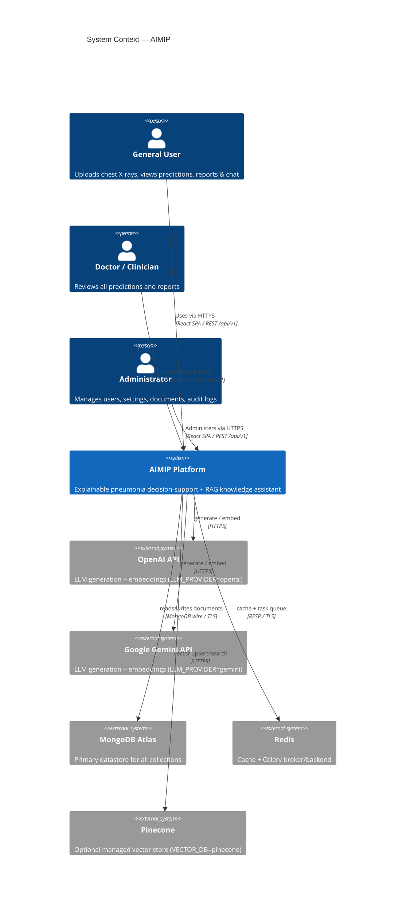
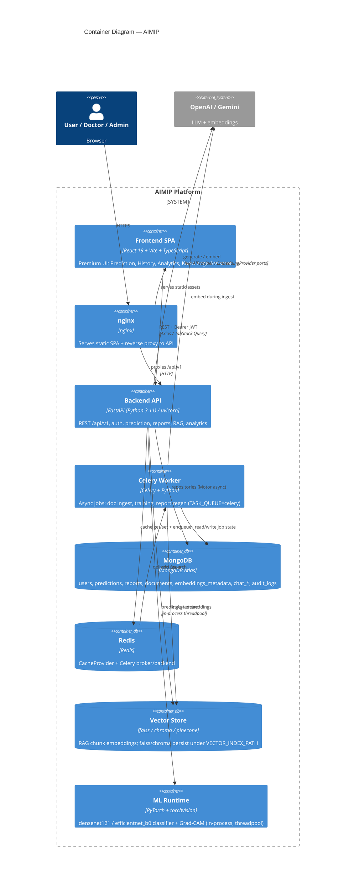
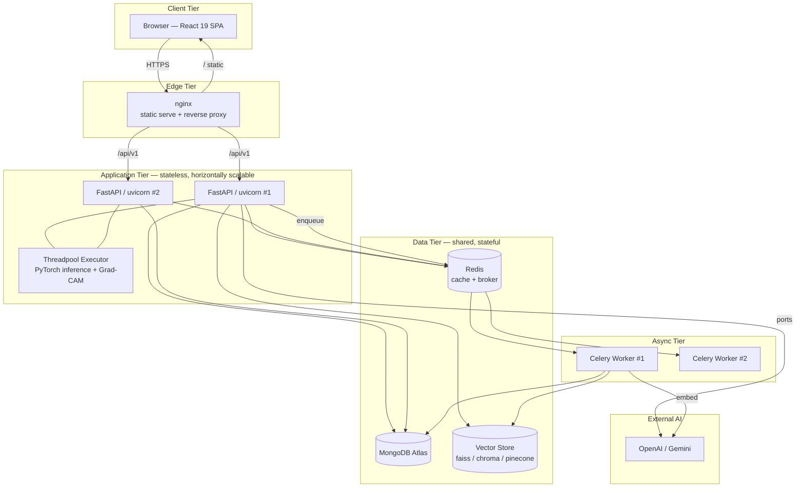
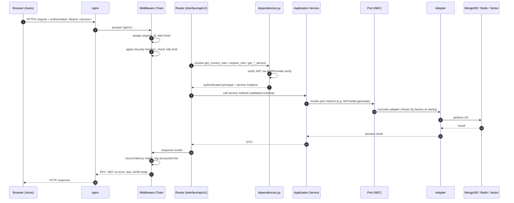

# 03 — System Architecture

> **Product:** Advanced AI Medical Intelligence Platform (**AIMIP**)
> **Scope:** System-level architecture — C4 Context & Container views, technology
> stack rationale, runtime topology, request lifecycle, and cross-cutting concerns.
> **Related docs:** [SRS](02_Software_Requirements_Specification.md) ·
> [High-Level Architecture](04_High_Level_Architecture.md) ·
> [Low-Level Architecture](05_Low_Level_Architecture.md) ·
> [Folder Structure](06_Folder_Structure.md) ·
> [Backend Architecture](07_Backend_Architecture.md) ·
> [AI Providers](16_AI_Providers.md) ·
> [Database Design](17_Database_Design.md) ·
> [API Design](18_API_Design.md) ·
> [Authorization / RBAC](20_Authorization_RBAC.md) ·
> [Environment Configuration](31_Environment_Configuration.md)

> **Disclaimer:** AIMIP is a clinical **decision-support** platform, NOT a medical
> device. All outputs are informational, not a diagnosis; a licensed clinician must
> review every result. No PHI is uploaded without consent. The platform is not
> FDA/CE cleared.

---

## 1. Purpose and Architectural Goals

AIMIP is an enterprise AI healthcare SaaS whose core capability pipeline is:

> chest X-ray pneumonia classification → Explainable AI (Grad-CAM) → LLM-generated
> medical report → RAG medical knowledge assistant

behind JWT authentication, persisted in MongoDB, served through a premium React
frontend, with analytics, Docker packaging, CI, and observability.

The architecture is designed to satisfy the non-functional targets in the
[SRS](02_Software_Requirements_Specification.md):

| Goal | Target | Architectural mechanism |
|------|--------|-------------------------|
| Availability | 99.5% | Stateless API, health probes, container restart policies |
| API latency | p95 < 300 ms (excl. model/LLM) | Async I/O (FastAPI + Motor), caching, threadpool offload |
| Prediction latency | end-to-end < 6 s p95 | Threadpool inference, warm model, precomputed Grad-CAM |
| Scalability | Horizontal, stateless | No in-process session state; Redis + MongoDB Atlas shared |
| Testability | ≥ 80% backend coverage | Ports & Adapters + contract tests in `tests/contract/` |
| Security | OWASP ASVS L1 | JWT rotation, RBAC, security headers, rate limiting |
| Portability | 12-factor config | ENV-driven providers, fail-fast `Settings` |
| Observability | Logs + metrics + tracing | `structlog`, `prometheus-client`, request-id propagation |

The guiding principle is **Clean / Hexagonal (Ports & Adapters)** with dependency
direction `domain ← application ← infrastructure ← interface`. Business logic depends
only on **ports** (ABCs); concrete **adapters** are chosen at startup by **factories**
reading ENV. This is elaborated in [Low-Level Architecture](05_Low_Level_Architecture.md).

---

## 2. C4 Level 1 — System Context

**Context notes**

- The three human roles map to the RBAC roles `user`, `doctor`, `admin`
  (see [Authorization / RBAC](20_Authorization_RBAC.md)).
- External AI vendors are reached **only** through the `AIProvider` and
  `EmbeddingProvider` ports — never called from business logic directly.
- `sentence-transformer` embeddings and `faiss`/`chroma` vector stores run
  **in-process**, so with `EMBEDDING_PROVIDER=sentence_transformer`,
  `VECTOR_DB=faiss`, and `LLM_PROVIDER=mock` the platform has **no external AI
  dependency** at all — useful for air-gapped and offline test environments.

---

## 3. C4 Level 2 — Container Diagram

**Container responsibilities**

| Container | Technology | Responsibility |
|-----------|-----------|----------------|
| Frontend SPA | React 19, Vite, TypeScript, Tailwind, TanStack Query, Zustand | All UI/UX; server-state via TanStack Query, client/UI state via Zustand |
| nginx | nginx | Serves built SPA; reverse-proxies `/api/v1` to the API; TLS termination point |
| Backend API | FastAPI + uvicorn[standard] | Stateless REST surface, auth, orchestration of services and ports |
| Celery Worker | Celery + Redis | Long-running async jobs when `TASK_QUEUE=celery` (ingest, train, report_regen) |
| MongoDB | MongoDB Atlas (Motor) | System of record for all 9 collections (see [Database Design](17_Database_Design.md)) |
| Redis | Redis | `CacheProvider=redis` and Celery broker/result backend |
| Vector Store | faiss-cpu / chromadb / pinecone | RAG embedding index behind the `VectorStore` port |
| ML Runtime | PyTorch, torchvision, OpenCV, Pillow | Classifier build/predict + Grad-CAM; runs in-process on a threadpool executor |

---

## 4. Technology Stack & Rationale

The authoritative stack is fixed in the [CANON](_CANON.md). The rationale below
explains *why* each choice serves the architecture. **TensorFlow and LlamaIndex are
intentionally NOT used**; the target Python is **3.11+ (NOT 3.12)**.

### 4.1 Backend

| Technology | Role | Rationale |
|-----------|------|-----------|
| **Python 3.11+** | Runtime | Mature async, structural pattern matching, faster CPython; pinned below 3.12 for PyTorch/torchvision wheel compatibility |
| **FastAPI** | Web framework | First-class async, Pydantic-native validation, automatic OpenAPI at `/docs`, `Depends` DI aligns with our composition root |
| **Pydantic v2 + pydantic-settings** | Validation + config | Fast v2 core; `Settings` gives 12-factor fail-fast config (e.g. `LLM_PROVIDER=openai` with empty `OPENAI_API_KEY` raises at startup) |
| **Motor** | Async MongoDB driver | Non-blocking DB I/O keeps the event loop free, protecting the p95 < 300 ms target |
| **PyTorch + torchvision** | ML | Pretrained `densenet121`/`efficientnet_b0`; hooks enable Grad-CAM on `target_layer` |
| **Pillow / OpenCV (headless) / NumPy** | Image ops | Decode, normalize (224×224, ImageNet mean/std), and render Grad-CAM overlays |
| **scikit-learn** | Metrics | Accuracy, precision, recall, F1, AUROC, confusion matrix during training |
| **PyMuPDF (fitz)** | PDF ingest | Fast, dependency-light PDF text + page extraction for RAG |
| **sentence-transformers / faiss-cpu / chromadb** | Embeddings + vectors | Local, offline-capable embedding and vector search paths |
| **openai / google-generativeai** | LLM + embeddings | Managed vendors behind `AIProvider`/`EmbeddingProvider` ports |
| **python-jose[cryptography] / passlib[bcrypt]** | Auth | JWT sign/verify + bcrypt password hashing |
| **redis / celery** | Cache + queue | `CacheProvider` and `TaskQueue` adapters for scale-out async work |
| **prometheus-client / structlog** | Observability | `/metrics` scrape endpoint + structured JSON logs with request-id |
| **httpx** | HTTP client | Async outbound calls (vendor SDK fallback / health checks) |
| **pytest, pytest-asyncio, ruff, mypy** | Quality | Test + lint + type gates enforced in CI |

### 4.2 Frontend

| Technology | Role | Rationale |
|-----------|------|-----------|
| **React 19 + Vite + TypeScript** | SPA | Fast HMR dev loop, type safety, modern concurrent rendering |
| **TailwindCSS + Framer Motion** | Styling + motion | Medical palette (primary blue `#0EA5E9`, teal `#14B8A6`), glassmorphism, 8px scale |
| **TanStack Query** | Server state | Caching, retries, background refetch for prediction/history/analytics |
| **Zustand** | UI/client state | Lightweight store for theme, sidebar, ephemeral UI |
| **React Hook Form + Zod** | Forms | Typed schema validation mirroring backend Pydantic schemas |
| **Axios** | HTTP | Interceptors attach Bearer token and handle refresh rotation |
| **React Router v6** | Routing | Route-based code splitting per page |
| **Recharts** | Charts | Analytics: trends, disease/confidence distributions |
| **Lucide-react** | Icons | Consistent line-icon system |
| **Vitest + React Testing Library** | Testing | Component + hook tests aligned with Vite |

### 4.3 Infrastructure

| Technology | Role | Rationale |
|-----------|------|-----------|
| **MongoDB Atlas** | Datastore | Flexible document model fits prediction/report/chat shapes; TTL indexes for refresh tokens |
| **Redis** | Cache + broker | Shared cache and Celery transport for horizontal scale |
| **Docker + docker-compose** | Packaging | Reproducible multi-container topology (Docker is authored now, run later) |
| **nginx** | Serve + proxy | Static SPA hosting and reverse proxy in one edge tier |
| **GitHub Actions** | CI | Lint, type-check, test, build gates on every push |

---

## 5. Runtime Topology

**Topology principles**

- **Stateless API** — no session or file state is held in-process; JWT carries
  identity, MongoDB/Redis/vector store hold all shared state. Any API replica can
  serve any request, enabling horizontal scale behind nginx.
- **Model in-process, offloaded** — inference and Grad-CAM run in the API process
  but on a **threadpool executor**, so the async event loop is never blocked.
- **Async tier optional** — with `TASK_QUEUE=inprocess` the API executes jobs
  synchronously in a background task (single-node dev). With `TASK_QUEUE=celery`
  the same jobs run on dedicated workers (production scale).
- **Data tier shared** — MongoDB Atlas, Redis, and (for `faiss`/`chroma`) a persisted
  index directory under `VECTOR_INDEX_PATH` are the only stateful components.

---

## 6. Request Lifecycle

The middleware chain (see `interface/middleware/`) wraps every request in this order:
`request_id` → `timing` → `security_headers` → `rate_limit` → `error_handler`, then
router → dependencies → service → ports → adapters.

**Error handling** — all failures surface as **RFC 7807** problem documents
`{type, title, status, detail, instance, errors?}` via the `error_handler`
middleware and `core/exceptions.py`. List endpoints use the envelope
`{items, page, size, total, pages}`. Full contract in [API Design](18_API_Design.md).

---

## 7. Cross-Cutting Concerns (Overview)

| Concern | Where implemented | Summary |
|---------|-------------------|---------|
| **Configuration** | `core/config.py` (`Settings`) | 12-factor, pydantic-settings, fail-fast on invalid provider/key combos |
| **Composition / DI** | `core/container.py` + `interface/dependencies.py` | Composition root builds adapters via factories; FastAPI `Depends` injects services |
| **Authentication** | `AuthProvider` (`jwt` adapter), `security.py` | Access + refresh JWT, rotation, bcrypt hashing, lockout after `MAX_LOGIN_ATTEMPTS` |
| **Authorization** | `require_role(...)` dependency | RBAC for `user`/`doctor`/`admin` — see [RBAC](20_Authorization_RBAC.md) |
| **Validation** | Pydantic v2 schemas | Request/response models in `interface/schemas/` |
| **Caching** | `CacheProvider` (`memory`/`redis`) | Hot reads (analytics, settings) with TTL |
| **Async jobs** | `TaskQueue` (`inprocess`/`celery`) | Ingest, train, report regen in `app/workers/` |
| **Logging** | `core/logging.py` (`structlog`) | Structured JSON logs carrying `request_id` |
| **Metrics** | `prometheus-client` | `/metrics` endpoint; request latency, counts |
| **Tracing / correlation** | `request_id` middleware | Correlation id propagated through logs and responses |
| **Security headers** | `security_headers` middleware | HSTS, CSP, X-Content-Type-Options, etc. |
| **Rate limiting** | `rate_limit` middleware | Per-principal throttling |
| **Auditing** | `audit_logs` collection | Append-only; PHI access recorded |
| **Idempotency** | `Idempotency-Key` header + `predictions.idempotency_key` | Safe `POST /predict` retries |
| **OOD safety** | ML inference guard | Rejects non-chest-X-ray uploads → `ood_flag` |

Each concern is expanded in its dedicated doc; the mechanisms are wired centrally in
the composition root so that a provider swap is a `.env` change only — see
[Low-Level Architecture](05_Low_Level_Architecture.md) and
[AI Providers](16_AI_Providers.md).

---

## 8. Deployment View (Summary)

`docker-compose.yml` composes: `frontend` (nginx serving the built SPA + proxy),
`backend` (FastAPI/uvicorn), `worker` (Celery), `redis`, and connects to MongoDB
Atlas and the configured vector store. Health is probed via `GET /health/live`
(liveness) and `GET /health/ready` (readiness — verifies DB, cache, model load).
CI is defined in `.github/workflows/ci.yml`. The full deployment and RPO/RTO
treatment lives in the deployment documentation; the container-level view here is
the authoritative source for topology.

---

*See also:* [High-Level Architecture](04_High_Level_Architecture.md) for subsystem
boundaries and data/control flow, and [Folder Structure](06_Folder_Structure.md)
for the code map.
