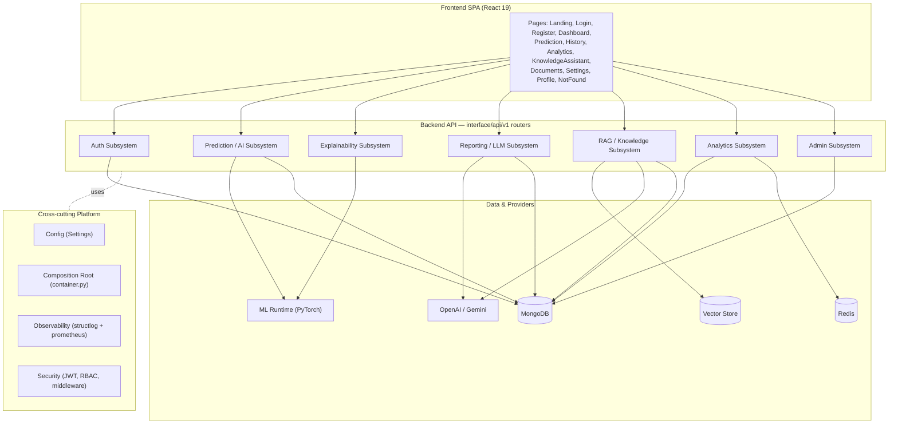
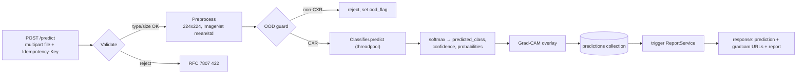
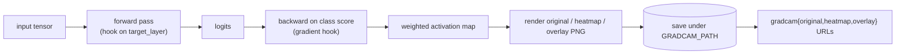
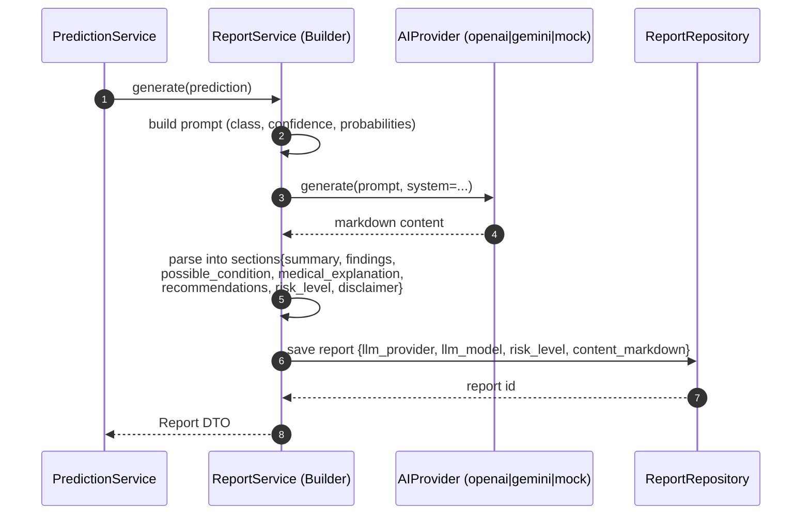
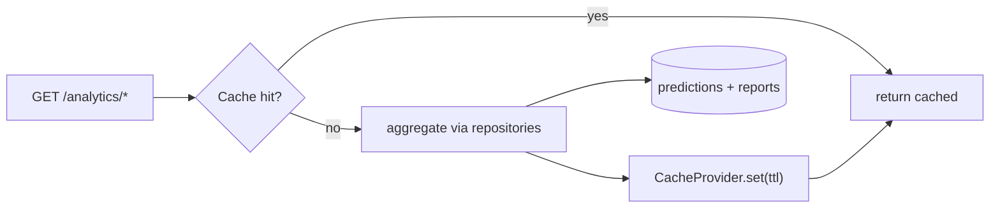
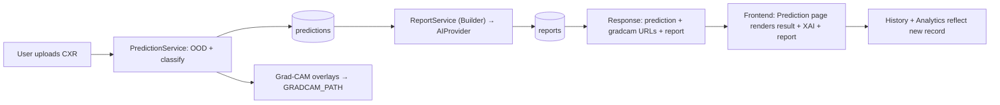
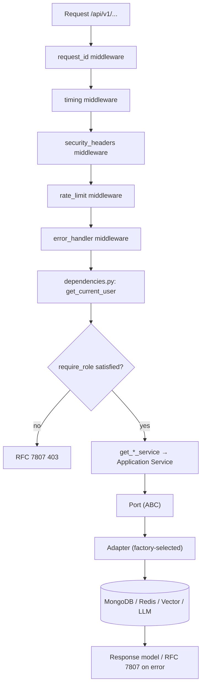
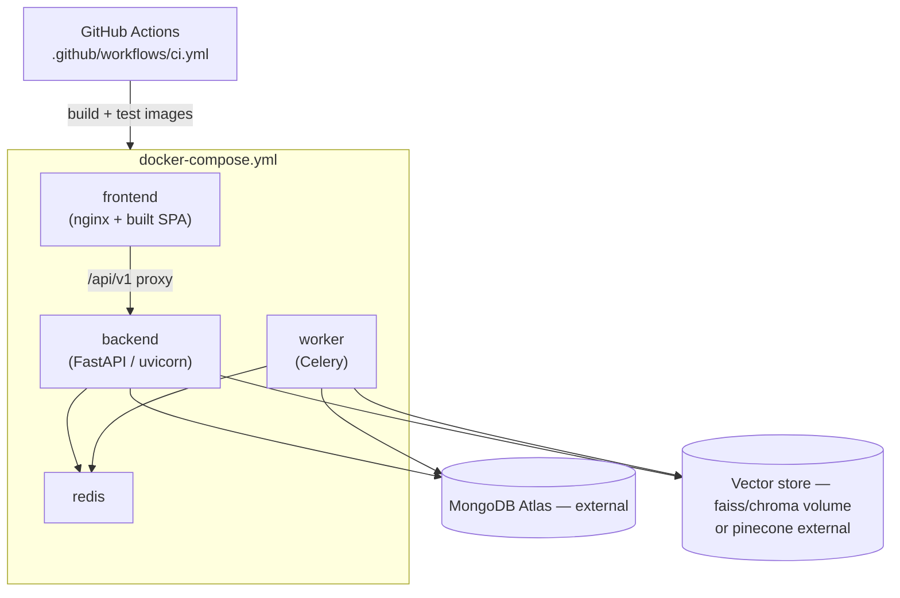

# 04 — High-Level Architecture

> **Product:** Advanced AI Medical Intelligence Platform (**AIMIP**)
> **Scope:** Subsystem decomposition and boundaries, data-flow and control-flow
> diagrams, integration points, and the deployment view.
> **Related docs:** [System Architecture](03_System_Architecture.md) ·
> [Low-Level Architecture](05_Low_Level_Architecture.md) ·
> [Folder Structure](06_Folder_Structure.md) ·
> [Backend Architecture](07_Backend_Architecture.md) ·
> [AI Providers](16_AI_Providers.md) ·
> [Database Design](17_Database_Design.md) ·
> [API Design](18_API_Design.md) ·
> [Authorization / RBAC](20_Authorization_RBAC.md) ·
> [Environment Configuration](31_Environment_Configuration.md)

> **Disclaimer:** AIMIP is clinical **decision-support**, NOT a medical device.
> Outputs are informational, not a diagnosis; a licensed clinician must review all
> results. No PHI without consent. Not FDA/CE cleared.

---

## 1. Subsystem Map

AIMIP decomposes into seven cohesive subsystems plus shared platform concerns. Each
subsystem owns a set of application services, ports, and adapters, and maps to a
router group under `/api/v1` and (usually) a MongoDB collection set.



### 1.1 Subsystem boundaries

| Subsystem | Application service(s) | Routers | Ports used | Primary collections |
|-----------|------------------------|---------|------------|---------------------|
| **Auth** | `AuthService`, `UserService` | `auth` | `AuthProvider`, `StorageProvider`, `UserRepository`, `RefreshTokenRepository` | `users`, `refresh_tokens` |
| **Prediction / AI** | `PredictionService` | `predict`, `history` | `Classifier`, `StorageProvider`, `TaskQueue`, `PredictionRepository` | `predictions` |
| **Explainability** | `PredictionService` (Grad-CAM step) | `predict` | `Classifier` (`target_layer`), `StorageProvider` | `predictions.gradcam` |
| **Reporting / LLM** | `ReportService` | `reports` | `AIProvider`, `ReportRepository` | `reports` |
| **RAG / Knowledge** | `RagService`, `DocumentService` | `chat`, `documents` | `EmbeddingProvider`, `VectorStore`, `AIProvider`, `TaskQueue`, `DocumentRepository`, `ChatRepository` | `documents`, `embeddings_metadata`, `chat_sessions`, `chat_history` |
| **Analytics** | `AnalyticsService` | `analytics` | `CacheProvider`, `PredictionRepository`, `ReportRepository` | `predictions`, `reports` |
| **Admin** | `UserService` | `users`, `settings` | `StorageProvider`, `UserRepository` | `users`, `audit_logs` |

Boundaries follow the dependency rule from the [CANON](_CANON.md): each service
depends only on **ports** (ABCs). No service imports a vendor SDK. Adapter selection
is centralized in the composition root — see
[Low-Level Architecture](05_Low_Level_Architecture.md).

---

## 2. Auth Subsystem

**Responsibility:** registration, login, token issuance/rotation, logout, and the
authenticated principal (`GET /auth/me`). Enforces bcrypt hashing, lockout after
`MAX_LOGIN_ATTEMPTS` (default 5) for `LOCKOUT_MINUTES` (default 15), access tokens
(`ACCESS_TOKEN_EXPIRE_MINUTES=30`) and rotating refresh tokens
(`REFRESH_TOKEN_EXPIRE_DAYS=7`).

```mermaid
sequenceDiagram
    autonumber
    participant C as Client
    participant R as auth router
    participant S as AuthService
    participant AP as AuthProvider (jwt)
    participant UR as UserRepository
    participant TR as RefreshTokenRepository

    C->>R: POST /auth/login {email, password}
    R->>S: login(email, password)
    S->>UR: find_by_email(email)
    UR-->>S: user (password_hash, failed_login_attempts, locked_until)
    S->>S: verify bcrypt; check lockout
    S->>AP: create_access(user), create_refresh(user)
    AP-->>S: access, refresh (jti)
    S->>TR: store refresh (jti, token_hash, expires_at)
    S-->>R: {access, refresh}
    R-->>C: 200 OK

    Note over C,TR: POST /auth/refresh rotates: verify → revoke old jti → issue new pair
```

Endpoints (see [API Design](18_API_Design.md)): `POST /auth/register`,
`POST /auth/login`, `POST /auth/refresh`, `POST /auth/logout`, `GET /auth/me`.

---

## 3. Prediction / AI Subsystem

**Responsibility:** accept a chest X-ray upload, guard against out-of-distribution
inputs, run the classifier, persist the prediction, and trigger report generation.



- Default `MODEL_ARCH=densenet121` (torchvision, ImageNet-pretrained), 2-class head
  `[NORMAL, PNEUMONIA]`; alternative `efficientnet_b0`.
- Inference runs in a **threadpool executor** so the event loop is never blocked
  (protects p95 targets in the [SRS](02_Software_Requirements_Specification.md)).
- **Idempotency:** the `Idempotency-Key` header maps to
  `predictions.idempotency_key`; repeat keys return the original result.
- **Pretrained-inference fallback** lets the app run without training or the dataset.

---

## 4. Explainability Subsystem

**Responsibility:** produce visual evidence for each prediction via Grad-CAM using
forward/backward hooks on the `Classifier.target_layer`.



Outputs are stored in `predictions.gradcam{original,heatmap,overlay}` and served as
URLs. This subsystem shares the `Classifier` port with Prediction — the explainability
step reuses the already-built model instance.

---

## 5. Reporting / LLM Subsystem

**Responsibility:** assemble a structured medical report from a prediction using the
**Builder** pattern and the `AIProvider` port. Never calls a vendor SDK directly.



Report sections are exactly: `summary`, `findings`, `possible_condition`,
`medical_explanation`, `recommendations`, `risk_level`, `disclaimer`. `risk_level` is
one of `low|moderate|high`. Endpoints: `GET /reports/{prediction_id}`,
`POST /reports/{prediction_id}/regenerate`.

---

## 6. RAG / Knowledge Subsystem

**Responsibility:** ingest medical PDFs, index them, and answer grounded questions
with citations, refusing when retrieval confidence is too low.

```mermaid
flowchart TB
    subgraph Ingest["Ingest pipeline (async via TaskQueue)"]
        UP["POST /documents (pdf)"] --> LD["PyMuPDF load"]
        LD --> CL["clean"]
        CL --> CH["chunk (RAG_CHUNK_SIZE=800, overlap=120)"]
        CH --> EM["EmbeddingProvider.embed"]
        EM --> VS[("VectorStore.add + persist")]
        EM --> MD[("embeddings_metadata")]
        CH --> DS["documents.status: indexed"]
    end

    subgraph Query["Query pipeline"]
        Q["POST /chat {session_id?, message}"] --> QE["embed query"]
        QE --> RT["hybrid retrieve<br/>(dense + BM25), top_k=RAG_TOP_K"]
        RT --> RK["rerank"]
        RK --> GATE{max score >= RAG_MIN_SCORE?}
        GATE -->|no| REF["refuse: 'insufficient context'"]
        GATE -->|yes| GEN["AIProvider.generate grounded answer"]
        GEN --> CIT["attach citations[{document_id, chunk_id, score}]"]
        CIT --> HIST[("chat_history + chat_sessions")]
    end
```



- Chunking parameters come from ENV: `RAG_CHUNK_SIZE=800`, `RAG_CHUNK_OVERLAP=120`,
  `RAG_TOP_K=5`, `RAG_MIN_SCORE=0.2`.
- Retrieval is **hybrid** (dense embeddings + BM25) followed by reranking.
- The answer is **grounded** with citations; below `RAG_MIN_SCORE` the assistant
  refuses rather than hallucinate — a clinical-safety requirement.
- Ingest runs asynchronously through the `TaskQueue` port
  (`inprocess` or `celery`). See [AI Providers](16_AI_Providers.md).

---

## 7. Analytics Subsystem

**Responsibility:** aggregate prediction/report data into dashboard metrics, cached
via the `CacheProvider` port for latency.



Endpoints: `GET /analytics/overview`, `/analytics/trends?interval=day|week`,
`/analytics/disease-distribution`, `/analytics/confidence-distribution`,
`/analytics/recent-activity`. Rendered with Recharts on the Analytics page.

---

## 8. Admin Subsystem

**Responsibility:** user management, platform settings, and audit visibility —
restricted to `admin` via `require_role("admin")`.

Endpoints: `GET /users`, `GET /users/{id}`, `PATCH /users/{id}`, `DELETE /users/{id}`,
`GET /settings`, `PATCH /settings`. Every privileged action writes to the append-only
`audit_logs` collection. RBAC matrix in [Authorization / RBAC](20_Authorization_RBAC.md).

---

## 9. End-to-End Data Flow — Prediction to Report



---

## 10. Control Flow — Authenticated Request



Control always enters through the fixed middleware chain, resolves identity and role
in `dependencies.py`, then flows service → port → adapter. Adapters are the only layer
that touches external systems.

---

## 11. Integration Points

| Integration | Boundary port / mechanism | ENV selector | Notes |
|-------------|---------------------------|--------------|-------|
| OpenAI (LLM + embeddings) | `AIProvider`, `EmbeddingProvider` | `LLM_PROVIDER=openai`, `EMBEDDING_PROVIDER=openai` | Requires `OPENAI_API_KEY` (fail-fast) |
| Google Gemini | `AIProvider`, `EmbeddingProvider` | `LLM_PROVIDER=gemini`, `EMBEDDING_PROVIDER=gemini` | Requires `GEMINI_API_KEY` |
| Local embeddings | `EmbeddingProvider` | `EMBEDDING_PROVIDER=sentence_transformer` | In-process, offline-capable |
| Vector store | `VectorStore` | `VECTOR_DB=faiss\|chroma\|pinecone` | faiss/chroma persist under `VECTOR_INDEX_PATH`; pinecone via `PINECONE_API_KEY` |
| MongoDB Atlas | `StorageProvider` + repositories | `STORAGE_PROVIDER=mongodb` | `MONGODB_URI`, `DB_NAME=aimip` |
| Redis | `CacheProvider`, `TaskQueue` | `CACHE_PROVIDER=redis`, `TASK_QUEUE=celery` | `REDIS_URL` |
| Classifier | `Classifier` | `MODEL_ARCH=densenet121\|efficientnet_b0` | Weights at `MODEL_PATH` |
| Auth | `AuthProvider` | `AUTH_PROVIDER=jwt` | Future: oauth2, keycloak |
| Frontend → API | REST `/api/v1` + Bearer JWT | `VITE_API_BASE_URL` | Axios interceptors handle refresh |

Every port ships a **shared contract test** in `tests/contract/`; a provider swap
(`.env` change only) is itself an automated test — see the [CANON](_CANON.md) §3.

---

## 12. Deployment View



- **Services:** `frontend`, `backend`, `worker`, `redis` in `docker-compose.yml`;
  MongoDB Atlas and (optionally) Pinecone are external managed services.
- **Health:** `GET /health/live` (liveness) and `GET /health/ready` (readiness:
  DB + cache + model load) drive orchestrator probes.
- **Observability:** `GET /metrics` (Prometheus) and structured `structlog` output.
- **CI:** lint (`ruff`), type-check (`mypy`), tests (`pytest`), and image build.
- Docker is authored now and run later (not installed on the current dev machine).

The detailed deployment procedure, scaling, and RPO/RTO live in the deployment
documentation; this section is the authoritative high-level topology.

---

*See also:* [System Architecture](03_System_Architecture.md) for C4 diagrams and the
technology-stack rationale, and [Low-Level Architecture](05_Low_Level_Architecture.md)
for the ports-and-adapters internals.
