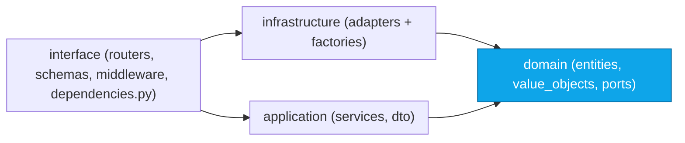
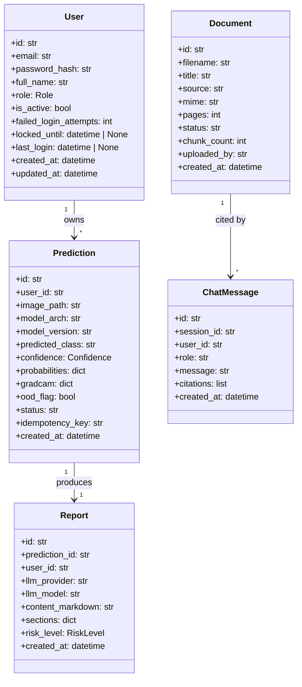
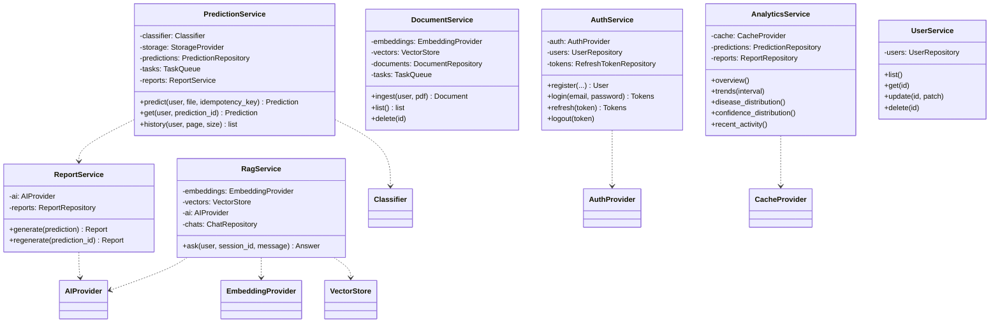
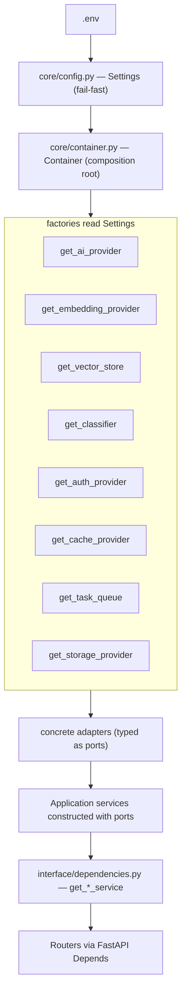
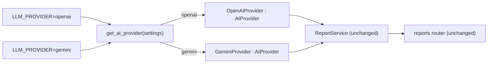

# 05 — Low-Level Architecture (Ports & Adapters)

> **Product:** Advanced AI Medical Intelligence Platform (**AIMIP**)
> **Scope:** The Hexagonal / Ports-and-Adapters design in detail — domain entities,
> ports (ABCs), application services, infrastructure adapters, the DI / composition
> root, class-level Mermaid diagrams, a concrete request trace, and how a provider
> swap changes nothing but the factory output.
> **Related docs:** [System Architecture](03_System_Architecture.md) ·
> [High-Level Architecture](04_High_Level_Architecture.md) ·
> [Folder Structure](06_Folder_Structure.md) ·
> [Backend Architecture](07_Backend_Architecture.md) ·
> [AI Providers](16_AI_Providers.md) ·
> [Database Design](17_Database_Design.md) ·
> [API Design](18_API_Design.md) ·
> [Authorization / RBAC](20_Authorization_RBAC.md) ·
> [Environment Configuration](31_Environment_Configuration.md)

> **Disclaimer:** AIMIP is clinical **decision-support**, NOT a medical device.
> Outputs are informational, not a diagnosis; a licensed clinician must review all
> results. No PHI without consent. Not FDA/CE cleared.

---

## 1. The Dependency Rule

AIMIP is **Clean / Hexagonal (Ports & Adapters)**. The dependency direction is fixed:

```
domain ← application ← infrastructure ← interface
```

- **domain** — pure business types (entities, value objects) and **ports** (ABCs).
  Depends on nothing else in the codebase.
- **application** — services orchestrating use cases. Depends only on **domain**
  (entities + ports), never on concrete adapters or vendor SDKs.
- **infrastructure** — concrete **adapters** implementing the ports (Mongo repos,
  LLM clients, vector stores, ML runtime). Depends on domain (to implement its ABCs).
- **interface** — FastAPI routers, schemas, middleware, and `dependencies.py`.
  Depends on application + domain; wires adapters via the composition root.



The arrows only ever point **inward** toward `domain`. Business logic depends on
**abstractions (ports)**; concrete adapters are chosen at startup by **factories**
reading ENV. This is the Dependency Inversion Principle applied platform-wide.

---

## 2. Domain Layer

### 2.1 Entities (`domain/entities/`)

Entities mirror the MongoDB collections (see [Database Design](17_Database_Design.md))
but are framework-free dataclasses/Pydantic models with no persistence concerns.



### 2.2 Value Objects (`domain/value_objects/`)

Immutable, self-validating types: `Role` (`admin|doctor|user`), `RiskLevel`
(`low|moderate|high`), `Confidence` (0.0–1.0 softmax max). They centralize
invariants so services never carry raw strings/floats with implicit rules.

### 2.3 Ports (`domain/ports/`)

Ports are Python **ABCs**. Per the [CANON](_CANON.md) §3, business logic **NEVER**
calls a vendor SDK — it calls a port.

```mermaid
classDiagram
    class AIProvider {
        <<abstract>>
        +generate(prompt, system, **opts) str
        +stream(prompt, system, **opts) Iterator
    }
    class EmbeddingProvider {
        <<abstract>>
        +embed(texts: list[str]) list[list[float]]
        +dimension: int
    }
    class VectorStore {
        <<abstract>>
        +add(ids, vectors, metadatas)
        +search(vector, k, filter) list
        +persist()
        +load()
    }
    class Classifier {
        <<abstract>>
        +build()
        +predict(tensor) logits
        +target_layer
    }
    class AuthProvider {
        <<abstract>>
        +create_access(user) str
        +create_refresh(user) str
        +verify(token) claims
        +rotate(refresh) tokens
    }
    class StorageProvider {
        <<abstract>>
        +save_blob(...) 
        +get_blob(...)
        +delete_blob(...)
        +repository access
    }
    class CacheProvider {
        <<abstract>>
        +get(key)
        +set(key, value, ttl)
        +delete(key)
    }
    class TaskQueue {
        <<abstract>>
        +enqueue(job_name, payload)
        +schedule(...)
    }
    class Repository {
        <<abstract>>
        +get(id)
        +add(entity)
        +update(entity)
        +delete(id)
        +list(filter, page, size)
    }
```



| Port (ABC) | ENV var | Adapters | Key methods |
|------------|---------|----------|-------------|
| `AIProvider` | `LLM_PROVIDER` | `openai` · `gemini` · `mock` | `generate(prompt, system=None, **opts) -> str`, `stream(...)` |
| `EmbeddingProvider` | `EMBEDDING_PROVIDER` | `openai` · `gemini` · `sentence_transformer` | `embed(texts) -> list[list[float]]`, `dimension: int` |
| `VectorStore` | `VECTOR_DB` | `faiss` · `chroma` · `pinecone` | `add`, `search(vector, k, filter=None)`, `persist()`, `load()` |
| `Classifier` | `MODEL_ARCH` | `densenet121` · `efficientnet_b0` | `build()`, `predict(tensor) -> logits`, `target_layer` |
| `AuthProvider` | `AUTH_PROVIDER` | `jwt` | `create_access`, `create_refresh`, `verify`, `rotate` |
| `StorageProvider` | `STORAGE_PROVIDER` | `mongodb` | repository access + `save_blob/get_blob/delete_blob` |
| `CacheProvider` | `CACHE_PROVIDER` | `memory` · `redis` | `get`, `set(ttl)`, `delete` |
| `TaskQueue` | `TASK_QUEUE` | `inprocess` · `celery` | `enqueue(job_name, payload)`, `schedule(...)` |

Repository ports (`UserRepository`, `RefreshTokenRepository`, `PredictionRepository`,
`ReportRepository`, `DocumentRepository`, `ChatRepository`) also live in
`domain/ports/` and follow the **Repository** pattern.

---

## 3. Application Layer

Services in `application/services/` orchestrate use cases. Each is constructed with
its **ports** (constructor injection) and holds no vendor references.



Services depend on **interfaces only** (the `..>` dotted dependencies point at ABCs).
They are unit-testable by injecting fakes/mocks — no network, no DB.

---

## 4. Infrastructure Layer — Adapters

Adapters implement the ports. They live under `infrastructure/` and are the **only**
code allowed to import vendor SDKs (`openai`, `google-generativeai`, `faiss`,
`chromadb`, `torch`, `motor`, `redis`, `celery`, `python-jose`).

```mermaid
classDiagram
    AIProvider <|.. OpenAIProvider
    AIProvider <|.. GeminiProvider
    AIProvider <|.. MockAIProvider

    EmbeddingProvider <|.. OpenAIEmbeddings
    EmbeddingProvider <|.. GeminiEmbeddings
    EmbeddingProvider <|.. SentenceTransformerEmbeddings

    VectorStore <|.. FaissVectorStore
    VectorStore <|.. ChromaVectorStore
    VectorStore <|.. PineconeVectorStore

    Classifier <|.. DenseNet121Classifier
    Classifier <|.. EfficientNetB0Classifier

    AuthProvider <|.. JwtAuthProvider
    CacheProvider <|.. MemoryCache
    CacheProvider <|.. RedisCache
    TaskQueue <|.. InProcessTaskQueue
    TaskQueue <|.. CeleryTaskQueue
    StorageProvider <|.. MongoStorageProvider

    class OpenAIProvider {
        -client: openai.OpenAI
        +generate(prompt, system, **opts) str
        +stream(...)
    }
    class DenseNet121Classifier {
        -model: torchvision densenet121
        +build()
        +predict(tensor) logits
        +target_layer
    }
    class FaissVectorStore {
        -index: faiss.Index
        +add(ids, vectors, metadatas)
        +search(vector, k, filter)
        +persist()  // VECTOR_INDEX_PATH
        +load()
    }
```



Each provider family has a **factory** `get_<x>_provider(settings)` in
`infrastructure/providers/<x>/factory.py` (per [CANON](_CANON.md) §3). Factories are
the single decision point that reads ENV and returns the concrete adapter typed as
its port.

```python
# infrastructure/providers/llm/factory.py  (illustrative)
def get_ai_provider(settings: Settings) -> AIProvider:
    match settings.LLM_PROVIDER:
        case "openai":
            return OpenAIProvider(api_key=settings.OPENAI_API_KEY,
                                  model=settings.LLM_MODEL)
        case "gemini":
            return GeminiProvider(api_key=settings.GEMINI_API_KEY,
                                  model=settings.LLM_MODEL)
        case "mock":
            return MockAIProvider()
        case other:
            raise ConfigurationError(f"Unknown LLM_PROVIDER={other!r}")
```

The return type is the **port** `AIProvider` — callers never see the concrete class.

---

## 5. Composition Root & Dependency Injection

The **composition root** is `core/container.py`. At application startup
(`main.py` lifespan), it reads the validated `Settings`, calls every
`get_<x>_provider(settings)` factory once, constructs the repositories and
application services with those adapters, and holds them for the process lifetime.
`interface/dependencies.py` exposes FastAPI `Depends` providers that hand services to
routers.



```python
# core/container.py  (illustrative composition root)
class Container:
    def __init__(self, settings: Settings) -> None:
        # adapters — chosen by factories reading ENV
        self.ai        = get_ai_provider(settings)
        self.embed     = get_embedding_provider(settings)
        self.vectors   = get_vector_store(settings)
        self.classifier= get_classifier(settings); self.classifier.build()
        self.auth      = get_auth_provider(settings)
        self.cache     = get_cache_provider(settings)
        self.tasks     = get_task_queue(settings)
        self.storage   = get_storage_provider(settings)

        # repositories (Repository pattern over Motor)
        self.users        = self.storage.user_repository()
        self.predictions  = self.storage.prediction_repository()
        self.reports_repo  = self.storage.report_repository()

        # services — constructed with ports only
        self.report_service     = ReportService(self.ai, self.reports_repo)
        self.prediction_service = PredictionService(
            self.classifier, self.storage, self.predictions,
            self.tasks, self.report_service,
        )
        self.rag_service        = RagService(self.embed, self.vectors, self.ai, ...)
        self.auth_service       = AuthService(self.auth, self.users, ...)
        self.analytics_service  = AnalyticsService(self.cache, self.predictions, self.reports_repo)
```

```python
# interface/dependencies.py  (illustrative DI providers)
def get_prediction_service(request: Request) -> PredictionService:
    return request.app.state.container.prediction_service

def get_current_user(token = Depends(bearer_scheme),
                     request: Request = None) -> User:
    claims = request.app.state.container.auth.verify(token.credentials)
    ...  # load User; raise 401 (RFC 7807) if invalid

def require_role(*roles: str):
    def _dep(user: User = Depends(get_current_user)) -> User:
        if user.role not in roles:
            raise ForbiddenError()  # → RFC 7807 403
        return user
    return _dep
```

This is the **Dependency Injection** pattern from the [CANON](_CANON.md) §2:
FastAPI `Depends` + a composition-root container. Wiring happens once; the rest of
the code receives ready-made services.

---

## 6. Concrete Request Trace — `POST /predict`

The following trace follows one request from router to adapters and back, exactly per
the layered flow.

```mermaid
sequenceDiagram
    autonumber
    participant RT as predict router (interface/api/v1)
    participant DEP as dependencies.py
    participant PS as PredictionService (application)
    participant CL as Classifier port
    participant DN as DenseNet121Classifier (adapter)
    participant TP as Threadpool executor
    participant SP as StorageProvider port
    participant MR as MongoStorageProvider (adapter)
    participant RS as ReportService (application)
    participant AI as AIProvider port
    participant OA as OpenAIProvider (adapter)

    RT->>DEP: Depends(require_role("user","doctor","admin"))
    DEP->>DEP: AuthProvider.verify(bearer) → User
    DEP->>RT: get_prediction_service() → PS
    RT->>PS: predict(user, file, Idempotency-Key)
    PS->>PS: validate type/size; OOD guard
    PS->>CL: predict(tensor)
    CL->>DN: predict(tensor)  // port → adapter
    DN->>TP: run torch forward in threadpool
    TP-->>DN: logits
    DN-->>PS: logits → softmax(confidence, probabilities)
    PS->>DN: Grad-CAM via target_layer hooks → overlay PNGs
    PS->>SP: save prediction + blobs
    SP->>MR: insert into predictions, write GRADCAM_PATH
    MR-->>PS: prediction id
    PS->>RS: generate(prediction)
    RS->>AI: generate(prompt, system)
    AI->>OA: generate(...)  // port → adapter
    OA-->>RS: markdown → sections
    RS-->>PS: Report
    PS-->>RT: prediction + gradcam URLs + report
    RT-->>RT: serialize response schema
```

Notice every hop between layers crosses a **port**, and only adapters (`DenseNet121Classifier`,
`MongoStorageProvider`, `OpenAIProvider`) touch a framework or vendor. The router and
service never name a concrete adapter.

---

## 7. Provider Swap — "Change Nothing but the Factory Output"

Suppose we switch the LLM from OpenAI to Gemini. The **only** change is one ENV line:

```diff
- LLM_PROVIDER=openai
+ LLM_PROVIDER=gemini
```

At startup, `get_ai_provider(settings)` now returns a `GeminiProvider` instead of an
`OpenAIProvider`. Both satisfy the `AIProvider` ABC, so:

- `ReportService` is unchanged — it still calls `self.ai.generate(...)`.
- The `reports` router is unchanged.
- The composition root is unchanged — it still calls the same factory.
- Persisted `reports.llm_provider` / `reports.llm_model` simply record the new values.



The same holds for every port: `EMBEDDING_PROVIDER`, `VECTOR_DB`, `MODEL_ARCH`,
`CACHE_PROVIDER`, `TASK_QUEUE`, `STORAGE_PROVIDER`, `AUTH_PROVIDER`. Because each port
ships a **shared contract test** in `tests/contract/` that all its adapters must pass,
correctness is guaranteed across the swap — and **the provider swap itself is an
automated test** (a `.env` change only). See [AI Providers](16_AI_Providers.md).

### 7.1 Why this is safe by construction

| Property | Enforced by |
|----------|-------------|
| Business logic can't import a vendor SDK | Ports live in `domain/`; SDKs only in `infrastructure/` |
| All adapters behave identically at the boundary | Shared contract tests in `tests/contract/` |
| One decision point per port | The `get_<x>_provider(settings)` factory |
| Callers see the abstraction, not the class | Factory return type is the port ABC |
| Misconfiguration fails immediately | `Settings` fail-fast (e.g. `openai` + empty key) |

---

## 8. Cross-Cutting Implementation Notes

- **Threadpool offload** — `Classifier.predict` and Grad-CAM run via a threadpool
  executor so PyTorch never blocks the async event loop (protects p95 latency).
- **Idempotency** — `PredictionService` consults `predictions.idempotency_key`
  before running inference; a repeated `Idempotency-Key` returns the stored result.
- **Errors** — services raise domain exceptions from `core/exceptions.py`; the
  `error_handler` middleware maps them to **RFC 7807** problem documents.
- **Builder** — `ReportService` uses the Builder pattern to assemble the fixed
  section set `{summary, findings, possible_condition, medical_explanation,
  recommendations, risk_level, disclaimer}`.
- **Strategy / Provider** — the entire adapter mechanism is the Strategy pattern
  selected by configuration, per [CANON](_CANON.md) §2.

---

*See also:* [Folder Structure](06_Folder_Structure.md) for exactly where each of
these classes lives, and [Backend Architecture](07_Backend_Architecture.md) for the
runtime and lifecycle details.
