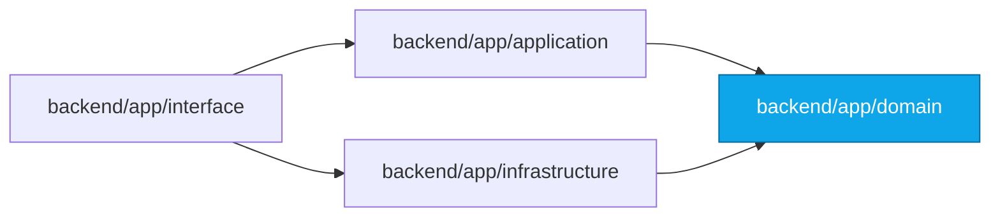

# 06 — Folder Structure

> **Product:** Advanced AI Medical Intelligence Platform (**AIMIP**)
> **Scope:** The full monorepo tree (reproduced from the [CANON](_CANON.md)), a
> per-directory responsibility table, and conventions for where new code goes.
> **Related docs:** [System Architecture](03_System_Architecture.md) ·
> [High-Level Architecture](04_High_Level_Architecture.md) ·
> [Low-Level Architecture](05_Low_Level_Architecture.md) ·
> [Backend Architecture](07_Backend_Architecture.md) ·
> [AI Providers](16_AI_Providers.md) ·
> [Database Design](17_Database_Design.md) ·
> [API Design](18_API_Design.md) ·
> [Authorization / RBAC](20_Authorization_RBAC.md) ·
> [Environment Configuration](31_Environment_Configuration.md)

> **Disclaimer:** AIMIP is clinical **decision-support**, NOT a medical device.
> Outputs are informational, not a diagnosis; a licensed clinician must review all
> results. No PHI without consent. Not FDA/CE cleared.

---

## 1. Monorepo Tree (authoritative)

The tree below is reproduced verbatim from the [CANON](_CANON.md) §4. It is the
single source of truth for where code lives.

```
AI_Prediction_System/
├── backend/
│   ├── app/
│   │   ├── main.py                     # app factory, lifespan, DI wiring, router mount
│   │   ├── core/                       # config.py (Settings), logging.py, security.py, exceptions.py, container.py
│   │   ├── domain/
│   │   │   ├── entities/               # User, Prediction, Report, Document, ChatMessage ...
│   │   │   ├── value_objects/          # Role, RiskLevel, Confidence ...
│   │   │   └── ports/                  # AIProvider, EmbeddingProvider, VectorStore, Classifier,
│   │   │                               #   AuthProvider, StorageProvider, CacheProvider, TaskQueue, *Repository
│   │   ├── application/
│   │   │   ├── services/               # AuthService, PredictionService, ReportService, RagService,
│   │   │   │                           #   DocumentService, AnalyticsService, UserService
│   │   │   └── dto/                    # internal data-transfer objects
│   │   ├── infrastructure/
│   │   │   ├── db/                     # mongo client, indexes, repositories (Repository pattern)
│   │   │   ├── providers/{llm,embeddings,vector_db,cache,task_queue}/  # adapters + factory.py
│   │   │   ├── ml/{classifier,inference,gradcam,training}/
│   │   │   ├── rag/                    # loader, cleaner, chunker, ingest, retriever, reranker, pipeline
│   │   │   ├── auth/                   # jwt adapter
│   │   │   └── storage/                # mongodb storage adapter
│   │   ├── interface/
│   │   │   ├── api/v1/                 # routers: auth, predict, history, reports, chat, documents,
│   │   │   │                           #   analytics, users, settings, health
│   │   │   ├── schemas/                # pydantic request/response models
│   │   │   ├── middleware/             # request_id, timing, rate_limit, error_handler, security_headers
│   │   │   └── dependencies.py         # FastAPI DI providers (get_current_user, require_role, get_*_service)
│   │   └── workers/                    # celery app + tasks (ingest, train, report_regen)
│   ├── tests/{unit,integration,contract}/
│   ├── scripts/                        # seed_db.py, ingest_docs.py, train.py entrypoints
│   ├── pyproject.toml / requirements.txt
│   ├── Dockerfile
│   └── .env.example
├── frontend/
│   ├── src/
│   │   ├── app/                        # providers, router, query client
│   │   ├── pages/                      # Landing, Login, Register, Dashboard, Prediction, History,
│   │   │                               #   Analytics, KnowledgeAssistant, Documents, Settings, Profile, NotFound
│   │   ├── features/{auth,prediction,history,analytics,chat,documents}/
│   │   ├── components/{ui,layout,charts}/
│   │   ├── hooks/  lib/ (api client, axios interceptors)  store/ (zustand)  styles/  types/
│   ├── package.json / vite.config.ts / tailwind.config.js / nginx.conf
│   ├── Dockerfile
│   └── .env.example
├── docs/                               # the 38 numbered docs (00–37)
├── data/                               # gitignored: uploads/, gradcam/, vector_index/, pdfs/, weights/
├── docker-compose.yml
├── .github/workflows/ci.yml
├── README.md · CHANGELOG.md · CONTRIBUTING.md · LICENSE · .gitignore
```

The four layers map cleanly onto directories, preserving the dependency rule
`domain ← application ← infrastructure ← interface` (see
[Low-Level Architecture](05_Low_Level_Architecture.md)):



---

## 2. Backend — Per-Directory Responsibility

### 2.1 Top level & `app/`

| Path | Responsibility |
|------|----------------|
| `backend/app/main.py` | App factory, `lifespan` (build `Container`, load model, connect DB), DI wiring, router mount, middleware registration |
| `backend/app/core/` | Cross-cutting foundation (see below) |
| `backend/app/domain/` | Pure business layer — entities, value objects, ports; depends on nothing |
| `backend/app/application/` | Use-case orchestration — services + DTOs; depends only on domain |
| `backend/app/infrastructure/` | Concrete adapters + factories; the only place vendor SDKs are imported |
| `backend/app/interface/` | HTTP surface — routers, schemas, middleware, `dependencies.py` |
| `backend/app/workers/` | Celery app + tasks (`ingest`, `train`, `report_regen`) |
| `backend/tests/` | `unit/`, `integration/`, `contract/` test suites |
| `backend/scripts/` | Operational entrypoints: `seed_db.py`, `ingest_docs.py`, `train.py` |
| `backend/pyproject.toml` / `requirements.txt` | Dependency + tool config (`ruff`, `mypy`, `pytest`) |
| `backend/Dockerfile` | Backend container image |
| `backend/.env.example` | Template of canonical ENV vars (see [Environment Configuration](31_Environment_Configuration.md)) |

### 2.2 `core/`

| File | Responsibility |
|------|----------------|
| `core/config.py` | `Settings` (pydantic-settings); 12-factor, fail-fast (e.g. `LLM_PROVIDER=openai` with empty `OPENAI_API_KEY` raises at startup) |
| `core/logging.py` | `structlog` structured-logging setup; injects `request_id` |
| `core/security.py` | Password hashing (passlib/bcrypt), token helpers used by the jwt adapter |
| `core/exceptions.py` | Domain exception hierarchy → mapped to RFC 7807 by middleware |
| `core/container.py` | **Composition root**: builds adapters via factories, constructs services |

### 2.3 `domain/`

| Path | Responsibility | Key contents |
|------|----------------|--------------|
| `domain/entities/` | Framework-free business entities | `User`, `Prediction`, `Report`, `Document`, `ChatMessage` |
| `domain/value_objects/` | Immutable, self-validating types | `Role`, `RiskLevel`, `Confidence` |
| `domain/ports/` | Abstractions (ABCs) that business logic depends on | `AIProvider`, `EmbeddingProvider`, `VectorStore`, `Classifier`, `AuthProvider`, `StorageProvider`, `CacheProvider`, `TaskQueue`, `*Repository` |

### 2.4 `application/`

| Path | Responsibility | Key contents |
|------|----------------|--------------|
| `application/services/` | One service per use-case group | `AuthService`, `PredictionService`, `ReportService`, `RagService`, `DocumentService`, `AnalyticsService`, `UserService` |
| `application/dto/` | Internal data-transfer objects between layers | request/result DTOs (not HTTP schemas) |

### 2.5 `infrastructure/`

| Path | Responsibility | Key contents |
|------|----------------|--------------|
| `infrastructure/db/` | Mongo client, index creation, repositories (Repository pattern over Motor) | `UserRepository`, `PredictionRepository`, `ReportRepository`, `DocumentRepository`, `ChatRepository`, `RefreshTokenRepository` |
| `infrastructure/providers/llm/` | `AIProvider` adapters + `factory.py` | `openai`, `gemini`, `mock` |
| `infrastructure/providers/embeddings/` | `EmbeddingProvider` adapters + `factory.py` | `openai`, `gemini`, `sentence_transformer` |
| `infrastructure/providers/vector_db/` | `VectorStore` adapters + `factory.py` | `faiss`, `chroma`, `pinecone` |
| `infrastructure/providers/cache/` | `CacheProvider` adapters + `factory.py` | `memory`, `redis` |
| `infrastructure/providers/task_queue/` | `TaskQueue` adapters + `factory.py` | `inprocess`, `celery` |
| `infrastructure/ml/classifier/` | `Classifier` adapters | `densenet121`, `efficientnet_b0` (build, predict, `target_layer`) |
| `infrastructure/ml/inference/` | Preprocessing (224×224, ImageNet mean/std), threadpool inference, OOD guard |
| `infrastructure/ml/gradcam/` | Grad-CAM hooks → original/heatmap/overlay PNGs under `GRADCAM_PATH` |
| `infrastructure/ml/training/` | Transfer-learning loop, metrics, checkpoint → `MODEL_PATH` |
| `infrastructure/rag/` | RAG pipeline stages | `loader`, `cleaner`, `chunker`, `ingest`, `retriever`, `reranker`, `pipeline` |
| `infrastructure/auth/` | `AuthProvider` jwt adapter | access/refresh/rotate/verify |
| `infrastructure/storage/` | `StorageProvider` mongodb adapter | blob save/get/delete + repository access |

### 2.6 `interface/`

| Path | Responsibility | Key contents |
|------|----------------|--------------|
| `interface/api/v1/` | Versioned routers under `/api/v1` | `auth`, `predict`, `history`, `reports`, `chat`, `documents`, `analytics`, `users`, `settings`, `health` |
| `interface/schemas/` | Pydantic request/response models | mirror DTOs at the HTTP boundary |
| `interface/middleware/` | Cross-cutting request pipeline | `request_id`, `timing`, `rate_limit`, `error_handler`, `security_headers` |
| `interface/dependencies.py` | FastAPI DI providers | `get_current_user`, `require_role`, `get_*_service` |

### 2.7 `workers/`, `tests/`, `scripts/`

| Path | Responsibility |
|------|----------------|
| `workers/` | Celery app + tasks: `ingest` (document indexing), `train` (model training), `report_regen` (report regeneration) |
| `tests/unit/` | Fast, isolated tests of services/adapters with fakes |
| `tests/integration/` | Cross-component tests against real-ish infra (DB, cache) |
| `tests/contract/` | **Shared contract tests** every adapter of a port must pass; the provider swap is itself a test |
| `scripts/seed_db.py` | Seed users/settings for local dev |
| `scripts/ingest_docs.py` | Batch-ingest PDFs from `PDF_PATH` into the vector store |
| `scripts/train.py` | Train/fine-tune the classifier and checkpoint to `MODEL_PATH` |

---

## 3. Frontend — Per-Directory Responsibility

| Path | Responsibility | Key contents |
|------|----------------|--------------|
| `frontend/src/app/` | App bootstrap | providers, React Router v6 router, TanStack Query client |
| `frontend/src/pages/` | Route-level pages | `Landing`, `Login`, `Register`, `Dashboard`, `Prediction`, `History`, `Analytics`, `KnowledgeAssistant`, `Documents`, `Settings`, `Profile`, `NotFound` |
| `frontend/src/features/auth/` | Auth feature slice | login/register/token refresh logic + hooks |
| `frontend/src/features/prediction/` | Prediction feature slice | upload, result, Grad-CAM viewer |
| `frontend/src/features/history/` | History feature slice | paginated list, filters |
| `frontend/src/features/analytics/` | Analytics feature slice | data hooks feeding Recharts |
| `frontend/src/features/chat/` | Knowledge Assistant feature slice | chat sessions, citations |
| `frontend/src/features/documents/` | Documents feature slice | upload + ingest status |
| `frontend/src/components/ui/` | Reusable primitives | buttons, cards (glassmorphism), inputs, skeletons |
| `frontend/src/components/layout/` | Layout shells | nav, sidebar, page frames |
| `frontend/src/components/charts/` | Chart components | Recharts wrappers |
| `frontend/src/hooks/` | Shared React hooks | cross-feature hooks |
| `frontend/src/lib/` | API client | Axios instance + interceptors (Bearer + refresh rotation) |
| `frontend/src/store/` | Zustand stores | UI/client state (theme, sidebar) |
| `frontend/src/styles/` | Global styles | Tailwind layers, medical palette tokens |
| `frontend/src/types/` | Shared TypeScript types | API response types (mirror schemas) |
| `frontend/package.json` etc. | Build/config | `vite.config.ts`, `tailwind.config.js`, `nginx.conf` |
| `frontend/Dockerfile` | Frontend image (build + nginx serve) |
| `frontend/.env.example` | Template incl. `VITE_API_BASE_URL` |

---

## 4. Repo-Root Files

| Path | Responsibility |
|------|----------------|
| `docs/` | The 38 numbered docs (00–37); this file is `06_Folder_Structure.md` |
| `data/` | Gitignored runtime data: `uploads/`, `gradcam/`, `vector_index/`, `pdfs/`, `weights/` (map to `UPLOAD_PATH`, `GRADCAM_PATH`, `VECTOR_INDEX_PATH`, `PDF_PATH`, `MODEL_PATH`) |
| `docker-compose.yml` | Composes `frontend`, `backend`, `worker`, `redis` |
| `.github/workflows/ci.yml` | CI: `ruff`, `mypy`, `pytest`, image build |
| `README.md` | Overview + disclaimer |
| `CHANGELOG.md` | Release history |
| `CONTRIBUTING.md` | Contribution + conventions |
| `LICENSE` | MIT — `Copyright (c) 2026 DTable Analytics` |
| `.gitignore` | Ignores `data/`, secrets, build artifacts |

---

## 5. Conventions — Where New Code Goes

These rules keep the dependency direction intact. When adding code, place it by
**what layer it belongs to**, not by feature convenience.

| You are adding… | It goes in… | Also do |
|-----------------|-------------|---------|
| A new **LLM adapter** (e.g. Anthropic) | `infrastructure/providers/llm/` + register in that dir's `factory.py` | Add a `LLM_PROVIDER` value; pass the shared contract test in `tests/contract/` |
| A new **embedding adapter** | `infrastructure/providers/embeddings/` + `factory.py` | Add an `EMBEDDING_PROVIDER` value; contract test |
| A new **vector store** | `infrastructure/providers/vector_db/` + `factory.py` | Add a `VECTOR_DB` value; contract test |
| A new **cache backend** | `infrastructure/providers/cache/` + `factory.py` | Add a `CACHE_PROVIDER` value; contract test |
| A new **task queue** | `infrastructure/providers/task_queue/` + `factory.py` | Add a `TASK_QUEUE` value; contract test |
| A new **model architecture** | `infrastructure/ml/classifier/` | Add a `MODEL_ARCH` value; expose `build`, `predict`, `target_layer` |
| A new **auth provider** (oauth2, keycloak) | `infrastructure/auth/` | Add an `AUTH_PROVIDER` value; implement `AuthProvider` |
| A new **repository** | interface (ABC) in `domain/ports/`, implementation in `infrastructure/db/` | Wire it in `core/container.py` |
| A new **port** (abstraction) | `domain/ports/` | Add a factory + adapters + a shared contract test |
| A new **use case / service** | `application/services/` | Depend on ports only; wire in `core/container.py` |
| A new **entity / value object** | `domain/entities/` or `domain/value_objects/` | No framework imports |
| A new **REST endpoint** | `interface/api/v1/<router>` | Add Pydantic models in `interface/schemas/`; inject service via `dependencies.py` |
| A new **request/response model** | `interface/schemas/` | Keep it separate from `application/dto/` |
| A new **middleware** | `interface/middleware/` | Register in `main.py` in the correct order |
| A new **background job** | `workers/` (+ enqueue via `TaskQueue` port) | Never call Celery from a service — go through the port |
| A new **RAG stage** | `infrastructure/rag/` | Slot into `pipeline` (`loader`→`cleaner`→`chunker`→`ingest`→`retriever`→`reranker`) |
| A new **operational script** | `scripts/` | Reuse services/adapters, do not duplicate logic |
| A new **frontend page** | `frontend/src/pages/` + a slice in `frontend/src/features/<name>/` | Register the route in `frontend/src/app/` |
| A new **shared UI primitive** | `frontend/src/components/ui/` | Keep feature logic out of `ui/` |
| A new **chart** | `frontend/src/components/charts/` | Use Recharts + palette tokens |

**Golden rules**

1. **Business logic never imports a vendor SDK.** SDKs appear only under
   `infrastructure/`. A service calls a **port** (see
   [Low-Level Architecture](05_Low_Level_Architecture.md)).
2. **One decision point per port** — the `get_<x>_provider(settings)` factory. Adding
   an adapter means editing exactly one `factory.py` and adding one ENV value.
3. **Every adapter passes the port's shared contract test** in `tests/contract/`.
4. **Wire once** in `core/container.py`; everything else receives ready services via
   `interface/dependencies.py`.
5. **HTTP schemas (`interface/schemas/`) are distinct from DTOs (`application/dto/`)** —
   never leak Pydantic HTTP models into the application layer.

---

*See also:* [System Architecture](03_System_Architecture.md) for the container view,
[High-Level Architecture](04_High_Level_Architecture.md) for subsystem boundaries, and
[Backend Architecture](07_Backend_Architecture.md) for runtime lifecycle details.
