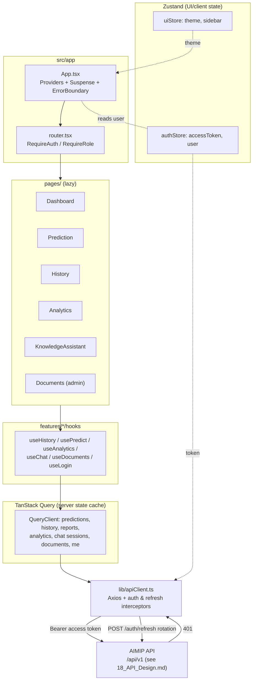

# 08 — Frontend Architecture

> Part of the **Advanced AI Medical Intelligence Platform (AIMIP)** documentation set.
> Authoritative names, paths, ENV vars, endpoints, and pages are defined in
> [_CANON.md](_CANON.md). This document explains **how the React frontend is structured**.
>
> **Disclaimer:** AIMIP is a clinical **decision-support** system, not a medical device.
> Every prediction and report view renders the disclaimer that outputs are informational,
> not a diagnosis, and that a licensed clinician must review all results.

**Related docs:** [Backend Architecture](07_Backend_Architecture.md) ·
[API Design](18_API_Design.md) · [Authorization / RBAC](20_Authorization_RBAC.md) ·
[Environment Configuration](31_Environment_Configuration.md) ·
[Coding Standards](32_Coding_Standards.md)

---

## 1. Tech stack (authoritative)

Per [_CANON.md §1](_CANON.md): **React 19**, **Vite**, **TypeScript**, **TailwindCSS**,
**Framer Motion**, **TanStack Query** (server state), **Zustand** (UI/client state),
**React Hook Form + Zod**, **Axios**, **React Router v6**, **Recharts**, **Lucide-react**,
**ESLint + Prettier**, **Vitest + React Testing Library**.

Single build ENV var ([_CANON.md §5](_CANON.md)):

```
VITE_API_BASE_URL=http://localhost:8000/api/v1
```

All requests target the versioned API under `/api/v1`; ops endpoints (`/health/*`, `/metrics`)
are not called from the SPA.

---

## 2. Feature-sliced structure (`frontend/src/`)

The app is organised **feature-first**: shared plumbing (`app/`, `lib/`, `components/ui`) is
generic; each business capability is a self-contained slice under `features/` that owns its
API calls, hooks, components, and types. Pages compose features; features never import from
pages.

```
frontend/src/
├── app/                    # providers, router, query client (composition root of the SPA)
│   ├── App.tsx             # <QueryClientProvider> + <RouterProvider> + <ErrorBoundary>
│   ├── router.tsx          # route table (see §3), lazy routes, guards
│   ├── queryClient.ts      # TanStack QueryClient config (retries, staleTime)
│   └── providers.tsx       # ThemeProvider, Toaster, Zustand hydration
├── pages/                  # Landing, Login, Register, Dashboard, Prediction, History,
│                           #   Analytics, KnowledgeAssistant, Documents, Settings, Profile, NotFound
├── features/
│   ├── auth/               # login/register/refresh hooks, auth store binding, guards
│   ├── prediction/         # upload form, Grad-CAM viewer, prediction + report hooks
│   ├── history/            # paginated history table + filters
│   ├── analytics/          # overview/trends/distribution hooks + chart wiring
│   ├── chat/               # KnowledgeAssistant session + streaming answer + citations
│   └── documents/          # PDF upload + ingest status polling
├── components/
│   ├── ui/                 # design-system atoms (Button, Card, Input, Skeleton, EmptyState…)
│   ├── layout/             # AppShell, Sidebar, Topbar, ThemeToggle
│   └── charts/             # Recharts wrappers (LineChart, BarChart, DonutChart)
├── hooks/                  # cross-feature hooks (useDebounce, useMediaQuery, useTheme)
├── lib/                    # api client + axios interceptors, zod schemas, formatters
├── store/                  # zustand stores (auth, ui)
├── styles/                 # tailwind base, tokens, globals.css
└── types/                  # shared TS types mirroring API schemas
```

Layering rule (enforced by ESLint `import/no-restricted-paths`, see
[32_Coding_Standards.md §7](32_Coding_Standards.md)):
`pages → features → components/ui + lib + hooks + store`. Imports never flow upward.

---

## 3. Routing map (React Router v6)

All twelve pages from [_CANON.md §10](_CANON.md) are routed. Protected routes require a valid
access token; role-gated routes additionally check `role` per
[20_Authorization_RBAC.md](20_Authorization_RBAC.md). Routes are **lazy-loaded** (§7).

| Path | Page component | Access | Primary API(s) |
|------|----------------|--------|----------------|
| `/` | `Landing` | public | — |
| `/login` | `Login` | public (redirects if authed) | `POST /auth/login` |
| `/register` | `Register` | public | `POST /auth/register` |
| `/dashboard` | `Dashboard` | authed | `GET /analytics/overview`, `GET /auth/me` |
| `/predict` | `Prediction` | authed | `POST /predict`, `GET /predict/{id}`, `GET /reports/{prediction_id}` |
| `/history` | `History` | authed | `GET /history?page&size&from&to` |
| `/analytics` | `Analytics` | authed | `GET /analytics/{overview,trends,disease-distribution,confidence-distribution,recent-activity}` |
| `/assistant` | `KnowledgeAssistant` | authed | `POST /chat`, `GET /chat/sessions`, `GET /chat/sessions/{id}` |
| `/documents` | `Documents` | `admin` | `POST /documents`, `GET /documents`, `DELETE /documents/{id}` |
| `/settings` | `Settings` | authed | `GET /settings`, `PATCH /settings` |
| `/profile` | `Profile` | authed | `GET /auth/me` |
| `*` | `NotFound` | public | — |

`doctor` sees review-oriented data (all predictions/reports) on `/history` and `/analytics`;
`admin` additionally unlocks `/documents` and user administration screens. Guarding is done
by a `<RequireAuth>` / `<RequireRole>` wrapper in `app/router.tsx`.

```tsx
// src/app/router.tsx (excerpt)
import { lazy } from "react";
import { createBrowserRouter } from "react-router-dom";
import { RequireAuth, RequireRole } from "../features/auth/guards";
import { AppShell } from "../components/layout/AppShell";

const Dashboard = lazy(() => import("../pages/Dashboard"));
const Prediction = lazy(() => import("../pages/Prediction"));
const Documents = lazy(() => import("../pages/Documents"));
// …remaining pages lazy-imported identically

export const router = createBrowserRouter([
  { path: "/", element: <Landing /> },
  { path: "/login", element: <Login /> },
  { path: "/register", element: <Register /> },
  {
    element: <RequireAuth><AppShell /></RequireAuth>,   // shared layout for authed pages
    children: [
      { path: "/dashboard", element: <Dashboard /> },
      { path: "/predict", element: <Prediction /> },
      { path: "/history", element: <History /> },
      { path: "/analytics", element: <Analytics /> },
      { path: "/assistant", element: <KnowledgeAssistant /> },
      { path: "/settings", element: <Settings /> },
      { path: "/profile", element: <Profile /> },
      {
        element: <RequireRole roles={["admin"]} />,
        children: [{ path: "/documents", element: <Documents /> }],
      },
    ],
  },
  { path: "*", element: <NotFound /> },
]);
```

---

## 4. State management — server vs UI

A strict separation prevents the single biggest React state bug: caching server data in
component/Zustand state and letting it go stale.

| Concern | Tool | Examples |
|---------|------|----------|
| **Server state** (anything owned by the API) | **TanStack Query** | predictions, history, reports, analytics, chat sessions, documents, current user |
| **UI/client state** (owned by the browser) | **Zustand** | access token in memory, theme (light/dark), sidebar open, active chat session id, toast queue |

Rule of thumb: **if it comes from an endpoint, it lives in TanStack Query**; if it is
ephemeral UI or auth session, it lives in Zustand. Query is the cache; Zustand is not.

### 4.1 Zustand stores (`src/store/`)

```ts
// src/store/authStore.ts
import { create } from "zustand";
import type { User } from "../types/user";

interface AuthState {
  accessToken: string | null;      // kept in memory only (refresh token is httpOnly-cookie/rotated server-side)
  user: User | null;
  setSession: (token: string, user: User) => void;
  clear: () => void;
}

export const useAuthStore = create<AuthState>((set) => ({
  accessToken: null,
  user: null,
  setSession: (accessToken, user) => set({ accessToken, user }),
  clear: () => set({ accessToken: null, user: null }),
}));
```

```ts
// src/store/uiStore.ts
import { create } from "zustand";

interface UiState {
  theme: "light" | "dark";
  sidebarOpen: boolean;
  toggleTheme: () => void;
  toggleSidebar: () => void;
}

export const useUiStore = create<UiState>((set) => ({
  theme:
    window.matchMedia("(prefers-color-scheme: dark)").matches ? "dark" : "light",
  sidebarOpen: true,
  toggleTheme: () => set((s) => ({ theme: s.theme === "dark" ? "light" : "dark" })),
  toggleSidebar: () => set((s) => ({ sidebarOpen: !s.sidebarOpen })),
}));
```

### 4.2 TanStack Query client (`src/app/queryClient.ts`)

```ts
import { QueryClient } from "@tanstack/react-query";

export const queryClient = new QueryClient({
  defaultOptions: {
    queries: {
      staleTime: 30_000,          // treat data fresh for 30s
      gcTime: 5 * 60_000,
      retry: 2,                    // network blips; auth 401s are handled by the interceptor
      refetchOnWindowFocus: false,
    },
    mutations: { retry: 0 },
  },
});
```

Query keys are namespaced by feature, e.g. `["history", { page, size, from, to }]`,
`["prediction", id]`, `["analytics", "trends", interval]`, `["chat", "sessions"]`.

---

## 5. Axios client with auth + refresh interceptors (`src/lib/`)

A single Axios instance carries `VITE_API_BASE_URL`, injects the bearer token from the auth
store on every request, and transparently performs **refresh-token rotation** on a `401`
using `POST /auth/refresh` ([_CANON.md §7](_CANON.md)). Concurrent 401s are de-duplicated so
only one refresh is in flight.

```ts
// src/lib/apiClient.ts
import axios, { AxiosError, type InternalAxiosRequestConfig } from "axios";
import { useAuthStore } from "../store/authStore";

export const api = axios.create({
  baseURL: import.meta.env.VITE_API_BASE_URL,   // http://localhost:8000/api/v1
  withCredentials: true,                        // send refresh cookie to /auth/refresh
});

// --- Request: attach access token ---
api.interceptors.request.use((config: InternalAxiosRequestConfig) => {
  const token = useAuthStore.getState().accessToken;
  if (token) config.headers.Authorization = `Bearer ${token}`;
  return config;
});

// --- Response: rotate on 401, retry once, single-flight ---
let refreshing: Promise<string> | null = null;

async function rotate(): Promise<string> {
  const { data } = await axios.post(
    `${import.meta.env.VITE_API_BASE_URL}/auth/refresh`,
    {},
    { withCredentials: true },
  );
  useAuthStore.getState().setSession(data.access_token, data.user);
  return data.access_token as string;
}

api.interceptors.response.use(
  (res) => res,
  async (error: AxiosError) => {
    const original = error.config as InternalAxiosRequestConfig & { _retried?: boolean };
    const isAuthCall = original?.url?.includes("/auth/");
    if (error.response?.status === 401 && !original._retried && !isAuthCall) {
      original._retried = true;
      try {
        refreshing ??= rotate().finally(() => (refreshing = null));
        const token = await refreshing;
        original.headers.Authorization = `Bearer ${token}`;
        return api(original);                    // replay original request
      } catch {
        useAuthStore.getState().clear();
        window.location.assign("/login");
      }
    }
    return Promise.reject(error);
  },
);
```

RFC 7807 problem responses ([_CANON.md §7](_CANON.md)) are normalised to a typed
`ApiError { title, detail, status, errors? }` so components and forms show `detail` and map
`errors` onto field-level messages.

---

## 6. Data-fetching patterns (feature hooks)

Every feature exposes typed hooks wrapping TanStack Query — components never call `api`
directly. Reads use `useQuery`; writes use `useMutation` with cache invalidation.

```ts
// src/features/history/useHistory.ts
import { keepPreviousData, useQuery } from "@tanstack/react-query";
import { api } from "../../lib/apiClient";
import type { Paginated, Prediction } from "../../types";

interface Params { page: number; size: number; from?: string; to?: string }

export function useHistory(params: Params) {
  return useQuery({
    queryKey: ["history", params],
    queryFn: async () => {
      const { data } = await api.get<Paginated<Prediction>>("/history", { params });
      return data;                               // {items, page, size, total, pages}
    },
    placeholderData: keepPreviousData,           // smooth pagination, no flicker
  });
}
```

```ts
// src/features/prediction/usePredict.ts
import { useMutation, useQueryClient } from "@tanstack/react-query";
import { api } from "../../lib/apiClient";

export function usePredict() {
  const qc = useQueryClient();
  return useMutation({
    mutationFn: async (vars: { file: File; idempotencyKey: string }) => {
      const form = new FormData();
      form.append("file", vars.file);
      const { data } = await api.post("/predict", form, {
        headers: { "Idempotency-Key": vars.idempotencyKey },   // canon: header on POST /predict
      });
      return data;
    },
    onSuccess: () => {
      qc.invalidateQueries({ queryKey: ["history"] });
      qc.invalidateQueries({ queryKey: ["analytics"] });
    },
  });
}
```

The KnowledgeAssistant (`/assistant`) consumes `POST /chat` and renders the returned
`citations[]`; sessions come from `GET /chat/sessions`. Documents ingest is asynchronous, so
`Documents` polls `GET /documents` (via `refetchInterval`) until each row's `status` reaches
`indexed` or `failed`.

---

## 7. Code-splitting & lazy routes

Every page in the route table (§3) is imported with `React.lazy` and rendered inside a
`<Suspense>` boundary that shows a route-level **loading skeleton**. Heavy, rarely-first-paint
modules are also split: the Recharts-based `Analytics` charts and the Grad-CAM image viewer in
`Prediction` are lazy chunks so the initial bundle stays small. Vite performs the chunking; a
`manualChunks` rule isolates `recharts` and `framer-motion` into vendor chunks.

```tsx
// src/app/App.tsx (excerpt)
import { Suspense } from "react";
import { RouterProvider } from "react-router-dom";
import { QueryClientProvider } from "@tanstack/react-query";
import { RootErrorBoundary } from "./RootErrorBoundary";
import { RouteSkeleton } from "../components/ui/RouteSkeleton";
import { queryClient } from "./queryClient";
import { router } from "./router";

export function App() {
  return (
    <QueryClientProvider client={queryClient}>
      <RootErrorBoundary>
        <Suspense fallback={<RouteSkeleton />}>
          <RouterProvider router={router} />
        </Suspense>
      </RootErrorBoundary>
    </QueryClientProvider>
  );
}
```

---

## 8. Forms — React Hook Form + Zod

All user input uses **React Hook Form** for state/validation lifecycle and **Zod** schemas as
the single source of truth for shape + messages (shared with the inferred TS type). Server
`errors` from RFC 7807 responses are mapped back onto fields via `setError`.

```ts
// src/lib/schemas/auth.ts
import { z } from "zod";

export const loginSchema = z.object({
  email: z.string().email("Enter a valid email"),
  password: z.string().min(8, "Minimum 8 characters"),
});
export type LoginValues = z.infer<typeof loginSchema>;
```

```tsx
// src/features/auth/LoginForm.tsx
import { useForm } from "react-hook-form";
import { zodResolver } from "@hookform/resolvers/zod";
import { loginSchema, type LoginValues } from "../../lib/schemas/auth";
import { useLogin } from "./useLogin";

export function LoginForm() {
  const { register, handleSubmit, setError, formState } = useForm<LoginValues>({
    resolver: zodResolver(loginSchema),
  });
  const login = useLogin();

  const onSubmit = handleSubmit(async (values) => {
    try {
      await login.mutateAsync(values);           // POST /auth/login
    } catch (e) {
      setError("password", { message: "Invalid credentials" });
    }
  });

  return (
    <form onSubmit={onSubmit} noValidate aria-describedby="login-error">
      <label htmlFor="email">Email</label>
      <input id="email" type="email" autoComplete="email"
             aria-invalid={!!formState.errors.email} {...register("email")} />
      {formState.errors.email && (
        <p role="alert">{formState.errors.email.message}</p>
      )}

      <label htmlFor="password">Password</label>
      <input id="password" type="password" autoComplete="current-password"
             aria-invalid={!!formState.errors.password} {...register("password")} />
      {formState.errors.password && (
        <p role="alert">{formState.errors.password.message}</p>
      )}

      <button type="submit" disabled={formState.isSubmitting}>Sign in</button>
    </form>
  );
}
```

Forms in scope: Login, Register, Prediction upload, Settings, Profile, Documents upload,
KnowledgeAssistant message box.

---

## 9. Error boundaries

Two tiers:

1. **Root boundary** (`app/RootErrorBoundary`) — catches render-time crashes anywhere, logs
   them, and shows a full-page fallback with a "reload" affordance. Never leaks a white screen.
2. **Feature/route boundaries** — each lazy route and each chart/Grad-CAM widget is wrapped so
   a failure in one panel does not take down the shell.

Server errors (rejected promises) are **not** thrown to boundaries; they surface through
TanStack Query `isError`/`error` states, which render inline error cards with a **retry**
button. Every list view also renders **empty states** and **loading skeletons**
([_CANON.md §10](_CANON.md)).

```tsx
// src/app/RootErrorBoundary.tsx
import { Component, type ReactNode } from "react";

interface State { hasError: boolean }

export class RootErrorBoundary extends Component<{ children: ReactNode }, State> {
  state: State = { hasError: false };
  static getDerivedStateFromError(): State { return { hasError: true }; }
  componentDidCatch(error: unknown) { console.error("[AIMIP] render crash", error); }
  render() {
    if (this.state.hasError) {
      return (
        <div role="alert" className="error-fallback">
          <h1>Something went wrong</h1>
          <button onClick={() => window.location.reload()}>Reload</button>
        </div>
      );
    }
    return this.props.children;
  }
}
```

---

## 10. Design system & accessibility (WCAG 2.1 AA)

Per [_CANON.md §10](_CANON.md): medical palette — primary blue `#0EA5E9`, teal `#14B8A6`,
risk semantics green/amber/red mapped to the `risk_level` values `low|moderate|high`;
glassmorphism cards; **Inter** typography; **8px spacing scale**; dark mode via
`prefers-color-scheme` + a Zustand toggle; **Recharts** for all charts; **Lucide-react** icons;
subtle **Framer Motion** transitions.

Accessibility commitments (**WCAG 2.1 AA**):

- **Color is never the only signal** — risk levels pair color with a text label and icon.
- **Contrast ≥ 4.5:1** for text (validated for both themes; `#0EA5E9`/`#14B8A6` on surfaces
  meet AA at the sizes used).
- **Keyboard-operable** — every interactive element is focusable with a visible focus ring;
  logical tab order; modals trap focus and restore it on close.
- **Semantic markup + ARIA** — labelled inputs (`htmlFor`), `role="alert"` for errors,
  `aria-live` regions for async status (e.g. document ingest, streaming chat answers),
  `aria-busy` on loading skeletons.
- **Reduced motion** — Framer Motion respects `prefers-reduced-motion`.
- **Alt text** — Grad-CAM images carry descriptive alt text; charts expose an accessible
  data summary.

---

## 11. Component / state diagram



---

## 12. Build, quality & testing

- **Vite** dev server on `5173` (the backend `CORS_ORIGINS` default). Production build is a
  static bundle served by **nginx** (`frontend/nginx.conf`), which also reverse-proxies
  `/api/v1` to the backend ([_CANON.md §1](_CANON.md)).
- **ESLint + Prettier** enforce style; hooks rules enforce dependency arrays and call order
  ([32_Coding_Standards.md §6](32_Coding_Standards.md)).
- **Vitest + React Testing Library** — hooks tested with a `QueryClientProvider` wrapper and a
  mocked Axios; components tested by user-visible behaviour (roles/labels), not implementation.

---

## 13. Cross-references

- API contract this client consumes → [18_API_Design.md](18_API_Design.md)
- Server architecture behind the API → [07_Backend_Architecture.md](07_Backend_Architecture.md)
- Roles gating routes/features → [20_Authorization_RBAC.md](20_Authorization_RBAC.md)
- `VITE_API_BASE_URL` and other ENV → [31_Environment_Configuration.md](31_Environment_Configuration.md)
- TS/React style, naming, hooks rules → [32_Coding_Standards.md](32_Coding_Standards.md)
