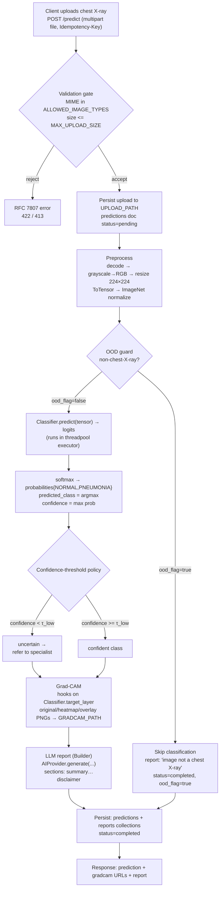
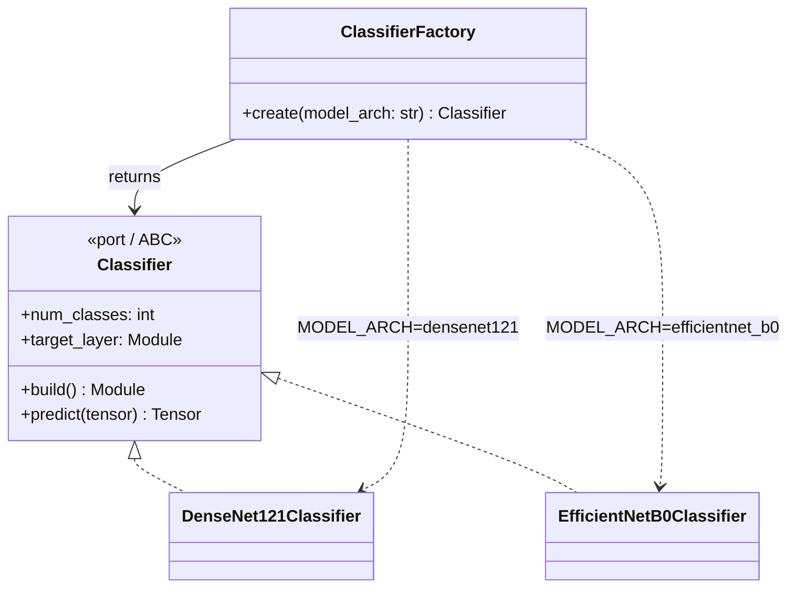

# 09 — AI Architecture

> **Advanced AI Medical Intelligence Platform (AIMIP)** — AI subsystem architecture.
>
> **Disclaimer:** AIMIP is a clinical **decision-support** tool, **not a medical device**. All
> outputs are informational, not a diagnosis; a licensed clinician must review every result. No
> PHI should be uploaded without consent. The platform is **not FDA/CE cleared**.

**Related docs:** [Software Requirements Specification](02_Software_Requirements_Specification.md) ·
[AI Providers](16_AI_Providers.md) · [Database Design](17_Database_Design.md) ·
[API Design](18_API_Design.md) · [Authorization & RBAC](20_Authorization_RBAC.md) ·
[Environment Configuration](31_Environment_Configuration.md) ·
[Model Training](10_Model_Training.md) · [Model Inference](11_Model_Inference.md) ·
[Grad-CAM](12_GradCAM.md)

---

## 1. Purpose & scope

This document describes the **end-to-end AI pipeline** for chest X-ray pneumonia analysis: how an
uploaded image flows from ingestion, through an out-of-distribution (OOD) guard, a CNN classifier,
Grad-CAM explainability, and finally an LLM-generated medical report. It also specifies the
`Classifier` **port**, the `ClassifierFactory(MODEL_ARCH)` selection strategy, the model registry
and versioning scheme, the model card / dataset datasheet summaries, the confidence-threshold
policy, and the safety/governance controls that wrap the whole subsystem.

The AI subsystem lives under `backend/app/infrastructure/ml/` in four packages that mirror the
pipeline stages:

```
backend/app/infrastructure/ml/
├── classifier/     # Classifier port adapters + ClassifierFactory (densenet121, efficientnet_b0)
├── inference/      # model loading, preprocessing, threadpool execution, softmax, OOD guard
├── gradcam/        # forward/backward hook Grad-CAM, PNG rendering
└── training/       # transfer-learning training loop, metrics, checkpointing
```

Business logic (`application/services/PredictionService`) depends only on **ports** (ABCs). Concrete
adapters are chosen at startup by **factories** reading ENV — never by importing a vendor SDK or a
concrete class directly. This is the Clean / Hexagonal (Ports & Adapters) rule from the project
architecture.

---

## 2. End-to-end AI pipeline

The request path is triggered by `POST /predict` (multipart `file`, header `Idempotency-Key`) and
returns a prediction with Grad-CAM URLs and an LLM report. See [API Design](18_API_Design.md).



### 2.1 Stage responsibilities

| Stage | Package / Service | Key output |
|-------|-------------------|------------|
| Upload & validation | `interface/api/v1` (predict router) + `PredictionService` | file persisted to `UPLOAD_PATH`, `predictions` doc created (`status=pending`, `idempotency_key`) |
| Preprocess | `infrastructure/ml/inference` | `1×3×224×224` float tensor, ImageNet-normalized |
| OOD guard | `infrastructure/ml/inference` | `ood_flag: bool` |
| Classify | `infrastructure/ml/classifier` (via `Classifier` port) | logits → `predicted_class`, `confidence`, `probabilities{NORMAL,PNEUMONIA}` |
| Confidence policy | `PredictionService` | confident vs. `uncertain → refer to specialist` |
| Grad-CAM | `infrastructure/ml/gradcam` | `gradcam{original,heatmap,overlay}` PNGs under `GRADCAM_PATH` |
| LLM report | `ReportService` (Builder) via `AIProvider` | `reports` doc with `sections{...}`, `risk_level` |
| Persist | `PredictionService` / `ReportService` → repositories | `predictions` + `reports` collections |

Latency budget (see [SRS](02_Software_Requirements_Specification.md), NFRs): **prediction
end-to-end < 6 s p95**. The classifier forward pass and Grad-CAM run in a threadpool executor so the
async event loop is never blocked; see [Model Inference](11_Model_Inference.md).

---

## 3. The `Classifier` port

The `Classifier` port is the ABC that isolates business logic from any specific CNN architecture. It
is defined in `backend/app/domain/ports/` and selected by the `MODEL_ARCH` ENV var.

| Port (ABC)   | ENV var      | Adapters                        | Key methods |
|--------------|--------------|---------------------------------|-------------|
| `Classifier` | `MODEL_ARCH` | `densenet121` · `efficientnet_b0` | `build()`, `predict(tensor) -> logits`, `target_layer` (for Grad-CAM) |

```python
# backend/app/domain/ports/classifier.py
from __future__ import annotations
from abc import ABC, abstractmethod
import torch
import torch.nn as nn

CLASS_NAMES: tuple[str, str] = ("NORMAL", "PNEUMONIA")  # index order is contractual


class Classifier(ABC):
    """Port: a 2-class chest X-ray classifier. Adapters wrap a torchvision backbone."""

    num_classes: int = 2

    @abstractmethod
    def build(self) -> nn.Module:
        """Construct the backbone with an ImageNet-pretrained body and a fresh 2-class head."""

    @abstractmethod
    def predict(self, tensor: torch.Tensor) -> torch.Tensor:
        """Forward pass. Input: (N, 3, 224, 224). Returns raw logits (N, 2)."""

    @property
    @abstractmethod
    def target_layer(self) -> nn.Module:
        """The last convolutional block, used to register Grad-CAM forward/backward hooks."""
```

**Contract notes**

- `predict` returns **logits**, not probabilities. Softmax is applied downstream in the inference
  service so the same logits can feed metrics/calibration. See
  [Model Inference](11_Model_Inference.md).
- Class index order is **contractual**: `0 = NORMAL`, `1 = PNEUMONIA`. Both adapters and the training
  pipeline share `CLASS_NAMES` so labels never drift.
- `target_layer` exposes the last conv block so [Grad-CAM](12_GradCAM.md) never reaches into
  architecture internals from outside the adapter.
- Every port ships a **shared contract test** in `backend/tests/contract/`; both adapters must pass
  it (correct output shape, index order, `target_layer` is a `Conv2d`-bearing module).

### 3.1 Adapters

```python
# backend/app/infrastructure/ml/classifier/densenet121.py
import torch, torch.nn as nn
from torchvision import models
from app.domain.ports.classifier import Classifier

class DenseNet121Classifier(Classifier):
    def __init__(self, pretrained: bool = True) -> None:
        self._pretrained = pretrained
        self._model: nn.Module | None = None

    def build(self) -> nn.Module:
        weights = models.DenseNet121_Weights.IMAGENET1K_V1 if self._pretrained else None
        net = models.densenet121(weights=weights)
        in_features = net.classifier.in_features          # 1024
        net.classifier = nn.Linear(in_features, self.num_classes)
        self._model = net
        return net

    def predict(self, tensor: torch.Tensor) -> torch.Tensor:
        assert self._model is not None, "call build() before predict()"
        return self._model(tensor)

    @property
    def target_layer(self) -> nn.Module:
        # DenseNet: last conv activation lives in features.norm5 / denseblock4
        return self._model.features.denseblock4     # type: ignore[union-attr]
```

```python
# backend/app/infrastructure/ml/classifier/efficientnet_b0.py
class EfficientNetB0Classifier(Classifier):
    def build(self) -> nn.Module:
        weights = models.EfficientNet_B0_Weights.IMAGENET1K_V1 if self._pretrained else None
        net = models.efficientnet_b0(weights=weights)
        in_features = net.classifier[1].in_features       # 1280
        net.classifier[1] = nn.Linear(in_features, self.num_classes)
        self._model = net
        return net

    @property
    def target_layer(self) -> nn.Module:
        return self._model.features[-1]                   # last MBConv block
```

---

## 4. `ClassifierFactory(MODEL_ARCH)` design

Adapter selection follows the project **Factory + Strategy** pattern. The composition root calls the
factory function `get_classifier_provider(settings)` (consistent with the `get_<x>_provider`
convention used by all ports), which delegates to `ClassifierFactory`.



```python
# backend/app/infrastructure/ml/classifier/factory.py
from app.core.config import Settings
from app.domain.ports.classifier import Classifier
from .densenet121 import DenseNet121Classifier
from .efficientnet_b0 import EfficientNetB0Classifier

class ClassifierFactory:
    """Strategy selector keyed on MODEL_ARCH (densenet121 | efficientnet_b0)."""

    _registry: dict[str, type[Classifier]] = {
        "densenet121": DenseNet121Classifier,
        "efficientnet_b0": EfficientNetB0Classifier,
    }

    @classmethod
    def create(cls, model_arch: str, pretrained: bool = True) -> Classifier:
        try:
            adapter_cls = cls._registry[model_arch]
        except KeyError as exc:
            valid = ", ".join(cls._registry)
            raise ValueError(
                f"Unknown MODEL_ARCH={model_arch!r}; expected one of: {valid}"
            ) from exc
        return adapter_cls(pretrained=pretrained)


def get_classifier_provider(settings: Settings) -> Classifier:
    """Composition-root entrypoint; reads MODEL_ARCH from Settings (fails fast on bad value)."""
    return ClassifierFactory.create(settings.MODEL_ARCH)
```

**Fail-fast config:** `MODEL_ARCH` is validated by Pydantic (`pydantic-settings`) to the literal set
`{"densenet121", "efficientnet_b0"}`. An out-of-set value raises at startup, consistent with the
canonical config policy (e.g. `LLM_PROVIDER=openai` with empty `OPENAI_API_KEY` also raises at
startup). The default is `MODEL_ARCH=densenet121`.

Swapping architectures is a **one-line `.env` change** (`MODEL_ARCH=efficientnet_b0`) with **no code
change**; the swap is itself covered by an automated test, matching how provider swaps are tested
project-wide.

---

## 5. Model registry & versioning

The registry gives every set of trained weights a stable, auditable identity and lets inference
resolve exactly which weights produced a prediction.

### 5.1 `model_version` scheme

`model_version` is a string recorded on **every** prediction (`predictions.model_version`) and every
report indirectly through it. Format:

```
{MODEL_ARCH}-v{MAJOR}.{MINOR}.{PATCH}+{git_sha7}
example:  densenet121-v1.2.0+a1b9f3c
```

- **MAJOR** — architecture or label-space change (breaking; e.g. new class).
- **MINOR** — retrain on new/expanded data or changed transforms.
- **PATCH** — same data, re-run for a reproducibility fix or hyper-parameter tweak.
- **+git_sha7** — first 7 chars of the training-code commit, tying weights to code.

### 5.2 Registry record

The training pipeline writes a sidecar `model_card.json` next to the checkpoint and (optionally) a
`model_registry` document store. Each registry entry captures:

| Field | Meaning |
|-------|---------|
| `model_version` | canonical id above |
| `model_arch` | `densenet121` or `efficientnet_b0` |
| `weights_path` | resolves to `MODEL_PATH` (`./data/weights/model.pt`) for the active model |
| `dataset_version` | Kaggle Chest X-Ray Pneumonia snapshot id + split hash |
| `metrics` | test accuracy, precision, recall, F1, AUROC, confusion matrix |
| `input_spec` | `3×224×224`, ImageNet mean/std |
| `class_names` | `["NORMAL", "PNEUMONIA"]` |
| `confidence_thresholds` | `τ_low` / `τ_high` in force (see §7) |
| `trained_at`, `trained_by`, `git_sha` | provenance |

The **active** model is whatever weights live at `MODEL_PATH`. Inference records the running
`model_version` on each `predictions` doc, so a prediction is always traceable to its exact model and
data. See [Model Training](10_Model_Training.md) for checkpoint production and
[Database Design](17_Database_Design.md) for the `predictions` schema.

---

## 6. Model card & dataset datasheet (summaries)

### 6.1 Model card (summary)

| Section | Content |
|---------|---------|
| **Model** | AIMIP chest X-ray pneumonia classifier. Backbone: torchvision `densenet121` (default) or `efficientnet_b0`, ImageNet-pretrained, 2-class head `[NORMAL, PNEUMONIA]`. |
| **Intended use** | Decision-support triage signal for frontal chest radiographs, reviewed by a licensed clinician. **Not** a standalone diagnostic device; **not** FDA/CE cleared. |
| **Out-of-scope** | Non-chest images, lateral views, CT/MRI, pediatric-vs-adult distinction claims, any condition other than the pneumonia-vs-normal binary. Non-chest-X-ray inputs are rejected by the OOD guard (`ood_flag`). |
| **Inputs / outputs** | Input: RGB `224×224`, ImageNet-normalized. Output: `predicted_class`, `confidence`, `probabilities{NORMAL,PNEUMONIA}`, plus Grad-CAM overlay. |
| **Metrics** | Reported on the held-out test split: accuracy, precision, recall, F1, AUROC, confusion matrix (see [Model Training](10_Model_Training.md)). |
| **Ethical/safety** | Confidence-threshold fallback (`uncertain → refer to specialist`); mandatory clinician-review disclaimer on every report; audit logging of PHI access (`audit_logs`). |
| **Known limitations** | Trained on a single public dataset (potential site/scanner bias); binary label space; not validated across demographics; Grad-CAM is an approximate saliency map, not proof of causation. |

### 6.2 Dataset datasheet (summary)

| Field | Content |
|-------|---------|
| **Name** | Kaggle "Chest X-Ray Images (Pneumonia)", Kermany et al. |
| **Composition** | Pediatric frontal chest radiographs labeled `NORMAL` / `PNEUMONIA` (bacterial + viral collapsed to `PNEUMONIA`). |
| **Splits** | `train` / `val` / `test` as provided by the source archive. |
| **Collection** | Retrospective clinical images from a single medical center; de-identified by the dataset authors. |
| **Known biases** | Pediatric population; class imbalance (more `PNEUMONIA` than `NORMAL`) handled with weighted cross-entropy; single-source acquisition may not generalize to other scanners/sites. |
| **Preprocessing** | Grayscale→RGB, resize `224×224`, ImageNet mean/std normalization, train-time augmentation (see [Model Training](10_Model_Training.md)). |
| **Consent / PHI** | Public research dataset, de-identified at source. AIMIP additionally forbids uploading PHI without consent and logs PHI access. |

---

## 7. Confidence-threshold policy

Softmax confidence is `max(probabilities)`. The `PredictionService` applies a two-band policy so
low-confidence outputs are never presented as if they were decisive.

| Band | Condition | Behavior |
|------|-----------|----------|
| **Uncertain** | `confidence < τ_low` (`τ_low = 0.60`) | Result labeled **uncertain**; report `risk_level` capped and recommendation set to **"refer to specialist"**; UI shows the uncertain state prominently. |
| **Actionable** | `τ_low ≤ confidence < τ_high` | Class reported with the numeric confidence and a "clinician review required" note. |
| **High confidence** | `confidence ≥ τ_high` (`τ_high = 0.85`) | Class reported with high confidence; still requires clinician review. |

```python
# backend/app/application/services/prediction_service.py (excerpt)
TAU_LOW = 0.60
TAU_HIGH = 0.85

def apply_confidence_policy(predicted_class: str, confidence: float, ood_flag: bool) -> dict:
    if ood_flag:
        return {"decision": "rejected_non_xray", "refer": True}
    if confidence < TAU_LOW:
        # uncertain → refer to specialist
        return {"decision": "uncertain", "refer": True, "predicted_class": predicted_class}
    band = "high_confidence" if confidence >= TAU_HIGH else "actionable"
    return {"decision": band, "refer": False, "predicted_class": predicted_class}
```

The active thresholds are stored on the model registry entry (§5.2) so a retrain can recalibrate them
without a code change. The **"uncertain → refer to specialist"** fallback and the OOD rejection are
the two safety escape hatches in front of the LLM report step.

---

## 8. Safety & governance

The AI subsystem is wrapped by controls that satisfy the product disclaimer and the non-functional
security targets (OWASP ASVS L1; structured logs + metrics + tracing).

- **Decision-support, not diagnosis.** Every generated report carries the canonical disclaimer:
  outputs are informational, not a diagnosis; a licensed clinician must review all results; the
  platform is not FDA/CE cleared. The `disclaimer` section is mandatory in `reports.sections`.
- **OOD guard.** Non-chest-X-ray uploads are rejected before classification, flagged with `ood_flag`
  on the `predictions` doc; no misleading pneumonia probability is surfaced. See
  [Model Inference](11_Model_Inference.md).
- **Uncertainty fallback.** `uncertain → refer to specialist` prevents low-confidence outputs from
  reading as confident calls (§7).
- **Explainability.** Grad-CAM overlays accompany every classification so a reviewer can sanity-check
  where the model looked. See [Grad-CAM](12_GradCAM.md).
- **Provenance & auditability.** `model_arch` + `model_version` are recorded on every prediction;
  PHI access is written to the append-only `audit_logs` collection.
- **RBAC.** Predictions/reports are scoped by role: `user` sees own; `doctor` may review all;
  `admin` manages users/settings/documents. Enforced by `require_role(...)`. See
  [Authorization & RBAC](20_Authorization_RBAC.md).
- **Data handling.** Uploads go to `UPLOAD_PATH`, Grad-CAM PNGs to `GRADCAM_PATH`, weights to
  `MODEL_PATH`; all under the gitignored `data/` tree. Upload MIME is restricted to
  `ALLOWED_IMAGE_TYPES` and size to `MAX_UPLOAD_SIZE`.
- **Human in the loop.** The platform never auto-acts on a prediction; the clinician is the decision
  maker. Reports are advisory Markdown assembled by the report Builder via the `AIProvider` port —
  see [AI Providers](16_AI_Providers.md).

---

## 9. Cross-references

- Training the weights that back this pipeline → [Model Training](10_Model_Training.md)
- Serving inference without blocking the event loop → [Model Inference](11_Model_Inference.md)
- How explanations are produced → [Grad-CAM](12_GradCAM.md)
- LLM report generation (`AIProvider`) → [AI Providers](16_AI_Providers.md)
- `predictions` / `reports` schemas → [Database Design](17_Database_Design.md)
- `POST /predict` contract → [API Design](18_API_Design.md)
- ENV vars (`MODEL_ARCH`, `MODEL_PATH`, `GRADCAM_PATH`, …) →
  [Environment Configuration](31_Environment_Configuration.md)
