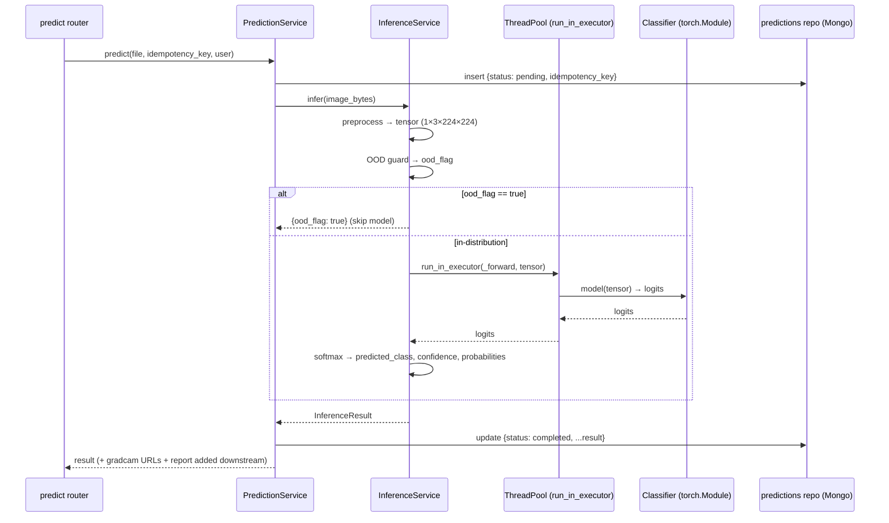

# 11 — Model Inference

> **AIMIP** chest X-ray pneumonia classifier — inference/serving path.
>
> **Disclaimer:** AIMIP is clinical **decision-support**, **not a medical device**; outputs are
> informational, not a diagnosis, and must be reviewed by a licensed clinician. Not FDA/CE cleared.

**Related docs:** [AI Architecture](09_AI_Architecture.md) · [Model Training](10_Model_Training.md) ·
[Grad-CAM](12_GradCAM.md) · [AI Providers](16_AI_Providers.md) ·
[Database Design](17_Database_Design.md) · [API Design](18_API_Design.md) ·
[Environment Configuration](31_Environment_Configuration.md)

---

## 1. Purpose & scope

The inference service (`backend/app/infrastructure/ml/inference/`) turns a validated upload into a
persisted `predictions` document. It owns: model loading (with a **pretrained fallback** when no
weights exist at `MODEL_PATH`), preprocessing, **threadpool/async execution** so the FastAPI event
loop is never blocked, softmax decoding into `predicted_class` / `confidence` / `probabilities`, the
**OOD guard** (`ood_flag`), a latency budget, caching, error handling, and persistence.



Latency budget (from [SRS](02_Software_Requirements_Specification.md) NFRs): **prediction
end-to-end < 6 s p95**; the forward pass itself is a small fraction of that, which is why the
threadpool handoff matters more for concurrency than for single-request latency.

---

## 2. Model loading & pretrained fallback

The model is loaded **once** at application startup (via the lifespan/composition-root container) and
held as a singleton in the `InferenceService`. The `Classifier` adapter is produced by
`ClassifierFactory` from `MODEL_ARCH` (see [AI Architecture §3–4](09_AI_Architecture.md)).

**Fallback rule:** if a checkpoint exists at `MODEL_PATH` it is loaded (and its `model_arch` must
match the running `MODEL_ARCH`); **otherwise** the ImageNet-pretrained backbone with a fresh 2-class
head is used, so the app runs without training or the dataset. This is the canonical
pretrained-inference fallback.

```python
# backend/app/infrastructure/ml/inference/loader.py
import os, torch
from app.core.config import Settings
from app.infrastructure.ml.classifier.factory import ClassifierFactory

def load_model(settings: Settings, device: str = "cpu") -> tuple[torch.nn.Module, str]:
    classifier = ClassifierFactory.create(settings.MODEL_ARCH, pretrained=True)
    model = classifier.build()

    if os.path.exists(settings.MODEL_PATH):
        ckpt = torch.load(settings.MODEL_PATH, map_location=device)
        if ckpt["model_arch"] != settings.MODEL_ARCH:
            raise ValueError(
                f"Checkpoint arch {ckpt['model_arch']!r} != MODEL_ARCH {settings.MODEL_ARCH!r}")
        model.load_state_dict(ckpt["state_dict"])
        model_version = ckpt["model_version"]              # e.g. densenet121-v1.2.0+a1b9f3c
    else:
        # pretrained-inference fallback: no weights at MODEL_PATH
        model_version = f"{settings.MODEL_ARCH}-pretrained-fallback"

    model.to(device).eval()
    return model, model_version
```

The resolved `model_version` (real checkpoint id or `...-pretrained-fallback`) is recorded on every
`predictions` document so a result is always traceable, even in fallback mode.

---

## 3. Preprocessing

Inference reuses the **exact `eval_transform`** from training — the same grayscale→RGB expansion,
`224×224` resize, and ImageNet normalization — guaranteeing zero train/serve skew. See
[Model Training §2](10_Model_Training.md).

```python
# backend/app/infrastructure/ml/inference/preprocess.py
import io
from PIL import Image
import torch
from app.infrastructure.ml.training.transforms import eval_transform

def preprocess(image_bytes: bytes) -> torch.Tensor:
    img = Image.open(io.BytesIO(image_bytes)).convert("RGB")
    tensor = eval_transform(img)              # (3, 224, 224)
    return tensor.unsqueeze(0)                # (1, 3, 224, 224)
```

Upstream, the predict router already enforced `MIME ∈ ALLOWED_IMAGE_TYPES` and
`size ≤ MAX_UPLOAD_SIZE`; a decode failure here is surfaced as an RFC 7807 `422` (see §8).

---

## 4. Async execution — never block the event loop

FastAPI handlers are `async`; a synchronous PyTorch forward pass would block the event loop and
serialize all requests. The forward pass is therefore dispatched to a **threadpool executor** via
`loop.run_in_executor`, per the canon ("runs in a threadpool executor (never blocks the event
loop)").

```python
# backend/app/infrastructure/ml/inference/service.py
import asyncio, torch, torch.nn.functional as F
from app.domain.ports.classifier import CLASS_NAMES   # ("NORMAL", "PNEUMONIA")

class InferenceService:
    def __init__(self, model: torch.nn.Module, model_version: str, device: str = "cpu"):
        self._model, self._model_version, self._device = model, model_version, device

    def _forward(self, tensor: torch.Tensor) -> torch.Tensor:
        with torch.inference_mode():                    # no autograd for plain inference
            return self._model(tensor.to(self._device)).cpu()

    async def infer(self, image_bytes: bytes) -> "InferenceResult":
        tensor = preprocess(image_bytes)

        ood_flag = is_out_of_distribution(tensor)       # cheap heuristic, runs inline
        if ood_flag:
            return InferenceResult(ood_flag=True, model_version=self._model_version)

        loop = asyncio.get_running_loop()
        logits = await loop.run_in_executor(None, self._forward, tensor)   # threadpool

        probs = F.softmax(logits, dim=1).squeeze(0)     # (2,)
        idx = int(torch.argmax(probs).item())
        return InferenceResult(
            predicted_class=CLASS_NAMES[idx],
            confidence=float(probs[idx].item()),
            probabilities={"NORMAL": float(probs[0]), "PNEUMONIA": float(probs[1])},
            ood_flag=False,
            model_version=self._model_version,
        )
```

> **Note:** Grad-CAM needs gradients, so it runs in a **separate** pass that does *not* use
> `inference_mode`; see [Grad-CAM](12_GradCAM.md). The plain-classification pass above stays
> gradient-free for speed.

---

## 5. Softmax decoding

The logits `(1, 2)` are turned into a probability distribution with softmax:

- `probabilities = {"NORMAL": p₀, "PNEUMONIA": p₁}` with `p₀ + p₁ = 1`.
- `predicted_class = CLASS_NAMES[argmax]` (`0=NORMAL`, `1=PNEUMONIA`, contractual order).
- `confidence = max(probabilities)` — the softmax max, feeding the confidence-threshold policy in
  [AI Architecture §7](09_AI_Architecture.md) (`uncertain → refer to specialist` when
  `confidence < τ_low`).

These three fields (`predicted_class`, `confidence`, `probabilities{NORMAL,PNEUMONIA}`) map directly
onto the `predictions` schema in [Database Design](17_Database_Design.md).

---

## 6. OOD / non-X-ray rejection (`ood_flag`)

The OOD guard rejects uploads that are not chest radiographs so the system never surfaces a
meaningless pneumonia probability for, say, a selfie or a document scan. It runs **before** the
classifier and, when it fires, short-circuits classification and sets `ood_flag=true` on the
`predictions` doc; the LLM report then states the image is not a chest X-ray rather than describing
findings.

**Strategy (heuristic/threshold, layered):**

1. **Statistical image priors.** Chest radiographs are effectively grayscale with a characteristic
   intensity distribution. The guard checks channel correlation (near-grayscale), dynamic range /
   entropy, and mean-intensity bounds. A color-saturated or extreme-histogram image is flagged.
2. **Model confidence signal.** A genuinely out-of-distribution input often produces a low-margin,
   high-entropy softmax; a softmax-entropy threshold complements the pixel heuristics.

```python
# backend/app/infrastructure/ml/inference/ood.py
import torch

def is_out_of_distribution(tensor: torch.Tensor) -> bool:
    x = tensor.squeeze(0)                         # (3, 224, 224), ImageNet-normalized
    r, g, b = x[0], x[1], x[2]
    # 1) near-grayscale: RGB channels should be ~identical for an X-ray converted to RGB
    color_spread = (r - g).abs().mean() + (g - b).abs().mean()
    if color_spread > COLOR_SPREAD_MAX:           # too colorful → not an X-ray
        return True
    # 2) dynamic range / contrast sanity
    if x.std() < MIN_STD or x.std() > MAX_STD:
        return True
    return False
```

Thresholds (`COLOR_SPREAD_MAX`, `MIN_STD`, `MAX_STD`) are configuration constants tuned against the
dataset's normalized statistics. The guard is intentionally conservative (favor rejecting a borderline
image over confidently mis-classifying a non-X-ray), consistent with the safety posture in
[AI Architecture §8](09_AI_Architecture.md).

---

## 7. Latency budget & caching

**Budget.** End-to-end target is **< 6 s p95** (SRS). Rough breakdown on CPU:

| Step | Typical | Notes |
|------|---------|-------|
| validation + persist upload | ~10–30 ms | I/O to `UPLOAD_PATH` + `predictions` insert |
| preprocess | ~10–20 ms | decode + resize + normalize |
| OOD guard | ~1–5 ms | tensor stats only |
| classifier forward | ~50–200 ms | densenet121 CPU; smaller on efficientnet_b0 / GPU |
| Grad-CAM | ~100–300 ms | extra fwd+bwd + PNG render |
| LLM report | ~1–4 s | dominant term; via `AIProvider` (network) |

The **LLM report dominates**; the model itself is comfortably inside budget, and the threadpool
handoff keeps throughput high under concurrency.

**Caching.** Results are memoized through the `CacheProvider` port (`CACHE_PROVIDER=memory|redis`),
keyed on a content hash of the image bytes plus `model_version`. This is reinforced by the
`Idempotency-Key` header on `POST /predict`: a repeat submission with the same key returns the
existing `predictions` document instead of re-running the model. The cache TTL is set via
`CacheProvider.set(ttl)`.

```python
cache_key = f"pred:{sha256(image_bytes)}:{model_version}"
cached = await cache.get(cache_key)
if cached is not None:
    return cached
result = await inference.infer(image_bytes)
await cache.set(cache_key, result, ttl=3600)
```

---

## 8. Error handling

All failures are mapped to the RFC 7807 error envelope `{type, title, status, detail, instance,
errors?}` used platform-wide (see [API Design](18_API_Design.md)), and the `predictions` doc is
moved to `status=failed` so nothing is left dangling at `pending`.

| Condition | Handling | HTTP |
|-----------|----------|------|
| MIME not in `ALLOWED_IMAGE_TYPES` | reject at router | `415` / `422` |
| size > `MAX_UPLOAD_SIZE` | reject at router | `413` |
| corrupt/undecodable image | `Image.open` raises → mapped error, `status=failed` | `422` |
| OOD (non-X-ray) | **not an error** — `ood_flag=true`, `status=completed` | `200` |
| model load failure at startup | fail fast (lifespan) — app does not start | n/a |
| forward-pass exception | caught, `status=failed`, logged (structlog + metrics) | `500` |
| checkpoint arch mismatch | raised at load (`MODEL_ARCH` vs checkpoint) | fail fast |

Every failure emits a structured log with the `request_id` (from middleware) and increments a
Prometheus counter, per the observability NFRs.

---

## 9. Persistence — the `predictions` collection

On completion the `PredictionService` writes the result to the **`predictions`** collection. Fields
(canonical, from [Database Design](17_Database_Design.md)):

```
predictions: {
  _id, user_id, image_path,            # image_path under UPLOAD_PATH
  model_arch,                          # densenet121 | efficientnet_b0  (= MODEL_ARCH)
  model_version,                       # from the loaded checkpoint / fallback id
  predicted_class,                     # "NORMAL" | "PNEUMONIA"
  confidence,                          # softmax max
  probabilities: { NORMAL, PNEUMONIA },
  gradcam: { original, heatmap, overlay },   # URLs under GRADCAM_PATH (see 12_GradCAM.md)
  ood_flag,                            # true → non-X-ray, classifier skipped
  status,                              # pending | completed | failed
  idempotency_key,                     # from POST /predict header
  created_at
}
```

Flow: the doc is inserted `status=pending` when `POST /predict` arrives, updated to `completed` with
the inference fields (and the `gradcam` URLs once [Grad-CAM](12_GradCAM.md) has rendered them), or set
to `failed` on error. The downstream `ReportService` (Builder, via the `AIProvider` port — see
[AI Providers](16_AI_Providers.md)) reads this document to generate the `reports` entry.

---

## 10. Cross-references

- Port, factory, versioning, confidence policy, safety → [AI Architecture](09_AI_Architecture.md)
- Where the loaded weights come from → [Model Training](10_Model_Training.md)
- The gradient-based explanation pass → [Grad-CAM](12_GradCAM.md)
- LLM report generation over the result → [AI Providers](16_AI_Providers.md)
- `predictions` schema → [Database Design](17_Database_Design.md)
- `POST /predict` contract & idempotency → [API Design](18_API_Design.md)
- `MODEL_PATH`, `UPLOAD_PATH`, `CACHE_PROVIDER`, size/MIME limits →
  [Environment Configuration](31_Environment_Configuration.md)
