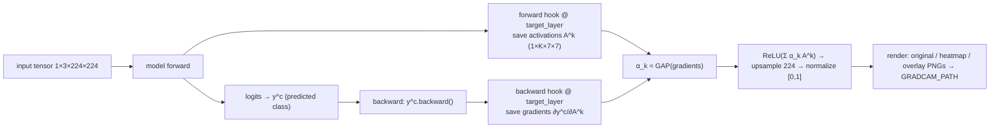

# 12 — Grad-CAM Explainability

> **AIMIP** — Explainable AI for the chest X-ray pneumonia classifier.
>
> **Disclaimer:** AIMIP is clinical **decision-support**, **not a medical device**; outputs are
> informational, not a diagnosis, and must be reviewed by a licensed clinician. A Grad-CAM heatmap
> shows **where the model looked**, not proof of pathology. Not FDA/CE cleared.

**Related docs:** [AI Architecture](09_AI_Architecture.md) · [Model Training](10_Model_Training.md) ·
[Model Inference](11_Model_Inference.md) · [Database Design](17_Database_Design.md) ·
[API Design](18_API_Design.md) · [Environment Configuration](31_Environment_Configuration.md)

---

## 1. Purpose

Grad-CAM (Gradient-weighted Class Activation Mapping) produces a coarse heatmap over the input X-ray
highlighting the regions most responsible for the predicted class. It gives clinicians a visual
sanity check on **where** the model attended, which is a required safety control in AIMIP: every
classification is accompanied by an explanation overlay. The subsystem lives in
`backend/app/infrastructure/ml/gradcam/` and hooks the `Classifier.target_layer` exposed by the port
(see [AI Architecture §3](09_AI_Architecture.md)).

Outputs are three PNGs — **original**, **heatmap**, **overlay** — saved under `GRADCAM_PATH` and
served as URLs, recorded on the `predictions` document as `gradcam{original, heatmap, overlay}`.

---

## 2. Theory (concise math)

Grad-CAM explains a class score using the gradients flowing into the **last convolutional layer**,
whose feature maps still retain spatial structure.

Let the target convolutional layer produce feature maps $A^k \in \mathbb{R}^{H \times W}$ for
$k = 1 \dots K$ channels. Let $y^c$ be the score (logit) for the target class $c$.

**1. Neuron importance weights** — global-average-pool the gradient of the class score w.r.t. each
feature map:

$$
\alpha_k^c = \frac{1}{H W} \sum_{i}\sum_{j} \frac{\partial y^c}{\partial A^k_{ij}}
$$

**2. Weighted combination + ReLU** — linearly combine the maps by their importance and keep only the
features with a positive influence on class $c$:

$$
L^c_{\text{Grad-CAM}} = \mathrm{ReLU}\!\left( \sum_{k} \alpha_k^c \, A^k \right)
$$

The ReLU discards regions that *lower* the class score, leaving the evidence *for* class $c$.

**3. Upsample & normalize** — $L^c$ has the conv layer's spatial size ($7\times7$ for both
densenet121 and efficientnet_b0 at $224$ input); it is bilinearly upsampled to $224\times224$ and
min-max normalized to $[0, 1]$ before colormapping.

The target class $c$ is the predicted class (`argmax` of the logits) from
[Model Inference](11_Model_Inference.md).

---

## 3. Hook-based implementation

Grad-CAM needs both the **forward activations** $A^k$ and the **backward gradients**
$\partial y^c / \partial A^k$ at `Classifier.target_layer`. These are captured with a **forward hook**
(saves activations) and a **full backward hook** (saves gradients). Because gradients are required,
this pass runs **with autograd enabled** — unlike the plain classification pass in
[Model Inference §4](11_Model_Inference.md), which uses `inference_mode`.



```python
# backend/app/infrastructure/ml/gradcam/gradcam.py
import cv2, numpy as np, torch, torch.nn.functional as F

class GradCAM:
    """Hook-based Grad-CAM over Classifier.target_layer."""

    def __init__(self, model: torch.nn.Module, target_layer: torch.nn.Module):
        self._model = model
        self._activations: torch.Tensor | None = None
        self._gradients: torch.Tensor | None = None
        # register hooks on the last conv block exposed by the Classifier port
        target_layer.register_forward_hook(self._save_activations)
        target_layer.register_full_backward_hook(self._save_gradients)

    def _save_activations(self, module, inp, out):
        self._activations = out.detach()                    # A^k : (1, K, 7, 7)

    def _save_gradients(self, module, grad_in, grad_out):
        self._gradients = grad_out[0].detach()              # ∂y^c/∂A^k : (1, K, 7, 7)

    def generate(self, tensor: torch.Tensor, class_idx: int | None = None) -> np.ndarray:
        self._model.zero_grad()
        logits = self._model(tensor)                        # forward → fires forward hook
        if class_idx is None:
            class_idx = int(logits.argmax(dim=1).item())
        score = logits[:, class_idx].sum()
        score.backward()                                    # backward → fires backward hook

        grads = self._gradients                             # (1, K, 7, 7)
        acts  = self._activations                           # (1, K, 7, 7)
        alpha = grads.mean(dim=(2, 3), keepdim=True)        # α_k : (1, K, 1, 1)  (GAP)
        cam = F.relu((alpha * acts).sum(dim=1, keepdim=True))  # (1, 1, 7, 7)

        cam = F.interpolate(cam, size=(224, 224), mode="bilinear", align_corners=False)
        cam = cam.squeeze().cpu().numpy()
        cam -= cam.min()
        cam /= (cam.max() + 1e-8)                            # normalize to [0, 1]
        return cam                                          # 224×224 float map
```

Hooks are registered against the module returned by the adapter's `target_layer` property
(`features.denseblock4` for densenet121, `features[-1]` for efficientnet_b0 — see
[AI Architecture §3.1](09_AI_Architecture.md)), so this code never reaches into architecture internals.

---

## 4. Rendering original / heatmap / overlay PNGs

The normalized CAM is colormapped (OpenCV `COLORMAP_JET`) and alpha-blended over the **original**
(un-normalized, resized) X-ray. Three files are written under `GRADCAM_PATH`, keyed by
`prediction_id`.

```python
# backend/app/infrastructure/ml/gradcam/render.py
import os, cv2, numpy as np

OVERLAY_ALPHA = 0.40            # heatmap weight in the blend
COLORMAP = cv2.COLORMAP_JET

def render(cam: np.ndarray, original_rgb: np.ndarray, prediction_id: str,
           gradcam_dir: str) -> dict[str, str]:
    os.makedirs(gradcam_dir, exist_ok=True)
    original_rgb = cv2.resize(original_rgb, (224, 224))            # match CAM size

    heatmap = cv2.applyColorMap(np.uint8(255 * cam), COLORMAP)     # BGR, 224×224×3
    heatmap_rgb = cv2.cvtColor(heatmap, cv2.COLOR_BGR2RGB)

    overlay = cv2.addWeighted(heatmap_rgb, OVERLAY_ALPHA,
                              original_rgb, 1 - OVERLAY_ALPHA, 0)

    paths = {
        "original": os.path.join(gradcam_dir, f"{prediction_id}_original.png"),
        "heatmap":  os.path.join(gradcam_dir, f"{prediction_id}_heatmap.png"),
        "overlay":  os.path.join(gradcam_dir, f"{prediction_id}_overlay.png"),
    }
    cv2.imwrite(paths["original"], cv2.cvtColor(original_rgb, cv2.COLOR_RGB2BGR))
    cv2.imwrite(paths["heatmap"],  cv2.cvtColor(heatmap_rgb,  cv2.COLOR_RGB2BGR))
    cv2.imwrite(paths["overlay"],  cv2.cvtColor(overlay,      cv2.COLOR_RGB2BGR))
    return paths
```

### 4.1 Colormap & overlay parameters

| Parameter | Value | Meaning |
|-----------|-------|---------|
| `COLORMAP` | `cv2.COLORMAP_JET` | blue = low relevance → red = high relevance |
| `OVERLAY_ALPHA` | `0.40` | heatmap opacity in the blend; the X-ray anatomy stays legible underneath |
| CAM size | `7×7` → bilinear → `224×224` | matches the input/inference spatial size |
| normalization | min-max to `[0, 1]` | per-image, so colors are comparable within one explanation |

### 4.2 Serving as URLs

The three files are saved on the `GRADCAM_PATH` volume and exposed as static URLs (mounted route),
and the URL triple is written to the `predictions` document:

```
predictions.gradcam = {
  "original": "/gradcam/{prediction_id}_original.png",
  "heatmap":  "/gradcam/{prediction_id}_heatmap.png",
  "overlay":  "/gradcam/{prediction_id}_overlay.png",
}
```

The frontend Prediction page renders the **overlay** primarily, with original/heatmap available for
comparison. The `POST /predict` response includes these URLs (see [API Design](18_API_Design.md));
the schema is in [Database Design](17_Database_Design.md).

> **OOD short-circuit:** when `ood_flag=true` (non-X-ray), classification is skipped, so no Grad-CAM
> is generated and `gradcam` is left unset — consistent with
> [Model Inference §6](11_Model_Inference.md).

---

## 5. Integration with the inference flow

```python
# invoked by PredictionService after a successful (non-OOD) classification
cam = grad_cam.generate(tensor, class_idx=predicted_index)
gradcam_urls = render(cam, original_rgb, prediction_id, settings.GRADCAM_PATH)
# persist onto the predictions doc
await predictions_repo.set_gradcam(prediction_id, gradcam_urls)
```

Grad-CAM runs a second forward+backward pass, so it is dispatched to the **threadpool executor** just
like the classification pass, keeping the async event loop unblocked (see
[Model Inference §4](11_Model_Inference.md)). Its ~100–300 ms cost sits comfortably within the
end-to-end **< 6 s p95** budget.

---

## 6. Validation of explanations

Grad-CAM output is quality-checked so a misleading map is not silently shown:

- **Sanity / localization checks.** On a labeled validation subset, overlays are inspected to confirm
  `PNEUMONIA` activations tend to fall over lung fields rather than image borders, text markers, or
  corners. Persistent border activation is a red flag for a shortcut-learning artifact.
- **Class sensitivity.** The map for the predicted class should differ from the map computed for the
  opposite class; an explanation that is identical regardless of `class_idx` is not class-discriminative
  and is flagged.
- **Degenerate-map guard.** If the normalized CAM is nearly uniform (negligible variance), the
  overlay is still produced but marked low-informative, reinforcing the
  `uncertain → refer to specialist` posture from [AI Architecture §7](09_AI_Architecture.md).
- **Reproducibility.** With fixed weights and a fixed input, the CAM is deterministic, so overlays can
  be regression-tested.

---

## 7. Limitations

- **Coarse resolution.** The map originates at the conv layer's `7×7` grid; upsampling yields smooth
  blobs, not sharp lesion boundaries. It indicates *region*, not precise extent.
- **Attention, not causation.** A hot region is where the model looked, not proof of pathology; it can
  reflect dataset shortcuts (e.g. text overlays, view markers, scanner artifacts).
- **Class-discriminative but not exhaustive.** Grad-CAM highlights the most influential evidence for
  one class; it does not enumerate every relevant feature.
- **Sensitivity to the chosen layer.** Different `target_layer` choices give different granularity;
  AIMIP fixes it to the last conv block via the port for consistency.
- **Not a substitute for review.** Explanations support, but never replace, a licensed clinician's
  reading — the core AIMIP disclaimer.

---

## 8. Cross-references

- The `Classifier.target_layer` contract → [AI Architecture §3](09_AI_Architecture.md)
- The classification pass that supplies the predicted class → [Model Inference](11_Model_Inference.md)
- How the trained model is produced → [Model Training](10_Model_Training.md)
- `predictions.gradcam` schema → [Database Design](17_Database_Design.md)
- `POST /predict` response with gradcam URLs → [API Design](18_API_Design.md)
- `GRADCAM_PATH` and static serving → [Environment Configuration](31_Environment_Configuration.md)
