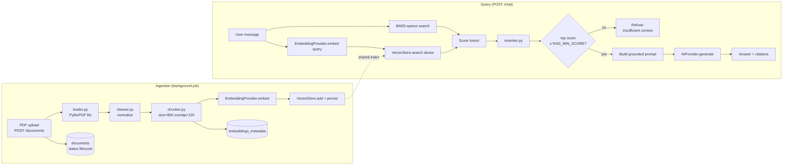
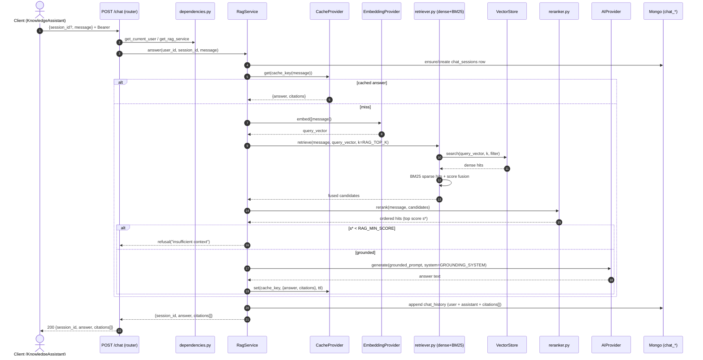

# 13. RAG Architecture

> **Scope.** This document specifies the Retrieval-Augmented Generation (RAG) subsystem of the
> **Advanced AI Medical Intelligence Platform (AIMIP)** — the "Knowledge Assistant" that answers
> clinical-knowledge questions strictly from an ingested corpus of vetted medical PDFs (WHO / NIH /
> peer-reviewed research) and **refuses** when the corpus does not support an answer.
>
> **Disclaimer.** Answers are informational, not a diagnosis; a licensed clinician must review all
> results. The assistant never invents medical facts — every claim is grounded in a retrieved,
> cited chunk or the request is refused.

**Related docs:** [Vector Database](14_Vector_Database.md) · [Embedding System](15_Embedding_System.md) ·
[AI Providers](16_AI_Providers.md) · [Database Design](17_Database_Design.md) ·
[API Design](18_API_Design.md) · [Environment Configuration](31_Environment_Configuration.md) ·
[Authorization / RBAC](20_Authorization_RBAC.md) · [SRS](02_Software_Requirements_Specification.md)

---

## 1. Purpose & design principles

The RAG subsystem exists so that the LLM answers **only** from a curated, auditable medical
corpus rather than from parametric memory. This is a safety requirement in a clinical
decision-support context: hallucinated medical guidance is unacceptable, so the pipeline is
built around **grounding** and **verifiable citations**.

Guiding principles, all consistent with the Hexagonal architecture of [§2 CANON]:

- **Business logic depends only on ports.** `RagService` never imports `openai`, `faiss`, or
  `fitz`. It depends on the `EmbeddingProvider`, `VectorStore`, `AIProvider`, `CacheProvider`,
  and `TaskQueue` ABCs; concrete adapters are chosen by factories reading ENV. See
  [16_AI_Providers.md](16_AI_Providers.md).
- **Grounded-or-refuse.** If the best retrieval score is below `RAG_MIN_SCORE`, the service
  returns a deterministic "insufficient context" refusal — the LLM is never asked to answer
  ungrounded.
- **Every answer is auditable.** Each response carries `citations[]` (`document_id`, `chunk_id`,
  `score`) persisted to `chat_history`, so any clinical claim traces back to a source page.
- **Ingestion is asynchronous.** Uploading a PDF returns immediately; parsing, chunking,
  embedding, and indexing run as a background job via the `TaskQueue` port.
- **Provider consistency.** The same `EMBEDDING_PROVIDER` must be used for ingest and query, or
  vectors are incomparable — enforced at query time (see [15_Embedding_System.md](15_Embedding_System.md) §7).

---

## 2. Components & code locations

All RAG code lives under `backend/app/infrastructure/rag/` and is orchestrated by
`application/services/RagService` and `DocumentService`.

| Stage        | Module (`infrastructure/rag/`) | Responsibility |
|--------------|--------------------------------|----------------|
| Load         | `loader.py`                    | PyMuPDF (`fitz`) page-by-page text + page numbers extraction |
| Clean        | `cleaner.py`                   | De-hyphenation, whitespace/heading normalization, boilerplate strip |
| Chunk        | `chunker.py`                   | Split into overlapping windows (`RAG_CHUNK_SIZE` / `RAG_CHUNK_OVERLAP`) |
| Ingest       | `ingest.py`                    | Orchestrates load→clean→chunk→embed→store; writes `documents` + `embeddings_metadata` |
| Retrieve     | `retriever.py`                 | Hybrid dense (`VectorStore`) + sparse (BM25) retrieval and score fusion |
| Rerank       | `reranker.py`                  | Cross-encoder / score-based reordering of the fused candidate set |
| Pipeline     | `pipeline.py`                  | Query-time orchestration: retrieve→rerank→build grounded prompt→`AIProvider.generate` |

Ports consumed (all from `domain/ports/`, adapters in `infrastructure/providers/`):

- `EmbeddingProvider` — `embed(texts) -> list[list[float]]`, `dimension: int`
- `VectorStore` — `add(ids, vectors, metadatas)`, `search(vector, k, filter=None)`, `persist()`, `load()`
- `AIProvider` — `generate(prompt, system=None, **opts) -> str`, `stream(...)`
- `CacheProvider` — `get`, `set(ttl)`, `delete` (query-embedding + answer caching)
- `TaskQueue` — `enqueue(job_name, payload)`, `schedule(...)` (background ingest)

---

## 3. End-to-end pipeline overview



---

## 4. Ingestion pipeline (detail)

### 4.1 Load — PyMuPDF (`fitz`)

`loader.py` opens the uploaded PDF from `PDF_PATH` and extracts text **per page**, preserving the
1-based page number so citations can point at a real page. TensorFlow/LlamaIndex are intentionally
not used — extraction is done directly with PyMuPDF.

```python
# infrastructure/rag/loader.py
import fitz  # PyMuPDF

def load_pdf(path: str) -> list[tuple[int, str]]:
    """Return [(page_number, raw_text), ...], 1-based page numbers."""
    pages: list[tuple[int, str]] = []
    with fitz.open(path) as doc:
        for i, page in enumerate(doc, start=1):
            pages.append((i, page.get_text("text")))
    return pages
```

### 4.2 Clean

`cleaner.py` removes artifacts that harm retrieval quality: line-break hyphenation
(`inflamma-\ntion` → `inflammation`), repeated headers/footers, page numbers, excessive
whitespace, and control characters. Cleaning is deliberately conservative — clinical terminology
must not be altered.

```python
# infrastructure/rag/cleaner.py
import re

def clean_text(text: str) -> str:
    text = re.sub(r"-\n(\w)", r"\1", text)          # de-hyphenate across line breaks
    text = re.sub(r"[ \t]+", " ", text)             # collapse intra-line whitespace
    text = re.sub(r"\n{3,}", "\n\n", text)          # collapse blank runs
    return text.strip()
```

### 4.3 Chunk — `RAG_CHUNK_SIZE` / `RAG_CHUNK_OVERLAP`

`chunker.py` produces overlapping character windows of **`RAG_CHUNK_SIZE=800`** with
**`RAG_CHUNK_OVERLAP=120`** (canonical defaults, see [31_Environment_Configuration.md](31_Environment_Configuration.md)).
Overlap preserves context that would otherwise be severed at a window boundary. Splitting prefers
sentence/paragraph boundaries within a tolerance so chunks stay semantically coherent. Each chunk
retains its source `page` for citation.

```python
# infrastructure/rag/chunker.py
from dataclasses import dataclass

@dataclass(frozen=True)
class Chunk:
    chunk_index: int
    text: str
    page: int

def chunk_pages(pages: list[tuple[int, str]], size: int, overlap: int) -> list[Chunk]:
    chunks: list[Chunk] = []
    idx = 0
    for page_no, text in pages:
        start = 0
        while start < len(text):
            window = text[start : start + size]
            # snap to the last sentence boundary in the window when possible
            cut = window.rfind(". ")
            if cut > size * 0.5 and start + size < len(text):
                window = window[: cut + 1]
            chunks.append(Chunk(chunk_index=idx, text=window.strip(), page=page_no))
            idx += 1
            start += max(1, len(window) - overlap)   # advance with overlap
    return [c for c in chunks if c.text]
```

### 4.4 Embed & store

Chunks are embedded in **batches** through `EmbeddingProvider.embed` (batching + cost/latency in
[15_Embedding_System.md](15_Embedding_System.md) §5) and written to the active `VectorStore`
(faiss / chroma / pinecone — see [14_Vector_Database.md](14_Vector_Database.md)). For each stored
vector, one row is written to the `embeddings_metadata` collection linking `vector_id` ↔ chunk.

```python
# infrastructure/rag/ingest.py  (orchestration, adapters injected)
def ingest_document(document_id: str, pdf_path: str, deps) -> int:
    deps.documents.set_status(document_id, "processing")
    pages  = load_pdf(pdf_path)
    pages  = [(p, clean_text(t)) for p, t in pages]
    chunks = chunk_pages(pages, deps.settings.RAG_CHUNK_SIZE, deps.settings.RAG_CHUNK_OVERLAP)

    vectors = deps.embedder.embed([c.text for c in chunks])   # batched inside adapter
    ids     = [f"{document_id}:{c.chunk_index}" for c in chunks]
    metas   = [{"document_id": document_id, "chunk_index": c.chunk_index, "page": c.page}
               for c in chunks]

    deps.vector_store.add(ids=ids, vectors=vectors, metadatas=metas)
    deps.vector_store.persist()                               # → VECTOR_INDEX_PATH

    deps.embeddings_metadata.insert_many([
        {"document_id": document_id, "chunk_id": ids[i], "chunk_index": c.chunk_index,
         "text": c.text, "page": c.page, "vector_id": ids[i],
         "embedding_provider": deps.settings.EMBEDDING_PROVIDER,
         "dimension": deps.embedder.dimension}
        for i, c in enumerate(chunks)
    ])
    deps.documents.set_status(document_id, "indexed", chunk_count=len(chunks))
    return len(chunks)
```

### 4.5 Ingestion as a background job

`POST /documents` (multipart PDF) does **not** parse inline. `DocumentService` persists a
`documents` row with `status="uploaded"`, saves the file under `PDF_PATH`, then enqueues the work
through the `TaskQueue` port. With `TASK_QUEUE=inprocess` the job runs in a background task; with
`TASK_QUEUE=celery` it is dispatched to a Celery worker (`workers/` → `ingest` task). The API
returns `202`-style immediately with the `documents` id.

```python
# application/services/DocumentService.py
async def upload(self, file, actor_id: str) -> Document:
    doc = await self.documents.create(
        filename=file.filename, title=derive_title(file.filename),
        source="other", mime=file.content_type, status="uploaded",
        uploaded_by=actor_id,
    )
    path = await self.storage.save_blob(PDF_PATH, doc.id, file)
    self.task_queue.enqueue("ingest_document", {"document_id": doc.id, "pdf_path": path})
    return doc
```

**`documents.status` lifecycle:** `uploaded → processing → indexed` (success) or
`uploaded → processing → failed` (extraction/embedding error; the job records the failure and the
UI surfaces a retry). Values are exactly those in the `documents` collection (CANON §6).

---

## 5. Query pipeline (`POST /chat`)

### 5.1 Sequence diagram



### 5.2 Hybrid retrieval (dense + BM25)

`retriever.py` runs two retrievers and fuses their results:

- **Dense** — `EmbeddingProvider.embed([query])` → `VectorStore.search(vector, k, filter)`.
  Captures semantic similarity ("shortness of breath" ≈ "dyspnea").
- **Sparse (BM25)** — a lexical index over chunk `text`. Captures exact terms, acronyms, drug
  names, and rare tokens that dense embeddings blur.

Scores from the two lists are normalized and combined with **Reciprocal Rank Fusion (RRF)**, which
is robust to the differing score scales of cosine similarity vs. BM25:

```python
# infrastructure/rag/retriever.py
def rrf_fuse(dense: list[Hit], sparse: list[Hit], k: int, c: int = 60) -> list[Hit]:
    scores: dict[str, float] = {}
    for ranked in (dense, sparse):
        for rank, hit in enumerate(ranked):
            scores[hit.chunk_id] = scores.get(hit.chunk_id, 0.0) + 1.0 / (c + rank)
    fused = sorted(scores.items(), key=lambda kv: kv[1], reverse=True)
    return [Hit(chunk_id=cid, score=s) for cid, s in fused][: k * 3]  # over-fetch for rerank
```

The fused set is intentionally larger than `RAG_TOP_K` (over-fetch) so the reranker has room to
promote the best chunk.

### 5.3 Rerank

`reranker.py` reorders the fused candidates by relevance to the **exact** query, using a
cross-encoder (`sentence-transformers` cross-encoder) that scores each `(query, chunk_text)` pair
jointly — more accurate than the fusion score alone. The top **`RAG_TOP_K=5`** chunks survive, and
the top chunk's rerank score `s*` is the value tested against `RAG_MIN_SCORE`.

### 5.4 Grounding guardrails & the refusal contract

The core safety gate:

```python
# application/services/RagService.py (excerpt)
hits = self.reranker.rerank(message, candidates)[: self.settings.RAG_TOP_K]
top_score = hits[0].score if hits else 0.0

if top_score < self.settings.RAG_MIN_SCORE:     # RAG_MIN_SCORE = 0.2
    return ChatAnswer(
        answer=("I don't have enough grounded medical context to answer that reliably. "
                "Please rephrase, or upload a source document covering this topic. "
                "This assistant only answers from vetted medical sources and is not a diagnosis."),
        citations=[],
        refused=True,
    )

context = self._format_context(hits)            # numbered [1..k] chunk blocks
prompt  = GROUNDED_PROMPT_TEMPLATE.format(context=context, question=message)
answer  = self.ai.generate(prompt, system=GROUNDING_SYSTEM, temperature=0.1)
```

Grounding is enforced on three levels:

1. **Retrieval gate** — below `RAG_MIN_SCORE`, the LLM is never called (deterministic refusal).
2. **System prompt** (`GROUNDING_SYSTEM`) — instructs the model to answer **only** from the
   numbered context, to cite sources as `[n]`, to say it cannot answer if the context is
   insufficient, and never to provide a diagnosis (append the CANON disclaimer).
3. **Low temperature** (`0.1`) — minimizes creative drift from the supplied context.

```text
GROUNDING_SYSTEM (verbatim intent):
You are AIMIP's medical knowledge assistant. Answer ONLY using the numbered context passages.
Cite every claim with its passage number in square brackets, e.g. [2]. If the context does not
contain the answer, reply exactly: "The provided sources do not cover this." Do NOT use outside
knowledge. Never give a diagnosis or treatment order; append: "This is informational only — a
licensed clinician must review all results."
```

### 5.5 Citations & persistence

Every surviving hit maps back through `embeddings_metadata` (`vector_id`/`chunk_id`) to its
`document_id` and page. The response `citations[]` items are exactly
`{document_id, chunk_id, score}` — matching the `chat_history.citations[]` schema (CANON §6). Both
the user message and the assistant answer (with citations) are appended to `chat_history` under the
resolved `session_id`; `chat_sessions.updated_at` is bumped. Response body matches
[18_API_Design.md](18_API_Design.md): `{session_id, answer, citations[]}`.

---

## 6. Chunk metadata schema (`embeddings_metadata`)

The `embeddings_metadata` collection is the join table between a `VectorStore` `vector_id` and the
human-readable chunk. One row per stored vector (CANON §6):

| Field                | Type      | Meaning |
|----------------------|-----------|---------|
| `_id`                | ObjectId  | Mongo id |
| `document_id`        | ObjectId  | FK → `documents._id` |
| `chunk_id`           | string    | Stable chunk key, e.g. `"<document_id>:<chunk_index>"` |
| `chunk_index`        | int       | 0-based ordinal within the document |
| `text`              | string    | Cleaned chunk text (returned in citations / rerank input) |
| `page`               | int       | 1-based source PDF page (for "see page N" citations) |
| `vector_id`          | string    | Id used inside the `VectorStore` (equals `chunk_id`) |
| `embedding_provider` | string    | `EMBEDDING_PROVIDER` at ingest time (consistency guard) |
| `dimension`          | int       | Vector dimension at ingest (index-compatibility guard) |
| `created_at`         | datetime  | Ingest timestamp |

**Indexes:** `document_id` (delete-cascade + per-doc listing), unique `vector_id`, and
`(embedding_provider, dimension)` to detect mismatches. Deleting a document
(`DELETE /documents/{id}`) removes its `embeddings_metadata` rows **and** the corresponding vectors
from the `VectorStore`, then re-persists the index.

---

## 7. Evaluation approach

RAG quality is measured on a curated gold set of `(question, relevant_chunk_ids, reference_answer)`
tuples derived from the ingested corpus, run in `tests/integration/` and as an offline harness in
`scripts/`.

**Retrieval metrics** (do we fetch the right chunks?):

- **Precision@k / Recall@k** at `k = RAG_TOP_K` against `relevant_chunk_ids`.
- **MRR** (Mean Reciprocal Rank) — how high the first relevant chunk ranks after rerank.
- **Hit rate** — fraction of questions with ≥1 relevant chunk in the top-k.

**Generation metrics** (is the answer faithful?):

- **Faithfulness / groundedness** — every sentence in the answer must be entailed by a cited
  chunk; measured with an LLM-as-judge rubric plus citation-coverage checks (each `[n]` resolves
  to a retrieved chunk).
- **Answer relevancy** — does the answer address the question.
- **Refusal correctness** — on out-of-corpus questions, the pipeline **must** refuse
  (top score < `RAG_MIN_SCORE`); false-answer rate on these is a first-class safety metric.

**Tuning levers** exposed via ENV so evaluation can sweep without code changes:
`RAG_CHUNK_SIZE`, `RAG_CHUNK_OVERLAP`, `RAG_TOP_K`, `RAG_MIN_SCORE`, `EMBEDDING_PROVIDER`,
`EMBEDDING_MODEL`. Raising `RAG_MIN_SCORE` trades recall for safety (more refusals, fewer weak
answers); enlarging `RAG_CHUNK_SIZE` improves context continuity but coarsens citation precision.

---

## 8. Failure modes & handling

| Failure | Handling |
|---------|----------|
| Corrupt / non-text PDF (scanned image) | `loader` yields empty text → `documents.status="failed"`; UI shows retry / OCR-required notice |
| Embedding provider outage during ingest | Ingest job fails → `status="failed"`; retried via `TaskQueue`; partial vectors rolled back |
| Query embedding provider ≠ ingest provider | Guard compares `EMBEDDING_PROVIDER`/`dimension`; mismatch → operator error, re-index required (see [15](15_Embedding_System.md) §7) |
| Empty corpus / no candidates | Treated as score `0.0` < `RAG_MIN_SCORE` → refusal |
| LLM outage | `AIProvider` error surfaces as RFC 7807 `503`; no partial/ungrounded answer persisted |
| Index/store corruption | `VectorStore.load()` fails fast at startup; ops restore from `VECTOR_INDEX_PATH` backup |

---

## 9. Cross-references

- Vector adapters, persistence, metric choice, filtering → **[14_Vector_Database.md](14_Vector_Database.md)**
- Embedding adapters, dimension/index compatibility, caching, batching → **[15_Embedding_System.md](15_Embedding_System.md)**
- Provider/factory pattern, ABC contracts, contract tests, `.env`-only swaps → **[16_AI_Providers.md](16_AI_Providers.md)**
- `documents` / `embeddings_metadata` / `chat_sessions` / `chat_history` collections → **[17_Database_Design.md](17_Database_Design.md)**
- `POST /chat`, `POST /documents`, error envelope, list envelope → **[18_API_Design.md](18_API_Design.md)**
- Who may chat / manage documents (roles) → **[20_Authorization_RBAC.md](20_Authorization_RBAC.md)**
- Canonical ENV defaults (`RAG_*`, `PDF_PATH`, `VECTOR_INDEX_PATH`) → **[31_Environment_Configuration.md](31_Environment_Configuration.md)**
