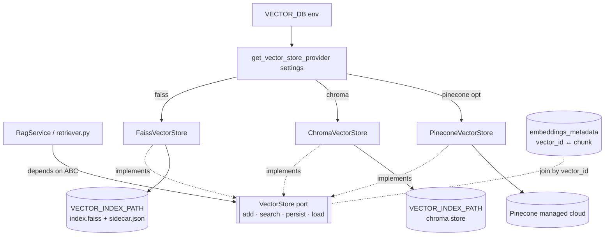

# 14. Vector Database

> **Scope.** The `VectorStore` port and its adapters (`faiss`, `chroma`, `pinecone` optional) that
> back dense retrieval for the RAG subsystem of the **Advanced AI Medical Intelligence Platform
> (AIMIP)**. Selection is ENV-driven via `VECTOR_DB`; the index is persisted at
> `VECTOR_INDEX_PATH`. Business logic (`RagService`) depends only on the ABC — never on a vendor SDK.

**Related docs:** [RAG Architecture](13_RAG_Architecture.md) · [Embedding System](15_Embedding_System.md) ·
[AI Providers](16_AI_Providers.md) · [Database Design](17_Database_Design.md) ·
[Environment Configuration](31_Environment_Configuration.md)

---

## 1. Role in the architecture

The `VectorStore` is the durable index of chunk embeddings produced during ingestion
(see [13_RAG_Architecture.md](13_RAG_Architecture.md) §4). At query time it answers approximate
nearest-neighbour (ANN) searches for the **dense** half of hybrid retrieval. It stores only
`(id, vector, small-metadata)`; the authoritative chunk text and provenance live in the
`embeddings_metadata` MongoDB collection (CANON §6), joined by `vector_id`.

Per the Hexagonal rule (CANON §2), `RagService` imports the `VectorStore` **ABC** from
`domain/ports/`. Concrete adapters live in `infrastructure/providers/vector_db/` and are selected
at startup by `get_vector_store_provider(settings)` reading `VECTOR_DB`.



---

## 2. The `VectorStore` port (ABC)

Exact method surface from CANON §3:

```python
# domain/ports/vector_store.py
from abc import ABC, abstractmethod

class VectorStore(ABC):
    """Durable ANN index over chunk embeddings. Adapters MUST NOT leak vendor types."""

    @abstractmethod
    def add(self, ids: list[str], vectors: list[list[float]],
            metadatas: list[dict]) -> None:
        """Insert/upsert vectors keyed by stable string ids (e.g. '<doc_id>:<chunk_index>')."""

    @abstractmethod
    def search(self, vector: list[float], k: int,
               filter: dict | None = None) -> list["VectorHit"]:
        """Return top-k nearest neighbours, optionally constrained by a metadata filter."""

    @abstractmethod
    def persist(self) -> None:
        """Flush the in-memory index + id/metadata sidecar to VECTOR_INDEX_PATH."""

    @abstractmethod
    def load(self) -> None:
        """Restore a previously persisted index at startup (fail-fast if corrupt)."""


@dataclass(frozen=True)
class VectorHit:
    id: str          # == vector_id == chunk_id
    score: float     # normalized similarity in [0, 1], higher = closer
    metadata: dict   # {document_id, chunk_index, page}
```

**Contract invariants** (enforced by the shared contract test, see §8 and
[16_AI_Providers.md](16_AI_Providers.md) §5):

- `add` is idempotent per `id` (re-adding an existing id upserts, never duplicates).
- `search` returns at most `k` hits, sorted by `score` descending, each `score ∈ [0, 1]`.
- `score` semantics are **normalized similarity** regardless of the underlying metric, so
  `RAG_MIN_SCORE` compares consistently across adapters.
- `persist()` then `load()` round-trips exactly (same ids, vectors, metadata, search results).
- `filter` semantics are equality-match on metadata keys (e.g. `{"document_id": "..."}`).

---

## 3. Adapter selection (`VECTOR_DB`) & factory

```python
# infrastructure/providers/vector_db/factory.py
from app.domain.ports.vector_store import VectorStore
from .faiss_store import FaissVectorStore
from .chroma_store import ChromaVectorStore
from .pinecone_store import PineconeVectorStore   # optional

def get_vector_store_provider(settings) -> VectorStore:
    kind = settings.VECTOR_DB                       # "faiss" | "chroma" | "pinecone"
    dim  = settings.embedding_dimension             # from EmbeddingProvider (see doc 15)
    if kind == "faiss":
        store = FaissVectorStore(path=settings.VECTOR_INDEX_PATH, dim=dim)
    elif kind == "chroma":
        store = ChromaVectorStore(path=settings.VECTOR_INDEX_PATH, dim=dim)
    elif kind == "pinecone":
        if not settings.PINECONE_API_KEY:
            raise ConfigError("VECTOR_DB=pinecone requires PINECONE_API_KEY")
        store = PineconeVectorStore(api_key=settings.PINECONE_API_KEY, dim=dim)
    else:
        raise ConfigError(f"Unknown VECTOR_DB={kind!r}")
    store.load()                                    # restore prior index if present
    return store
```

The factory **fails fast** (CANON §5): `VECTOR_DB=pinecone` with an empty `PINECONE_API_KEY`
raises at startup, not at first query. Canonical default is `VECTOR_DB=faiss`.

---

## 4. Adapters

### 4.1 `faiss` (default — local, embedded)

`faiss-cpu` in-process ANN. The vectors live in a FAISS index; a JSON/pickle sidecar maps FAISS
integer offsets ↔ string `id` and holds per-id metadata (FAISS itself stores only float vectors).
Best for single-node deployments and CI — no external service.

```python
# infrastructure/providers/vector_db/faiss_store.py
import os, json, faiss, numpy as np

class FaissVectorStore(VectorStore):
    def __init__(self, path: str, dim: int):
        self._path, self._dim = path, dim
        self._index = faiss.IndexFlatIP(dim)        # inner product on L2-normalized vecs = cosine
        self._ids: list[str] = []
        self._meta: dict[str, dict] = {}

    def add(self, ids, vectors, metadatas):
        arr = self._normalize(np.asarray(vectors, dtype="float32"))
        # upsert: drop existing ids first (rebuild is cheap at doc scale)
        for i, m in zip(ids, metadatas):
            self._meta[i] = m
        self._index.add(arr)
        self._ids.extend(ids)

    def search(self, vector, k, filter=None):
        q = self._normalize(np.asarray([vector], dtype="float32"))
        sims, idxs = self._index.search(q, k * 4 if filter else k)
        hits = []
        for score, offset in zip(sims[0], idxs[0]):
            if offset < 0:
                continue
            vid = self._ids[offset]
            meta = self._meta[vid]
            if filter and any(meta.get(kk) != vv for kk, vv in filter.items()):
                continue
            hits.append(VectorHit(id=vid, score=float((score + 1) / 2), metadata=meta))
            if len(hits) == k:
                break
        return hits

    def persist(self):
        os.makedirs(self._path, exist_ok=True)
        faiss.write_index(self._index, os.path.join(self._path, "index.faiss"))
        with open(os.path.join(self._path, "sidecar.json"), "w") as fh:
            json.dump({"ids": self._ids, "meta": self._meta, "dim": self._dim}, fh)

    def load(self):
        idx_p = os.path.join(self._path, "index.faiss")
        if not os.path.exists(idx_p):
            return                                  # fresh install: empty index
        self._index = faiss.read_index(idx_p)
        with open(os.path.join(self._path, "sidecar.json")) as fh:
            side = json.load(fh)
        if side["dim"] != self._dim:                # index-compatibility guard (see doc 15)
            raise ConfigError(f"Index dim {side['dim']} != embedding dim {self._dim}; re-index required")
        self._ids, self._meta = side["ids"], side["meta"]

    @staticmethod
    def _normalize(a):
        faiss.normalize_L2(a)                        # cosine via inner product
        return a
```

FAISS returns inner-product on L2-normalized vectors ∈ `[-1, 1]`; the adapter maps it to `[0, 1]`
so `score` obeys the port contract and `RAG_MIN_SCORE` is metric-agnostic. `filter` is applied
post-search with over-fetch (`k * 4`) since `IndexFlatIP` has no native metadata filtering.

### 4.2 `chroma` (embedded document store with native metadata filter)

`chromadb` persistent client. Chroma stores vectors **and** metadata together and supports
server-side `where` filtering, so no sidecar is needed. Good when per-document filtering is heavy.

```python
# infrastructure/providers/vector_db/chroma_store.py
import chromadb

class ChromaVectorStore(VectorStore):
    def __init__(self, path: str, dim: int):
        self._dim = dim
        self._client = chromadb.PersistentClient(path=path)     # persists under VECTOR_INDEX_PATH
        self._col = self._client.get_or_create_collection(
            name="aimip_chunks", metadata={"hnsw:space": "cosine"})

    def add(self, ids, vectors, metadatas):
        self._col.upsert(ids=ids, embeddings=vectors, metadatas=metadatas)

    def search(self, vector, k, filter=None):
        res = self._col.query(query_embeddings=[vector], n_results=k, where=filter or None)
        hits = []
        for vid, dist, meta in zip(res["ids"][0], res["distances"][0], res["metadatas"][0]):
            hits.append(VectorHit(id=vid, score=1.0 - float(dist), metadata=meta))  # cosine dist→sim
            return_score = hits
        return hits

    def persist(self):
        pass                                          # PersistentClient auto-persists on write

    def load(self):
        pass                                          # collection reopened in __init__
```

Chroma's `cosine` space returns a distance; the adapter converts to similarity (`1 - distance`) to
satisfy the `[0, 1]` contract. `persist`/`load` are no-ops because `PersistentClient` writes
through to `VECTOR_INDEX_PATH` on every mutation.

### 4.3 `pinecone` (optional — managed, horizontally scalable)

Managed cloud ANN for multi-node / large-corpus deployments. Gated by `PINECONE_API_KEY`. State
lives in Pinecone's service, so `persist`/`load` are no-ops locally; `VECTOR_INDEX_PATH` is unused
for this adapter. Namespaces isolate tenants/environments.

```python
# infrastructure/providers/vector_db/pinecone_store.py
from pinecone import Pinecone

class PineconeVectorStore(VectorStore):
    def __init__(self, api_key: str, dim: int, index_name: str = "aimip", namespace: str = "default"):
        self._pc = Pinecone(api_key=api_key)
        self._index = self._pc.Index(index_name)      # dim/metric fixed at index creation
        self._ns, self._dim = namespace, dim

    def add(self, ids, vectors, metadatas):
        self._index.upsert(
            vectors=[{"id": i, "values": v, "metadata": m}
                     for i, v, m in zip(ids, vectors, metadatas)],
            namespace=self._ns)

    def search(self, vector, k, filter=None):
        res = self._index.query(vector=vector, top_k=k, filter=filter,
                                include_metadata=True, namespace=self._ns)
        return [VectorHit(id=m["id"], score=float(m["score"]), metadata=m["metadata"])
                for m in res["matches"]]              # cosine index → score already in [0,1]

    def persist(self): pass                           # managed service, remote-durable
    def load(self):    pass
```

---

## 5. Index persistence (`VECTOR_INDEX_PATH`)

- Canonical path: `VECTOR_INDEX_PATH=./data/vector_index` (gitignored, CANON §4/§5).
- **faiss** — `index.faiss` (vectors) + `sidecar.json` (id list, metadata, `dim`). `persist()` is
  called explicitly after every ingest job (`ingest.py`) and on graceful shutdown.
- **chroma** — a SQLite + parquet store managed by `PersistentClient` under the same path;
  auto-persisted.
- **pinecone** — remote; nothing on local disk. `VECTOR_INDEX_PATH` is ignored.
- **Startup** — `load()` runs inside the factory. A dimension mismatch between the persisted index
  and the active `EmbeddingProvider.dimension` **fails fast** (index-compatibility guard, mirrors
  [15_Embedding_System.md](15_Embedding_System.md) §4).
- **Backup/restore** — for faiss/chroma, snapshot the `VECTOR_INDEX_PATH` directory; the `documents`
  and `embeddings_metadata` collections plus original PDFs under `PDF_PATH` allow a full rebuild via
  `scripts/ingest_docs.py`.

---

## 6. Distance metrics & normalization

All adapters are configured for **cosine similarity**, matching how text embeddings are compared:

- **faiss** — `IndexFlatIP` over L2-normalized vectors ≡ cosine; adapter maps to `[0, 1]`.
- **chroma** — collection created with `hnsw:space="cosine"`; adapter maps distance→similarity.
- **pinecone** — index created with `metric="cosine"`; score already in `[0, 1]`.

Because the port guarantees a normalized `[0, 1]` similarity, the single ENV knob `RAG_MIN_SCORE`
(default `0.2`) governs the "insufficient context" refusal identically across stores. Euclidean/dot
metrics are deliberately avoided so score thresholds remain portable.

---

## 7. Metadata filtering

`search(vector, k, filter=...)` constrains results to metadata equality matches. Metadata carried
per vector is `{document_id, chunk_index, page}` (the rich text lives in `embeddings_metadata`).
Typical uses:

- Restrict a query to a single uploaded document: `filter={"document_id": "<id>"}`.
- Exclude a document mid-deletion before its vectors are purged.

Implementation differs by store: chroma and pinecone filter **server-side**; faiss over-fetches and
filters **in the adapter** (§4.1). The port contract keeps this difference invisible to
`RagService`.

---

## 8. Shared contract test

Every adapter must pass the single parametrized suite in `tests/contract/test_vector_store.py`
(CANON §3: "Every port ships a shared contract test that all adapters must pass"). It runs the same
assertions against each adapter fixture:

```python
# tests/contract/test_vector_store.py
import pytest

@pytest.fixture(params=["faiss", "chroma", "pinecone"])
def store(request, tmp_path):
    return make_store(request.param, path=str(tmp_path), dim=8)   # pinecone skipped w/o key

def test_add_search_roundtrip(store):
    store.add(ids=["a:0", "a:1"], vectors=[[1,0,0,0,0,0,0,0],[0,1,0,0,0,0,0,0]],
              metadatas=[{"document_id": "a", "chunk_index": 0, "page": 1},
                         {"document_id": "a", "chunk_index": 1, "page": 1}])
    hits = store.search([1,0,0,0,0,0,0,0], k=1)
    assert hits[0].id == "a:0"
    assert 0.0 <= hits[0].score <= 1.0
    assert len(hits) <= 1

def test_metadata_filter(store):
    hits = store.search([1,0,0,0,0,0,0,0], k=5, filter={"document_id": "a"})
    assert all(h.metadata["document_id"] == "a" for h in hits)

def test_persist_load_roundtrip(store):
    store.persist(); store.load()
    assert store.search([1,0,0,0,0,0,0,0], k=1)   # survives reload
```

---

## 9. Trade-offs

| Dimension            | `faiss` (default)             | `chroma`                        | `pinecone` (optional)            |
|----------------------|-------------------------------|---------------------------------|----------------------------------|
| Deployment           | In-process library            | In-process, embedded DB         | Managed cloud service            |
| External dependency  | None                          | None                            | Network + `PINECONE_API_KEY`     |
| Persistence          | `index.faiss` + sidecar (manual `persist()`) | Auto (SQLite/parquet under `VECTOR_INDEX_PATH`) | Remote / managed |
| Metadata filtering   | Adapter-side (over-fetch)     | Native `where` (server-side)    | Native `filter` (server-side)    |
| Scale ceiling        | Single node / RAM-bound       | Single node, larger corpora     | Horizontal, very large corpora   |
| Latency              | Lowest (no network)           | Low                             | Network round-trip               |
| Cost                 | Free                          | Free                            | Usage-based cloud billing        |
| Best for             | Dev, CI, single-node prod     | Heavy metadata filtering, mid-size | Multi-node / large-scale prod |
| Ops burden           | Backup the index dir          | Backup the store dir            | None (managed)                   |

**Guidance.** Default to `faiss` for development, CI, and single-node production. Choose `chroma`
when per-document metadata filtering dominates. Choose `pinecone` only when corpus size or
multi-node scaling exceeds a single machine.

---

## 10. Adding a new adapter

1. **Implement the port.** Create `infrastructure/providers/vector_db/<name>_store.py` subclassing
   `VectorStore` and implementing `add`, `search`, `persist`, `load`. Normalize `score` to `[0, 1]`
   (cosine) and return `VectorHit` — never leak the vendor's native types.
2. **Register in the factory.** Add a branch to `get_vector_store_provider` keyed on the new
   `VECTOR_DB` value; validate any required keys and **fail fast** if missing.
3. **Extend ENV.** Document the new `VECTOR_DB=<name>` value and any keys in
   [31_Environment_Configuration.md](31_Environment_Configuration.md) and `.env.example`; add
   startup validation in `core/config.py`.
4. **Pass the contract test.** Add `<name>` to the parametrized fixture in
   `tests/contract/test_vector_store.py`. No new assertions — the existing suite defines "correct".
5. **Handle persistence honestly.** If remote/managed, make `persist`/`load` no-ops and document
   that `VECTOR_INDEX_PATH` is unused; if local, round-trip through `VECTOR_INDEX_PATH`.
6. **Enforce dimension compatibility.** Reject loading an index whose stored dimension differs from
   the active `EmbeddingProvider.dimension`.

No change to `RagService`, `retriever.py`, or any router is required — that is the point of the port.

---

## 11. Cross-references

- How the store is filled and queried in the pipeline → **[13_RAG_Architecture.md](13_RAG_Architecture.md)**
- Vector dimensions, provider consistency, index compatibility → **[15_Embedding_System.md](15_Embedding_System.md)**
- Ports/factory pattern and the contract-test convention → **[16_AI_Providers.md](16_AI_Providers.md)**
- `embeddings_metadata` join schema → **[17_Database_Design.md](17_Database_Design.md)**
- `VECTOR_DB`, `VECTOR_INDEX_PATH`, `PINECONE_API_KEY` → **[31_Environment_Configuration.md](31_Environment_Configuration.md)**
