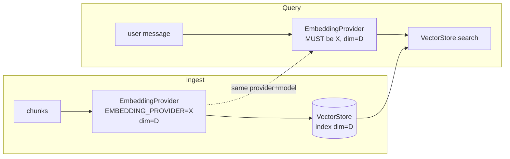

# 15. Embedding System

> **Scope.** The `EmbeddingProvider` port and its adapters (`openai`, `gemini`,
> `sentence_transformer`) that turn text into vectors for the RAG subsystem of the **Advanced AI
> Medical Intelligence Platform (AIMIP)**. Selection is ENV-driven via `EMBEDDING_PROVIDER`.
> Embeddings feed the `VectorStore` at ingest and the retriever at query time; the **same provider
> must be used for both** or vectors are incomparable.

**Related docs:** [RAG Architecture](13_RAG_Architecture.md) · [Vector Database](14_Vector_Database.md) ·
[AI Providers](16_AI_Providers.md) · [Database Design](17_Database_Design.md) ·
[Environment Configuration](31_Environment_Configuration.md)

---

## 1. Role in the architecture

Embeddings are the bridge between raw chunk text and the `VectorStore`. During ingestion each
cleaned chunk is embedded and stored; during a `POST /chat` query the user's message is embedded
and used for dense ANN search (see [13_RAG_Architecture.md](13_RAG_Architecture.md) §4–5).

Per the Hexagonal rule (CANON §2), business logic imports the `EmbeddingProvider` **ABC** from
`domain/ports/`; concrete adapters live in `infrastructure/providers/embeddings/` and are chosen by
`get_embedding_provider(settings)` reading `EMBEDDING_PROVIDER`. `RagService` never imports
`openai`, `google-generativeai`, or `sentence-transformers`.

---

## 2. The `EmbeddingProvider` port (ABC)

Exact surface from CANON §3: `embed(texts: list[str]) -> list[list[float]]` and `dimension: int`.

```python
# domain/ports/embedding_provider.py
from abc import ABC, abstractmethod

class EmbeddingProvider(ABC):
    """Maps text → fixed-length vectors. Adapters MUST NOT leak vendor SDK types."""

    @property
    @abstractmethod
    def dimension(self) -> int:
        """Vector length this provider/model emits (must match the VectorStore index)."""

    @abstractmethod
    def embed(self, texts: list[str]) -> list[list[float]]:
        """Embed a batch. len(result) == len(texts); each vector has length `dimension`.
        Order is preserved (result[i] corresponds to texts[i])."""
```

**Contract invariants** (enforced by the shared contract test, §8):

- `len(embed(texts)) == len(texts)` and order is preserved.
- Every returned vector has length exactly `dimension`.
- `embed([])` returns `[]` (no vendor call).
- `dimension` is stable for the life of the process and matches `EMBEDDING_MODEL`.
- Deterministic per input for a given model (same text → same vector, modulo provider drift).

---

## 3. Adapter selection (`EMBEDDING_PROVIDER`) & factory

```python
# infrastructure/providers/embeddings/factory.py
from app.domain.ports.embedding_provider import EmbeddingProvider
from .openai_embeddings import OpenAIEmbeddingProvider
from .gemini_embeddings import GeminiEmbeddingProvider
from .st_embeddings import SentenceTransformerEmbeddingProvider

def get_embedding_provider(settings) -> EmbeddingProvider:
    kind = settings.EMBEDDING_PROVIDER              # openai | gemini | sentence_transformer
    if kind == "openai":
        if not settings.OPENAI_API_KEY:
            raise ConfigError("EMBEDDING_PROVIDER=openai requires OPENAI_API_KEY")
        base = OpenAIEmbeddingProvider(api_key=settings.OPENAI_API_KEY,
                                       model=settings.EMBEDDING_MODEL)   # text-embedding-3-small
    elif kind == "gemini":
        if not settings.GEMINI_API_KEY:
            raise ConfigError("EMBEDDING_PROVIDER=gemini requires GEMINI_API_KEY")
        base = GeminiEmbeddingProvider(api_key=settings.GEMINI_API_KEY,
                                       model="text-embedding-004")
    elif kind == "sentence_transformer":
        base = SentenceTransformerEmbeddingProvider(model="all-MiniLM-L6-v2")   # local, no key
    else:
        raise ConfigError(f"Unknown EMBEDDING_PROVIDER={kind!r}")
    return CachingEmbeddingProvider(base, cache=get_cache_provider(settings))    # §6
```

Consistent with fail-fast config (CANON §5): `EMBEDDING_PROVIDER=openai` with an empty
`OPENAI_API_KEY` raises at startup. Canonical defaults: `EMBEDDING_PROVIDER=openai`,
`EMBEDDING_MODEL=text-embedding-3-small`.

---

## 4. Adapters, dimensions & index compatibility

Each provider/model emits a **fixed** vector dimension. The `VectorStore` index is created for one
dimension and cannot mix dimensions — so the embedding provider and the vector index are coupled.

| `EMBEDDING_PROVIDER`    | Default model             | Dimension | Key required        | Locality       |
|-------------------------|---------------------------|-----------|---------------------|----------------|
| `openai` (default)      | `text-embedding-3-small`  | 1536      | `OPENAI_API_KEY`    | Remote API     |
| `gemini`                | `text-embedding-004`      | 768       | `GEMINI_API_KEY`    | Remote API     |
| `sentence_transformer`  | `all-MiniLM-L6-v2`        | 384       | none                | Local (CPU)    |

**Index-compatibility guard.** `dimension` propagates into the `VectorStore` factory
(`settings.embedding_dimension`, see [14_Vector_Database.md](14_Vector_Database.md) §3). At startup,
`VectorStore.load()` compares the persisted index dimension against the active provider's
`dimension` and **fails fast** on mismatch — because a 384-dim query vector cannot be searched
against a 1536-dim index. Changing `EMBEDDING_PROVIDER` (or `EMBEDDING_MODEL`) after ingest
therefore requires a **full re-index** via `scripts/ingest_docs.py`. The provider and dimension are
also recorded per chunk in `embeddings_metadata` (`embedding_provider`, `dimension`, CANON §6) so a
mismatch is detectable in data, not just at load.

### 4.1 OpenAI adapter (remote, batched)

```python
# infrastructure/providers/embeddings/openai_embeddings.py
from openai import OpenAI

class OpenAIEmbeddingProvider(EmbeddingProvider):
    _DIMS = {"text-embedding-3-small": 1536, "text-embedding-3-large": 3072}

    def __init__(self, api_key: str, model: str):
        self._client = OpenAI(api_key=api_key)
        self._model = model
        self._dim = self._DIMS[model]

    @property
    def dimension(self) -> int:
        return self._dim

    def embed(self, texts: list[str]) -> list[list[float]]:
        if not texts:
            return []
        out: list[list[float]] = []
        for batch in _batched(texts, 128):          # provider batch cap, see §5
            resp = self._client.embeddings.create(model=self._model, input=batch)
            out.extend(d.embedding for d in resp.data)
        return out
```

### 4.2 sentence_transformer adapter (local, no key)

```python
# infrastructure/providers/embeddings/st_embeddings.py
from sentence_transformers import SentenceTransformer

class SentenceTransformerEmbeddingProvider(EmbeddingProvider):
    def __init__(self, model: str = "all-MiniLM-L6-v2"):
        self._model = SentenceTransformer(model)     # downloaded/cached locally, runs on CPU
        self._dim = self._model.get_sentence_embedding_dimension()   # 384

    @property
    def dimension(self) -> int:
        return self._dim

    def embed(self, texts: list[str]) -> list[list[float]]:
        if not texts:
            return []
        vecs = self._model.encode(texts, batch_size=64, normalize_embeddings=True,
                                  convert_to_numpy=True)
        return vecs.tolist()
```

`sentence_transformer` is the offline/CI-friendly default — no API key, no network — at the cost of
lower embedding quality than the hosted models. The `gemini` adapter mirrors this structure over
`google-generativeai`'s `embed_content` with `dimension = 768`.

---

## 5. Batching, cost & latency

- **Batching.** `embed` accepts a list and batches internally (128 for OpenAI, 64 for
  sentence-transformers). Ingestion embeds a whole document's chunks in a few large calls rather
  than one call per chunk — critical for throughput and (for hosted providers) cost.
- **Ingest vs. query volume.** Ingestion is bulk (hundreds–thousands of chunks per PDF, offline in
  a background job). Query is a **single** short text on the hot path, so query latency dominates
  user experience — hence query-embedding caching (§6).
- **Cost.** Hosted providers bill per token. `text-embedding-3-small` is the canonical default for
  its strong quality-per-cost. `sentence_transformer` has **zero** marginal cost but consumes local
  CPU. Choose per deployment budget.
- **Latency.** `sentence_transformer` avoids network round-trips (lowest tail latency for query,
  higher CPU); hosted providers add network latency but offload compute. Embedding calls never run
  on the event loop — bulk ingest runs in the background job (`TaskQueue`), and hot-path query
  embedding is cache-first.

---

## 6. Caching via `CacheProvider`

The `EmbeddingProvider` returned by the factory is wrapped in a `CachingEmbeddingProvider`
decorator that consults the `CacheProvider` port (`memory` or `redis`, ENV `CACHE_PROVIDER`) before
calling the underlying model. This is a pure decorator — the wrapped adapter is unaware of caching,
and the cache key namespaces by provider **and** model so vectors from different models never
collide.

```python
# infrastructure/providers/embeddings/caching.py
import hashlib

class CachingEmbeddingProvider(EmbeddingProvider):
    def __init__(self, inner: EmbeddingProvider, cache, ttl: int = 86_400):
        self._inner, self._cache, self._ttl = inner, cache, ttl

    @property
    def dimension(self) -> int:
        return self._inner.dimension

    def embed(self, texts: list[str]) -> list[list[float]]:
        results: list[list[float] | None] = [None] * len(texts)
        misses: list[tuple[int, str]] = []
        for i, t in enumerate(texts):
            cached = self._cache.get(self._key(t))
            if cached is not None:
                results[i] = cached
            else:
                misses.append((i, t))
        if misses:
            fresh = self._inner.embed([t for _, t in misses])   # single batched call for misses
            for (i, t), vec in zip(misses, fresh):
                results[i] = vec
                self._cache.set(self._key(t), vec, ttl=self._ttl)
        return results  # type: ignore[return-value]

    def _key(self, text: str) -> str:
        h = hashlib.sha256(text.encode()).hexdigest()
        return f"emb:{self._inner.__class__.__name__}:{self._inner.dimension}:{h}"
```

**Highest-value cache hit:** repeated/near-identical user queries on the hot path. Re-ingesting an
unchanged document also benefits. TTL defaults to 24h; caching is transparent to `RagService`.
See [16_AI_Providers.md](16_AI_Providers.md) for the `CacheProvider` port itself.

---

## 7. Consistency rules (same provider for ingest and query)

**The single most important rule of the embedding system:** the vectors used to *build* the index
and the vector used to *query* it must come from the **same provider and model**. Cosine similarity
between vectors from different embedding spaces is meaningless — a 1536-dim OpenAI vector and a
384-dim MiniLM vector are not even the same length, and even two same-length models produce
incomparable geometries.

Enforcement:

1. **Startup dimension guard** — `VectorStore.load()` rejects an index whose dimension differs from
   the active provider's `dimension` (fail fast).
2. **Per-chunk provenance** — `embeddings_metadata.embedding_provider` and `.dimension` record what
   built each vector; a mismatch is queryable and blocks silent corruption.
3. **Re-index on change** — changing `EMBEDDING_PROVIDER`/`EMBEDDING_MODEL` mandates a full re-embed
   of the corpus (`scripts/ingest_docs.py`). This is documented as an operational runbook step, not
   a hot-swap.



---

## 8. Shared contract test

All adapters pass one parametrized suite in `tests/contract/test_embedding_provider.py` (CANON §3):

```python
# tests/contract/test_embedding_provider.py
import pytest

@pytest.fixture(params=["openai", "gemini", "sentence_transformer"])
def provider(request):
    return make_embedding_provider(request.param)     # hosted providers use recorded/mock keys in CI

def test_length_and_order(provider):
    out = provider.embed(["alpha", "beta", "gamma"])
    assert len(out) == 3
    assert all(len(v) == provider.dimension for v in out)

def test_empty_input(provider):
    assert provider.embed([]) == []

def test_determinism(provider):
    a = provider.embed(["pneumonia consolidation"])[0]
    b = provider.embed(["pneumonia consolidation"])[0]
    assert a == pytest.approx(b, rel=1e-4)
```

---

## 9. Adding a new embedding adapter

1. Implement `infrastructure/providers/embeddings/<name>_embeddings.py` subclassing
   `EmbeddingProvider`; expose a fixed `dimension` and a batched, order-preserving `embed`.
2. Register a branch in `get_embedding_provider` keyed on the new `EMBEDDING_PROVIDER` value; fail
   fast on missing keys.
3. Document the new value, model, dimension, and any keys in
   [31_Environment_Configuration.md](31_Environment_Configuration.md) and `.env.example`.
4. Add `<name>` to the parametrized fixture in `tests/contract/test_embedding_provider.py`.
5. Note the dimension in the compatibility table (§4) and the runbook: switching to this provider
   requires a full re-index.

`RagService`, the retriever, and the routers need no changes — the port isolates them.

---

## 10. Cross-references

- Where embeddings are produced/consumed in the pipeline → **[13_RAG_Architecture.md](13_RAG_Architecture.md)**
- How dimension couples to the ANN index and persistence → **[14_Vector_Database.md](14_Vector_Database.md)**
- `CacheProvider` port, ports/factory pattern, contract-test convention → **[16_AI_Providers.md](16_AI_Providers.md)**
- `embeddings_metadata.embedding_provider` / `.dimension` fields → **[17_Database_Design.md](17_Database_Design.md)**
- `EMBEDDING_PROVIDER`, `EMBEDDING_MODEL`, `CACHE_PROVIDER` → **[31_Environment_Configuration.md](31_Environment_Configuration.md)**
