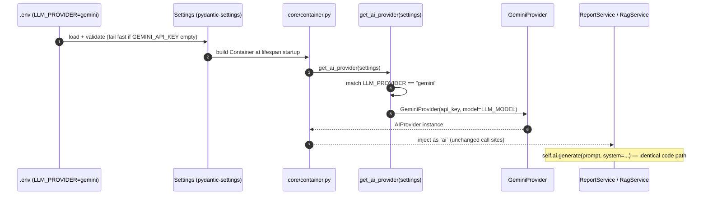

# 16. AI Providers — Ports, Adapters & Factories

> **Scope.** The provider/factory pattern that underpins the entire **Advanced AI Medical
> Intelligence Platform (AIMIP)**. This document specifies **all eight ports** of CANON §3
> (`AIProvider`, `EmbeddingProvider`, `VectorStore`, `Classifier`, `AuthProvider`,
> `StorageProvider`, `CacheProvider`, `TaskQueue`): why the abstraction exists, the ABC contracts,
> the factory functions, ENV-driven selection, the shared contract-test suite every adapter must
> pass, and a worked example proving that switching `LLM_PROVIDER=openai→gemini` changes only
> `.env`.

**Related docs:** [RAG Architecture](13_RAG_Architecture.md) · [Vector Database](14_Vector_Database.md) ·
[Embedding System](15_Embedding_System.md) · [Database Design](17_Database_Design.md) ·
[API Design](18_API_Design.md) · [Authorization / RBAC](20_Authorization_RBAC.md) ·
[Environment Configuration](31_Environment_Configuration.md)

---

## 1. Why the abstraction exists

AIMIP follows Clean / Hexagonal (Ports & Adapters) architecture with dependency direction
`domain ← application ← infrastructure ← interface` (CANON §2). The **golden rule**:

> **Business logic (application/domain) NEVER calls a vendor SDK directly.** It depends only on
> **ports** — abstract base classes (ABCs) in `domain/ports/`. Concrete **adapters** in
> `infrastructure/` implement those ports and are selected at startup by **factories** that read
> ENV.

This buys:

- **Substitutability (Strategy/Provider pattern).** Swap OpenAI for Gemini, faiss for pinecone,
  in-memory cache for Redis — by editing `.env`, with **zero** changes to services, routers, or
  tests. Proven in §6.
- **Testability.** Services are tested against `mock` / in-memory adapters — no network, no GPU, no
  MongoDB — keeping the ≥80% backend coverage target (CANON §11) fast and deterministic.
- **Dependency Inversion (the "D" in SOLID).** High-level policy (`RagService`,
  `PredictionService`) depends on abstractions; low-level detail (SDKs) depends on those same
  abstractions. Vendors are plugins, not foundations.
- **Fail-fast configuration (12-factor).** Factories validate required keys at startup
  (e.g. `LLM_PROVIDER=openai` with empty `OPENAI_API_KEY` raises immediately — CANON §5).
- **Auditable swaps.** Because provider choice is config, it is visible in `.env`, versioned, and
  covered by a swap test — no hidden vendor coupling anywhere in business logic.

```mermaid
flowchart TB
  subgraph interface["interface (routers, DI)"]
    R[api/v1 routers] --> DEP[dependencies.py]
  end
  subgraph application["application (services)"]
    RS[RagService / PredictionService / AuthService ...]
  end
  subgraph domain["domain/ports (ABCs)"]
    P1[AIProvider]:::port
    P2[EmbeddingProvider]:::port
    P3[VectorStore]:::port
    P4[Classifier]:::port
    P5[AuthProvider]:::port
    P6[StorageProvider]:::port
    P7[CacheProvider]:::port
    P8[TaskQueue]:::port
  end
  subgraph infrastructure["infrastructure (adapters + factories)"]
    F[get_*_provider(settings)] --> A1[openai/gemini/mock]
    F --> A2[faiss/chroma/pinecone]
    F --> A3[jwt / mongodb / redis / celery ...]
  end
  DEP --> RS
  RS --> P1 & P2 & P3 & P7 & P8
  F -. builds & injects .-> RS
  A1 -. implements .-> P1
  A2 -. implements .-> P3
  classDef port fill:#0EA5E9,stroke:#0369a1,color:#fff;
```

Composition happens once, at startup, in `core/container.py` (the composition root); FastAPI's
`Depends` in `interface/dependencies.py` hands the already-built ports to routers.

---

## 2. The eight ports at a glance (CANON §3)

| Port (ABC)          | ENV selector         | Adapters                                      | Key methods |
|---------------------|----------------------|-----------------------------------------------|-------------|
| `AIProvider`        | `LLM_PROVIDER`       | `openai` · `gemini` · `mock`                  | `generate(prompt, system=None, **opts) -> str`, `stream(...)` |
| `EmbeddingProvider` | `EMBEDDING_PROVIDER` | `openai` · `gemini` · `sentence_transformer`  | `embed(texts) -> list[list[float]]`, `dimension: int` |
| `VectorStore`       | `VECTOR_DB`          | `faiss` · `chroma` · `pinecone` (optional)    | `add(ids, vectors, metadatas)`, `search(vector, k, filter=None)`, `persist()`, `load()` |
| `Classifier`        | `MODEL_ARCH`         | `densenet121` · `efficientnet_b0`             | `build()`, `predict(tensor) -> logits`, `target_layer` |
| `AuthProvider`      | `AUTH_PROVIDER`      | `jwt` (future: oauth2, keycloak)              | `create_access`, `create_refresh`, `verify`, `rotate` |
| `StorageProvider`   | `STORAGE_PROVIDER`   | `mongodb` (future: postgres, s3)              | repository access + `save_blob` / `get_blob` / `delete_blob` |
| `CacheProvider`     | `CACHE_PROVIDER`     | `memory` · `redis`                            | `get`, `set(ttl)`, `delete` |
| `TaskQueue`         | `TASK_QUEUE`         | `inprocess` · `celery`                        | `enqueue(job_name, payload)`, `schedule(...)` |

Each port has a factory `get_<x>_provider(settings)` in
`infrastructure/providers/<x>/factory.py`, and each ships a shared contract test in
`tests/contract/` (§5). `VectorStore` and `EmbeddingProvider` are documented in depth in
[14_Vector_Database.md](14_Vector_Database.md) and [15_Embedding_System.md](15_Embedding_System.md);
this doc gives the full pattern and covers the remaining ports.

---

## 3. ABC contracts (all eight ports)

```python
# domain/ports/ai_provider.py
from abc import ABC, abstractmethod
from typing import Iterator

class AIProvider(ABC):
    @abstractmethod
    def generate(self, prompt: str, system: str | None = None, **opts) -> str:
        """Single-shot completion. opts may carry temperature, max_tokens, etc."""

    @abstractmethod
    def stream(self, prompt: str, system: str | None = None, **opts) -> Iterator[str]:
        """Yield answer tokens/chunks incrementally."""
```

```python
# domain/ports/embedding_provider.py   (full detail in doc 15)
class EmbeddingProvider(ABC):
    @property
    @abstractmethod
    def dimension(self) -> int: ...
    @abstractmethod
    def embed(self, texts: list[str]) -> list[list[float]]: ...
```

```python
# domain/ports/vector_store.py         (full detail in doc 14)
class VectorStore(ABC):
    @abstractmethod
    def add(self, ids: list[str], vectors: list[list[float]], metadatas: list[dict]) -> None: ...
    @abstractmethod
    def search(self, vector: list[float], k: int, filter: dict | None = None) -> list["VectorHit"]: ...
    @abstractmethod
    def persist(self) -> None: ...
    @abstractmethod
    def load(self) -> None: ...
```

```python
# domain/ports/classifier.py
import torch

class Classifier(ABC):
    @abstractmethod
    def build(self) -> "Classifier":
        """Construct the torchvision backbone with a 2-class head [NORMAL, PNEUMONIA]."""
    @abstractmethod
    def predict(self, tensor: torch.Tensor) -> torch.Tensor:
        """Return raw logits for a preprocessed 224x224 batch."""
    @property
    @abstractmethod
    def target_layer(self) -> torch.nn.Module:
        """Conv layer used by Grad-CAM forward/backward hooks."""
```

```python
# domain/ports/auth_provider.py
class AuthProvider(ABC):
    @abstractmethod
    def create_access(self, subject: str, claims: dict) -> str: ...
    @abstractmethod
    def create_refresh(self, subject: str, jti: str) -> str: ...
    @abstractmethod
    def verify(self, token: str) -> dict:
        """Return validated claims or raise AuthError."""
    @abstractmethod
    def rotate(self, refresh_token: str) -> tuple[str, str]:
        """Validate a refresh token and return a new (access, refresh) pair."""
```

```python
# domain/ports/storage_provider.py
class StorageProvider(ABC):
    @abstractmethod
    def repository(self, name: str) -> "Repository":
        """Access a collection/table repository (users, predictions, documents, ...)."""
    @abstractmethod
    async def save_blob(self, path: str, key: str, data) -> str: ...
    @abstractmethod
    async def get_blob(self, path: str, key: str): ...
    @abstractmethod
    async def delete_blob(self, path: str, key: str) -> None: ...
```

```python
# domain/ports/cache_provider.py
class CacheProvider(ABC):
    @abstractmethod
    def get(self, key: str): ...
    @abstractmethod
    def set(self, key: str, value, ttl: int) -> None: ...
    @abstractmethod
    def delete(self, key: str) -> None: ...
```

```python
# domain/ports/task_queue.py
class TaskQueue(ABC):
    @abstractmethod
    def enqueue(self, job_name: str, payload: dict) -> str:
        """Dispatch a named background job; return a job id."""
    @abstractmethod
    def schedule(self, job_name: str, payload: dict, *, delay_seconds: int) -> str:
        """Dispatch a job to run after a delay."""
```

Ports return **plain types / domain objects** (`str`, `list[float]`, `VectorHit`, claims dict) —
never vendor SDK objects — so no adapter type leaks upward.

---

## 4. Factory functions & ENV-driven selection

Every port is built by `get_<x>_provider(settings)` in
`infrastructure/providers/<x>/factory.py`. The pattern is uniform: read the ENV selector, validate
required keys (fail fast), construct the adapter. Two representative factories:

```python
# infrastructure/providers/llm/factory.py
from app.domain.ports.ai_provider import AIProvider
from .openai_provider import OpenAIProvider
from .gemini_provider import GeminiProvider
from .mock_provider import MockAIProvider

def get_ai_provider(settings) -> AIProvider:
    kind = settings.LLM_PROVIDER                    # openai | gemini | mock
    if kind == "openai":
        if not settings.OPENAI_API_KEY:
            raise ConfigError("LLM_PROVIDER=openai requires OPENAI_API_KEY")
        return OpenAIProvider(api_key=settings.OPENAI_API_KEY, model=settings.LLM_MODEL)
    if kind == "gemini":
        if not settings.GEMINI_API_KEY:
            raise ConfigError("LLM_PROVIDER=gemini requires GEMINI_API_KEY")
        return GeminiProvider(api_key=settings.GEMINI_API_KEY, model=settings.LLM_MODEL)
    if kind == "mock":
        return MockAIProvider()                     # deterministic; used in tests/offline
    raise ConfigError(f"Unknown LLM_PROVIDER={kind!r}")
```

```python
# infrastructure/providers/cache/factory.py
from app.domain.ports.cache_provider import CacheProvider
from .memory_cache import InMemoryCache
from .redis_cache import RedisCache

def get_cache_provider(settings) -> CacheProvider:
    kind = settings.CACHE_PROVIDER                  # memory | redis
    if kind == "memory":
        return InMemoryCache()
    if kind == "redis":
        if not settings.REDIS_URL:
            raise ConfigError("CACHE_PROVIDER=redis requires REDIS_URL")
        return RedisCache(url=settings.REDIS_URL)
    raise ConfigError(f"Unknown CACHE_PROVIDER={kind!r}")
```

The canonical selectors and their defaults (CANON §5):

```
LLM_PROVIDER=openai            # openai|gemini|mock
EMBEDDING_PROVIDER=openai      # openai|gemini|sentence_transformer
VECTOR_DB=faiss                # faiss|chroma|pinecone
MODEL_ARCH=densenet121         # densenet121|efficientnet_b0
AUTH_PROVIDER=jwt
STORAGE_PROVIDER=mongodb
CACHE_PROVIDER=memory          # memory|redis
TASK_QUEUE=inprocess           # inprocess|celery
```

All factories are invoked once in the composition root and the results injected via FastAPI
`Depends`:

```python
# core/container.py  (composition root — built once at lifespan startup)
class Container:
    def __init__(self, settings):
        self.settings   = settings
        self.ai         = get_ai_provider(settings)
        self.embedder   = get_embedding_provider(settings)
        self.vectors    = get_vector_store_provider(settings)
        self.classifier = get_classifier_provider(settings)
        self.auth       = get_auth_provider(settings)
        self.storage    = get_storage_provider(settings)
        self.cache      = get_cache_provider(settings)
        self.tasks      = get_task_queue_provider(settings)

# interface/dependencies.py
def get_rag_service(container=Depends(get_container)) -> RagService:
    return RagService(ai=container.ai, embedder=container.embedder,
                      vector_store=container.vectors, cache=container.cache,
                      task_queue=container.tasks, settings=container.settings)
```

---

## 5. The shared contract-test suite

CANON §3: *"Every port ships a shared contract test in `tests/contract/` that all adapters must
pass. The provider swap (`.env` change only) is itself an automated test."*

A **contract test** encodes the port's behavioural guarantees **once** and runs them against every
adapter via a parametrized fixture. This is how substitutability is *guaranteed* rather than
*hoped for*: any adapter that passes is a drop-in replacement for any other.

```python
# tests/contract/test_ai_provider.py
import pytest

@pytest.fixture(params=["mock", "openai", "gemini"])
def ai(request):
    # hosted providers use recorded HTTP cassettes / stubbed keys in CI; mock always runs
    return make_ai_provider(request.param)

def test_generate_returns_nonempty_str(ai):
    out = ai.generate("Summarize: pneumonia is a lung infection.", system="Be concise.")
    assert isinstance(out, str) and out.strip()

def test_stream_yields_chunks(ai):
    chunks = list(ai.stream("List two symptoms of pneumonia."))
    assert chunks and "".join(chunks).strip()

def test_system_prompt_accepted(ai):
    assert ai.generate("hi", system="You only answer in one word.")
```

```python
# tests/contract/test_cache_provider.py
@pytest.fixture(params=["memory", "redis"])
def cache(request):
    return make_cache_provider(request.param)     # redis via testcontainer/fakeredis

def test_set_get_delete(cache):
    cache.set("k", {"v": 1}, ttl=60)
    assert cache.get("k") == {"v": 1}
    cache.delete("k")
    assert cache.get("k") is None
```

Analogous suites exist for every port: `test_embedding_provider.py`
([doc 15](15_Embedding_System.md) §8), `test_vector_store.py`
([doc 14](14_Vector_Database.md) §8), `test_classifier.py`, `test_auth_provider.py`,
`test_storage_provider.py`, `test_task_queue.py`. **Adding an adapter = adding its name to the
existing fixture params** — no new assertions, because the suite *is* the definition of correctness.

### 5.1 The swap test

The `.env`-only swap is itself asserted, so a regression that couples business logic to a vendor is
caught in CI:

```python
# tests/contract/test_provider_swap.py
import pytest

@pytest.mark.parametrize("provider", ["openai", "gemini", "mock"])
def test_llm_swap_changes_only_env(provider, monkeypatch):
    monkeypatch.setenv("LLM_PROVIDER", provider)
    monkeypatch.setenv("OPENAI_API_KEY", "test"); monkeypatch.setenv("GEMINI_API_KEY", "test")
    settings = Settings()                          # re-read env
    ai = get_ai_provider(settings)                 # same factory, same call site
    # Same service code path regardless of provider — no branching in business logic:
    svc = ReportService(ai=ai, settings=settings)
    report = svc.build_report(sample_prediction())
    assert report.sections["disclaimer"]           # identical service behaviour across providers
```

---

## 6. Worked example — `LLM_PROVIDER=openai → gemini`

**Goal:** switch the LLM that writes medical reports and answers RAG queries, changing **only**
`.env`. No service, router, schema, or test edit.

### 6.1 The two adapters (behind one ABC)

```python
# infrastructure/providers/llm/openai_provider.py
from openai import OpenAI

class OpenAIProvider(AIProvider):
    def __init__(self, api_key: str, model: str):
        self._client, self._model = OpenAI(api_key=api_key), model   # model = LLM_MODEL

    def generate(self, prompt: str, system: str | None = None, **opts) -> str:
        msgs = ([{"role": "system", "content": system}] if system else []) + \
               [{"role": "user", "content": prompt}]
        resp = self._client.chat.completions.create(
            model=self._model, messages=msgs,
            temperature=opts.get("temperature", 0.2))
        return resp.choices[0].message.content      # -> plain str (no SDK type leaks out)

    def stream(self, prompt: str, system: str | None = None, **opts):
        msgs = ([{"role": "system", "content": system}] if system else []) + \
               [{"role": "user", "content": prompt}]
        for ev in self._client.chat.completions.create(
                model=self._model, messages=msgs, stream=True,
                temperature=opts.get("temperature", 0.2)):
            delta = ev.choices[0].delta.content
            if delta:
                yield delta
```

```python
# infrastructure/providers/llm/gemini_provider.py
import google.generativeai as genai

class GeminiProvider(AIProvider):
    def __init__(self, api_key: str, model: str):
        genai.configure(api_key=api_key)
        self._model_name = model

    def generate(self, prompt: str, system: str | None = None, **opts) -> str:
        model = genai.GenerativeModel(self._model_name, system_instruction=system)
        resp = model.generate_content(
            prompt, generation_config={"temperature": opts.get("temperature", 0.2)})
        return resp.text                            # -> plain str, same contract as OpenAI

    def stream(self, prompt: str, system: str | None = None, **opts):
        model = genai.GenerativeModel(self._model_name, system_instruction=system)
        for ev in model.generate_content(
                prompt, stream=True,
                generation_config={"temperature": opts.get("temperature", 0.2)}):
            if ev.text:
                yield ev.text
```

Both return `str` from `generate` and yield `str` from `stream` — **the port contract**. Business
logic (`ReportService`, `RagService`) calls `self.ai.generate(...)` and cannot tell which vendor
answered.

### 6.2 The only change: `.env`

```diff
# .env  (before → after)
- LLM_PROVIDER=openai
- LLM_MODEL=gpt-4o-mini
+ LLM_PROVIDER=gemini
+ LLM_MODEL=gemini-1.5-flash
  GEMINI_API_KEY=<set>            # already present; now required
```

### 6.3 What runs at startup



**Files changed to switch vendors: exactly one — `.env`.** No Python edited. The swap is protected
by `test_provider_swap.py` (§5.1), so this guarantee is enforced, not merely claimed. The same
property holds for `EMBEDDING_PROVIDER`, `VECTOR_DB`, `CACHE_PROVIDER`, `TASK_QUEUE`, `MODEL_ARCH`,
`AUTH_PROVIDER`, and `STORAGE_PROVIDER`.

---

## 7. Remaining ports — adapter notes

- **`Classifier` (`MODEL_ARCH`)** — `densenet121` (default) / `efficientnet_b0`, torchvision,
  ImageNet-pretrained, 2-class head `[NORMAL, PNEUMONIA]`. `target_layer` feeds Grad-CAM hooks; the
  ML pipeline (training, inference-in-threadpool, OOD guard) is detailed in the AI/ML docs (CANON §9).
- **`AuthProvider` (`AUTH_PROVIDER=jwt`)** — `python-jose` HS256 access/refresh tokens with rotation
  and reuse-detection; `create_access`/`create_refresh`/`verify`/`rotate`. Refresh tokens are
  tracked in the `refresh_tokens` collection (CANON §6). Future: `oauth2`, `keycloak`. See
  [20_Authorization_RBAC.md](20_Authorization_RBAC.md).
- **`StorageProvider` (`STORAGE_PROVIDER=mongodb`)** — Motor async client exposing repositories
  (users, predictions, reports, documents, embeddings_metadata, chat_*, audit_logs) plus blob
  helpers over local paths (`UPLOAD_PATH`, `GRADCAM_PATH`, `PDF_PATH`). Future: `postgres`, `s3`.
  See [17_Database_Design.md](17_Database_Design.md).
- **`CacheProvider` (`CACHE_PROVIDER`)** — `memory` (dict + TTL, dev/CI/single-node) or `redis`
  (shared, multi-instance). Backs embedding/answer caching ([15_Embedding_System.md](15_Embedding_System.md) §6),
  rate limiting, and login-lockout counters.
- **`TaskQueue` (`TASK_QUEUE`)** — `inprocess` (FastAPI background task, dev) or `celery` (workers,
  Redis broker, prod). Drives async PDF ingestion, training, and report regeneration
  (`workers/` tasks). See [13_RAG_Architecture.md](13_RAG_Architecture.md) §4.5.

---

## 8. Adding a new adapter (any port) — checklist

1. **Implement the ABC** in `infrastructure/providers/<port>/<name>_*.py`. Return domain/plain
   types only — never leak the vendor SDK object upward.
2. **Register in the factory** `get_<x>_provider`: add a branch on the new ENV selector value and
   **fail fast** on missing keys.
3. **Extend ENV & config** — new selector value + any keys in
   [31_Environment_Configuration.md](31_Environment_Configuration.md), `.env.example`, and startup
   validation in `core/config.py`.
4. **Add to the contract fixture** in `tests/contract/test_<port>.py` (params list). The existing
   assertions define correctness — do not weaken them for the new adapter.
5. **Keep the swap test green** — the adapter must be interchangeable via `.env` alone.

Business logic, routers, and DI wiring never change — that is the entire payoff of the port/adapter
pattern.

---

## 9. Cross-references

- `AIProvider` grounding usage in RAG / `TaskQueue` ingest jobs → **[13_RAG_Architecture.md](13_RAG_Architecture.md)**
- `VectorStore` port in depth → **[14_Vector_Database.md](14_Vector_Database.md)**
- `EmbeddingProvider` port + `CacheProvider` for embeddings → **[15_Embedding_System.md](15_Embedding_System.md)**
- `StorageProvider` repositories & collections → **[17_Database_Design.md](17_Database_Design.md)**
- Endpoints served by these services → **[18_API_Design.md](18_API_Design.md)**
- `AuthProvider` + role enforcement → **[20_Authorization_RBAC.md](20_Authorization_RBAC.md)**
- Every ENV selector and key → **[31_Environment_Configuration.md](31_Environment_Configuration.md)**
