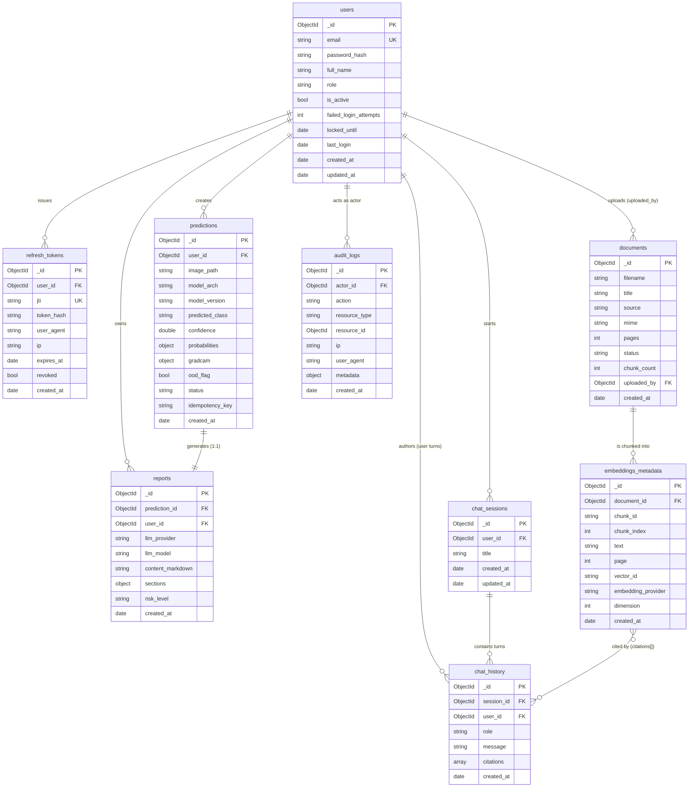

# 17 — Database Design

**Advanced AI Medical Intelligence Platform (AIMIP)**
Persistence layer: **MongoDB** (MongoDB Atlas in production, local `mongod` in dev) accessed
asynchronously via **Motor**. Selected through `STORAGE_PROVIDER=mongodb` and reached through
the `StorageProvider` port and per-collection `*Repository` ports (Repository pattern), so no
business-logic code ever talks to Motor directly.

Related docs:
[SRS](02_Software_Requirements_Specification.md) ·
[API Design](18_API_Design.md) ·
[Authentication](19_Authentication.md) ·
[Authorization / RBAC](20_Authorization_RBAC.md) ·
[Environment Configuration](31_Environment_Configuration.md)

> **Clinical / PHI disclaimer.** AIMIP is a clinical **decision-support** platform, **not** a
> medical device and **not** FDA/CE cleared. Stored outputs are informational, never a
> diagnosis; a licensed clinician must review every result. Chest X-ray uploads may constitute
> **Protected Health Information (PHI)** and must not be uploaded without consent. PHI-handling
> rules for every collection are in [§7](#7-phi-handling).

---

## 1. Design principles

| Principle | Application in AIMIP |
|-----------|----------------------|
| Single database, one logical schema | Database name from `DB_NAME` (default `aimip`); one Mongo client built from `MONGODB_URI`. |
| Repository pattern | Each collection has a repository ABC in `domain/ports/` and a Motor adapter in `infrastructure/db/repositories/`. |
| Documents mirror domain entities | `users → User`, `predictions → Prediction`, `reports → Report`, `documents → Document`, `chat_history → ChatMessage`, etc. |
| ObjectId identity | `_id` is a native BSON `ObjectId`; foreign keys (`user_id`, `prediction_id`, …) store the referenced `ObjectId`. |
| UTC everywhere | All `*_at` fields are BSON `date` in UTC. Application serializes to RFC 3339 strings at the API boundary. |
| Explicit indexes | Indexes are created idempotently at startup by `infrastructure/db/indexes.py` (`create_indexes()` in the app lifespan). |
| Append-only audit | `audit_logs` is never updated or deleted by application code (see [Authorization / RBAC](20_Authorization_RBAC.md)). |
| Fail-safe validation | Pydantic v2 validates at the API/service layer; MongoDB JSON-Schema validators (`$jsonSchema`) are the second line of defense ([§6](#6-validation-rules)). |

Nine collections are defined by canon §6, grouped by bounded context:

- **Identity & access:** `users`, `refresh_tokens`
- **Prediction pipeline:** `predictions`, `reports`
- **RAG knowledge base:** `documents`, `embeddings_metadata`
- **Conversational assistant:** `chat_sessions`, `chat_history`
- **Governance:** `audit_logs`

---

## 2. Collection relationship overview (ERD)



**Referential integrity.** MongoDB does not enforce foreign keys; integrity is maintained by
the service layer. Deletes are handled as documented per collection ([§5 lifecycle](#5-data-lifecycle--retention)):
`predictions` and their 1:1 `reports` are deleted together; deleting a `documents` row cascades
to its `embeddings_metadata` rows and the corresponding `VectorStore` vectors.

---

## 3. Collection field specifications

Legend for **Constraints**: `PK` primary key, `FK` foreign key, `UK` unique, `REQ` required,
`IDX` indexed, `ENUM` constrained value set, `TTL` drives a time-to-live index.

### 3.1 `users`

Identity, credentials and account-state for every principal. One document per registered person.

| Field | Type | Constraints | Description |
|-------|------|-------------|-------------|
| `_id` | ObjectId | PK | Server-generated identity. |
| `email` | string | REQ, UK, IDX | Login identifier; stored lowercased and trimmed; RFC-5322 shape. |
| `password_hash` | string | REQ | bcrypt hash produced by passlib (`passlib[bcrypt]`). Never the plaintext. See [Authentication](19_Authentication.md). |
| `full_name` | string | REQ | Display name, 1–120 chars. |
| `role` | string | REQ, ENUM(`admin`,`doctor`,`user`) | RBAC role; default `user` on registration. See [RBAC](20_Authorization_RBAC.md). |
| `is_active` | bool | REQ, default `true` | Soft on/off switch; inactive users cannot authenticate. |
| `failed_login_attempts` | int | REQ, default `0`, `>= 0` | Consecutive failed logins; reset on success. Drives lockout (`MAX_LOGIN_ATTEMPTS`). |
| `locked_until` | date \| null | nullable | UTC instant until which login is blocked; set when attempts reach `MAX_LOGIN_ATTEMPTS` (`+ LOCKOUT_MINUTES`). |
| `last_login` | date \| null | nullable | Timestamp of the most recent successful login. |
| `created_at` | date | REQ | Row creation (UTC). |
| `updated_at` | date | REQ | Last mutation (UTC); touched on every update. |

### 3.2 `refresh_tokens`

One document per **issued** refresh token, enabling rotation, revocation and audit. See
[Authentication §refresh rotation](19_Authentication.md#5-refresh-token-rotation--revocation).

| Field | Type | Constraints | Description |
|-------|------|-------------|-------------|
| `_id` | ObjectId | PK | Identity. |
| `user_id` | ObjectId | REQ, FK→`users._id`, IDX | Owner of the token. |
| `jti` | string | REQ, UK, IDX | JWT ID claim of the refresh token; the revocation key. |
| `token_hash` | string | REQ | SHA-256 hash of the raw refresh token (never store the raw token). |
| `user_agent` | string \| null | nullable | Client UA captured at issue time (device/session hint). |
| `ip` | string \| null | nullable | Client IP captured at issue time. |
| `expires_at` | date | REQ, TTL | Absolute expiry (`now + REFRESH_TOKEN_EXPIRE_DAYS`). MongoDB TTL index purges the row at/after this instant. |
| `revoked` | bool | REQ, default `false` | Set `true` on rotation or logout; a revoked-but-not-yet-purged token is rejected. |
| `created_at` | date | REQ | Issue time (UTC). |

### 3.3 `predictions`

One document per inference request (a chest-X-ray classification run).

| Field | Type | Constraints | Description |
|-------|------|-------------|-------------|
| `_id` | ObjectId | PK | Identity; used as the `{id}` in `GET /predict/{id}`. |
| `user_id` | ObjectId | REQ, FK→`users._id`, IDX | Requesting user; ownership key for RBAC. |
| `image_path` | string | REQ | Server path of the stored upload under `UPLOAD_PATH`. |
| `model_arch` | string | REQ, ENUM(`densenet121`,`efficientnet_b0`) | Architecture used (`MODEL_ARCH`). |
| `model_version` | string | REQ | Weights/version tag of the classifier that produced the result. |
| `predicted_class` | string \| null | ENUM(`NORMAL`,`PNEUMONIA`), nullable while `pending` | Arg-max class; `null` until completed. |
| `confidence` | double | `0.0–1.0`, nullable while `pending` | Softmax probability of `predicted_class`. |
| `probabilities` | object | REQ | Full distribution: `{ "NORMAL": double, "PNEUMONIA": double }`, each `0.0–1.0`, summing ≈ 1. |
| `gradcam` | object \| null | nullable | Explainable-AI artefact paths: `{ original, heatmap, overlay }` PNGs under `GRADCAM_PATH`, served as URLs. |
| `ood_flag` | bool | REQ, default `false` | Out-of-distribution guard result; `true` when the upload is not a plausible chest X-ray. |
| `status` | string | REQ, ENUM(`pending`,`completed`,`failed`) | Lifecycle state of the inference. |
| `idempotency_key` | string \| null | nullable, unique-per-user IDX | Client `Idempotency-Key` header value; dedupes retried `POST /predict`. |
| `created_at` | date | REQ, IDX | Creation time (UTC); primary sort/range key for history and analytics. |

### 3.4 `reports`

LLM-generated medical narrative, **1:1** with a prediction. Assembled by the `ReportService`
Builder and produced through the `AIProvider` port.

| Field | Type | Constraints | Description |
|-------|------|-------------|-------------|
| `_id` | ObjectId | PK | Identity. |
| `prediction_id` | ObjectId | REQ, FK→`predictions._id`, UK, IDX | The prediction this report explains (one report per prediction; regeneration replaces content in place). |
| `user_id` | ObjectId | REQ, FK→`users._id`, IDX | Owner (denormalized from the prediction for ownership checks). |
| `llm_provider` | string | REQ, ENUM(`openai`,`gemini`,`mock`) | Provider that generated the report (`LLM_PROVIDER`). |
| `llm_model` | string | REQ | Model id used (`LLM_MODEL`, e.g. `gpt-4o-mini`). |
| `content_markdown` | string | REQ | Full report as Markdown. |
| `sections` | object | REQ | Structured sections (see below). |
| `sections.summary` | string | REQ | One-paragraph overview. |
| `sections.findings` | string | REQ | Observed radiological findings. |
| `sections.possible_condition` | string | REQ | Candidate condition(s), informational. |
| `sections.medical_explanation` | string | REQ | Plain-language explanation. |
| `sections.recommendations` | string | REQ | Suggested next steps (clinician-reviewed). |
| `sections.risk_level` | string | REQ, ENUM(`low`,`moderate`,`high`) | Risk classification (mirrors top-level `risk_level`). |
| `sections.disclaimer` | string | REQ | Mandatory non-diagnosis disclaimer. |
| `risk_level` | string | REQ, ENUM(`low`,`moderate`,`high`), IDX | Top-level risk for analytics/filtering. |
| `created_at` | date | REQ | Generation time (UTC); updated on regenerate. |

### 3.5 `documents`

One document per uploaded knowledge-base PDF that feeds RAG.

| Field | Type | Constraints | Description |
|-------|------|-------------|-------------|
| `_id` | ObjectId | PK | Identity; `{id}` in `DELETE /documents/{id}`. |
| `filename` | string | REQ | Original file name of the upload. |
| `title` | string | REQ | Human-readable title (defaults to filename stem). |
| `source` | string | REQ, ENUM(`WHO`,`NIH`,`research`,`other`) | Provenance/trust label. |
| `mime` | string | REQ | MIME type (`application/pdf`). |
| `pages` | int | `>= 0` | Page count extracted by PyMuPDF. |
| `status` | string | REQ, ENUM(`uploaded`,`processing`,`indexed`,`failed`) | Ingestion lifecycle state. |
| `chunk_count` | int | REQ, default `0`, `>= 0` | Number of chunks produced/indexed. |
| `uploaded_by` | ObjectId | REQ, FK→`users._id`, IDX | Admin who uploaded (only admins may upload — see [RBAC](20_Authorization_RBAC.md)). |
| `created_at` | date | REQ, IDX | Upload time (UTC). |

### 3.6 `embeddings_metadata`

One document per **chunk**; the searchable text lives here while the numeric vector lives in the
`VectorStore` (`VECTOR_DB=faiss|chroma|pinecone`). `vector_id` links the two.

| Field | Type | Constraints | Description |
|-------|------|-------------|-------------|
| `_id` | ObjectId | PK | Identity. |
| `document_id` | ObjectId | REQ, FK→`documents._id`, IDX | Parent document. |
| `chunk_id` | string | REQ, IDX | Stable chunk identifier (e.g. `{document_id}:{chunk_index}`); referenced by `chat_history.citations`. |
| `chunk_index` | int | REQ, `>= 0` | Zero-based ordinal within the document. |
| `text` | string | REQ | Chunk text (cleaned), sized by `RAG_CHUNK_SIZE`/`RAG_CHUNK_OVERLAP`. |
| `page` | int | `>= 0` | Source page number. |
| `vector_id` | string | REQ | Id of the vector in the `VectorStore`. |
| `embedding_provider` | string | REQ, ENUM(`openai`,`gemini`,`sentence_transformer`) | Provider used (`EMBEDDING_PROVIDER`). |
| `dimension` | int | REQ, `> 0` | Embedding dimensionality (`EmbeddingProvider.dimension`). |
| `created_at` | date | REQ | Indexing time (UTC). |

### 3.7 `chat_sessions`

Conversation container for the Knowledge Assistant.

| Field | Type | Constraints | Description |
|-------|------|-------------|-------------|
| `_id` | ObjectId | PK | Identity; `session_id` in `POST /chat` and `GET /chat/sessions/{id}`. |
| `user_id` | ObjectId | REQ, FK→`users._id`, IDX | Owner. |
| `title` | string | REQ | Session title (auto-derived from the first message, editable). |
| `created_at` | date | REQ | Creation time (UTC). |
| `updated_at` | date | REQ, IDX | Last-activity time (UTC); sort key for the sessions list. |

### 3.8 `chat_history`

One document per conversational turn (user prompt or assistant answer).

| Field | Type | Constraints | Description |
|-------|------|-------------|-------------|
| `_id` | ObjectId | PK | Identity. |
| `session_id` | ObjectId | REQ, FK→`chat_sessions._id`, IDX | Owning session. |
| `user_id` | ObjectId | REQ, FK→`users._id`, IDX | Owner (denormalized for ownership checks). |
| `role` | string | REQ, ENUM(`user`,`assistant`) | Turn author. |
| `message` | string | REQ | Turn text. |
| `citations` | array<object> | default `[]` | For assistant turns: `[{ document_id, chunk_id, score }]`, grounding the answer. Empty for user turns and for refusals. |
| `created_at` | date | REQ, IDX | Turn time (UTC); chronological sort key. |

**`citations[]` element:** `document_id` (ObjectId→`documents._id`), `chunk_id`
(string→`embeddings_metadata.chunk_id`), `score` (double, retrieval/rerank score; only turns
with a top score ≥ `RAG_MIN_SCORE` are answered — below it the assistant refuses with
"insufficient context").

### 3.9 `audit_logs`

Append-only governance trail. Every privileged or PHI-touching action writes one row.

| Field | Type | Constraints | Description |
|-------|------|-------------|-------------|
| `_id` | ObjectId | PK | Identity. |
| `actor_id` | ObjectId \| null | FK→`users._id`, IDX, nullable | Principal who performed the action; `null` for anonymous/system events (e.g. failed login before identification). |
| `action` | string | REQ, IDX | Verb, e.g. `user.login`, `prediction.create`, `report.regenerate`, `document.delete`, `user.update`, `phi.access`. |
| `resource_type` | string | REQ | Target collection/entity, e.g. `prediction`, `report`, `user`, `document`. |
| `resource_id` | ObjectId \| null | nullable | Target document id when applicable. |
| `ip` | string \| null | nullable | Source IP. |
| `user_agent` | string \| null | nullable | Source UA. |
| `metadata` | object | default `{}` | Action-specific context (never raw PHI; e.g. `{ "old_role": "user", "new_role": "doctor" }`). |
| `created_at` | date | REQ, IDX | Event time (UTC). |

---

## 4. Indexes

Created idempotently at startup (`create_indexes()`), safe to re-run.

| Collection | Index (keys) | Type | Purpose |
|------------|--------------|------|---------|
| `users` | `{ email: 1 }` | unique | Enforce one account per email; login lookup. |
| `users` | `{ role: 1 }` | single | Admin user listing/filtering. |
| `refresh_tokens` | `{ jti: 1 }` | unique | O(1) revocation lookup by token id. |
| `refresh_tokens` | `{ user_id: 1 }` | single | Revoke-all-for-user; session listing. |
| `refresh_tokens` | `{ expires_at: 1 }` | **TTL** (`expireAfterSeconds: 0`) | Auto-purge expired tokens at `expires_at`. |
| `predictions` | `{ user_id: 1, created_at: -1 }` | compound | History pagination (`GET /history`) newest-first per user. |
| `predictions` | `{ user_id: 1, idempotency_key: 1 }` | **unique, partial** (`idempotency_key` exists) | Idempotent `POST /predict` per user. |
| `predictions` | `{ status: 1 }` | single | Worker/ops queries for `pending`/`failed`. |
| `predictions` | `{ created_at: -1 }` | single | Global analytics time-range scans. |
| `reports` | `{ prediction_id: 1 }` | unique | 1:1 with prediction; `GET /reports/{prediction_id}`. |
| `reports` | `{ user_id: 1, created_at: -1 }` | compound | Owner-scoped report listing. |
| `reports` | `{ risk_level: 1 }` | single | Risk distribution analytics. |
| `documents` | `{ status: 1 }` | single | Ingestion dashboards. |
| `documents` | `{ created_at: -1 }` | single | Documents listing. |
| `embeddings_metadata` | `{ document_id: 1, chunk_index: 1 }` | compound | Ordered chunk retrieval; cascade delete by document. |
| `embeddings_metadata` | `{ chunk_id: 1 }` | unique | Citation resolution and dedupe. |
| `chat_sessions` | `{ user_id: 1, updated_at: -1 }` | compound | Sessions list newest-active-first. |
| `chat_history` | `{ session_id: 1, created_at: 1 }` | compound | Chronological turn retrieval per session. |
| `chat_history` | `{ user_id: 1 }` | single | Ownership checks; user data export/erasure. |
| `audit_logs` | `{ actor_id: 1, created_at: -1 }` | compound | Per-actor audit queries. |
| `audit_logs` | `{ action: 1, created_at: -1 }` | compound | Action-type audit queries. |
| `audit_logs` | `{ resource_type: 1, resource_id: 1 }` | compound | "Who touched this resource" queries. |

> **TTL semantics.** The `refresh_tokens` TTL index uses `expireAfterSeconds: 0` against the
> absolute `expires_at` field, so Mongo's background TTL monitor deletes each token the moment it
> passes its own expiry (checked ~every 60 s). `audit_logs` intentionally has **no** TTL — see
> retention in [§5](#5-data-lifecycle--retention).

---

## 5. Data lifecycle & retention

| Collection | Create | Update | Delete / Retention |
|------------|--------|--------|--------------------|
| `users` | On `POST /auth/register`. | On profile edits, login-state changes, admin `PATCH /users/{id}`. | `DELETE /users/{id}` (admin). Recommended **soft-delete first** via `is_active=false`; hard delete cascades to the user's `refresh_tokens`, `predictions`+`reports`, `chat_sessions`+`chat_history` (GDPR/erasure). |
| `refresh_tokens` | On login and on each refresh (rotation issues a new row). | `revoked=true` on rotation/logout. | Auto-purged by TTL at `expires_at`; also removed on user hard-delete. |
| `predictions` | On `POST /predict`. | Status `pending → completed/failed`; result fields populated by inference. | Deleted with owning user; may be aged out per data-retention policy. Deleting a prediction also deletes its 1:1 `report` and its `image_path` + `gradcam` files on disk. |
| `reports` | On successful prediction (auto) or `POST /reports/{prediction_id}/regenerate`. | Regeneration overwrites `content_markdown`/`sections` and refreshes `created_at`. | Deleted with its prediction/owner. |
| `documents` | On `POST /documents` (admin). | Status transitions during ingest (`uploaded→processing→indexed`/`failed`), `chunk_count` set. | `DELETE /documents/{id}` cascades to all `embeddings_metadata` rows **and** the vectors in the `VectorStore`, plus the source PDF under `PDF_PATH`. |
| `embeddings_metadata` | During ingest, one per chunk. | Immutable after indexing (re-ingest replaces the set). | Cascade-deleted with parent document. |
| `chat_sessions` | On first `POST /chat` without `session_id`. | `updated_at` on each new turn; `title` editable. | Deleted with owner; user may delete own sessions (cascades to turns). |
| `chat_history` | On every chat turn. | Immutable. | Cascade-deleted with session/owner. |
| `audit_logs` | On every privileged/PHI action. | **Never updated** (append-only). | **Never deleted by the application.** Retained per compliance policy (recommended ≥ 6 years for healthcare-adjacent records); archival/expiry is an operational, out-of-band process, not a runtime delete. |

**Blob lifecycle.** Binary artefacts (uploaded X-rays, Grad-CAM PNGs, source PDFs) live on disk
under `UPLOAD_PATH` / `GRADCAM_PATH` / `PDF_PATH` (future: S3 via a `StorageProvider` adapter).
Documents store **paths/URLs**, not the bytes. Deleting a parent document must delete its blobs
through `StorageProvider.delete_blob` to avoid orphans.

---

## 6. Validation rules

Two enforcement layers:

1. **Application layer (primary):** Pydantic v2 request/response models in
   `interface/schemas/` and domain entities in `domain/entities/` validate types, enums, ranges,
   and email shape before any write. Enums map to value objects (`Role`, `RiskLevel`,
   `Confidence`).
2. **Database layer (defense in depth):** MongoDB `$jsonSchema` validators attached at collection
   creation reject malformed documents even if a bad write bypasses the service layer.

Representative validator for `predictions`:

```json
{
  "$jsonSchema": {
    "bsonType": "object",
    "required": ["user_id", "image_path", "model_arch", "model_version",
                 "probabilities", "ood_flag", "status", "created_at"],
    "properties": {
      "user_id":        { "bsonType": "objectId" },
      "image_path":     { "bsonType": "string", "minLength": 1 },
      "model_arch":     { "enum": ["densenet121", "efficientnet_b0"] },
      "predicted_class":{ "enum": ["NORMAL", "PNEUMONIA", null] },
      "confidence":     { "bsonType": ["double", "null"], "minimum": 0, "maximum": 1 },
      "probabilities":  {
        "bsonType": "object",
        "required": ["NORMAL", "PNEUMONIA"],
        "properties": {
          "NORMAL":    { "bsonType": "double", "minimum": 0, "maximum": 1 },
          "PNEUMONIA": { "bsonType": "double", "minimum": 0, "maximum": 1 }
        }
      },
      "ood_flag":       { "bsonType": "bool" },
      "status":         { "enum": ["pending", "completed", "failed"] },
      "created_at":     { "bsonType": "date" }
    }
  }
}
```

Cross-collection invariants enforced by services (not expressible in `$jsonSchema`):

- `reports.prediction_id` must reference an existing `predictions._id` whose `status = completed`.
- `reports.risk_level` must equal `reports.sections.risk_level`.
- `probabilities.NORMAL + probabilities.PNEUMONIA ≈ 1.0` (± 1e-3).
- A `chat_history` assistant turn with a non-empty `citations[]` must reference live
  `embeddings_metadata.chunk_id` values; every `score ≥ RAG_MIN_SCORE`.
- `documents.chunk_count` equals the number of `embeddings_metadata` rows for that document once
  `status = indexed`.

---

## 7. PHI handling

Chest-X-ray uploads and the derived reports may contain or imply **Protected Health
Information**. Controls per canon disclaimer and [Security](02_Software_Requirements_Specification.md):

| Concern | Control |
|---------|---------|
| Consent | Uploads require explicit consent; the platform is decision-support only and not FDA/CE cleared. |
| Minimization | No patient name/DOB/MRN fields exist in the schema. Predictions are linked only to the acting `user_id`, never to a patient identity. |
| Credential safety | Passwords stored only as bcrypt hashes; refresh tokens stored only as SHA-256 hashes. No plaintext secrets at rest. |
| Blob isolation | Image and Grad-CAM files live under access-controlled paths, served as authenticated URLs — never publicly listable. |
| Access logging | Every read/write of a prediction, report, or image by a `doctor`/`admin` on another user's data writes an `audit_logs` row (`action=phi.access`). See [RBAC](20_Authorization_RBAC.md#5-audit-logging-of-privileged-access). |
| Encryption | TLS in transit; encryption at rest via MongoDB Atlas (production) and encrypted volumes for blob storage. |
| Retention & erasure | User hard-delete cascades to all PHI-bearing rows and blobs; `audit_logs` retains only non-PHI metadata of the access, satisfying "log the access, not the content". |
| Least privilege | RBAC restricts cross-user PHI reads to `doctor`/`admin`; regular `user`s see only their own predictions/reports/chats. |

---

## 8. Representative documents

### 8.1 `users`

```json
{
  "_id": { "$oid": "665f1a2b3c4d5e6f7a8b9c01" },
  "email": "dr.rao@hospital.example",
  "password_hash": "$2b$12$eImiTMZG4T2m1sT6l9m0dOa1bQ8k2Vv3rN5uQ7wXyZ0aBcDeFgHi",
  "full_name": "Dr. Anita Rao",
  "role": "doctor",
  "is_active": true,
  "failed_login_attempts": 0,
  "locked_until": null,
  "last_login": { "$date": "2026-07-23T08:12:44Z" },
  "created_at": { "$date": "2026-05-01T10:00:00Z" },
  "updated_at": { "$date": "2026-07-23T08:12:44Z" }
}
```

### 8.2 `refresh_tokens`

```json
{
  "_id": { "$oid": "665f1a2b3c4d5e6f7a8b9c02" },
  "user_id": { "$oid": "665f1a2b3c4d5e6f7a8b9c01" },
  "jti": "b7c2a1f0-9e6d-4a3b-8c1d-2e5f7a9b0c11",
  "token_hash": "9f2c8e...c4a1",
  "user_agent": "Mozilla/5.0 (X11; Linux x86_64) AppleWebKit/537.36",
  "ip": "203.0.113.24",
  "expires_at": { "$date": "2026-07-30T08:12:44Z" },
  "revoked": false,
  "created_at": { "$date": "2026-07-23T08:12:44Z" }
}
```

### 8.3 `predictions`

```json
{
  "_id": { "$oid": "665f1a2b3c4d5e6f7a8b9c03" },
  "user_id": { "$oid": "665f1a2b3c4d5e6f7a8b9c01" },
  "image_path": "./data/uploads/665f1a2b_chest.png",
  "model_arch": "densenet121",
  "model_version": "densenet121-2class-v1.3.0",
  "predicted_class": "PNEUMONIA",
  "confidence": 0.9412,
  "probabilities": { "NORMAL": 0.0588, "PNEUMONIA": 0.9412 },
  "gradcam": {
    "original": "./data/gradcam/665f1a2b_original.png",
    "heatmap":  "./data/gradcam/665f1a2b_heatmap.png",
    "overlay":  "./data/gradcam/665f1a2b_overlay.png"
  },
  "ood_flag": false,
  "status": "completed",
  "idempotency_key": "3f8c1d92-4b6a-11ee-be56-0242ac120002",
  "created_at": { "$date": "2026-07-23T08:15:02Z" }
}
```

### 8.4 `reports`

```json
{
  "_id": { "$oid": "665f1a2b3c4d5e6f7a8b9c04" },
  "prediction_id": { "$oid": "665f1a2b3c4d5e6f7a8b9c03" },
  "user_id": { "$oid": "665f1a2b3c4d5e6f7a8b9c01" },
  "llm_provider": "openai",
  "llm_model": "gpt-4o-mini",
  "content_markdown": "## Summary\nThe model indicates findings consistent with pneumonia...",
  "sections": {
    "summary": "Findings consistent with pneumonia in the right lower lobe.",
    "findings": "Increased opacity and consolidation in the right lower zone.",
    "possible_condition": "Community-acquired pneumonia (informational).",
    "medical_explanation": "Consolidation reflects alveoli filled with inflammatory exudate...",
    "recommendations": "Correlate clinically; consider CBC and follow-up imaging.",
    "risk_level": "high",
    "disclaimer": "This output is informational, not a diagnosis; a licensed clinician must review it."
  },
  "risk_level": "high",
  "created_at": { "$date": "2026-07-23T08:15:07Z" }
}
```

### 8.5 `documents`

```json
{
  "_id": { "$oid": "665f1a2b3c4d5e6f7a8b9c05" },
  "filename": "who_pneumonia_guidelines_2024.pdf",
  "title": "WHO Pneumonia Management Guidelines (2024)",
  "source": "WHO",
  "mime": "application/pdf",
  "pages": 48,
  "status": "indexed",
  "chunk_count": 213,
  "uploaded_by": { "$oid": "665f1a2b3c4d5e6f7a8b9c00" },
  "created_at": { "$date": "2026-06-10T14:03:00Z" }
}
```

### 8.6 `embeddings_metadata`

```json
{
  "_id": { "$oid": "665f1a2b3c4d5e6f7a8b9c06" },
  "document_id": { "$oid": "665f1a2b3c4d5e6f7a8b9c05" },
  "chunk_id": "665f1a2b3c4d5e6f7a8b9c05:0042",
  "chunk_index": 42,
  "text": "Empirical antibiotic therapy for community-acquired pneumonia should...",
  "page": 11,
  "vector_id": "faiss-vec-000042",
  "embedding_provider": "openai",
  "dimension": 1536,
  "created_at": { "$date": "2026-06-10T14:07:31Z" }
}
```

### 8.7 `chat_sessions`

```json
{
  "_id": { "$oid": "665f1a2b3c4d5e6f7a8b9c07" },
  "user_id": { "$oid": "665f1a2b3c4d5e6f7a8b9c01" },
  "title": "Antibiotic choice for CAP",
  "created_at": { "$date": "2026-07-23T09:00:00Z" },
  "updated_at": { "$date": "2026-07-23T09:04:12Z" }
}
```

### 8.8 `chat_history`

```json
{
  "_id": { "$oid": "665f1a2b3c4d5e6f7a8b9c08" },
  "session_id": { "$oid": "665f1a2b3c4d5e6f7a8b9c07" },
  "user_id": { "$oid": "665f1a2b3c4d5e6f7a8b9c01" },
  "role": "assistant",
  "message": "According to WHO guidance, first-line therapy for CAP is...",
  "citations": [
    { "document_id": { "$oid": "665f1a2b3c4d5e6f7a8b9c05" },
      "chunk_id": "665f1a2b3c4d5e6f7a8b9c05:0042", "score": 0.83 }
  ],
  "created_at": { "$date": "2026-07-23T09:04:12Z" }
}
```

### 8.9 `audit_logs`

```json
{
  "_id": { "$oid": "665f1a2b3c4d5e6f7a8b9c09" },
  "actor_id": { "$oid": "665f1a2b3c4d5e6f7a8b9c01" },
  "action": "phi.access",
  "resource_type": "prediction",
  "resource_id": { "$oid": "665f1a2b3c4d5e6f7a8b9c03" },
  "ip": "203.0.113.24",
  "user_agent": "Mozilla/5.0 (X11; Linux x86_64) AppleWebKit/537.36",
  "metadata": { "reason": "clinical_review", "owner_id": "665f...b0ff" },
  "created_at": { "$date": "2026-07-23T10:22:00Z" }
}
```

---

## 9. Sizing & performance notes

- **Hot path:** `POST /predict` writes one `predictions` row (fast) then, after threadpool
  inference, updates it and inserts one `reports` row. Reads use the
  `{ user_id, created_at }` compound index to keep `GET /history` p95 well under the 300 ms API
  target ([SRS NFRs](02_Software_Requirements_Specification.md)).
- **Growth drivers:** `embeddings_metadata` (hundreds of rows per PDF) and `chat_history` grow
  fastest; both are index-backed for their access patterns.
- **Analytics** (`GET /analytics/*`) run range/aggregation queries over `predictions` and
  `reports` using the `created_at` and `risk_level` indexes; heavy aggregations may be cached via
  the `CacheProvider`.
- **Connection management:** a single Motor client/pool is created in the app lifespan and
  injected; repositories are thin and stateless.

See [API Design](18_API_Design.md) for how each collection surfaces through the REST contract and
[Authentication](19_Authentication.md) for the `users`/`refresh_tokens` security model.
