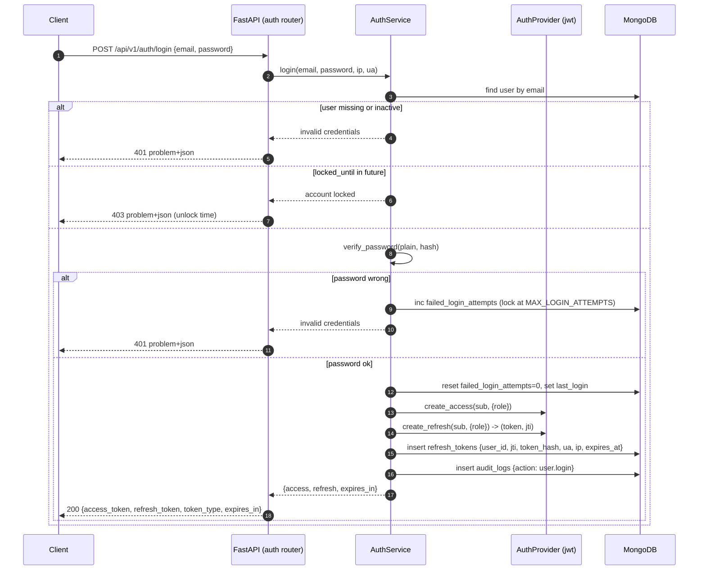
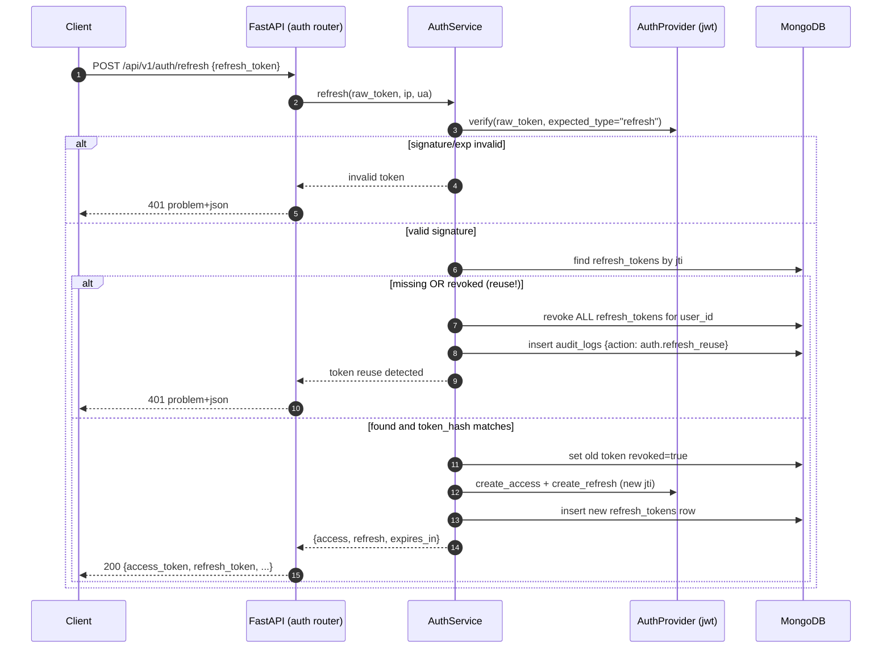

# 19 — Authentication

**Advanced AI Medical Intelligence Platform (AIMIP)** — identity and token management.

Authentication is provided behind the **`AuthProvider`** port (`AUTH_PROVIDER=jwt`), so business
logic never imports a JWT library directly. The default adapter issues **JWT** access/refresh
tokens (HS256), hashes passwords with **bcrypt via passlib**, rotates and revokes refresh tokens
through the `refresh_tokens` collection, and enforces account lockout.

Related docs:
[SRS](02_Software_Requirements_Specification.md) ·
[Database Design](17_Database_Design.md) ·
[API Design](18_API_Design.md) ·
[Authorization / RBAC](20_Authorization_RBAC.md) ·
[Environment Configuration](31_Environment_Configuration.md)

> **Disclaimer.** AIMIP is clinical decision-support, not a medical device, and not FDA/CE
> cleared. Authentication protects PHI-adjacent data; consent and clinician review remain
> mandatory.

---

## 1. The `AuthProvider` port

Per canon §3, all auth flows depend only on the port ABC; the concrete adapter is chosen at
startup by `get_auth_provider(settings)` reading `AUTH_PROVIDER`.

```python
# domain/ports/auth_provider.py
from abc import ABC, abstractmethod

class AuthProvider(ABC):
    @abstractmethod
    def create_access(self, subject: str, claims: dict) -> str: ...
    @abstractmethod
    def create_refresh(self, subject: str, claims: dict) -> tuple[str, str]:  # (token, jti)
        ...
    @abstractmethod
    def verify(self, token: str, *, expected_type: str) -> dict:  # decoded claims
        ...
    @abstractmethod
    def rotate(self, refresh_token: str) -> tuple[str, str, str]:  # (access, refresh, new_jti)
        ...
```

| `AUTH_PROVIDER` | Adapter | Status |
|-----------------|---------|--------|
| `jwt` | `infrastructure/auth/` JWT adapter (python-jose + passlib) | **default / implemented** |
| `oauth2` | External OAuth2/OIDC authorization-code adapter | future |
| `keycloak` | Keycloak realm adapter | future |

Because callers depend on the port, switching to `oauth2`/`keycloak` later is an adapter + ENV
change with no change to `AuthService` or routers. The port ships a shared contract test in
`tests/contract/` that every adapter must pass (canon §3).

Relevant ENV (from canon §5, documented in [Environment Configuration](31_Environment_Configuration.md)):

| ENV | Default | Meaning |
|-----|---------|---------|
| `AUTH_PROVIDER` | `jwt` | Selects the adapter. |
| `JWT_SECRET` | `change-me` | HMAC signing secret (must be overridden in prod). |
| `JWT_ALGORITHM` | `HS256` | Signing algorithm. |
| `ACCESS_TOKEN_EXPIRE_MINUTES` | `30` | Access-token TTL. |
| `REFRESH_TOKEN_EXPIRE_DAYS` | `7` | Refresh-token TTL (also the `refresh_tokens` TTL). |
| `MAX_LOGIN_ATTEMPTS` | `5` | Failed logins before lockout. |
| `LOCKOUT_MINUTES` | `15` | Lockout duration. |

Config fails fast: an empty `JWT_SECRET` in a non-development `ENV` raises at startup.

---

## 2. Registration & password hashing

Endpoint: `POST /api/v1/auth/register` ([API Design §3.1](18_API_Design.md#31-post-apiv1authregister)).

Flow:

1. Validate `email`, `password`, `full_name` (Pydantic v2). Enforce the password policy ([§4](#4-password-policy)).
2. Normalize email (lowercase, trim); reject if it already exists (`409`).
3. Hash the password with **passlib bcrypt** (`CryptContext(schemes=["bcrypt"])`, work factor 12).
4. Insert a `users` document with `role="user"`, `is_active=true`, `failed_login_attempts=0`,
   `locked_until=null`.
5. Write an `audit_logs` row (`action=user.register`).
6. Return the public user projection (never `password_hash`).

```python
# core/security.py
from passlib.context import CryptContext
pwd_context = CryptContext(schemes=["bcrypt"], deprecated="auto", bcrypt__rounds=12)

def hash_password(plain: str) -> str:
    return pwd_context.hash(plain)

def verify_password(plain: str, hashed: str) -> bool:
    return pwd_context.verify(plain, hashed)
```

- Only the bcrypt hash is stored (`users.password_hash`); plaintext is never persisted or logged.
- bcrypt's per-hash salt is embedded in the hash string; `passlib` verifies in constant time.
- `deprecated="auto"` allows transparent rehash if the work factor is raised later.

---

## 3. Login & tokens

Endpoint: `POST /api/v1/auth/login` ([API Design §3.2](18_API_Design.md#32-post-apiv1authlogin)).

Two token types:

| Token | Purpose | TTL | Storage server-side |
|-------|---------|-----|---------------------|
| **Access** | Bearer credential on every API call | `ACCESS_TOKEN_EXPIRE_MINUTES` (30 min) | **Stateless** — not stored; verified by signature + claims. |
| **Refresh** | Obtain a new access token without re-login | `REFRESH_TOKEN_EXPIRE_DAYS` (7 days) | **Stateful** — a row in `refresh_tokens` (hash + `jti`), enabling rotation/revocation. |

### 3.1 Token claims

```json
// Access token payload
{
  "sub": "665f1a2b3c4d5e6f7a8b9c10",
  "role": "user",
  "type": "access",
  "iat": 1753257600,
  "exp": 1753259400,
  "iss": "aimip",
  "aud": "aimip-api",
  "jti": "d3b07384-d9a0-4f2b-9c2e-1a2b3c4d5e6f"
}
```

```json
// Refresh token payload
{
  "sub": "665f1a2b3c4d5e6f7a8b9c10",
  "role": "user",
  "type": "refresh",
  "iat": 1753257600,
  "exp": 1753862400,
  "iss": "aimip",
  "aud": "aimip-api",
  "jti": "b7c2a1f0-9e6d-4a3b-8c1d-2e5f7a9b0c11"
}
```

| Claim | Meaning |
|-------|---------|
| `sub` | User `_id` (string). |
| `role` | RBAC role snapshot (`user`/`doctor`/`admin`) — used by `require_role`. |
| `type` | `access` or `refresh`; `verify(expected_type=...)` rejects the wrong type. |
| `iat` / `exp` | Issued-at / expiry (Unix seconds, UTC). |
| `iss` / `aud` | Issuer `aimip` / audience `aimip-api`, validated on verify. |
| `jti` | Unique token id; for refresh tokens it is the revocation key stored in `refresh_tokens.jti`. |

### 3.2 Login sequence



### 3.3 Verifying access tokens on protected routes

`get_current_user` (in `interface/dependencies.py`) extracts the bearer token, calls
`AuthProvider.verify(token, expected_type="access")`, loads the user, and rejects if the account
is inactive. `require_role(...)` then checks `role` (see [RBAC §3](20_Authorization_RBAC.md#3-the-require_role-dependency)).

```python
async def get_current_user(token = Depends(bearer_scheme),
                           auth: AuthProvider = Depends(get_auth_provider),
                           users: UserRepository = Depends(get_user_repo)) -> User:
    try:
        claims = auth.verify(token.credentials, expected_type="access")
    except InvalidTokenError:
        raise UnauthorizedError("invalid or expired token")
    user = await users.get(claims["sub"])
    if user is None or not user.is_active:
        raise UnauthorizedError("account unavailable")
    return user
```

---

## 4. Password policy

Enforced by a Pydantic validator on registration and password change:

| Rule | Value |
|------|-------|
| Minimum length | 12 characters |
| Maximum length | 128 characters (bcrypt processes ≤ 72 bytes; longer inputs are pre-hashed to avoid silent truncation) |
| Character classes | At least 3 of: lowercase, uppercase, digit, symbol |
| Disallowed | The email local-part; common/breached passwords (denylist); all-whitespace |
| Storage | bcrypt hash only, work factor 12 |
| Rotation | Not forced on a schedule (per NIST 800-63B); forced only on suspected compromise |

Violations return `422` with per-field `errors[]` in the RFC-7807 body
([API Design §1.4](18_API_Design.md#14-rfc-7807-error-envelope)).

---

## 5. Refresh-token rotation & revocation

Endpoint: `POST /api/v1/auth/refresh` ([API Design §3.3](18_API_Design.md#33-post-apiv1authrefresh)).

AIMIP uses **rotating** refresh tokens with **reuse detection**:

1. Client sends its current refresh token.
2. `AuthProvider.verify(token, expected_type="refresh")` checks signature, `exp`, `iss`, `aud`.
3. Look up `refresh_tokens` by `jti`:
   - **Not found or `revoked=true`** → treated as **reuse/replay**. Revoke **all** of the user's
     refresh tokens (`revoked=true` where `user_id`), write an `audit_logs` security event, and
     return `401`. This defeats stolen-token replay.
   - **Found and valid** → verify `token_hash` matches `sha256(raw_token)`.
4. Mark the old token `revoked=true` (single-use).
5. Issue a **new** access + refresh pair with a fresh `jti`; insert a new `refresh_tokens` row.
6. Return the new pair.

Storage rules:
- Only the **SHA-256 hash** of the raw refresh token is stored (`token_hash`) — a DB leak does not
  expose usable tokens.
- The `jti` unique index gives O(1) revocation lookups.
- The **TTL index on `expires_at`** auto-purges expired rows (canon §6; [Database Design §4](17_Database_Design.md#4-indexes)).

Revocation triggers:
- **Rotation** — old token revoked on every refresh.
- **Logout** (`POST /auth/logout`) — current token revoked; `all_devices=true` revokes every row
  for the user.
- **Reuse detection** — revoke-all as above.
- **Admin deactivate/delete** — a user set `is_active=false` or deleted has all refresh tokens
  revoked; access tokens are short-lived and expire within 30 min.

### 5.1 Refresh sequence



The frontend Axios interceptor performs this transparently: on a `401` from any call, it attempts
one `POST /auth/refresh`, retries the original request on success, or redirects to login on
failure ([API Design §13](18_API_Design.md#13-openapi--clients)).

---

## 6. Account lockout

Brute-force protection using the `users` counters and canon ENV:

| Field / ENV | Role |
|-------------|------|
| `users.failed_login_attempts` | Consecutive failed logins. |
| `users.locked_until` | UTC instant until which login is blocked. |
| `MAX_LOGIN_ATTEMPTS` (5) | Threshold that triggers a lock. |
| `LOCKOUT_MINUTES` (15) | Lock duration. |

Algorithm:

1. On a **failed** password check, increment `failed_login_attempts`.
2. When it reaches `MAX_LOGIN_ATTEMPTS`, set `locked_until = now + LOCKOUT_MINUTES` and reset the
   counter to 0.
3. While `locked_until` is in the future, login returns `403` (the `detail` states the unlock
   time); the password is not even checked.
4. On a **successful** login, reset `failed_login_attempts=0` and `locked_until=null`.

To avoid **user enumeration**, a non-existent email and a wrong password both return the same
generic `401 invalid credentials`; lockout state is applied only to real accounts and surfaced as
`403` only after the account is confirmed to exist. Repeated login attempts are additionally
subject to the global rate limiter ([API Design §1.7](18_API_Design.md#17-rate-limiting)).

---

## 7. Security considerations

| Area | Control |
|------|---------|
| Password storage | bcrypt (passlib), work factor 12, per-hash salt; constant-time verify. |
| Refresh-token storage | SHA-256 hash only; `jti` revocation; TTL purge; single-use rotation; reuse → revoke-all. |
| Access-token lifetime | Short (30 min) to bound the blast radius of a leaked token. |
| Transport | HTTPS/TLS only; `Secure`, `HttpOnly`, `SameSite=Strict` if tokens are ever cookie-stored (default: `Authorization` header). |
| Secret management | `JWT_SECRET` from ENV/secret store, never committed; rotate by supporting a key-id and short overlap. |
| Algorithm pinning | `verify` accepts only `JWT_ALGORITHM` (HS256); `alg=none` and algorithm-confusion are rejected. |
| Claim validation | `iss`, `aud`, `exp`, `type` all validated; wrong-type tokens rejected. |
| Enumeration | Uniform error messages for login/register/refresh failures. |
| Brute force | Account lockout + rate limiting. |
| Least privilege | `role` claim drives `require_role`; elevation only via admin `PATCH /users/{id}`. |
| Auditability | `user.register`, `user.login`, `auth.refresh_reuse`, `auth.logout` recorded in `audit_logs`. |
| PHI | Tokens grant access to PHI-adjacent data; cross-user reads are additionally audited ([RBAC §5](20_Authorization_RBAC.md#5-audit-logging-of-privileged-access)). |
| Logout everywhere | `all_devices=true` revokes every refresh token for the user. |

Target posture: **OWASP ASVS L1** ([SRS NFRs](02_Software_Requirements_Specification.md)).

---

## 8. Endpoint recap

| Endpoint | Auth | Purpose | Contract |
|----------|------|---------|----------|
| `POST /api/v1/auth/register` | none | Create account (`role=user`), bcrypt hash | [API §3.1](18_API_Design.md#31-post-apiv1authregister) |
| `POST /api/v1/auth/login` | none | Issue access + refresh; lockout | [API §3.2](18_API_Design.md#32-post-apiv1authlogin) |
| `POST /api/v1/auth/refresh` | none (refresh token) | Rotate + revoke; reuse detection | [API §3.3](18_API_Design.md#33-post-apiv1authrefresh) |
| `POST /api/v1/auth/logout` | user | Revoke refresh token(s) | [API §3.4](18_API_Design.md#34-post-apiv1authlogout) |
| `GET /api/v1/auth/me` | user | Current principal | [API §3.5](18_API_Design.md#35-get-apiv1authme) |

Next: role enforcement, the permission matrix, ownership checks, and privileged-access auditing in
[Authorization / RBAC](20_Authorization_RBAC.md).
