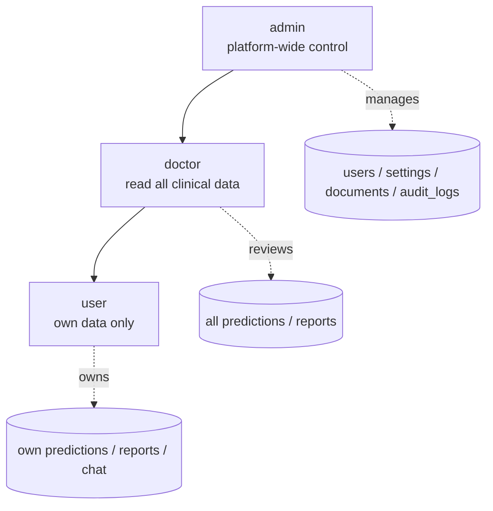
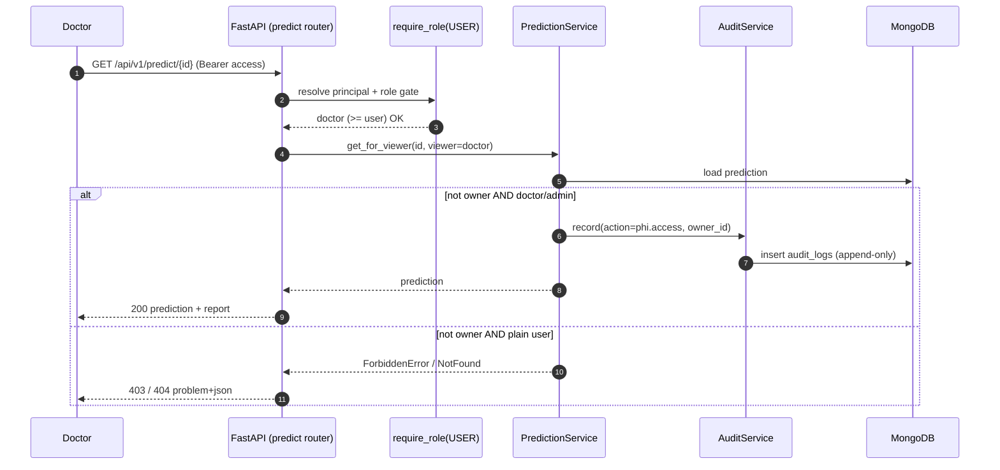

# 20 — Authorization & RBAC

**Advanced AI Medical Intelligence Platform (AIMIP)** — role-based access control.

Authorization runs **after** authentication ([Authentication](19_Authentication.md)): once
`get_current_user` resolves the principal from a valid access token, the `require_role(...)`
dependency and per-resource **ownership checks** decide what that principal may do. Privileged and
PHI-touching access is recorded append-only in `audit_logs`.

Related docs:
[SRS](02_Software_Requirements_Specification.md) ·
[Database Design](17_Database_Design.md) ·
[API Design](18_API_Design.md) ·
[Authentication](19_Authentication.md) ·
[Environment Configuration](31_Environment_Configuration.md)

> **Disclaimer.** AIMIP is clinical decision-support, not a medical device, and not FDA/CE
> cleared. RBAC restricts PHI-adjacent access; a licensed clinician must still review every result.

---

## 1. Roles

Three roles (canon §8), stored in `users.role` and carried as the `role` claim in the access
token ([Authentication §3.1](19_Authentication.md#31-token-claims)). Roles are **hierarchical**:
each higher role includes the capabilities of the lower ones.

| Role | Grants | Scope |
|------|--------|-------|
| `user` | Own predictions, history, reports, chat/RAG, browse document catalog, own analytics, read settings. | **Own data only.** |
| `doctor` | Everything a `user` can do **plus** read **all** predictions and reports for clinical review. | Cross-user **read** of clinical data (audited). |
| `admin` | Full control: manage users, mutate settings, upload/delete knowledge-base documents, read audit logs, plus all doctor/user capabilities. | **Platform-wide.** |

Precedence: `admin ⊇ doctor ⊇ user`. The default role at self-registration is `user`; elevation
happens only through `PATCH /api/v1/users/{id}` performed by an `admin`
([API Design §10.3](18_API_Design.md#103-patch-apiv1usersid)).



---

## 2. Permission matrix

Rows = actions/endpoints; columns = roles. Legend:
**Y** allowed · **Own** allowed for resources the caller owns · **All** allowed across all users
· **—** denied (`403`).

| Action / Endpoint | `user` | `doctor` | `admin` |
|-------------------|:------:|:--------:|:-------:|
| `POST /auth/register` (public) | Y | Y | Y |
| `POST /auth/login` (public) | Y | Y | Y |
| `POST /auth/refresh` (public) | Y | Y | Y |
| `POST /auth/logout` | Y | Y | Y |
| `GET /auth/me` | Y | Y | Y |
| `POST /predict` | Y | Y | Y |
| `GET /predict/{id}` | Own | All (audited) | All (audited) |
| `GET /history` | Own | Own | Own |
| `GET /reports/{prediction_id}` | Own | All (audited) | All (audited) |
| `POST /reports/{prediction_id}/regenerate` | Own | All (audited) | All (audited) |
| `POST /chat` | Own | Own | Own |
| `GET /chat/sessions` | Own | Own | Own |
| `GET /chat/sessions/{id}` | Own | Own | Own |
| `GET /documents` (browse catalog) | Y | Y | Y |
| `POST /documents` (upload/ingest) | — | — | Y |
| `DELETE /documents/{id}` | — | — | Y |
| `GET /analytics/overview` | Own scope | All | All |
| `GET /analytics/trends` | Own scope | All | All |
| `GET /analytics/disease-distribution` | Own scope | All | All |
| `GET /analytics/confidence-distribution` | Own scope | All | All |
| `GET /analytics/recent-activity` | Own scope | All | All |
| `GET /users` | — | — | Y |
| `GET /users/{id}` | — | — | Y |
| `PATCH /users/{id}` | — | — | Y |
| `DELETE /users/{id}` | — | — | Y |
| `GET /settings` | Y | Y | Y |
| `PATCH /settings` | — | — | Y |
| Read `audit_logs` | — | — | Y |
| `GET /health/live`, `/health/ready`, `/metrics`, `/docs` | Public / scrape-scoped | — | — |

Notes:
- **Own scope** for analytics means metrics are computed over the caller's own predictions/reports;
  `doctor`/`admin` receive platform-wide aggregates ([API Design §9](18_API_Design.md#9-analytics)).
- Cross-user clinical reads by `doctor`/`admin` are permitted **and** logged (see [§5](#5-audit-logging-of-privileged-access)).
- `admin` can technically read any prediction/report/chat for support, but every such cross-user
  read is audited; deliberate role separation keeps clinical review with `doctor`.

---

## 3. The `require_role` dependency

A FastAPI dependency factory in `interface/dependencies.py`. It composes with
`get_current_user` ([Authentication §3.3](19_Authentication.md#33-verifying-access-tokens-on-protected-routes))
and enforces the role hierarchy.

```python
# interface/dependencies.py
from fastapi import Depends
from app.domain.value_objects import Role
from app.core.exceptions import ForbiddenError

ROLE_RANK = {Role.USER: 1, Role.DOCTOR: 2, Role.ADMIN: 3}

def require_role(minimum: Role):
    async def _guard(current: User = Depends(get_current_user)) -> User:
        if ROLE_RANK[current.role] < ROLE_RANK[minimum]:
            raise ForbiddenError(
                detail=f"requires role >= {minimum.value}"
            )
        return current
    return _guard
```

Usage on routers:

```python
# interface/api/v1/users.py  — admin-only resource
@router.get("/users")
async def list_users(admin: User = Depends(require_role(Role.ADMIN)),
                     svc: UserService = Depends(get_user_service)):
    ...

# interface/api/v1/predict.py — any authenticated user; ownership handled in the service
@router.get("/predict/{id}")
async def get_prediction(id: str,
                         current: User = Depends(require_role(Role.USER)),
                         svc: PredictionService = Depends(get_prediction_service)):
    return await svc.get_for_viewer(prediction_id=id, viewer=current)
```

Design points:
- **Hierarchical**: `require_role(Role.USER)` admits everyone authenticated; `require_role(Role.DOCTOR)`
  admits doctors and admins; `require_role(Role.ADMIN)` admits only admins.
- **Denial** raises `ForbiddenError`, rendered as `403` in the RFC-7807 envelope by the
  `error_handler` middleware ([API Design §1.4](18_API_Design.md#14-rfc-7807-error-envelope)).
  A missing/invalid token yields `401` earlier, in `get_current_user`.
- **Single source of truth**: the guard reads the freshly loaded `User` (via `get_current_user`),
  so a role revoked mid-session takes effect on the next access token (≤ 30 min) — for immediate
  effect, admin actions also revoke refresh tokens ([Authentication §5](19_Authentication.md#5-refresh-token-rotation--revocation)).

---

## 4. Resource-ownership checks

Role gate alone is insufficient for owner-scoped resources: a `user` passing
`require_role(Role.USER)` must still be blocked from reading **another** user's prediction. The
service layer performs the ownership check, combining role and ownership.

```python
# application/services/prediction_service.py
async def get_for_viewer(self, prediction_id: str, viewer: User) -> Prediction:
    pred = await self.predictions.get(prediction_id)
    if pred is None:
        raise NotFoundError("prediction not found")
    is_owner = pred.user_id == viewer.id
    is_clinical_reviewer = viewer.role in (Role.DOCTOR, Role.ADMIN)
    if not (is_owner or is_clinical_reviewer):
        raise ForbiddenError("not permitted to view this prediction")
    if not is_owner and is_clinical_reviewer:
        await self.audit.record(
            actor_id=viewer.id, action="phi.access",
            resource_type="prediction", resource_id=pred.id,
            metadata={"reason": "clinical_review", "owner_id": str(pred.user_id)},
        )
    return pred
```

Rules:

| Resource | Owner field | Non-owner access |
|----------|-------------|------------------|
| `predictions` | `user_id` | `doctor`/`admin` may **read** (audited); no cross-user writes except regenerate (audited). |
| `reports` | `user_id` | Same as predictions. |
| `chat_sessions` / `chat_history` | `user_id` | **Owner only** — even `doctor`/`admin` cannot read another user's chats (private assistant); enforced with no override. |
| `documents` | `uploaded_by` | Catalog readable by all; upload/delete admin-only (not ownership-based). |
| `users` | `_id` | Admin-only management; a `user` may read/update only their **own** profile via `GET /auth/me` and profile settings. |

Not-found vs forbidden: to avoid leaking existence of others' resources to a plain `user`, the
service may return `404` rather than `403` when a non-privileged caller references a resource they
do not own (uniform "not visible"). Privileged callers get the true `403`/`404`.

A caller cannot escalate their own role: `PATCH /users/{id}` requires `admin`, and an admin
changing roles is audited; guards additionally prevent removing the **last active admin**
([API Design §10.3](18_API_Design.md#103-patch-apiv1usersid)).

---

## 5. Audit logging of privileged access

The append-only `audit_logs` collection ([Database Design §3.9](17_Database_Design.md#39-audit_logs))
is the accountability record. It is written by an `AuditService` and is **never updated or
deleted** by application code.

What gets logged:

| Trigger | `action` | Notable `metadata` |
|---------|----------|--------------------|
| Successful login | `user.login` | — |
| Registration | `user.register` | — |
| Refresh-token reuse detected | `auth.refresh_reuse` | revoked-count |
| Logout | `auth.logout` | `all_devices` |
| **Cross-user** read of a prediction/report/regenerate by doctor/admin | `phi.access` | `reason`, `owner_id` |
| Admin role/active change | `user.update` | `old_role`, `new_role`, `is_active` |
| Admin user delete | `user.delete` | cascade summary |
| Document upload / delete | `document.create` / `document.delete` | `source`, `chunk_count` |
| Settings change | `settings.update` | changed keys (non-secret) |

Principles:
- **Log the access, not the content.** `metadata` carries context (ids, reasons), never raw PHI
  (no image bytes, no report text).
- **Actor identity** comes from the authenticated principal (`actor_id`), plus `ip`/`user_agent`
  from the request context (`request_id`/timing middleware).
- **Append-only**: no route updates or deletes audit rows; retention is an operational concern,
  not a runtime delete ([Database Design §5](17_Database_Design.md#5-data-lifecycle--retention)).
- **Queryable**: compound indexes on `{actor_id, created_at}`, `{action, created_at}`, and
  `{resource_type, resource_id}` support "what did this actor do" and "who touched this resource"
  investigations.
- **Admin-only reads**: only `admin` may read audit logs; the read itself is a privileged action.



---

## 6. Enforcement summary

| Layer | Responsibility |
|-------|----------------|
| `get_current_user` | Authenticate: valid access token, active account → `401` otherwise. |
| `require_role(minimum)` | Coarse role gate using the hierarchy → `403` otherwise. |
| Service ownership checks | Fine-grained owner-vs-reviewer decisions → `403`/`404`. |
| `AuditService` → `audit_logs` | Record privileged/PHI/admin actions (append-only). |
| Middleware (`error_handler`) | Render `ForbiddenError`/`UnauthorizedError`/`NotFoundError` as RFC-7807. |

This defense-in-depth pairs a simple, hierarchical `require_role` gate with explicit ownership
logic in services, and holds `doctor`/`admin` accountable for every cross-user clinical read
through `audit_logs`. See [Authentication](19_Authentication.md) for how the `role` claim is
issued and validated, and [API Design](18_API_Design.md) for the per-endpoint auth column.
