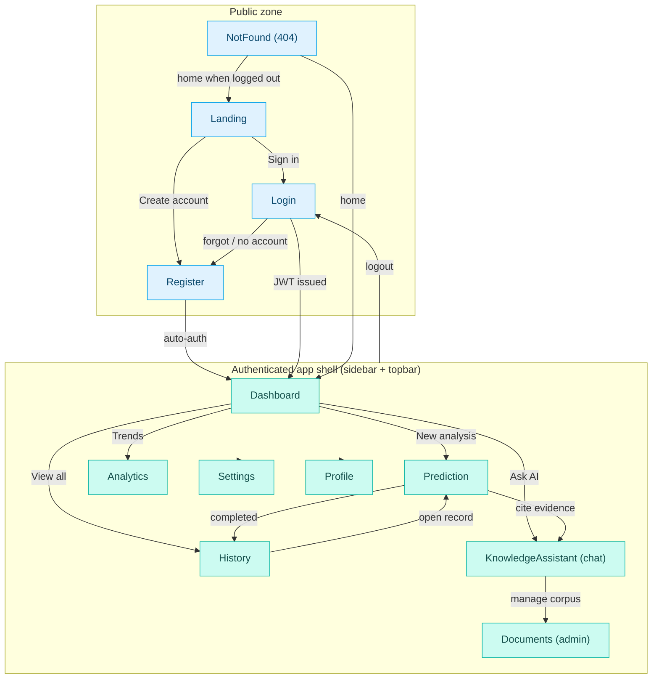

# 21 — UI/UX Guidelines

> **Product:** Advanced AI Medical Intelligence Platform (**AIMIP**)
> **Scope:** Information architecture, navigation, page-by-page UX inventory, universal
> state handling, responsive behavior, accessibility (WCAG 2.1 AA), motion/micro-interaction
> guidance (Framer Motion), and UX writing/tone — including how the medical disclaimer is
> surfaced across the product.
>
> **Canonical source:** [_CANON.md](_CANON.md) §10 (pages & design), §0 (disclaimer), §7 (API), §8 (RBAC).
> **Related:** [Frontend Architecture](08_Frontend_Architecture.md) · [Design System](22_Design_System.md) ·
> [API Design](18_API_Design.md) · [Authorization / RBAC](20_Authorization_RBAC.md) ·
> [Software Requirements Specification](02_Software_Requirements_Specification.md) ·
> [Environment Configuration](31_Environment_Configuration.md)

AIMIP is an **enterprise AI healthcare SaaS** for clinical **decision-support** — it is
**not a medical device**. Every UX decision in this document is bound by that framing: the
interface must inform and assist a licensed clinician, never assert a diagnosis. All visual
tokens, components, and Tailwind mappings referenced here are specified in the
[Design System](22_Design_System.md).

---

## 1. Design principles

1. **Clinical calm over excitement.** Medical blues/teals, generous whitespace on an 8px
   grid, restrained motion. The UI never celebrates a positive pneumonia finding.
2. **Explainability is a first-class citizen.** Grad-CAM overlays, confidence, and citations
   are shown *with* every AI output, never behind an extra click.
3. **Decision-support, not decision-making.** Language, hierarchy, and the persistent
   disclaimer keep the clinician in authority (§0 canon).
4. **Progressive disclosure.** Summary first; findings, probabilities, and raw evidence
   expand on demand.
5. **Trust through honesty of state.** Loading, empty, error, and "insufficient context"
   states are designed deliberately, not left as spinners.
6. **Accessible by default.** WCAG 2.1 AA is a gate, not a polish step.

---

## 2. Information architecture

The 12 pages from canon §10 map into four IA zones. Names below are the **exact** page
names and must not be renamed in code or docs.

| Zone | Pages | Access |
|------|-------|--------|
| **Public / unauthenticated** | Landing, Login, Register, NotFound | Everyone |
| **Core workflow** (authenticated) | Dashboard, Prediction, History, KnowledgeAssistant | `user`, `doctor`, `admin` |
| **Insight** | Analytics | `user` (own), `doctor`/`admin` (all) |
| **Administration & account** | Documents, Settings, Profile | Documents/Settings gated by role (§8) |

RBAC gating (canon §8): `user` sees own predictions/history/chat/reports; `doctor` additionally
reviews all predictions/reports; `admin` additionally manages Documents, Settings (platform),
and users. Route guards are described in [Frontend Architecture](08_Frontend_Architecture.md);
authorization rules are the contract in [Authorization / RBAC](20_Authorization_RBAC.md).

### 2.1 Navigation map (Mermaid)



### 2.2 App shell layout

- **Sidebar (left, collapsible):** logo, primary nav (Dashboard, Prediction, History,
  Analytics, KnowledgeAssistant), admin group (Documents, Settings) shown only when role
  permits, and a footer disclaimer chip (§9.3).
- **Topbar:** breadcrumb/page title, global search (History + Documents), theme toggle
  (light/dark), notifications, avatar menu → Profile / Settings / Logout.
- **Main region:** page content constrained to `max-w-screen-2xl`, 24px gutters (desktop).
- **Persistent disclaimer strip** anchored to the bottom of any page that renders AI output.

---

## 3. Page-by-page inventory

Each page below documents: **Purpose · Key components · Primary user flow · Data shown ·
States**. Components and their variants are defined in [Design System](22_Design_System.md);
data fields trace to MongoDB collections (canon §6) and endpoints (canon §7).

### 3.1 Landing

- **Purpose:** Public marketing + trust entry point that explains AIMIP's decision-support
  scope and routes visitors to Login/Register.
- **Key components:** Hero with animated gradient mesh, value-prop cards (X-ray
  classification → Grad-CAM XAI → LLM report → RAG assistant), "How it works" stepper,
  compliance/trust band, **prominent disclaimer band**, primary CTA buttons, footer.
- **Primary flow:** Visitor reads value props → clicks **Create account** (→ Register) or
  **Sign in** (→ Login).
- **Data shown:** Static marketing copy; no PHI, no authenticated data.
- **States:** *Default* only (static). Reduced-motion disables the hero mesh animation.
  Broken-image fallback for illustrations.

### 3.2 Login

- **Purpose:** Authenticate an existing account and issue JWT access/refresh tokens.
- **Key components:** Glass auth card, email + password fields (React Hook Form + Zod),
  show/hide password toggle, "Remember me", submit button with inline spinner, error alert,
  link to Register.
- **Primary flow:** Enter credentials → submit → `POST /auth/login` → on success store tokens
  (see [Frontend Architecture](08_Frontend_Architecture.md)) and redirect to Dashboard.
- **Data shown:** None persisted client-side beyond tokens; email echoed in field.
- **States:**
  - *Loading:* button spinner, fields disabled.
  - *Error — invalid credentials:* RFC 7807 `detail` surfaced in an inline alert; password
    field cleared, email retained.
  - *Error — account locked:* after `MAX_LOGIN_ATTEMPTS` (canon §5) show lockout message with
    minutes remaining (`LOCKOUT_MINUTES`), submit disabled.
  - *Success:* brief check animation, redirect.
- **Validation:** email format, password required. Zod schema shared with Register where fields overlap.

### 3.3 Register

- **Purpose:** Create a new account (`role=user` by default per §8).
- **Key components:** Glass auth card, full name, email, password + confirm, live password
  strength meter, terms + consent checkbox referencing the PHI/consent disclaimer, submit,
  link to Login.
- **Primary flow:** Fill fields → validate → `POST /auth/register` → auto-authenticate →
  Dashboard onboarding hint.
- **Data shown:** Field values only.
- **States:** *Loading*, *Error — email already exists* (field-level, RFC 7807 `errors[]`),
  *Error — weak password* (inline), *Success* → redirect. Consent checkbox must be checked
  before submit is enabled.

### 3.4 Dashboard

- **Purpose:** Authenticated home; at-a-glance status and jump-off to every workflow.
- **Key components:** Welcome header with role badge, KPI stat cards (total predictions,
  pneumonia rate, avg confidence, documents indexed), **New Analysis** primary CTA,
  recent-activity feed, mini trend sparkline, KnowledgeAssistant quick-ask box, disclaimer strip.
- **Primary flow:** Land after login → scan KPIs → click **New Analysis** (→ Prediction) or a
  recent record (→ Prediction detail) or **Ask AI** (→ KnowledgeAssistant).
- **Data shown:** `GET /analytics/overview` and `/analytics/recent-activity`; role from
  `GET /auth/me`. `user` sees own scope; `doctor`/`admin` see aggregate.
- **States:**
  - *Loading:* KPI card skeletons + feed skeleton rows.
  - *Empty (new user):* onboarding card — "Run your first analysis" with CTA; KPIs show `0`
    with muted styling, not error.
  - *Error:* section-level error card with **Retry**; unaffected sections still render.
  - *Success:* animated count-up on KPI numbers (respecting reduced-motion).

### 3.5 Prediction

- **Purpose:** The core workflow — upload a chest X-ray, run classification, view Grad-CAM
  explainability, and read the LLM-generated report. Also serves as the **detail view** for a
  historical record.
- **Key components:**
  - **Upload dropzone** (PNG/JPEG only per `ALLOWED_IMAGE_TYPES`, ≤ `MAX_UPLOAD_SIZE` 10 MB),
    with client-side type/size guard and a consent reminder.
  - **Result panel:** predicted class badge (`NORMAL` / `PNEUMONIA`), confidence gauge,
    probability bars for `{NORMAL, PNEUMONIA}`.
  - **Grad-CAM viewer:** tabbed / synced original · heatmap · overlay images with an opacity
    slider; OOD warning banner when `ood_flag` is set.
  - **Report card:** rendered Markdown with sections summary, findings, possible_condition,
    medical_explanation, recommendations, **risk_level** badge (low/moderate/high),
    **disclaimer** (always last), and a **Regenerate report** action.
  - Actions: download report, ask about this case (→ KnowledgeAssistant), view in History.
- **Primary flow:** Drag/select image → confirm consent → `POST /predict` (multipart `file`,
  header `Idempotency-Key`) → progress → result + gradcam URLs + report render (canon §7).
- **Data shown:** `predictions` doc — predicted_class, confidence, probabilities, gradcam
  {original,heatmap,overlay}, ood_flag, status, model_arch/version; linked `reports` doc.
- **States:**
  - *Idle:* dropzone prompt.
  - *Uploading / inferring:* staged progress ("Uploading → Analyzing image →
    Generating explanation → Writing report"); end-to-end target < 6 s p95 (canon §11).
  - *OOD rejected:* amber banner "This doesn't look like a chest X-ray" with guidance; no
    misleading class shown.
  - *Error — invalid file:* inline dropzone error (type/size) before upload.
  - *Error — inference/report failed:* `status=failed` card with **Retry**; partial results
    (e.g. classification succeeded, report failed) offer a targeted **Regenerate report**.
  - *Success:* result panel animates in; risk badge color-coded (green/amber/red).

### 3.6 History

- **Purpose:** Browse, filter, and revisit past predictions and their reports.
- **Key components:** Filter bar (date range `from`/`to`, class, risk level), paginated table
  or card grid, thumbnail, class + risk badges, confidence chip, timestamp, row → Prediction
  detail. Doctors/admins get a scope toggle (mine / all) per §8.
- **Primary flow:** Open History → filter → click a record → Prediction detail.
- **Data shown:** `GET /history?page&size&from&to` returning list envelope
  `{items, page, size, total, pages}` (canon §7).
- **States:**
  - *Loading:* table skeleton rows.
  - *Empty — no records:* illustration + "No analyses yet" + **New Analysis** CTA.
  - *Empty — no filter matches:* "No results for these filters" + **Clear filters**.
  - *Error:* error card with **Retry**.
  - *Success:* paginated data; pagination controls reflect `pages`/`total`.

### 3.7 Analytics

- **Purpose:** Visualize usage and outcome trends (Recharts).
- **Key components:** Interval switch (day/week), overview KPI row, trend line/area chart,
  disease-distribution donut (NORMAL vs PNEUMONIA), confidence-distribution histogram,
  recent-activity list. Charts wrapped in the shared `ChartCard` (see Design System).
- **Primary flow:** Open Analytics → pick interval → inspect charts → hover tooltips → drill
  to History via legend/segment.
- **Data shown:** `GET /analytics/overview`, `/analytics/trends?interval=day|week`,
  `/analytics/disease-distribution`, `/analytics/confidence-distribution`,
  `/analytics/recent-activity` (canon §7). Scope by role.
- **States:**
  - *Loading:* chart-shaped skeletons (bar/line placeholders), not spinners.
  - *Empty:* "Not enough data yet" per chart with a subtle axis frame.
  - *Error:* per-chart error with **Retry**, isolating failures.
  - *Success:* charts animate on mount; accessible data table fallback available per chart.

### 3.8 KnowledgeAssistant (chat)

- **Purpose:** Grounded RAG medical-knowledge assistant that answers from the indexed corpus
  with citations, and refuses when evidence is insufficient.
- **Key components:** Session sidebar (list + new session), message thread with user/assistant
  **chat bubbles**, streaming assistant response, **citation chips** (document + chunk +
  score), composer with send button, "insufficient context" refusal card, per-message
  disclaimer footnote.
- **Primary flow:** Type question → `POST /chat {session_id?, message}` → streamed answer with
  `citations[]` → follow-up in same session; sessions via `GET /chat/sessions` and
  `GET /chat/sessions/{id}` (canon §7).
- **Data shown:** `chat_sessions` and `chat_history` (role, message, citations[{document_id,
  chunk_id, score}]).
- **States:**
  - *Empty session:* suggested prompts (e.g. "What are pneumonia risk factors?").
  - *Thinking / streaming:* animated typing indicator, tokens append live.
  - *Refusal:* when retrieval score < `RAG_MIN_SCORE`, show "I don't have enough grounded
    context to answer that safely" card — never a hallucinated answer (canon §9).
  - *Error:* message-level error with **Retry**; composer stays intact.
  - *Success:* answer with expandable citations.

### 3.9 Documents (admin)

- **Purpose:** Manage the RAG knowledge corpus — upload PDFs, monitor ingestion, remove docs.
- **Key components:** Upload dropzone (PDF), document table (title, source WHO/NIH/research/
  other, pages, chunk_count, **status** uploaded/processing/indexed/failed, uploaded_by,
  created_at), per-row delete with confirm modal, ingestion progress indicators.
- **Primary flow:** Admin uploads PDF → `POST /documents` (async ingest job) → row appears
  `processing` → polled/refreshed to `indexed`; delete → confirm → `DELETE /documents/{id}`.
- **Data shown:** `GET /documents`; `documents` collection fields (canon §6).
- **States:**
  - *Loading:* table skeleton.
  - *Empty:* "No documents indexed yet" + upload CTA.
  - *Ingesting:* animated `processing` status badge + progress; `failed` badge offers
    **Re-ingest**.
  - *Error:* upload error (wrong mime / too large) inline; list error with **Retry**.
  - *Success:* `indexed` badge, chunk_count populated.
- **Access:** admin only (§8); non-admins never see the nav entry (route guard + hidden link).

### 3.10 Settings

- **Purpose:** Platform + preference configuration. Two tiers: **account preferences**
  (all roles) and **platform settings** (admin, per §8).
- **Key components:** Tabbed layout — Appearance (theme, motion), Notifications, Security
  (change password, active sessions/refresh tokens, revoke), and (admin) Platform (provider
  selectors surfaced read-mostly, defaults). Save bar with dirty-state detection.
- **Primary flow:** Open Settings → adjust in a tab → **Save** → `PATCH /settings` (or profile
  endpoints) → success toast.
- **Data shown:** `GET /settings`; user prefs + (admin) platform config.
- **States:** *Loading* (form skeleton), *Dirty* (sticky save bar enabled), *Saving*
  (button spinner), *Error* (field/summary), *Success* (toast + reset dirty).

### 3.11 Profile

- **Purpose:** View and edit the signed-in user's own account.
- **Key components:** Avatar, full name, email (read-only if not changeable), role badge,
  member-since, change-password link, last-login, danger-zone (deactivate) if permitted.
- **Primary flow:** Open Profile → edit name → save → success toast. Data from
  `GET /auth/me`.
- **Data shown:** `users` doc subset — full_name, email, role, last_login, created_at.
- **States:** *Loading*, *Editing/Dirty*, *Saving*, *Error*, *Success*.

### 3.12 NotFound (404)

- **Purpose:** Graceful catch-all for unknown routes.
- **Key components:** Large 404 glyph, friendly copy, primary CTA home (→ Dashboard if
  authenticated, → Landing if not), search box.
- **Primary flow:** Land on unknown URL → click home → correct destination.
- **Data shown:** None.
- **States:** *Default* only.

---

## 4. Universal state handling

Every data-bound view MUST implement these four states. TanStack Query drives server state;
Zustand drives UI state (canon §10). Patterns below are consistent across all pages so users
learn them once.

### 4.1 Loading — skeletons, not spinners

- Use content-shaped **skeletons** that match the final layout (KPI cards, table rows, chart
  frames, chat bubbles). This preserves layout and reduces perceived latency.
- Shimmer animation is a slow left-to-right sweep; **disabled under `prefers-reduced-motion`**
  (static muted blocks instead).
- Reserve space to avoid layout shift (CLS). Spinners are reserved for **in-button** actions
  (login, save, regenerate) only.
- Skeleton component spec lives in [Design System](22_Design_System.md) §component library.

### 4.2 Empty states

Distinguish **first-run empty** (encourage action) from **filtered empty** (offer to clear):

| Context | Message | Primary action |
|---------|---------|----------------|
| Dashboard, new user | "Run your first analysis to see insights here." | New Analysis |
| History, no records | "No analyses yet." | New Analysis |
| History, filter miss | "No results for these filters." | Clear filters |
| Analytics, no data | "Not enough data yet." | (none / New Analysis) |
| KnowledgeAssistant, new session | Suggested prompt chips | Pick a prompt |
| Documents, empty | "No documents indexed yet." | Upload PDF (admin) |

Empty states use a friendly illustration + one-line explanation + at most one CTA. Never a bare "No data".

### 4.3 Error states

- **Boundary errors** (render crashes): React Error Boundary renders a recoverable panel
  ("Something went wrong") with **Reload** and a support hint — never a white screen.
- **Request errors:** parse the RFC 7807 envelope `{type, title, status, detail, instance,
  errors?}` (canon §7). Show `title` as headline, `detail` as body; map `errors[]` to
  field-level messages in forms.
- **Section isolation:** a failed section shows an inline error card with **Retry**; sibling
  sections keep rendering (Dashboard, Analytics).
- **Network/offline:** global toast "You appear to be offline" with auto-retry via TanStack
  Query.
- **401/expired:** silent refresh via `POST /auth/refresh`; on failure, redirect to Login with
  a "Session expired" notice.
- Never expose stack traces, internal IDs beyond `instance`, or PHI in error copy.

### 4.4 Success feedback

- Transient, non-blocking **toasts** for saves, regenerations, uploads, deletes.
- Inline confirmation for in-context actions (e.g. checkmark on the save button).
- Optimistic UI where safe (e.g. document delete) with rollback on error.
- Success color is the risk-green token but used sparingly (see §9 tone — never celebrate a
  clinical finding).

---

## 5. Responsive design

Mobile-first. Breakpoints align with Tailwind defaults (mapped in
[Design System](22_Design_System.md) §Tailwind config).

| Token | Min width | Primary layout behavior |
|-------|-----------|-------------------------|
| `base` | 0 | Single column; sidebar becomes a bottom sheet / hamburger drawer; tables collapse to stacked cards. |
| `sm` | 640px | Two-column forms; larger touch targets retained. |
| `md` | 768px | Sidebar as an overlay drawer; History as compact table; charts full-width stacked. |
| `lg` | 1024px | Persistent collapsible sidebar; two-up chart grid; Prediction result + Grad-CAM side by side. |
| `xl` | 1280px | Three-up KPI/stat grids; Analytics multi-chart grid. |
| `2xl` | 1536px | Content capped at `max-w-screen-2xl`, centered with wide gutters. |

Rules:

- **Touch targets ≥ 44×44px** on all interactive elements (WCAG 2.5.5 / mobile best practice).
- The **Grad-CAM viewer** stacks vertically below `lg` (original → heatmap → overlay) with the
  opacity slider full-width.
- The **KnowledgeAssistant** session sidebar collapses into a top drawer below `md`.
- Charts must remain legible: below `md`, reduce series density and rely on tooltips; provide
  the accessible data-table fallback (§6).
- No horizontal page scroll at any breakpoint; wide tables/charts scroll inside their own
  `overflow-x-auto` container.

---

## 6. Accessibility standards (WCAG 2.1 AA)

Accessibility is a release gate. Automated checks (axe) run in CI; manual keyboard + screen
reader passes are required for new pages.

### 6.1 Color & contrast

- Text and essential UI meet **AA contrast**: ≥ **4.5:1** for normal text, ≥ **3:1** for large
  text (≥ 18.66px bold / 24px) and for UI component boundaries / focus indicators.
- The palette in [Design System](22_Design_System.md) is tuned so primary blue `#0EA5E9` and
  teal `#14B8A6` are used as **surfaces/accents with darker text**, not as small text on white.
- **Risk semantics never rely on color alone:** each risk_level pairs color with a **label**
  (Low/Moderate/High) and an icon (shield / alert-triangle / alert-octagon). Class badges pair
  color with the words `NORMAL` / `PNEUMONIA`.

### 6.2 Focus & keyboard navigation

- Visible focus ring on every interactive element: `focus-visible` 2px ring in the primary/
  focus token with a contrasting offset (spec in Design System).
- **Logical tab order** matching visual order; no positive `tabindex`.
- **Skip link** ("Skip to main content") as the first focusable element in the shell.
- **Focus trapping** in modals and the mobile nav drawer; focus returns to the trigger on close.
- **Escape** closes modals/drawers/menus; **Enter/Space** activate buttons; arrow keys move
  within tabs, menus, and the Analytics interval switch.
- The upload dropzone is keyboard-operable (focusable, Enter/Space opens the file picker) — not
  drag-only.
- The chat composer submits on **Enter**, newline on **Shift+Enter**.

### 6.3 ARIA & semantics

- Landmark roles: `banner` (topbar), `navigation` (sidebar), `main`, `contentinfo` (footer/
  disclaimer strip).
- Buttons are `<button>`, links are `<a>`; icon-only controls carry `aria-label`.
- **Live regions:** `aria-live="polite"` for toasts, prediction progress announcements,
  streaming chat, and skeleton→content transitions; `aria-live="assertive"` for errors.
- Forms (RHF + Zod): `<label>` bound to inputs, `aria-invalid`, `aria-describedby` pointing to
  the field error, and an error summary at the top of the form linking to fields.
- Tabs use `role="tablist"/"tab"/"tabpanel"` with `aria-selected` and arrow-key support
  (Settings, Grad-CAM viewer).
- Charts: each Recharts figure has an accessible name/description and a visually available or
  toggleable **data table** equivalent; decorative chart elements are `aria-hidden`.
- Images: Grad-CAM images have descriptive alt text ("Chest X-ray with Grad-CAM overlay
  highlighting regions influencing the PNEUMONIA prediction"); decorative illustrations use
  empty `alt=""`.

### 6.4 Motion & reduction

- Honor `prefers-reduced-motion: reduce` globally: disable the Landing hero mesh, skeleton
  shimmer, count-ups, and large transforms; replace with instant or opacity-only transitions.
- No content flashes more than 3×/second (seizure safety, WCAG 2.3.1).
- Auto-playing motion is never required to understand content.

### 6.5 Additional AA requirements

- Zoom to **200%** without loss of content or function; **400% reflow** to single column.
- Page `<title>` and a single `<h1>` per page; headings nest without skipping levels.
- `lang="en"` on the document; language of parts marked where applicable.
- Error identification is textual, not color-only.

---

## 7. Micro-interactions & animation (Framer Motion)

Motion reinforces state and hierarchy; it never delays task completion. All values below are
tuned for **calm clinical feel** and must degrade under reduced-motion (§6.4).

### 7.1 Motion tokens

| Token | Duration | Easing | Use |
|-------|----------|--------|-----|
| `motion.instant` | 0ms | — | Reduced-motion fallback |
| `motion.fast` | 120ms | `easeOut` | Hover, button press, toggles |
| `motion.base` | 200ms | `[0.4, 0, 0.2, 1]` | Card/panel enter, tab change |
| `motion.slow` | 320ms | `[0.4, 0, 0.2, 1]` | Page transitions, modal, result reveal |
| `motion.spring` | — | `stiffness 300, damping 30` | Toggle knobs, drag opacity slider |

### 7.2 Patterns

- **Page transitions:** fade + 8px upward slide (`motion.slow`) via `AnimatePresence` on the
  router outlet.
- **Result reveal (Prediction):** staged stagger — badge → confidence gauge → probability bars
  → Grad-CAM → report, ~60ms stagger, `motion.base`. Confidence gauge sweeps to value once.
- **KPI count-up (Dashboard/Analytics):** numeric tween, disabled under reduced-motion (shows
  final value immediately).
- **Chat streaming:** typing indicator (three-dot pulse) then token append; new message
  bubbles enter with `motion.fast`.
- **Toasts:** slide-in from the top-right with spring, auto-dismiss after 4s (errors persist
  until dismissed).
- **Grad-CAM opacity slider:** spring-driven thumb; overlay opacity updates in real time.
- **Skeleton shimmer:** looping gradient sweep (~1.4s), reduced-motion → static.
- **Hover/press:** subtle `scale 1.02` on cards, `scale 0.98` on button press (`motion.fast`).

### 7.3 Global Framer Motion reduced-motion setup

```tsx
// app/providers.tsx
import { MotionConfig } from "framer-motion";

export function MotionProvider({ children }: { children: React.ReactNode }) {
  // "user" = respect prefers-reduced-motion; Framer maps it to reduced variants.
  return <MotionConfig reducedMotion="user">{children}</MotionConfig>;
}
```

```tsx
// Reusable page-transition wrapper
const pageVariants = {
  initial: { opacity: 0, y: 8 },
  animate: { opacity: 1, y: 0, transition: { duration: 0.32, ease: [0.4, 0, 0.2, 1] } },
  exit:    { opacity: 0, y: -8, transition: { duration: 0.2 } },
};
```

Full component-level Framer usage is coordinated with
[Frontend Architecture](08_Frontend_Architecture.md).

---

## 8. UX writing & tone

### 8.1 Voice

- **Clinical, precise, and humble.** Plain language; avoid hype and avoid absolute claims.
- **Never diagnostic.** Say "the model predicts…", "findings suggest…", "for clinician
  review" — not "you have pneumonia".
- **Active, concise, second person** for guidance; third person for AI outputs.
- **No alarm.** A `PNEUMONIA` result is stated factually with next steps ("Recommend clinician
  review"), never with warning-red emotional language beyond the semantic risk badge.

### 8.2 Terminology (canonical)

Use exactly: classes `NORMAL` / `PNEUMONIA`; risk levels **Low / Moderate / High**; report
sections **Summary, Findings, Possible condition, Medical explanation, Recommendations, Risk
level, Disclaimer**; "Grad-CAM" and "explainability"; "Knowledge Assistant" for the chat. Roles
displayed as **User / Doctor / Admin**.

### 8.3 Button & label microcopy

| Context | Copy |
|---------|------|
| Start a prediction | "New Analysis" |
| Submit an X-ray | "Analyze X-ray" |
| Report action | "Regenerate report" |
| Chat send | "Ask" |
| Document upload | "Upload PDF" |
| Destructive delete | "Delete document" (confirm modal) |
| Auth | "Sign in" / "Create account" |

### 8.4 Error & empty copy tone

Blame the situation, not the user; state what happened and the next step. Example:
"We couldn't analyze that image. It must be a PNG or JPEG under 10 MB. Try another file."

---

## 9. The medical disclaimer — how it is surfaced

The disclaimer is a **product-wide, non-dismissible commitment** (canon §0): outputs are
**informational, not a diagnosis**; a **licensed clinician must review all results**; **no PHI
without consent**; the platform is **not FDA/CE cleared**.

### 9.1 Placement matrix

| Surface | How the disclaimer appears |
|---------|----------------------------|
| **Landing** | Dedicated, visually distinct disclaimer band in the hero region and footer. |
| **Register** | Consent checkbox referencing PHI-consent + not-a-diagnosis before account creation. |
| **App shell** | Persistent low-emphasis disclaimer chip in the sidebar footer, on every authenticated page. |
| **Prediction result** | Full disclaimer as the **last section of every report** (`sections.disclaimer`), plus a bottom strip on the result view. |
| **Report (downloaded/regenerated)** | Disclaimer travels with the report content_markdown — always the final section. |
| **KnowledgeAssistant** | Per-response footnote: "Educational information, not medical advice — verify with a clinician." |
| **Upload flow** | Consent reminder next to the dropzone: "Do not upload PHI without patient consent." |
| **NotFound / auth pages** | Footer disclaimer link. |

### 9.2 Rules

- The disclaimer on report output and the app shell is **never dismissible** and never hidden
  behind interaction.
- It uses a **calm informational** style (neutral surface + info icon), not an error/red style,
  so it reads as a standing commitment rather than a transient warning.
- Copy is centralized (single source string) so wording stays identical everywhere and matches
  the canon §0 text used in vision/security/report/README.

### 9.3 Canonical disclaimer copy

> **For clinical decision-support only.** AIMIP outputs are informational and are **not a
> diagnosis**. A licensed clinician must review all results before any clinical decision. Do
> not upload PHI without patient consent. AIMIP is **not FDA/CE cleared** and is not a medical
> device.

---

## 10. Cross-references

- Visual tokens, component specs, Tailwind mapping → [Design System](22_Design_System.md)
- Routing, guards, state/data layer → [Frontend Architecture](08_Frontend_Architecture.md)
- Endpoints & error envelope → [API Design](18_API_Design.md)
- Role gating for pages → [Authorization / RBAC](20_Authorization_RBAC.md)
- Non-functional UX targets (latency, availability) → [SRS](02_Software_Requirements_Specification.md)
- ENV that shapes UI limits (upload size, allowed types, RAG scores) →
  [Environment Configuration](31_Environment_Configuration.md)
- Canonical names, pages, palette → [_CANON.md](_CANON.md) §10
