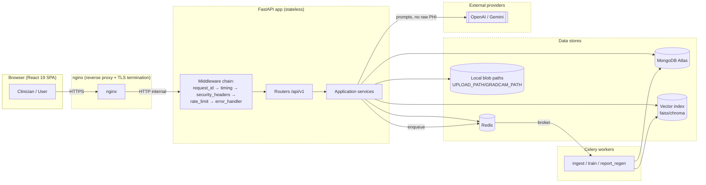
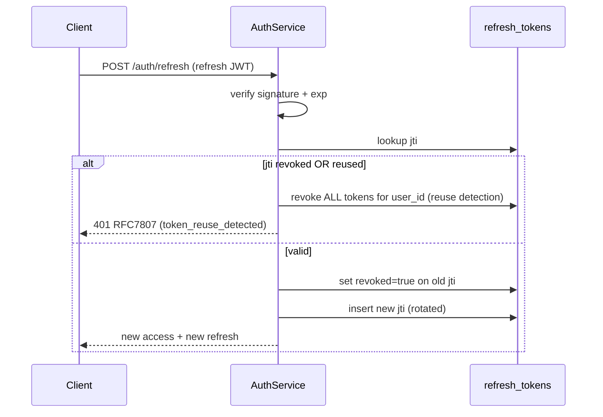
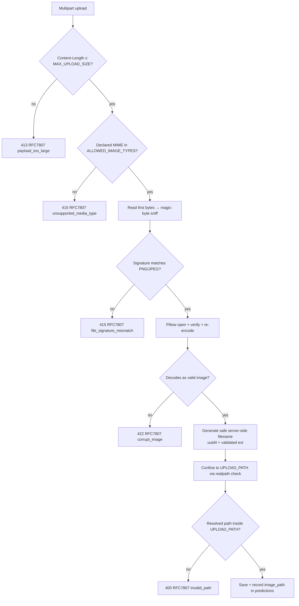

# 23 — Security

> **Product:** Advanced AI Medical Intelligence Platform (**AIMIP**)
> **Scope:** Threat model, application security controls, and healthcare/PHI safeguards for
> the AIMIP backend (FastAPI) and its adapters.
> **Baseline:** OWASP Top 10 (2021) + OWASP ASVS Level 1 (per [SRS §11](02_Software_Requirements_Specification.md)).

**Related docs:** [Authorization / RBAC](20_Authorization_RBAC.md) ·
[Logging](24_Logging.md) · [Monitoring](25_Monitoring.md) ·
[Background Jobs](26_Background_Jobs.md) · [API Design](18_API_Design.md) ·
[Database Design](17_Database_Design.md) · [Environment Configuration](31_Environment_Configuration.md)

---

## 1. Not-a-Medical-Device Disclaimer (authoritative)

> **AIMIP is a clinical decision-support tool, NOT a medical device.** All outputs
> (pneumonia classification, Grad-CAM overlays, LLM-generated reports, RAG answers) are
> **informational, not a diagnosis**. A **licensed clinician must review all results**
> before any clinical action. **No PHI may be uploaded without patient consent.** The
> platform is **not FDA/CE cleared**. This disclaimer is enforced in three places:
> 1. Persisted in every generated report (`reports.sections.disclaimer`).
> 2. Returned in the `POST /predict` and `POST /reports/{prediction_id}/regenerate` responses.
> 3. Rendered in the frontend before results are shown.

Security posture is therefore framed around **protecting PHI and clinician trust**, not
around device-safety certification.

---

## 2. Trust Boundaries & Data Flow



**Trust boundaries (each is an authentication/authorization/validation checkpoint):**

| # | Boundary | Control at the boundary |
|---|----------|-------------------------|
| B1 | Internet → nginx | TLS 1.2+, HSTS, rate limiting, request size cap |
| B2 | nginx → FastAPI | Internal network only; `X-Forwarded-For` normalized for real client IP |
| B3 | FastAPI middleware → router | JWT verification (`get_current_user`), `require_role`, input validation |
| B4 | Service → data store | Least-privilege DB user, parameterized Motor queries, path confinement |
| B5 | Service → external LLM | Egress allowlist, no raw PHI in prompts, API keys from secrets |
| B6 | API → Celery worker | Signed/validated job payloads over Redis, idempotency keys |

---

## 3. STRIDE Threat Model

| Threat (STRIDE) | Asset / Entry point | Attack scenario | Mitigation | OWASP |
|-----------------|---------------------|-----------------|------------|-------|
| **S**poofing | `POST /auth/login`, Bearer tokens | Stolen/forged JWT; credential stuffing | HS256 signature verify; bcrypt password hashing (`passlib[bcrypt]`); account lockout after `MAX_LOGIN_ATTEMPTS`/`LOCKOUT_MINUTES`; refresh-token rotation with `jti` in `refresh_tokens` | A07 |
| **S**poofing | Worker jobs on Redis | Rogue job injection into broker | Redis on private network + `REDIS_URL` auth; payloads validated against Pydantic schema; idempotency keys | A07 |
| **T**ampering | `POST /predict` multipart upload | Malicious/oversized image, polyglot file | `MAX_UPLOAD_SIZE` cap, `ALLOWED_IMAGE_TYPES` allowlist, **magic-byte sniffing**, Pillow re-encode, path-traversal prevention (§6) | A03, A08 |
| **T**ampering | MongoDB queries | NoSQL/operator injection via JSON body | Pydantic v2 strict models; Motor parameterized queries; never pass raw dict from client into filter | A03 |
| **T**ampering | `audit_logs` | Attacker edits/deletes audit trail | Append-only writes; no update/delete API; separate least-privilege role; retention policy (§10) | A08, A09 |
| **R**epudiation | Any PHI access or mutation | User denies performing an action | `audit_logs` records `actor_id, action, resource_type, resource_id, ip, user_agent` (see [Logging §4](24_Logging.md)); correlation IDs tie request to log | A09 |
| **I**nformation Disclosure | Error responses | Stack trace / internal detail leaked | RFC 7807 envelope with generic `detail` in production; internals only in structured server logs (§9) | A05 |
| **I**nformation Disclosure | Reports / Grad-CAM URLs | IDOR — user reads another user's data | `require_role` + ownership checks in services; object-scoped queries (`user_id` filter); `doctor`/`admin` overrides explicit | A01 |
| **I**nformation Disclosure | LLM prompts | PHI exfiltrated to third-party model | De-identify inputs before prompting; send image-derived features/findings, not identity; consent gating (§10) | A01, A02 |
| **I**nformation Disclosure | Logs | PHI/secrets written to logs | Redaction processor in structlog pipeline (see [Logging §5](24_Logging.md)) | A09 |
| **D**enial of Service | `/predict`, `/chat`, `/documents` | Flood of expensive ML/LLM calls | Per-route rate limiting (§7); async inference in threadpool; upload size cap; queue depth alerts ([Monitoring §5](25_Monitoring.md)) | A05 |
| **D**enial of Service | RAG ingestion | Huge PDF exhausts worker memory | `MAX_UPLOAD_SIZE`, page-count guard, chunk streaming, Celery time limits (see [Background Jobs §6](26_Background_Jobs.md)) | A05 |
| **E**levation of Privilege | Admin routes `/users`, `/settings` | Regular user calls admin endpoint | `require_role("admin")` dependency on every admin router; deny-by-default | A01 |
| **E**levation of Privilege | JWT claims | Client tampers `role` claim | Role is signed inside JWT and re-checked against `users.role` on sensitive ops; never trust client-supplied role | A01, A07 |
| **E**levation of Privilege | Dependencies | Vulnerable transitive package | `pip-audit` + Dependabot in CI (§11) | A06 |

---

## 4. Authentication & Token Lifecycle (JWT)

`AuthProvider` port, adapter `jwt` (`AUTH_PROVIDER=jwt`). Methods:
`create_access`, `create_refresh`, `verify`, `rotate`.

**Access token** — short-lived (`ACCESS_TOKEN_EXPIRE_MINUTES=30`), `HS256` signed with
`JWT_SECRET` / `JWT_ALGORITHM`. Claims: `sub` (user_id), `role`, `exp`, `iat`, `jti`.

**Refresh token** — long-lived (`REFRESH_TOKEN_EXPIRE_DAYS=7`), stored **hashed**
(`token_hash`) in `refresh_tokens` with a unique `jti`, plus `user_agent`, `ip`,
`expires_at` (TTL index), `revoked`.

### 4.1 Rotation & Revocation



- **Rotation:** every `/auth/refresh` issues a new refresh token and revokes the old `jti`
  (single-use). This limits replay windows.
- **Reuse detection:** if a previously-revoked `jti` is presented, **all** of that user's
  refresh tokens are revoked (assumed theft).
- **Logout:** `POST /auth/logout` sets `revoked=true` for the active `jti`.
- **Revocation check:** access tokens are stateless; for immediate revocation of sensitive
  sessions, the refresh chain and short access TTL bound exposure. Admin-forced logout
  revokes all `refresh_tokens` for the target `user_id`.
- **TTL cleanup:** MongoDB TTL index on `refresh_tokens.expires_at` purges expired rows.

Login throttling: `users.failed_login_attempts` increments on failure; when it reaches
`MAX_LOGIN_ATTEMPTS` the account is locked (`locked_until = now + LOCKOUT_MINUTES`).

---

## 5. Authorization (RBAC)

Enforced via the `require_role(...)` FastAPI dependency. Full matrix in
[20_Authorization_RBAC.md](20_Authorization_RBAC.md). Summary:

| Role | Scope |
|------|-------|
| `user` | Own `predictions`, `history`, `chat`, `reports` only |
| `doctor` | All `user` scope **+ read all** predictions/reports for clinical review |
| `admin` | Full: `users`, `settings`, `documents`, `audit_logs` |

**Deny-by-default:** every non-public router declares its required role; unauthenticated
access to anything other than `/auth/register`, `/auth/login`, `/health/*`, `/metrics`,
`/docs` is rejected. Ownership (object-level) checks live in the services, closing IDOR
(OWASP A01) beyond role checks alone.

---

## 6. Input Validation & File-Upload Security

### 6.1 General input validation

- **Pydantic v2** schemas (`interface/schemas/`) validate every request body/query with
  strict types, length bounds, and enums (e.g. `role`, `interval=day|week`).
- No client-supplied dict is ever passed directly into a Motor filter (NoSQL-injection safe).
- Path/ID params are typed and validated (ObjectId format) before any DB lookup.

### 6.2 Upload pipeline (`POST /predict`, `POST /documents`)



**Controls (all enforced server-side):**

| Control | Mechanism | ENV / source |
|---------|-----------|--------------|
| Size cap | Reject before buffering full body when possible; hard cap on read | `MAX_UPLOAD_SIZE` (10485760 B) |
| Type allowlist | Compare declared MIME against allowlist | `ALLOWED_IMAGE_TYPES=image/png,image/jpeg` |
| **Magic-byte sniffing** | Inspect leading bytes (PNG `89 50 4E 47 0D 0A 1A 0A`, JPEG `FF D8 FF`) — never trust the client `Content-Type` or extension | code |
| Re-encode / decompression-bomb guard | `Pillow` `Image.open().verify()` + re-save; bounded pixel dimensions to defeat bombs | code |
| **Path-traversal prevention** | Discard client filename; generate `uuid4` name; join to `UPLOAD_PATH`; `os.path.realpath` must be a prefix of the resolved `UPLOAD_PATH` (rejects `../`, absolute paths, symlinks) | `UPLOAD_PATH`, `GRADCAM_PATH`, `PDF_PATH` |
| OOD guard | Non-chest-X-ray images flagged (`predictions.ood_flag`) so garbage input is not silently "diagnosed" | ML pipeline |

PDF ingestion (`POST /documents`) applies the same size cap plus a page-count guard before
handing off to the async ingest job.

---

## 7. Network & Transport Controls

### 7.1 CORS allowlist

- Origins come **only** from `CORS_ORIGINS` (comma-separated; default
  `http://localhost:5173`). **No wildcard `*`** in staging/production.
- `allow_credentials=True`, explicit methods and headers, `Authorization` allowed.
- Configured once in `app/main.py`; a mismatched origin gets no CORS headers (browser blocks).

### 7.2 Security headers (Helmet-equivalent)

Applied by `interface/middleware/security_headers.py`:

| Header | Value (production) | Purpose |
|--------|--------------------|---------|
| `Strict-Transport-Security` | `max-age=63072000; includeSubDomains; preload` | Force HTTPS |
| `Content-Security-Policy` | `default-src 'self'; img-src 'self' data:; object-src 'none'; frame-ancestors 'none'` | XSS / injection mitigation |
| `X-Content-Type-Options` | `nosniff` | Block MIME sniffing |
| `X-Frame-Options` | `DENY` | Clickjacking |
| `Referrer-Policy` | `no-referrer` | Prevent URL leakage |
| `Permissions-Policy` | `geolocation=(), microphone=(), camera=()` | Disable unused APIs |
| `Cache-Control` (auth/PHI responses) | `no-store` | Prevent PHI caching |

Swagger (`/docs`) CSP is relaxed only enough to function and is disabled entirely in
production when `ENV=production` if required by policy.

### 7.3 Rate limiting

`interface/middleware/rate_limit.py`, backed by `CacheProvider` (`memory` for dev,
`redis` for multi-instance via `REDIS_URL`). Keyed on client IP + user id + route class.

| Route class | Limit (default) | Rationale |
|-------------|-----------------|-----------|
| `/auth/login`, `/auth/register` | 10 / min / IP | Brute-force / enumeration defense |
| `/predict` | 30 / min / user | Expensive ML inference |
| `/chat` | 60 / min / user | LLM cost + latency |
| `/documents` (upload) | 10 / min / user | Heavy ingestion jobs |
| Other authenticated GET | 300 / min / user | General fairness |

Exceeding a limit returns `429` in RFC 7807 form with a `Retry-After` header. Counters
surface as metrics (see [Monitoring §2](25_Monitoring.md)).

---

## 8. Secrets Management

- **Never hardcode secrets.** `JWT_SECRET`, `OPENAI_API_KEY`, `GEMINI_API_KEY`,
  `PINECONE_API_KEY`, `MONGODB_URI`, `REDIS_URL` all load via `pydantic-settings` from the
  environment (12-factor). `.env` is git-ignored; `.env.example` ships with **empty** values.
- **Fail-fast:** `LLM_PROVIDER=openai` with an empty `OPENAI_API_KEY` raises at startup
  (config validation), never at first request. `JWT_SECRET=change-me` is rejected when
  `ENV=production`.
- **Secrets-manager-ready:** `Settings` reads from the process environment, so a mounted
  secret (AWS Secrets Manager / GCP Secret Manager / Vault / K8s Secret) injected as an env
  var works with no code change. No secret is ever logged (redaction, [Logging §5](24_Logging.md))
  or returned by any endpoint (`GET /settings` exposes non-secret config only).
- Rotation of `JWT_SECRET` invalidates existing tokens by design; roll during a maintenance
  window or support dual-key verification if zero-downtime rotation is required.

---

## 9. Error Handling — RFC 7807 Without Leaking Internals

Central `error_handler` middleware (`interface/middleware/error_handler.py`) converts every
exception to the RFC 7807 envelope `{type, title, status, detail, instance, errors?}`.

- **Production:** `detail` is a **safe, generic** message; stack traces, DB errors, and
  provider messages are **only** written to structured server logs with the correlation id.
  The `instance` field carries the request path; the `X-Request-ID` correlates to the log.
- **Validation errors** (`422`) return field-level messages in `errors[]` — safe because
  they describe the client's own input, not server internals.
- **Never leaked:** exception class names, file paths, SQL/Mongo fragments, secret values,
  upstream provider raw errors.

```json
{
  "type": "https://aimip.dev/errors/prediction-failed",
  "title": "Prediction could not be completed",
  "status": 500,
  "detail": "An internal error occurred. Reference ID 4f1c... for support.",
  "instance": "/api/v1/predict"
}
```

The `Reference ID` equals the request/correlation id, letting support trace the full error
in logs without exposing internals to the client.

---

## 10. Healthcare / PHI Safeguards

### 10.1 Encryption in transit & at rest

| Layer | In transit | At rest |
|-------|-----------|---------|
| Client ↔ nginx | TLS 1.2+ (HSTS) | — |
| API ↔ MongoDB Atlas | TLS-enforced connection (`MONGODB_URI` with TLS) | Atlas encryption-at-rest (KMS-backed) |
| API ↔ Redis | TLS-capable `REDIS_URL` (rediss:// in prod) | Ephemeral; no long-lived PHI stored |
| Blob paths (`UPLOAD_PATH`, `GRADCAM_PATH`, `PDF_PATH`) | internal | Encrypted volume / filesystem-level encryption |

### 10.2 Audit logging (`audit_logs`)

Every access to or mutation of PHI is appended to `audit_logs`
(`actor_id, action, resource_type, resource_id, ip, user_agent, metadata, created_at`),
**append-only**. This satisfies the STRIDE Repudiation control and the accountability
requirement. Details and the audit-vs-application-log distinction are in
[24_Logging.md §4](24_Logging.md). Audit flushing is a background job
([26_Background_Jobs.md §3](26_Background_Jobs.md)).

### 10.3 Consent, de-identification & retention

- **Consent:** PHI (chest X-rays) must not be uploaded without patient consent; the upload
  flow records consent acknowledgement, and the disclaimer (§1) reiterates it.
- **De-identification:** filenames are replaced with `uuid4`; identity is not embedded in
  prompts sent to external LLMs — only image-derived findings. Reports reference internal
  ids, not patient identifiers.
- **Data retention:** predictions/reports/images are retained per policy and purged on a
  schedule; `refresh_tokens` auto-expire via TTL index; a retention job can de-identify or
  delete aged records (see [26_Background_Jobs.md](26_Background_Jobs.md)).
- **Right to erasure:** `DELETE /users/{id}` (admin) cascades to remove or de-identify the
  user's predictions, reports, chat history, and blobs.

---

## 11. Dependency & Supply-Chain Security

- **Scanning:** `pip-audit` (Python) and `npm audit` (frontend) run in
  [CI](.github) on every PR; Dependabot proposes version bumps. Builds fail on known
  high/critical CVEs (maps to **OWASP A06 — Vulnerable & Outdated Components**).
- **Pinned deps:** `requirements.txt` / `pyproject.toml` and `package-lock.json` pin
  versions for reproducible builds.
- **Static analysis:** `ruff` + `mypy` (backend), `ESLint` (frontend) in CI catch unsafe
  patterns early.
- **Container hygiene:** minimal base images; no secrets in image layers; image scan in CI.

---

## 12. OWASP Top 10 (2021) → Control Mapping

| OWASP | Risk | Where addressed |
|-------|------|-----------------|
| A01 | Broken Access Control | §5 RBAC, ownership checks, deny-by-default; §3 EoP rows |
| A02 | Cryptographic Failures | §4 HS256/bcrypt, §10.1 TLS + at-rest encryption |
| A03 | Injection | §6.1 Pydantic + parameterized Motor; NoSQL-injection safe |
| A04 | Insecure Design | Hexagonal ports, fail-fast config, STRIDE model §3 |
| A05 | Security Misconfiguration | §7 CORS allowlist + security headers + rate limiting; §8 fail-fast secrets |
| A06 | Vulnerable Components | §11 pip-audit / npm audit / Dependabot |
| A07 | Identification & Auth Failures | §4 token rotation/reuse detection, lockout |
| A08 | Software & Data Integrity | §6.2 upload integrity, §10.2 append-only audit |
| A09 | Logging & Monitoring Failures | [24_Logging](24_Logging.md), [25_Monitoring](25_Monitoring.md), §10.2 audit |
| A10 | SSRF | §7 egress allowlist to known LLM hosts; no user-controlled outbound URLs |

## 13. ASVS L1 Coverage Notes

AIMIP targets **OWASP ASVS Level 1**. Representative satisfied requirements: V2
(authentication — password hashing, lockout, token lifecycle §4), V3 (session — refresh
rotation/revocation §4.1), V4 (access control — RBAC §5), V5 (validation — §6), V7 (error
handling & logging — §9, [24](24_Logging.md)), V9 (communications — TLS §10.1), V12 (file
upload — §6.2), V14 (config — §7, §8). Gaps and roadmap items are tracked alongside the
security review checklist.
