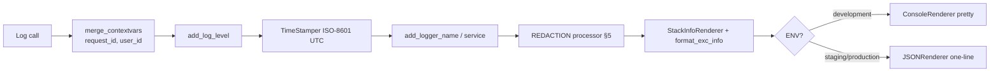
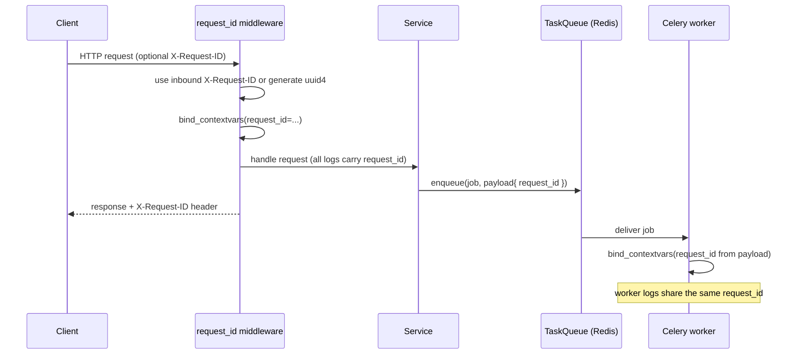

# 24 — Logging

> **Product:** Advanced AI Medical Intelligence Platform (**AIMIP**)
> **Scope:** Structured logging strategy for the FastAPI API and Celery workers —
> format, correlation, levels, redaction, audit trail, retention, and centralization.
> **Library:** `structlog` over the stdlib `logging` root, configured in `app/core/logging.py`.

**Related docs:** [Security](23_Security.md) · [Monitoring](25_Monitoring.md) ·
[Background Jobs](26_Background_Jobs.md) · [Database Design](17_Database_Design.md) ·
[Environment Configuration](31_Environment_Configuration.md)

---

## 1. Principles

1. **Structured, not stringly.** Every log line is a single-line JSON object (12-factor,
   [SRS §11](02_Software_Requirements_Specification.md)) — machine-parseable, greppable,
   aggregatable.
2. **Correlated.** Every line carries a `request_id` so a request can be reconstructed
   across middleware, services, and workers.
3. **Safe.** **No PHI and no secrets** ever reach application logs (§5 redaction).
4. **Two streams.** *Application logs* (operational, transient) are distinct from
   *audit logs* (`audit_logs` collection, durable, compliance) — see §4.
5. **Level-driven.** `LOG_LEVEL` (default `INFO`) is honored everywhere; log volume is a
   config decision, not a code change.

---

## 2. structlog Configuration

Configured once in `app/core/logging.py` and shared by API and workers. The processor
chain (order matters):



- **Development:** `ConsoleRenderer` (colorized, human-friendly).
- **Staging/Production:** `JSONRenderer` — one JSON object per line to stdout (12-factor;
  the container runtime/agent ships it onward, §8).
- **stdlib bridge:** uvicorn, FastAPI, Motor, and Celery loggers are routed through the
  same `structlog` formatter via a `ProcessorFormatter`, so third-party logs are also JSON.
- **Context propagation:** `structlog.contextvars` holds `request_id` (and `user_id` once
  authenticated) so no function needs to pass them explicitly.

---

## 3. Correlation / Request IDs



- **Ingress:** `interface/middleware/request_id.py` reads an inbound `X-Request-ID` (trusted
  from nginx) or generates a `uuid4`, binds it into `contextvars`, and echoes it back as the
  `X-Request-ID` response header. This id is the **Reference ID** shown in RFC 7807 errors
  ([Security §9](23_Security.md)).
- **Propagation to workers:** the `request_id` is placed in the job payload when
  `TaskQueue.enqueue(...)` is called; the Celery task re-binds it at the start of execution
  (see [Background Jobs §7](26_Background_Jobs.md)), so async ingestion/training logs join
  the originating request's trace.
- **Tracing linkage:** the same id is attached as an OpenTelemetry span attribute
  (`request_id`) so logs and traces cross-reference ([Monitoring §4](25_Monitoring.md)).

---

## 4. Audit Logs vs Application Logs

| | **Application logs** | **Audit logs** |
|---|----------------------|----------------|
| Purpose | Operations, debugging, performance | Compliance, accountability, PHI access trail |
| Sink | stdout → log aggregator (§8) | `audit_logs` MongoDB collection (append-only) |
| Schema | structlog JSON (§6) | `actor_id, action, resource_type, resource_id, ip, user_agent, metadata, created_at` |
| Mutability | Transient, rotated/expired | **Append-only**, never updated/deleted via API |
| Contains PHI? | **Never** | References resource **ids** only, never raw PHI |
| Written by | `logger.*` calls | `AuditService` on PHI access/mutation |
| Retention | §7 (short) | §7 (long, compliance-driven) |

**What is audited:** login/logout, token refresh & revocation, every prediction/report
read or create, document upload/delete, user administration, settings changes, and any
access to another user's data by `doctor`/`admin`. This backs the STRIDE **Repudiation**
control ([Security §3](23_Security.md)). The audit write path is buffered and flushed by a
background job to avoid blocking request latency ([Background Jobs §3](26_Background_Jobs.md)).

---

## 5. Sensitive-Data Redaction

A dedicated redaction processor sits in the structlog chain **before** any renderer, so no
sensitive value can be serialized:

- **Key-based redaction** — any field whose key matches the denylist is replaced with
  `"***REDACTED***"`: `password`, `password_hash`, `token`, `access_token`, `refresh_token`,
  `authorization`, `jwt`, `JWT_SECRET`, `OPENAI_API_KEY`, `GEMINI_API_KEY`,
  `PINECONE_API_KEY`, `MONGODB_URI`, `REDIS_URL`, `secret`, `api_key`.
- **PHI protection** — raw image bytes, upload filenames from clients, patient identifiers,
  and full LLM prompts/answers are **never logged**. Log the `prediction_id` /
  `document_id` / `image_path` (server-side uuid path), not the content.
- **Header scrubbing** — the `Authorization` header and cookies are stripped before request
  logging.
- **Value patterns** — Bearer-token and long-key-like substrings in free text are masked as
  a defense-in-depth backstop.
- **Fail-closed** — if the redactor errors on a field, the field is dropped rather than
  emitted raw.

This directly satisfies **OWASP A09** and the [Security §3](23_Security.md) Information
Disclosure controls.

---

## 6. Log Levels & Format

### 6.1 Levels (what each captures)

| Level | When used | Examples |
|-------|-----------|----------|
| `DEBUG` | Local/dev diagnostics; disabled in prod | Chunking counts, retrieval scores, model tensor shapes |
| `INFO` | Normal lifecycle & business events | Request start/finish, prediction completed, job enqueued/finished, user login |
| `WARNING` | Recoverable/abnormal but handled | Rate limit hit, OOD image flagged, LLM retry, RAG score < `RAG_MIN_SCORE` |
| `ERROR` | Operation failed, needs attention | Prediction failure, DB write error, provider call failed after retries |
| `CRITICAL` | App-level failure / unavailable dependency | Cannot reach MongoDB, config fail-fast at startup |

Default `LOG_LEVEL=INFO`. `access`-style request logs are `INFO`; health-probe polls
(`/health/live`, `/health/ready`) are logged at `DEBUG` to avoid noise.

### 6.2 Standard fields (every line)

`timestamp` (ISO-8601 UTC), `level`, `event`, `logger`, `service`
(`aimip-api` | `aimip-worker`), `request_id`, and when available `user_id`, `role`,
`method`, `path`, `status_code`, `duration_ms`.

### 6.3 Examples

Request completion (application log):

```json
{"timestamp":"2026-07-23T10:15:04.812Z","level":"info","event":"request.completed",
 "service":"aimip-api","request_id":"4f1c9a2e-...","user_id":"665f...","role":"doctor",
 "method":"POST","path":"/api/v1/predict","status_code":200,"duration_ms":4123}
```

Prediction lifecycle:

```json
{"timestamp":"2026-07-23T10:15:04.780Z","level":"info","event":"prediction.completed",
 "service":"aimip-api","request_id":"4f1c9a2e-...","prediction_id":"66a1...",
 "model_arch":"densenet121","predicted_class":"PNEUMONIA","confidence":0.94,
 "ood_flag":false,"inference_ms":390}
```

Redaction in action (secret never serialized):

```json
{"timestamp":"2026-07-23T10:16:22.001Z","level":"warning","event":"provider.retry",
 "service":"aimip-api","request_id":"4f1c9a2e-...","provider":"openai",
 "api_key":"***REDACTED***","attempt":2,"reason":"timeout"}
```

Worker log sharing the originating request_id:

```json
{"timestamp":"2026-07-23T10:20:31.500Z","level":"info","event":"ingest.chunk_embedded",
 "service":"aimip-worker","request_id":"4f1c9a2e-...","document_id":"66b2...",
 "chunk_index":42,"embedding_provider":"openai","dimension":1536}
```

Error (paired with a generic RFC 7807 response; internals stay in the log):

```json
{"timestamp":"2026-07-23T10:22:10.113Z","level":"error","event":"prediction.failed",
 "service":"aimip-api","request_id":"7b0e...","prediction_id":"66a2...",
 "error_type":"RuntimeError","exc_info":"Traceback (most recent call last)... "}
```

---

## 7. Retention

| Stream | Retention (default) | Mechanism |
|--------|---------------------|-----------|
| Application logs (aggregator) | 30 days hot, 90 days cold/archive | Aggregator lifecycle policy (§8) |
| Application logs (container stdout) | Ring-buffered by runtime | Docker/K8s log rotation (size + count caps) |
| `audit_logs` (compliance) | Long-term per healthcare policy | Retained; de-identification/retention job ([26 §3](26_Background_Jobs.md)) |
| `refresh_tokens` events | Token TTL (`REFRESH_TOKEN_EXPIRE_DAYS`) | Mongo TTL index on `expires_at` |

Retention aligns with the PHI data-retention policy in [Security §10.3](23_Security.md).

---

## 8. Centralization Strategy

- **12-factor:** the app treats logs as an event stream to **stdout**; it does not manage
  log files. The platform (Docker/K8s + a collector) handles shipping.
- **Collection:** a node/sidecar agent (e.g. Fluent Bit / Vector / Promtail) tails container
  stdout and forwards JSON lines to a central store (e.g. Loki / Elasticsearch / OpenSearch /
  a managed logging service).
- **Correlation across services:** because API and worker lines share `request_id`, a single
  query reconstructs an end-to-end flow spanning HTTP handling and async ingestion.
- **Cross-signal pivot:** `request_id` also appears as a trace attribute and in RFC 7807
  error `instance`/Reference IDs, so logs ↔ traces ↔ user-reported errors all join
  ([Monitoring §4](25_Monitoring.md), [Security §9](23_Security.md)).
- **Access control:** log store access is restricted; because PHI is redacted at source,
  logs are safe to centralize while `audit_logs` remain in MongoDB under RBAC.
- **Alerting on logs:** error-rate and specific `event` spikes feed alerting rules described
  in [Monitoring §5](25_Monitoring.md).
