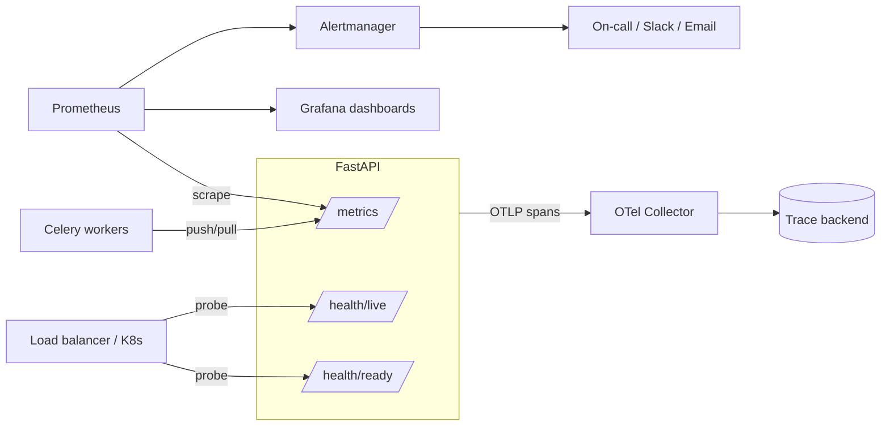
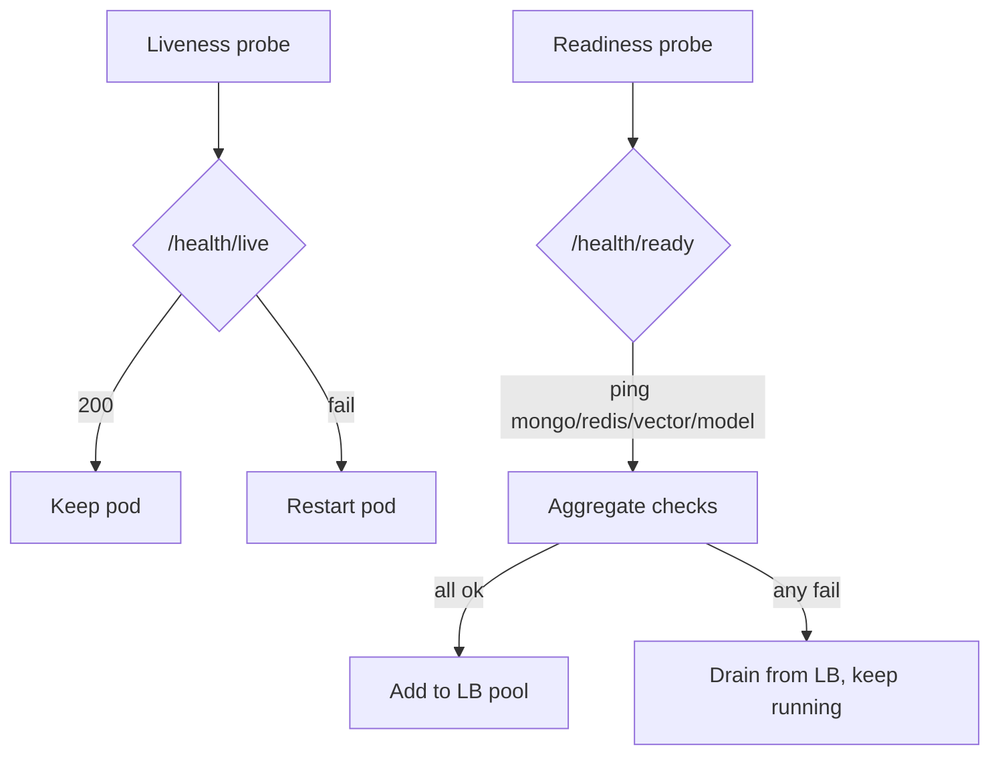

# 25 — Monitoring & Observability

> **Product:** Advanced AI Medical Intelligence Platform (**AIMIP**)
> **Scope:** Metrics, health probes, tracing, dashboards, alerting, and runbooks for the
> FastAPI API and Celery workers.
> **Stack:** `prometheus-client` (metrics) + OpenTelemetry (tracing) + `structlog`
> ([24_Logging.md](24_Logging.md)) — the three observability signals.

**Related docs:** [Logging](24_Logging.md) · [Security](23_Security.md) ·
[Background Jobs](26_Background_Jobs.md) · [SRS §11 NFRs](02_Software_Requirements_Specification.md) ·
[API Design](18_API_Design.md)

---

## 1. Observability Model

Three correlated signals, joined by `request_id`:

| Signal | Tool | Endpoint / Sink | Doc |
|--------|------|-----------------|-----|
| Metrics | `prometheus-client` | `GET /metrics` | this doc |
| Logs | `structlog` (JSON) | stdout → aggregator | [24](24_Logging.md) |
| Traces | OpenTelemetry | OTLP → collector | §4 |

---

## 2. Prometheus Metrics Catalog

Exposed at `GET /metrics` (no auth, internal network only — see §3.4). Metric names use the
`aimip_` prefix. Standard labels: `method`, `path` (route template, not raw), `status_code`,
`provider`, `job_name`, `outcome`.

### 2.1 HTTP / API

| Metric | Type | Labels | Meaning |
|--------|------|--------|---------|
| `aimip_http_requests_total` | Counter | `method`, `path`, `status_code` | Total requests (drives throughput & error rate) |
| `aimip_http_request_duration_seconds` | Histogram | `method`, `path` | Request latency; buckets tuned for p95 < 300 ms SLO |
| `aimip_http_requests_in_progress` | Gauge | `path` | Concurrent in-flight requests |
| `aimip_rate_limit_rejections_total` | Counter | `path` | 429s from rate limiter ([Security §7.3](23_Security.md)) |
| `aimip_auth_login_failures_total` | Counter | `outcome` | Failed logins / lockouts (security signal) |

### 2.2 ML prediction

| Metric | Type | Labels | Meaning |
|--------|------|--------|---------|
| `aimip_prediction_latency_seconds` | Histogram | `model_arch` | End-to-end predict time (SLO < 6 s p95) |
| `aimip_prediction_inference_seconds` | Histogram | `model_arch` | Model forward pass only (threadpool) |
| `aimip_predictions_total` | Counter | `model_arch`, `predicted_class`, `outcome` | Predictions by class & success/failure |
| `aimip_prediction_ood_flag_total` | Counter | — | OOD (non-chest-X-ray) rejections |
| `aimip_gradcam_duration_seconds` | Histogram | — | Grad-CAM generation time |

### 2.3 LLM & embeddings (RAG / reports)

| Metric | Type | Labels | Meaning |
|--------|------|--------|---------|
| `aimip_llm_call_latency_seconds` | Histogram | `provider`, `model` | `AIProvider.generate/stream` latency |
| `aimip_llm_calls_total` | Counter | `provider`, `model`, `outcome` | LLM calls, success vs error |
| `aimip_llm_errors_total` | Counter | `provider`, `reason` | LLM failures (timeout, rate_limit, http_error) |
| `aimip_embedding_call_latency_seconds` | Histogram | `provider` | `EmbeddingProvider.embed` latency |
| `aimip_embedding_errors_total` | Counter | `provider`, `reason` | Embedding failures |
| `aimip_rag_retrieval_score` | Histogram | — | Top retrieval scores (watch vs `RAG_MIN_SCORE`) |
| `aimip_rag_insufficient_context_total` | Counter | — | Answers refused for low score |

### 2.4 Background jobs / queue

| Metric | Type | Labels | Meaning |
|--------|------|--------|---------|
| `aimip_queue_depth` | Gauge | `queue` | Pending tasks in Redis broker (backpressure) |
| `aimip_job_duration_seconds` | Histogram | `job_name` | Task execution time |
| `aimip_jobs_total` | Counter | `job_name`, `outcome` | Jobs succeeded/failed/retried |
| `aimip_job_retries_total` | Counter | `job_name` | Retry attempts ([26 §6](26_Background_Jobs.md)) |
| `aimip_dead_letter_total` | Counter | `job_name` | Tasks sent to dead-letter after exhausting retries |
| `aimip_audit_flush_lag_seconds` | Gauge | — | Age of oldest un-flushed audit entry |

### 2.5 Dependency health

| Metric | Type | Labels | Meaning |
|--------|------|--------|---------|
| `aimip_dependency_up` | Gauge | `dependency` | 1/0 for `mongodb`, `redis`, `vector_db`, `model` |
| `aimip_build_info` | Gauge | `version`, `model_version`, `env` | Static build/version info |

Python runtime metrics (GC, process CPU/RSS, FDs) come free from `prometheus-client`'s
default collectors.

---

## 3. Endpoints & Health Probes

### 3.1 `GET /metrics`
Prometheus text exposition of everything in §2. Internal-only (§3.4).

### 3.2 `GET /health/live` (liveness)
Cheap, dependency-free. Confirms the process is up and the event loop responsive. Returns
`200 {"status":"alive"}`. **Never** touches MongoDB/Redis — a failing dependency must not
cause the orchestrator to kill an otherwise-healthy pod. Used by the K8s/Compose liveness
probe.

### 3.3 `GET /health/ready` (readiness)
Verifies the app can serve traffic by checking critical dependencies:

| Check | How | Fail behavior |
|-------|-----|---------------|
| MongoDB | `ping` on the Motor client | `503` if unreachable |
| Redis | `PING` (when `CACHE_PROVIDER=redis` or `TASK_QUEUE=celery`) | `503` |
| Vector store | index loaded / reachable (`VECTOR_DB`) | `503` (or degraded, see below) |
| Model weights | `MODEL_PATH` loaded into memory | `503` if model not ready |
| Config | fail-fast validation passed at startup | process would not have started |

Returns `200 {"status":"ready","checks":{...}}` or `503` with the failing component named
(no internals leaked). The load balancer routes traffic only to `ready` instances; a
temporarily un-ready instance is drained, not killed (that's liveness' job).

### 3.4 Exposure & security
`/metrics`, `/health/live`, `/health/ready` carry **no `/api/v1` prefix** and require no
JWT. In production they are reachable only from the internal network / scrape target
(nginx does not proxy `/metrics` to the internet). Health-probe polls are logged at `DEBUG`
to avoid log noise ([Logging §6.1](24_Logging.md)).

---

## 4. OpenTelemetry Tracing Hooks

- **Instrumentation:** FastAPI/ASGI, `httpx` (LLM/embedding outbound), Motor, and Redis are
  auto-instrumented; custom spans wrap `PredictionService.predict`, Grad-CAM, the RAG
  pipeline stages (load → clean → chunk → embed → retrieve → rerank → answer), and each
  Celery task.
- **Correlation:** every span carries `request_id` as an attribute so a trace joins its
  structured logs ([Logging §3](24_Logging.md)) and any RFC 7807 error Reference ID
  ([Security §9](23_Security.md)).
- **Context propagation into workers:** trace context is passed in the job payload alongside
  `request_id`, so an ingestion span is a child of the originating HTTP request span
  ([Background Jobs §7](26_Background_Jobs.md)).
- **Export:** spans go over **OTLP** to a collector, then to a trace backend (Jaeger /
  Tempo / vendor). Sampling is head-based (configurable rate) with always-sample on error.
- **What tracing answers:** "where did the 6 s go?" — splitting predict latency across
  decode, inference (threadpool), Grad-CAM, LLM report generation, and DB writes.

---

## 5. Dashboards, SLOs & Alerting

### 5.1 SLOs (from [CANON §11 / SRS §11](02_Software_Requirements_Specification.md))

| SLO | Target | Metric |
|-----|--------|--------|
| Availability | ≥ 99.5% | `aimip_dependency_up`, probe success, error rate |
| API latency (excl. model/LLM) | p95 < 300 ms | `aimip_http_request_duration_seconds` |
| Prediction end-to-end | p95 < 6 s | `aimip_prediction_latency_seconds` |
| API error rate | < 1% of requests | 5xx / total from `aimip_http_requests_total` |

### 5.2 Dashboards (Grafana)

1. **API Overview** — request rate, error rate, p50/p95/p99 latency, in-flight, rate-limit
   rejections.
2. **Prediction & ML** — prediction p95 vs 6 s SLO, inference vs Grad-CAM split, OOD rate,
   class distribution.
3. **LLM & RAG** — LLM/embedding latency & error rate by provider, retrieval score
   distribution, insufficient-context rate.
4. **Background Jobs** — queue depth, job duration, retries, dead-letter count, audit flush
   lag.
5. **Platform Health** — dependency up/down, build/version info, process CPU/RSS/GC.

### 5.3 Alerting rules (Alertmanager → on-call)

| Alert | Condition | Severity | Runbook |
|-------|-----------|----------|---------|
| `APIHighErrorRate` | 5xx rate > 1% for 5 min | critical | §6 |
| `APILatencySLOBreach` | `http_request_duration_seconds` p95 > 300 ms for 10 min | warning | §6 |
| `PredictionLatencySLOBreach` | `prediction_latency_seconds` p95 > 6 s for 10 min | warning | §6 |
| `DependencyDown` | `aimip_dependency_up == 0` for 1 min | critical | §6 |
| `ReadinessFailing` | `/health/ready` failing on > 25% instances | critical | §6 |
| `LLMErrorSpike` | `rate(aimip_llm_errors_total) > threshold` for 5 min | warning | §6 |
| `QueueBacklog` | `aimip_queue_depth > 100` for 10 min | warning | [26](26_Background_Jobs.md) |
| `DeadLetterGrowing` | `increase(aimip_dead_letter_total) > 0` in 15 min | warning | [26 §8](26_Background_Jobs.md) |
| `AuditFlushLag` | `aimip_audit_flush_lag_seconds > 300` | critical | [26 §3](26_Background_Jobs.md) |
| `LoginFailureSpike` | `rate(aimip_auth_login_failures_total)` abnormal | warning | [Security §4](23_Security.md) |

---

## 6. Runbooks

Each alert links to a runbook. Standard structure — **Symptom → Check → Mitigate → Verify**:

- **APIHighErrorRate / APILatencySLOBreach** — check the API Overview dashboard and error
  logs filtered by `request_id`; identify the failing route/dependency; scale API replicas
  (stateless, horizontally scalable per [SRS §11](02_Software_Requirements_Specification.md))
  or roll back; verify error rate returns < 1%.
- **DependencyDown / ReadinessFailing** — read `/health/ready` payload for the named failing
  component (mongodb/redis/vector/model); confirm `MONGODB_URI`/`REDIS_URL` reachability and
  `MODEL_PATH` presence; restore the dependency; verify probes green and instances back in
  the LB pool.
- **PredictionLatencySLOBreach** — use tracing (§4) to split predict latency; check
  threadpool saturation and `MODEL_ARCH`; scale workers/replicas; verify p95 < 6 s.
- **LLMErrorSpike** — inspect `aimip_llm_errors_total` by `reason` and provider; check
  provider status / API keys / rate limits; failover `LLM_PROVIDER` to `gemini` or `mock`
  if warranted; verify error rate normal.
- **QueueBacklog / DeadLetterGrowing / AuditFlushLag** — scale Celery workers, inspect
  dead-letter entries, and follow [Background Jobs §8](26_Background_Jobs.md).

Runbooks live alongside the deployment/operations docs and are linked from Alertmanager
annotations.
