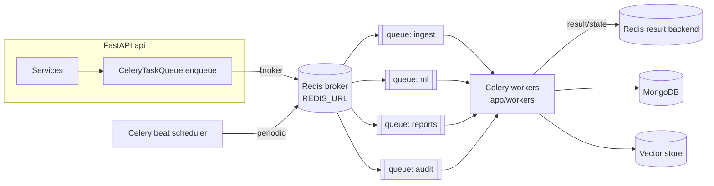
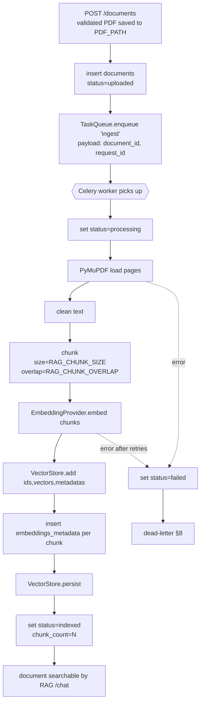
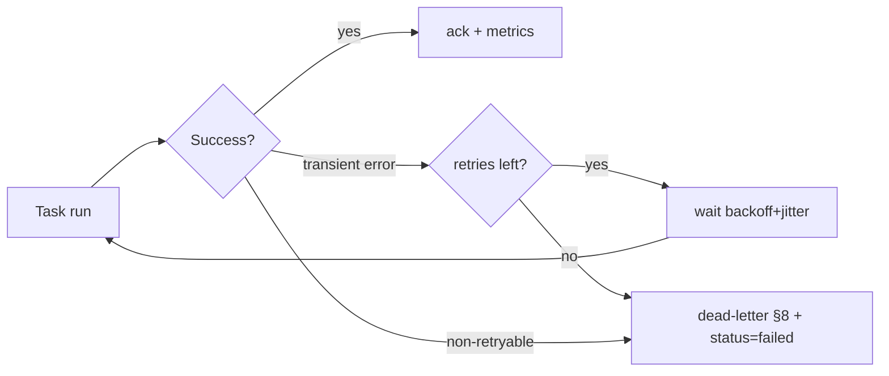

# 26 — Background Jobs

> **Product:** Advanced AI Medical Intelligence Platform (**AIMIP**)
> **Scope:** Asynchronous work — the `TaskQueue` port, its `inprocess`/`celery` adapters,
> the Celery + Redis topology, job catalog, retries, idempotency, scheduling, dead-letter
> handling, and worker deployment.
> **Selector:** `TASK_QUEUE` (`inprocess` | `celery`).

**Related docs:** [Monitoring](25_Monitoring.md) · [Logging](24_Logging.md) ·
[Security](23_Security.md) · [Database Design](17_Database_Design.md) ·
[API Design](18_API_Design.md) · [Environment Configuration](31_Environment_Configuration.md)

---

## 1. The `TaskQueue` Port

Business logic never imports Celery. It depends only on the `TaskQueue` ABC
(`domain/ports/`), obtained from the composition root; the concrete adapter is chosen at
startup by `get_task_queue_provider(settings)` in
`infrastructure/providers/task_queue/factory.py` based on `TASK_QUEUE`.

```python
# domain/ports/task_queue.py  (contract — enforced by tests/contract/)
class TaskQueue(ABC):
    @abstractmethod
    def enqueue(self, job_name: str, payload: dict) -> str: ...   # returns task_id
    @abstractmethod
    def schedule(self, job_name: str, payload: dict, *, eta=None, countdown=None) -> str: ...
```

| Adapter | `TASK_QUEUE` | Behavior | Use |
|---------|--------------|----------|-----|
| `InProcessTaskQueue` | `inprocess` | Runs the job in a FastAPI `BackgroundTask` / threadpool, same process | Dev, tests, single-node; no Redis needed |
| `CeleryTaskQueue` | `celery` | Publishes to the Celery app over the Redis broker | Staging/production, horizontal scale |

Both adapters pass the same **shared contract test** in `tests/contract/`
([CANON §3](_CANON.md)); swapping `TASK_QUEUE` in `.env` is itself an automated test. The
`enqueue`/`schedule` signature is identical, so services (`DocumentService`,
`ReportService`, training trigger, `AuditService`) are agnostic to the backend.

---

## 2. Celery + Redis Topology



- **Celery app:** defined in `app/workers/` (`celery_app`), broker & result backend both
  `REDIS_URL`. Tasks registered: `ingest`, `train`, `report_regen`, `audit_flush`.
- **Queues:** logical routing (`ingest`, `ml`, `reports`, `audit`) so heavy ingestion/
  training cannot starve quick jobs; workers subscribe per capacity.
- **Serialization:** JSON only (no pickle — security). Payloads validated against Pydantic
  schemas on both enqueue and execute.
- **Config from ENV:** broker/backend from `REDIS_URL`; DB access from `MONGODB_URI` /
  `DB_NAME`; providers resolved via the same factories as the API.

---

## 3. Job Catalog

| Job (`job_name`) | Queue | Trigger | Purpose | Writes |
|------------------|-------|---------|---------|--------|
| `ingest` | `ingest` | `POST /documents` | PDF → load (PyMuPDF) → clean → chunk (`RAG_CHUNK_SIZE`/`RAG_CHUNK_OVERLAP`) → `EmbeddingProvider.embed` → `VectorStore.add` + `persist` → index | `documents.status/chunk_count`, `embeddings_metadata`, vector index |
| `train` | `ml` | `scripts/train.py` / admin trigger | Model training (transfer learning, AdamW, early stopping) → checkpoint | `MODEL_PATH` weights, metrics |
| `report_regen` | `reports` | `POST /reports/{prediction_id}/regenerate` | Rebuild LLM report (Builder) via `AIProvider` for an existing prediction | `reports` document |
| `audit_flush` | `audit` | Periodic (beat) + buffer-full | Flush buffered audit entries to `audit_logs` (append-only) | `audit_logs` |

All jobs re-bind the `request_id` from the payload for log/trace correlation
([Logging §3](24_Logging.md), [Monitoring §4](25_Monitoring.md)) and emit
`aimip_jobs_total` / `aimip_job_duration_seconds` metrics ([Monitoring §2.4](25_Monitoring.md)).

---

## 4. Document Ingestion Job (detail)

`POST /documents` accepts the PDF (after size/type/magic-byte validation,
[Security §6.2](23_Security.md)), creates a `documents` record with `status=uploaded`, and
enqueues `ingest`. The endpoint returns immediately (async), so the request stays fast.



Idempotency: re-running `ingest` for the same `document_id` first clears any partial
`embeddings_metadata`/vectors for that document (keyed on `document_id`) before re-indexing,
so a retry never double-inserts chunks (§5).

---

## 5. Idempotency

| Job | Idempotency key | Guarantee |
|-----|-----------------|-----------|
| `ingest` | `document_id` | Partial chunks/vectors for the document are purged before (re)indexing; `chunk_count` reflects the final state |
| `predict`-driven flow | `predictions.idempotency_key` (from `Idempotency-Key` header) | A repeated `POST /predict` returns the existing prediction instead of recomputing ([API §7](18_API_Design.md)) |
| `report_regen` | `prediction_id` | Regeneration replaces the single `reports` doc for that prediction (upsert), not append |
| `audit_flush` | per-entry `_id` | Entries are marked flushed; a re-run skips already-persisted rows (append-only, no dup) |

Tasks are designed to be **at-least-once** delivered and **idempotent**, so redelivery after
a worker crash is safe.

---

## 6. Retry & Backoff

- **Policy:** transient failures (network, provider timeout/rate-limit, DB blip) are retried
  with **exponential backoff + jitter**. Defaults: `max_retries=5`,
  `retry_backoff=True` (base ~2 s), `retry_backoff_max=600 s`, `retry_jitter=True`.
- **Non-retryable:** validation errors, unsupported files, and `status=failed` business
  outcomes are **not** retried — they go straight to `failed` + dead-letter (§8).
- **Time limits:** each task has a `soft_time_limit` (graceful, raises to allow cleanup) and
  a hard `time_limit` to bound runaway ingestion/training and protect worker memory
  ([Security §3 DoS](23_Security.md)).
- **Visibility:** retries increment `aimip_job_retries_total`; exhausted retries increment
  `aimip_dead_letter_total` ([Monitoring §2.4](25_Monitoring.md)); each attempt logs at
  `WARNING` with `request_id` and attempt number ([Logging §6](24_Logging.md)).



---

## 7. Correlation & Context Propagation

`TaskQueue.enqueue(job_name, payload)` always injects `request_id` (and OpenTelemetry trace
context) into `payload`. The task re-binds them via `structlog.contextvars` at start, so
worker logs share the originating request's `request_id` and the ingestion span is a child
of the HTTP request span. This closes the trace across the async boundary
([Logging §3](24_Logging.md), [Monitoring §4](25_Monitoring.md)).

---

## 8. Dead-Letter Handling

- Tasks that exhaust retries or raise a non-retryable error are routed to a **dead-letter
  queue** (`<queue>.dlq`) and the owning record is marked terminal
  (`documents.status=failed`, `predictions.status=failed`).
- Dead-letter entries retain the full payload (with `request_id`), error type, and attempt
  count for diagnosis — **no PHI/secrets**, consistent with redaction
  ([Logging §5](24_Logging.md)).
- **Alerting:** `DeadLetterGrowing` fires when `increase(aimip_dead_letter_total) > 0` in a
  15-min window ([Monitoring §5.3](25_Monitoring.md)); on-call inspects, fixes root cause,
  and can **replay** a dead-lettered job (idempotency §5 makes replay safe).
- Poison messages (repeatedly failing) stay in the DLQ rather than looping the main queue,
  preserving throughput for healthy jobs.

---

## 9. Scheduling (Celery beat)

| Schedule | Job | Purpose |
|----------|-----|---------|
| Every 30 s (and on buffer-full) | `audit_flush` | Keep `aimip_audit_flush_lag_seconds` low ([Monitoring §5.3](25_Monitoring.md)) |
| Nightly | data-retention / de-identification sweep | Enforce PHI retention ([Security §10.3](23_Security.md)) |
| On-demand / off-peak | `train` | Model refresh when a new dataset/checkpoint is warranted |

Beat runs as a single dedicated process to avoid duplicate schedules. With
`TASK_QUEUE=inprocess` (dev), periodic work falls back to lightweight in-app timers, and
`train`/`ingest` run synchronously in the background task — no beat/broker required.

---

## 10. Worker Deployment

- **Process model:** workers run from `app/workers/` as separate containers, independent of
  the API, so ML/ingestion load never impacts API p95 ([SRS §11](02_Software_Requirements_Specification.md)).
- **docker-compose services:** `api`, `worker` (Celery), `beat` (scheduler), `redis`,
  `mongodb` (dev). Workers and API share the same image/config but different entrypoints.
- **Concurrency & routing:** the `ingest`/`reports`/`audit` workers use higher concurrency;
  the `ml` (train) worker runs low concurrency (CPU/GPU-bound) on its own pool. Prefetch is
  limited so long tasks don't hog reserved messages.
- **Scaling:** stateless workers scale horizontally on `aimip_queue_depth`
  ([Monitoring §5.3](25_Monitoring.md)); add replicas to the `ingest`/`ml` queues under
  backlog.
- **Health:** worker liveness via Celery ping / heartbeat; the API's `/health/ready` checks
  Redis reachability so a broker outage is visible ([Monitoring §3.3](25_Monitoring.md)).
- **Graceful shutdown:** workers finish in-flight tasks on SIGTERM (bounded by
  `soft_time_limit`); at-least-once delivery + idempotency (§5) make restarts safe.
- **Secrets/config:** workers read the same ENV (`REDIS_URL`, `MONGODB_URI`, provider keys)
  from the environment/secrets manager, never hardcoded ([Security §8](23_Security.md)).
