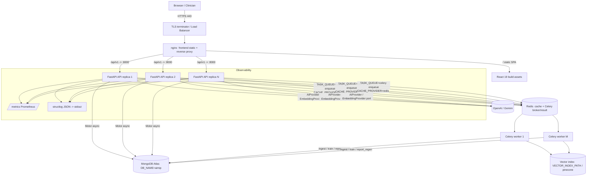
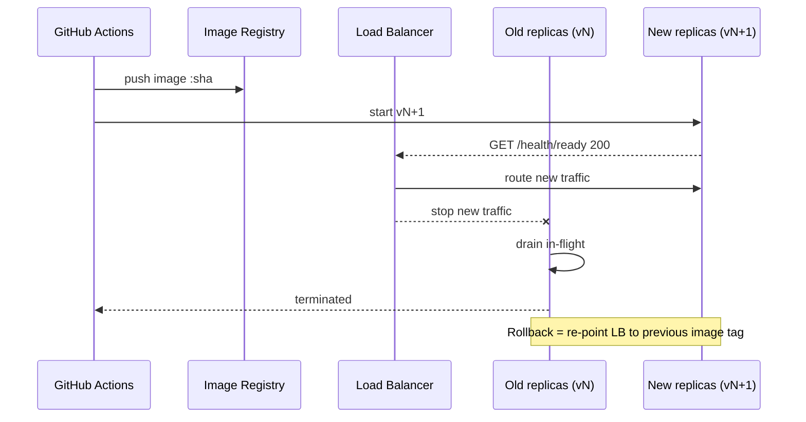

# 28 — Deployment

> Part of the **Advanced AI Medical Intelligence Platform (AIMIP)** documentation set.
> Canonical names, ENV vars, ports and services are defined in [`_CANON.md`](_CANON.md).
> Related: [27_Testing_Strategy](27_Testing_Strategy.md) · [29_Docker](29_Docker.md) ·
> [30_CICD](30_CICD.md) · [31_Environment_Configuration](31_Environment_Configuration.md) ·
> [02_Software_Requirements_Specification](02_Software_Requirements_Specification.md) ·
> [17_Database_Design](17_Database_Design.md) · [18_API_Design](18_API_Design.md).

**Disclaimer:** AIMIP is clinical **decision-support**, not a medical device; outputs are
informational, not a diagnosis, and a licensed clinician must review all results. No PHI is
uploaded without consent; the platform is not FDA/CE cleared.

> **Environment note:** Docker is **not installed** on the current dev machine
> ([`_CANON.md`](_CANON.md) §1). All container/compose assets ([29_Docker](29_Docker.md)) are
> authored and committed now and **run later** on a machine/CI runner that has Docker. This
> document therefore covers both container-based deployment and the current
> local-without-Docker fallback.

---

## 1. Twelve-factor configuration

AIMIP follows the [12-factor](https://12factor.net) methodology
([`_CANON.md`](_CANON.md) §11 — "12-factor config"):

| Factor | AIMIP realization |
|--------|-------------------|
| I. Codebase | Single monorepo ([`_CANON.md`](_CANON.md) §4), many deploys per environment |
| II. Dependencies | `requirements.txt`/`pyproject.toml` (backend), `package.json` (frontend); no implicit system deps |
| III. **Config** | **Everything** in ENV — the exact set in [`_CANON.md`](_CANON.md) §5, validated by `pydantic-settings` (see [31_Environment_Configuration](31_Environment_Configuration.md)). No secrets in code or image. |
| IV. Backing services | MongoDB Atlas, Redis, vendor LLM/embeddings are attached resources selected by ENV (`MONGODB_URI`, `REDIS_URL`, `LLM_PROVIDER`, …) — swappable without code change |
| V. Build, release, run | CI builds an immutable image ([30_CICD](30_CICD.md)); release = image + config; run = container process |
| VI. Processes | API, Celery workers are **stateless** — no session affinity, no local disk state that must survive |
| VII. Port binding | uvicorn binds `:8000`; nginx binds `:80`/`:443` |
| VIII. Concurrency | Scale out by process/replica: N API replicas + M Celery workers ([`_CANON.md`](_CANON.md) §11 stateless horizontal API) |
| IX. Disposability | Fast startup (lifespan warms model + indexes), graceful shutdown drains in-flight requests/tasks |
| X. Dev/prod parity | Same image across `staging`/`production`; only ENV differs (`ENV=development|staging|production`) |
| XI. Logs | Structured JSON to stdout via `structlog` — collected by the platform, never written to files |
| XII. Admin processes | One-off scripts (`scripts/seed_db.py`, `scripts/ingest_docs.py`, `scripts/train.py`) run as the same image with a different entrypoint |

**Config fails fast** ([`_CANON.md`](_CANON.md) §5): e.g. `LLM_PROVIDER=openai` with empty
`OPENAI_API_KEY` raises at startup, so a misconfigured release never accepts traffic. Details
in [31_Environment_Configuration](31_Environment_Configuration.md).

---

## 2. Environments

Selected by the `ENV` variable (`development|staging|production`, [`_CANON.md`](_CANON.md) §5).

| Aspect | development | staging | production |
|--------|-------------|---------|------------|
| `ENV` | `development` | `staging` | `production` |
| `LOG_LEVEL` | `DEBUG`/`INFO` | `INFO` | `INFO` (or `WARNING`) |
| Providers | `LLM_PROVIDER=mock`, `CACHE_PROVIDER=memory`, `TASK_QUEUE=inprocess`, `VECTOR_DB=faiss` | real or mock; `CACHE_PROVIDER=redis`, `TASK_QUEUE=celery` | `LLM_PROVIDER=openai\|gemini`, `CACHE_PROVIDER=redis`, `TASK_QUEUE=celery` |
| Data store | local Mongo / Atlas dev cluster (`DB_NAME=aimip`) | Atlas staging cluster | Atlas production cluster (dedicated tier) |
| `CORS_ORIGINS` | `http://localhost:5173` | staging domain | production domain(s) |
| `VITE_API_BASE_URL` | `http://localhost:8000/api/v1` | `https://staging.…/api/v1` | `https://app.…/api/v1` |
| Secrets | `.env` (gitignored) | secret manager | secret manager |
| TLS | none (localhost) | full TLS | full TLS (HSTS) |
| Scaling | single process | 1–2 replicas | N replicas, autoscaled |

`.env.example` files ([`_CANON.md`](_CANON.md) §4) ship for both `backend/` and `frontend/`;
the concrete `.env` is environment-specific and never committed
([31_Environment_Configuration](31_Environment_Configuration.md)).

---

## 3. Topology



### 3.1 Services ([`_CANON.md`](_CANON.md) §1, §4 — mapped to compose services in [29_Docker](29_Docker.md))

| Service | Image / process | Port | State | Scaling |
|---------|-----------------|------|-------|---------|
| **frontend** | nginx serving React 19 build + reverse proxy | 80/443 | stateless | horizontal (behind LB) |
| **backend (API)** | `uvicorn[standard]` running FastAPI | 8000 | **stateless** | horizontal (N replicas) |
| **worker** | Celery worker (same image, different entrypoint) | — | stateless | horizontal (M workers) |
| **mongo** | MongoDB Atlas (managed) — local `mongo` container in dev only | 27017 | **stateful** | Atlas-managed replica set |
| **redis** | Redis — cache (`CACHE_PROVIDER=redis`) + Celery broker/result (`TASK_QUEUE=celery`) | 6379 | ephemeral/stateful | managed or replicated |

The vector index (`VECTOR_INDEX_PATH`, `VECTOR_DB=faiss`) is persisted on a shared volume or
externalized to `pinecone` for multi-replica correctness — see §5.2.

---

## 4. Reverse proxy, TLS & security headers

nginx serves the SPA and proxies `/api/v1` to the API ([`_CANON.md`](_CANON.md) §1 —
"nginx (frontend serve + reverse proxy)"). Concrete `nginx.conf` lives at
`frontend/nginx.conf` ([`_CANON.md`](_CANON.md) §4); the container build is in
[29_Docker](29_Docker.md).

```nginx
# frontend/nginx.conf (production reverse proxy sketch)
server {
    listen 80;
    server_name _;
    root /usr/share/nginx/html;

    # SPA history-mode fallback
    location / {
        try_files $uri $uri/ /index.html;
    }

    # Reverse proxy to the FastAPI backend (service DNS name 'backend')
    location /api/v1/ {
        proxy_pass         http://backend:8000/api/v1/;
        proxy_set_header   Host $host;
        proxy_set_header   X-Real-IP $remote_addr;
        proxy_set_header   X-Forwarded-For $proxy_add_x_forwarded_for;
        proxy_set_header   X-Forwarded-Proto $scheme;
        client_max_body_size 10m;            # matches MAX_UPLOAD_SIZE (10 MB)
        proxy_read_timeout 60s;              # prediction e2e budget < 6s p95
    }

    # Proxy ops endpoints (no /api/v1 prefix per canon §7)
    location ~ ^/(health|metrics)/ { proxy_pass http://backend:8000; }

    # Cache-bust hashed assets
    location /assets/ { expires 1y; add_header Cache-Control "public, immutable"; }
}
```

- **TLS:** terminated at the load balancer / ingress (or nginx with certs from a managed CA /
  Let's Encrypt). Enforce TLS 1.2+; redirect 80 → 443; enable **HSTS** in staging/production.
- **Security headers** are also applied by the backend `security_headers` middleware
  ([`_CANON.md`](_CANON.md) §4): CSP, `X-Content-Type-Options: nosniff`,
  `X-Frame-Options: DENY`, `Referrer-Policy`, `Permissions-Policy`.
- **CORS** is driven by `CORS_ORIGINS` ([`_CANON.md`](_CANON.md) §5) — never `*` in production.
- `client_max_body_size 10m` mirrors `MAX_UPLOAD_SIZE=10485760` so oversize uploads are
  rejected at the edge as well as the app ([27_Testing_Strategy](27_Testing_Strategy.md) §9).

---

## 5. Stateless horizontal scaling

### 5.1 API & workers

The API holds **no** in-process session state ([`_CANON.md`](_CANON.md) §11 — "horizontal-
scalable stateless API"):

- **Auth** is stateless JWT (`AUTH_PROVIDER=jwt`); refresh tokens live in the `refresh_tokens`
  collection with a TTL index ([`_CANON.md`](_CANON.md) §6), so any replica can validate/rotate.
- **Cache** is externalized to Redis (`CACHE_PROVIDER=redis`) in staging/production — never the
  in-process `memory` adapter, which would diverge across replicas.
- **Background work** goes through the `TaskQueue` port with `TASK_QUEUE=celery` and Redis as
  broker/result backend, so long jobs (document ingest, training, report regen —
  `app/workers/` in [`_CANON.md`](_CANON.md) §4) never block the API event loop and scale
  independently.
- **ML inference** runs in a threadpool executor ([`_CANON.md`](_CANON.md) §9); each replica
  loads the model from `MODEL_PATH` at startup (lifespan).

Scale the API and workers independently by replica count. No sticky sessions required; put the
API behind a round-robin LB.

### 5.2 Shared state that needs care

| State | Single-replica dev | Multi-replica prod |
|-------|--------------------|---------------------|
| Uploads (`UPLOAD_PATH`) & Grad-CAM (`GRADCAM_PATH`) | local disk under `data/` | shared volume or object storage (future `s3` `StorageProvider`, [`_CANON.md`](_CANON.md) §3) so every replica serves the URLs |
| Vector index (`VECTOR_INDEX_PATH`, `VECTOR_DB=faiss`) | local file, single writer | shared read-only volume rebuilt by a worker, **or** switch `VECTOR_DB=pinecone` (externalized) |
| Model weights (`MODEL_PATH`) | bind-mounted `data/weights/model.pt` | baked into image or pulled from artifact store at startup |
| Cache / Celery | `memory` / `inprocess` | Redis |

The provider-port design ([`_CANON.md`](_CANON.md) §3) means these are ENV switches, not
rewrites — verified by the provider-swap test ([27_Testing_Strategy](27_Testing_Strategy.md) §6.5).

---

## 6. Secrets management

- Secrets are **only** ENV vars ([`_CANON.md`](_CANON.md) §5): `OPENAI_API_KEY`, `GEMINI_API_KEY`,
  `PINECONE_API_KEY`, `JWT_SECRET`, `MONGODB_URI` (contains Atlas credentials), `REDIS_URL`.
- **Never** committed: `.env` is gitignored; only `.env.example` (with empty/placeholder
  values) is committed ([31_Environment_Configuration](31_Environment_Configuration.md)).
- **Production** loads secrets from a platform secret manager (AWS Secrets Manager / GCP Secret
  Manager / GitHub Actions Environment secrets → injected as container ENV). CI never prints
  secret values; scanning in [30_CICD](30_CICD.md) blocks accidental commits.
- `JWT_SECRET=change-me` (the canon default) is a **development-only** placeholder; startup
  validation rejects it in `ENV=production` (see [31_Environment_Configuration](31_Environment_Configuration.md)).
- Rotate `JWT_SECRET` by rolling; existing access tokens (≤ `ACCESS_TOKEN_EXPIRE_MINUTES=30`)
  expire quickly, refresh tokens are re-issued on next rotation.

---

## 7. Zero-downtime deployment & rollback

**Strategy:** immutable images + rolling update behind the LB (blue/green or rolling replicas).

Rolling update sequence:

1. CI publishes a new immutable image tagged with the commit SHA ([30_CICD](30_CICD.md)).
2. Start new replicas with the new image; the LB routes to a replica only after
   `GET /health/ready` returns 200 ([`_CANON.md`](_CANON.md) §7). Readiness checks Mongo, Redis,
   and model load — so a bad config (fail-fast, §1) or unreachable DB keeps the replica out of
   rotation and traffic never hits it.
3. Drain old replicas gracefully: stop accepting new requests, finish in-flight
   (disposability, §1.IX), then terminate.
4. Celery workers are updated the same way; in-flight tasks are acked late / retried so a
   restart does not lose work.



**Rollback:**

- **App:** redeploy the previous image tag (SHA). Because images are immutable and config is
  external, rollback is a single re-point of the LB / redeploy — no rebuild needed. Target
  rollback time is minutes (bounded by health-check + drain).
- **Database:** additive, backward-compatible migrations only (expand → migrate → contract),
  so a rolled-back app version still reads the schema. Index/migration scripts live under
  `scripts/` ([`_CANON.md`](_CANON.md) §4); see [17_Database_Design](17_Database_Design.md).
- **Feature exposure:** risky changes gated by config/ENV so they can be disabled without a
  redeploy.

---

## 8. Backups, RPO & RTO

### 8.1 What is backed up

| Data | Store | Backup mechanism |
|------|-------|------------------|
| Application data (`users`, `predictions`, `reports`, `documents`, `chat_*`, `audit_logs`, …) | MongoDB Atlas (`DB_NAME=aimip`) | Atlas **continuous cloud backups** + point-in-time restore; scheduled snapshots |
| Uploaded images / Grad-CAM PNGs (`UPLOAD_PATH`, `GRADCAM_PATH`) | shared volume / object store | object-store versioning + periodic snapshot |
| Vector index (`VECTOR_INDEX_PATH`) | derived data | **rebuildable** from `documents` + `embeddings_metadata` via `scripts/ingest_docs.py` — no separate backup needed |
| Model weights (`MODEL_PATH`) | artifact store | versioned artifact; reproducible from `scripts/train.py` |
| Secrets | secret manager | secret manager's own backup/versioning |

`audit_logs` is append-only ([`_CANON.md`](_CANON.md) §6) and included in the primary DB backup
for compliance/traceability.

### 8.2 RPO / RTO targets

Supporting the 99.5% availability target in
[02_Software_Requirements_Specification](02_Software_Requirements_Specification.md) §11:

| Metric | Target | Basis |
|--------|--------|-------|
| **RPO** (max data loss) | ≤ **5 minutes** | Atlas continuous backup / point-in-time restore; oplog window |
| **RTO** (max time to restore service) | ≤ **1 hour** | Atlas restore + rolling redeploy of stateless API/workers from last good image |
| App-tier recovery (stateless) | minutes | Re-launch replicas from immutable image; readiness-gated |
| Derived-data recovery (vector index) | ≤ RTO | Rebuild via `scripts/ingest_docs.py` |

Recovery drill (documented runbook): (1) restore Atlas to the chosen point-in-time into a new
cluster, (2) update `MONGODB_URI` in the secret manager, (3) redeploy API/workers (readiness-
gated), (4) rebuild vector index if needed, (5) verify with health + smoke e2e
([27_Testing_Strategy](27_Testing_Strategy.md) §9.2).

---

## 9. Observability at deploy time

Per [`_CANON.md`](_CANON.md) §11 (structured logs + metrics + tracing):

- **Logs:** `structlog` JSON to stdout (12-factor XI), correlated by `request_id` middleware
  ([`_CANON.md`](_CANON.md) §4). Access to PHI is written to `audit_logs`.
- **Metrics:** `prometheus-client` at `GET /metrics` ([`_CANON.md`](_CANON.md) §7); scraped by
  Prometheus. Track API p95, prediction latency, LLM/RAG call durations, queue depth.
- **Health:** `GET /health/live` (process up) and `GET /health/ready` (dependencies ready) —
  the readiness probe is the gate for rolling deploys (§7).
- **Tracing:** request timing middleware; provider calls tagged by port.

---

## 10. Deploying without Docker (current dev machine)

Docker is not installed here ([`_CANON.md`](_CANON.md) §1); to run locally now:

```bash
# Backend
cd backend
python -m venv .venv && source .venv/bin/activate      # Windows: .venv\Scripts\activate
pip install -r requirements.txt
cp .env.example .env                                    # then fill secrets
# Point at a local/Atlas Mongo + a local/managed Redis:
#   MONGODB_URI=mongodb://localhost:27017   DB_NAME=aimip
#   REDIS_URL=redis://localhost:6379/0   (or CACHE_PROVIDER=memory, TASK_QUEUE=inprocess)
uvicorn app.main:app --host 0.0.0.0 --port 8000 --reload

# (Optional) Celery worker when TASK_QUEUE=celery
celery -A app.workers.celery_app worker --loglevel=INFO

# Frontend
cd ../frontend
npm ci
npm run dev            # Vite dev server on :5173, VITE_API_BASE_URL -> :8000/api/v1
# Production preview:
npm run build && npm run preview
```

With `CACHE_PROVIDER=memory` and `TASK_QUEUE=inprocess`, a single API process runs the whole
platform without Redis — ideal for the current machine. When Docker is available, use
[29_Docker](29_Docker.md) for the full multi-service topology and [30_CICD](30_CICD.md) for the
automated build/publish/deploy pipeline.

---

## 11. Deployment checklist

- [ ] Correct `ENV` and all [`_CANON.md`](_CANON.md) §5 vars set for the target environment
      ([31_Environment_Configuration](31_Environment_Configuration.md)); fail-fast validation passes.
- [ ] Secrets loaded from secret manager; no `change-me` / empty required keys in prod.
- [ ] `CORS_ORIGINS` and `VITE_API_BASE_URL` match the environment's domains.
- [ ] `CACHE_PROVIDER=redis`, `TASK_QUEUE=celery` in staging/production (not `memory`/`inprocess`).
- [ ] MongoDB Atlas reachable; indexes created; TTL index on `refresh_tokens`.
- [ ] Shared storage for `UPLOAD_PATH`/`GRADCAM_PATH` and vector index (or `pinecone`) across replicas.
- [ ] TLS + HSTS + security headers active; `client_max_body_size` = 10m.
- [ ] `/health/ready` green before LB rotation; rollback image tag known.
- [ ] Backups verified; last restore drill within policy; RPO ≤ 5 min, RTO ≤ 1 h.
- [ ] CI green: lint, types, tests ≥ 80% coverage, security scan ([30_CICD](30_CICD.md)).
