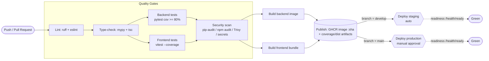

# 30 — CI/CD

> Part of the **Advanced AI Medical Intelligence Platform (AIMIP)** documentation set.
> Canonical names, ENV vars, ports and services are defined in [`_CANON.md`](_CANON.md).
> Related: [27_Testing_Strategy](27_Testing_Strategy.md) · [28_Deployment](28_Deployment.md) ·
> [29_Docker](29_Docker.md) · [31_Environment_Configuration](31_Environment_Configuration.md).

**Disclaimer:** AIMIP is clinical **decision-support**, not a medical device; outputs are
informational, not a diagnosis, and a licensed clinician must review all results.

The pipeline lives at `.github/workflows/ci.yml` ([`_CANON.md`](_CANON.md) §4) and runs on
**GitHub Actions** ([`_CANON.md`](_CANON.md) §1). It enforces every quality gate from
[27_Testing_Strategy](27_Testing_Strategy.md) and produces the immutable artifacts consumed by
[28_Deployment](28_Deployment.md).

---

## 1. Pipeline stages

| Stage | Backend tool | Frontend tool | Gate |
|-------|--------------|---------------|------|
| **Lint** | `ruff check` | `eslint` | fail on any error |
| **Type-check** | `mypy` | `tsc --noEmit` | fail on any error |
| **Test + coverage** | `pytest --cov=app --cov-fail-under=80` | `vitest run --coverage` | coverage ≥ 80% backend ([`_CANON.md`](_CANON.md) §11) |
| **Security / deps scan** | `pip-audit` + Trivy (image) + secret scan | `npm audit` | fail on high/critical |
| **Build** | backend Docker image | Vite production bundle | must build |
| **Publish artifacts** | push image `:sha`/`:latest` to GHCR | upload `dist/` + coverage | on protected branches |
| **Environment gating** | deploy `staging` (auto) / `production` (manual approval) | — | GitHub Environments |

All tests run against the deterministic adapters (`LLM_PROVIDER=mock`, `CACHE_PROVIDER=memory`
or Redis service, `TASK_QUEUE=inprocess`, `VECTOR_DB=faiss`) so **no vendor API keys are
required** ([27_Testing_Strategy](27_Testing_Strategy.md) §1, §12.3). Mongo and Redis are
provided as GitHub Actions **service containers**.

---

## 2. Pipeline diagram



---

## 3. `ci.yml`

```yaml
# .github/workflows/ci.yml
name: CI

on:
  push:
    branches: [main, develop]
  pull_request:
    branches: [main, develop]

# Cancel superseded runs on the same ref
concurrency:
  group: ci-${{ github.ref }}
  cancel-in-progress: true

permissions:
  contents: read
  packages: write        # push image to GHCR
  id-token: write        # OIDC for cloud deploy (no long-lived secrets)

env:
  PYTHON_VERSION: "3.11"     # canon §1: 3.11+, NOT 3.12
  NODE_VERSION: "20"
  IMAGE: ghcr.io/${{ github.repository }}/backend

jobs:
  # ---------------------------------------------------------------- backend lint + types
  backend-lint:
    name: Backend lint + type-check
    runs-on: ubuntu-latest
    defaults: { run: { working-directory: backend } }
    steps:
      - uses: actions/checkout@v4
      - uses: actions/setup-python@v5
        with:
          python-version: ${{ env.PYTHON_VERSION }}
          cache: pip
      - run: pip install -r requirements.txt
      - name: Ruff (lint)
        run: ruff check .
      - name: Ruff (format check)
        run: ruff format --check .
      - name: Mypy (type-check)
        run: mypy app

  # ---------------------------------------------------------------- backend tests + coverage
  backend-test:
    name: Backend tests + coverage gate
    runs-on: ubuntu-latest
    needs: backend-lint
    defaults: { run: { working-directory: backend } }
    services:
      mongo:
        image: mongo:7
        ports: ["27017:27017"]
        options: >-
          --health-cmd "mongosh --quiet --eval 'db.adminCommand({ping:1})'"
          --health-interval 10s --health-timeout 5s --health-retries 5
      redis:
        image: redis:7-alpine
        ports: ["6379:6379"]
        options: >-
          --health-cmd "redis-cli ping"
          --health-interval 10s --health-timeout 3s --health-retries 5
    env:
      # Deterministic, offline adapters — no vendor API keys (canon §3).
      ENV: development
      LLM_PROVIDER: mock
      EMBEDDING_PROVIDER: sentence_transformer
      VECTOR_DB: faiss
      CACHE_PROVIDER: redis
      TASK_QUEUE: inprocess
      STORAGE_PROVIDER: mongodb
      MONGODB_URI: mongodb://localhost:27017
      DB_NAME: aimip_test
      REDIS_URL: redis://localhost:6379/0
      JWT_SECRET: ci-secret-not-for-prod
    steps:
      - uses: actions/checkout@v4
      - uses: actions/setup-python@v5
        with:
          python-version: ${{ env.PYTHON_VERSION }}
          cache: pip
      - run: pip install -r requirements.txt
      - name: Pytest with coverage gate (>= 80%, canon §11)
        run: pytest --cov=app --cov-report=xml --cov-report=term-missing --cov-fail-under=80
      - name: Upload backend coverage
        uses: actions/upload-artifact@v4
        with:
          name: backend-coverage
          path: backend/coverage.xml

  # ---------------------------------------------------------------- frontend lint/types/tests
  frontend-test:
    name: Frontend lint + type-check + tests
    runs-on: ubuntu-latest
    defaults: { run: { working-directory: frontend } }
    steps:
      - uses: actions/checkout@v4
      - uses: actions/setup-node@v4
        with:
          node-version: ${{ env.NODE_VERSION }}
          cache: npm
          cache-dependency-path: frontend/package-lock.json
      - run: npm ci
      - name: ESLint
        run: npm run lint
      - name: Type-check (tsc)
        run: npm run typecheck        # "tsc --noEmit"
      - name: Vitest + coverage
        run: npm run test:coverage    # "vitest run --coverage"
      - name: Upload frontend coverage
        uses: actions/upload-artifact@v4
        with:
          name: frontend-coverage
          path: frontend/coverage

  # ---------------------------------------------------------------- security / dependency scan
  security:
    name: Security + dependency scan
    runs-on: ubuntu-latest
    needs: [backend-test, frontend-test]
    steps:
      - uses: actions/checkout@v4
      - uses: actions/setup-python@v5
        with: { python-version: "3.11" }
      - name: Python dependency audit
        working-directory: backend
        run: |
          pip install pip-audit
          pip-audit -r requirements.txt
      - name: Node dependency audit
        working-directory: frontend
        run: npm audit --audit-level=high
      - name: Secret scan (gitleaks)
        uses: gitleaks/gitleaks-action@v2
        env: { GITHUB_TOKEN: ${{ secrets.GITHUB_TOKEN }} }
      - name: Filesystem vulnerability scan (Trivy)
        uses: aquasecurity/trivy-action@0.28.0
        with:
          scan-type: fs
          scan-ref: .
          severity: HIGH,CRITICAL
          exit-code: "1"
          ignore-unfixed: true

  # ---------------------------------------------------------------- build + publish artifacts
  build-and-publish:
    name: Build images + publish artifacts
    runs-on: ubuntu-latest
    needs: security
    # Only publish from protected branches, never from PRs.
    if: github.event_name == 'push'
    steps:
      - uses: actions/checkout@v4

      # ---- Backend image (canon §4: backend/Dockerfile) ----
      - uses: docker/setup-buildx-action@v3
      - name: Log in to GHCR
        uses: docker/login-action@v3
        with:
          registry: ghcr.io
          username: ${{ github.actor }}
          password: ${{ secrets.GITHUB_TOKEN }}
      - name: Build & push backend image
        uses: docker/build-push-action@v6
        with:
          context: ./backend
          file: ./backend/Dockerfile
          push: true
          tags: |
            ${{ env.IMAGE }}:${{ github.sha }}
            ${{ env.IMAGE }}:latest
          cache-from: type=gha
          cache-to: type=gha,mode=max
      - name: Scan published image (Trivy)
        uses: aquasecurity/trivy-action@0.28.0
        with:
          image-ref: ${{ env.IMAGE }}:${{ github.sha }}
          severity: HIGH,CRITICAL
          exit-code: "1"
          ignore-unfixed: true

      # ---- Frontend bundle (canon §4: frontend Vite build) ----
      - uses: actions/setup-node@v4
        with: { node-version: "20", cache: npm, cache-dependency-path: frontend/package-lock.json }
      - name: Build frontend bundle
        working-directory: frontend
        env:
          VITE_API_BASE_URL: ${{ vars.VITE_API_BASE_URL }}   # canon §5
        run: |
          npm ci
          npm run build
      - name: Upload frontend bundle artifact
        uses: actions/upload-artifact@v4
        with:
          name: frontend-dist
          path: frontend/dist

  # ---------------------------------------------------------------- deploy: staging (auto)
  deploy-staging:
    name: Deploy staging
    runs-on: ubuntu-latest
    needs: build-and-publish
    if: github.ref == 'refs/heads/develop'
    environment:
      name: staging                 # ENV=staging; secrets scoped to this GH Environment
      url: ${{ vars.STAGING_URL }}
    steps:
      - name: Roll out image ${{ github.sha }} to staging
        run: ./deploy/rollout.sh staging ${{ github.sha }}   # readiness-gated, see 28_Deployment §7

  # ---------------------------------------------------------------- deploy: production (manual)
  deploy-production:
    name: Deploy production
    runs-on: ubuntu-latest
    needs: build-and-publish
    if: github.ref == 'refs/heads/main'
    environment:
      name: production              # requires manual approval (protection rule)
      url: ${{ vars.PRODUCTION_URL }}
    steps:
      - name: Roll out image ${{ github.sha }} to production
        run: ./deploy/rollout.sh production ${{ github.sha }}
```

---

## 4. Stage detail

### 4.1 Lint

- **Backend:** `ruff check .` (lint) + `ruff format --check .` (formatting) — ruff is the
  canonical linter/formatter ([`_CANON.md`](_CANON.md) §1).
- **Frontend:** `eslint` via `npm run lint` (ESLint + Prettier, [`_CANON.md`](_CANON.md) §1).

### 4.2 Type-check

- **Backend:** `mypy app` — strict typing on the application/domain layers keeps the port
  contracts honest ([`_CANON.md`](_CANON.md) §2, §3).
- **Frontend:** `tsc --noEmit` (TypeScript, [`_CANON.md`](_CANON.md) §1).

### 4.3 Test + coverage

- Backend `pytest --cov=app --cov-fail-under=80` — the hard **≥ 80%** gate
  ([`_CANON.md`](_CANON.md) §11, [27_Testing_Strategy](27_Testing_Strategy.md) §11). Mongo +
  Redis run as service containers; the contract suite ([27_Testing_Strategy](27_Testing_Strategy.md)
  §6) and provider-swap test ([27_Testing_Strategy](27_Testing_Strategy.md) §6.5) run here.
- Frontend `vitest run --coverage` with the thresholds from
  [27_Testing_Strategy](27_Testing_Strategy.md) §10.1.
- Coverage XML/LCOV uploaded as artifacts for the PR summary.

### 4.4 Security / dependency scan

- `pip-audit` (Python CVEs) + `npm audit --audit-level=high` (Node CVEs).
- **gitleaks** blocks accidental commits of `OPENAI_API_KEY`, `GEMINI_API_KEY`,
  `PINECONE_API_KEY`, `JWT_SECRET`, `MONGODB_URI` ([`_CANON.md`](_CANON.md) §5;
  [28_Deployment](28_Deployment.md) §6).
- **Trivy** scans the filesystem and the built image for HIGH/CRITICAL OS/library CVEs; supports
  the OWASP ASVS L1 target ([`_CANON.md`](_CANON.md) §11).

### 4.5 Build

- Backend image built from `backend/Dockerfile` ([29_Docker](29_Docker.md) §2), tagged with the
  commit SHA (immutable, [28_Deployment](28_Deployment.md) §7) and `latest`.
- Frontend production bundle built with Vite; `VITE_API_BASE_URL`
  ([`_CANON.md`](_CANON.md) §5) is injected per environment from GitHub `vars`.

### 4.6 Publish artifacts

- Image pushed to **GHCR** (`ghcr.io/<repo>/backend:<sha>`), consumed by the rollout in
  [28_Deployment](28_Deployment.md) §7.
- `frontend-dist` and coverage reports uploaded as workflow artifacts.
- Publishing happens only on `push` to protected branches, never on PRs (`if:` guards).

### 4.7 Environment gating

- **staging:** auto-deploys on merge to `develop`; `ENV=staging`
  ([28_Deployment](28_Deployment.md) §2).
- **production:** deploys on merge to `main` but the GitHub **Environment** `production` carries
  a required-reviewers protection rule → **manual approval** before rollout.
- Secrets (`OPENAI_API_KEY`, `MONGODB_URI`, …) are stored per **GitHub Environment**, so staging
  and production never share credentials ([28_Deployment](28_Deployment.md) §6). Deploy uses
  OIDC (`id-token: write`) — no long-lived cloud keys.
- Rollout is **readiness-gated** on `GET /health/ready` and supports rollback by re-pointing to
  the previous image tag ([28_Deployment](28_Deployment.md) §7).

---

## 5. Branch protection & merge policy

- PRs to `main`/`develop` must pass `backend-lint`, `backend-test`, `frontend-test`, and
  `security` (required status checks).
- Coverage gate failure (< 80% backend) blocks merge.
- `concurrency` cancels superseded runs to save minutes.
- No image is published from a fork/PR (least privilege on `packages: write`).

---

## 6. Local parity

Developers can reproduce the gates locally before pushing
([27_Testing_Strategy](27_Testing_Strategy.md) §12):

```bash
# Backend
cd backend
ruff check . && ruff format --check .
mypy app
pytest --cov=app --cov-fail-under=80

# Frontend
cd ../frontend
npm run lint && npm run typecheck && npm run test:coverage
```

Because CI uses the same `mock`/`faiss`/service-container adapters, a green local run predicts a
green pipeline. Docker-based build steps run later on a Docker-capable runner
([29_Docker](29_Docker.md), [28_Deployment](28_Deployment.md) — Docker not installed on the
current dev machine).
