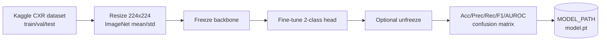
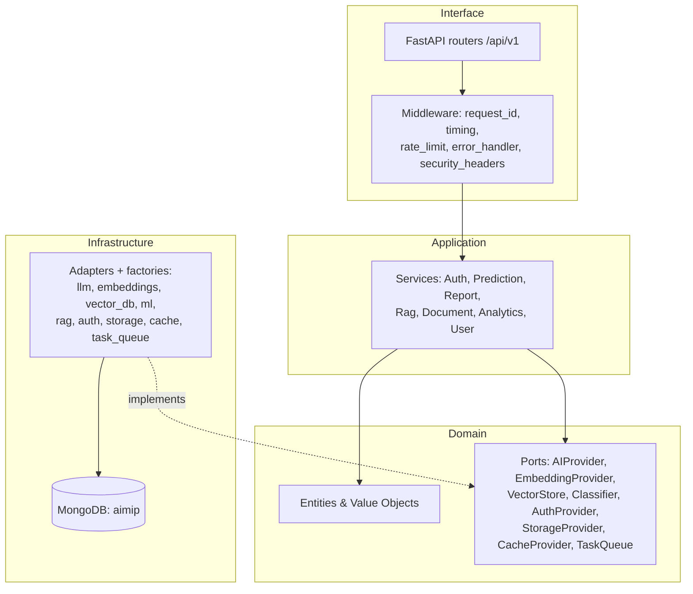
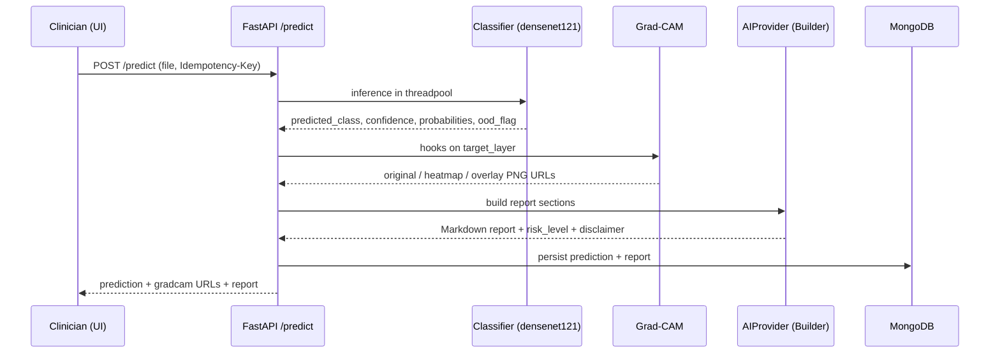
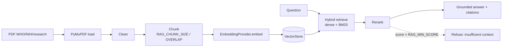

# 33 — Project Report

This report presents the **Advanced AI Medical Intelligence Platform (AIMIP)** to a technical evaluation panel. It summarizes the objectives, methodology, architecture, AI approach, and expected outcomes of an enterprise clinical **decision-support** SaaS that classifies chest X-rays for pneumonia, explains predictions with Grad-CAM, drafts LLM medical reports, and answers grounded medical questions via Retrieval-Augmented Generation (RAG). AIMIP is engineered on a Clean/Hexagonal architecture in which business logic depends only on ports, so vendors and models are interchangeable adapters chosen by configuration. It is authored against the single source of truth, the [CANON](_CANON.md).

> **Clinical disclaimer.** AIMIP outputs are informational, not a diagnosis; a licensed clinician must review all results. No PHI is uploaded without consent, and the platform is **not** FDA/CE cleared and is **not** a medical device.

Related documents: [Project Roadmap](00_Project_Roadmap.md) · [Project Vision](01_Project_Vision.md) · [Software Requirements Specification](02_Software_Requirements_Specification.md) · [Database Design](17_Database_Design.md) · [API Design](18_API_Design.md) · [Authorization & RBAC](20_Authorization_RBAC.md) · [Environment Configuration](31_Environment_Configuration.md) · [Future Roadmap](37_Future_Roadmap.md).

---

## 1. Executive summary

AIMIP compresses the chest-radiograph triage-to-understanding loop into a single, explainable, well-governed workflow. A clinician uploads a chest X-ray; a transfer-learned convolutional neural network (`densenet121` by default) classifies it as `NORMAL` or `PNEUMONIA` with a calibrated confidence and full probabilities; Grad-CAM renders where the model looked; an LLM drafts a structured medical report; and a RAG assistant answers follow-up questions grounded in a curated WHO/NIH/research corpus, with citations and an explicit refusal when evidence is thin. Every action is authenticated (JWT), authorized by role (`user`, `doctor`, `admin`), persisted in MongoDB, and — for PHI access — recorded in an append-only audit log. The platform is built to enterprise non-functional targets (99.5% availability, API p95 < 300 ms, prediction end-to-end p95 < 6 s, ≥ 80% backend test coverage, OWASP ASVS L1) and is portable across AI/vector/cache/queue providers by a single `.env` change.

---

## 2. Objectives

| # | Objective | Measure of success |
|---|-----------|--------------------|
| O1 | Accurate first-read triage for pneumonia on chest X-rays | AUROC ≥ 0.90, F1 (PNEUMONIA) ≥ 0.88 on the held-out test set |
| O2 | Explainable predictions clinicians can trust and defend | Grad-CAM original/heatmap/overlay for every prediction |
| O3 | Reduce report-authoring burden | LLM Builder produces a complete, editable Markdown report per prediction |
| O4 | Grounded, cited medical Q&A | RAG answers cite sources or refuse below `RAG_MIN_SCORE` |
| O5 | Safety & governance | Consent-gated uploads, RBAC, audit logging, mandatory disclaimer everywhere |
| O6 | Vendor-neutral, maintainable architecture | Provider swap via `.env` passes the shared contract test with no logic change |
| O7 | Production-grade NFRs | Availability, latency, coverage, and security targets demonstrably met |

---

## 3. Methodology

### 3.1 Engineering methodology

- **Docs-first, contract-driven.** The [CANON](_CANON.md) fixes every name, endpoint, ENV var, collection, and port before code, enabling parallel workstreams against one truth.
- **Vertical-slice delivery.** An end-to-end MVP (upload → classify → Grad-CAM → report → persist → view) precedes breadth, per the [Project Roadmap](00_Project_Roadmap.md).
- **Ports & adapters with contract tests.** Each of the eight ports ships a shared contract test in `tests/contract/`; the `.env`-only provider swap is itself an automated test.
- **Quality gates as merge blockers.** `ruff`, `mypy`, `pytest` (≥ 80% coverage) for the backend; `eslint`, `prettier`, `vitest` for the frontend, all in `.github/workflows/ci.yml`.
- **Fail-fast configuration.** `pydantic-settings` validates provider/secret combinations at startup (e.g. `LLM_PROVIDER=openai` with empty `OPENAI_API_KEY` raises).

### 3.2 ML methodology

Transfer learning on the Kaggle "Chest X-Ray Images (Pneumonia)" dataset (Kermany et al.): freeze the ImageNet-pretrained backbone, fine-tune a two-class head `[NORMAL, PNEUMONIA]`, then optionally unfreeze. Optimizer AdamW; cross-entropy with class weights to counter class imbalance; early stopping on validation loss. Evaluation: accuracy, precision, recall, F1, AUROC, and a confusion matrix. The best checkpoint is written to `MODEL_PATH`. Training is runnable but optional — a pretrained-inference fallback lets the app function without the dataset or a training run.

---

## 4. Architecture summary

AIMIP follows Clean/Hexagonal (Ports & Adapters) with dependency direction `domain ← application ← infrastructure ← interface`. Business logic depends only on ABC ports; concrete adapters are selected at startup by factories reading ENV. Patterns in use: Repository, Service layer, Factory, Strategy/Provider, Dependency Injection (FastAPI `Depends` + a composition-root container), and Builder (report assembly).

### 4.1 Provider ports & ENV selectors

| Port (ABC) | ENV var | Adapters |
|------------|---------|----------|
| `AIProvider` | `LLM_PROVIDER` | `openai` · `gemini` · `mock` |
| `EmbeddingProvider` | `EMBEDDING_PROVIDER` | `openai` · `gemini` · `sentence_transformer` |
| `VectorStore` | `VECTOR_DB` | `faiss` · `chroma` · `pinecone` (optional) |
| `Classifier` | `MODEL_ARCH` | `densenet121` · `efficientnet_b0` |
| `AuthProvider` | `AUTH_PROVIDER` | `jwt` (future: oauth2, keycloak) |
| `StorageProvider` | `STORAGE_PROVIDER` | `mongodb` (future: postgres, s3 blobs) |
| `CacheProvider` | `CACHE_PROVIDER` | `memory` · `redis` |
| `TaskQueue` | `TASK_QUEUE` | `inprocess` · `celery` |

Each port has a factory `get_<x>_provider(settings)` under `infrastructure/providers/<x>/factory.py`. Full configuration is documented in [Environment Configuration](31_Environment_Configuration.md).

### 4.2 Data model

Persistence is in MongoDB (`DB_NAME=aimip`) across the collections defined in [Database Design](17_Database_Design.md): `users`, `refresh_tokens` (TTL on `expires_at`), `predictions`, `reports`, `documents`, `embeddings_metadata`, `chat_sessions`, `chat_history`, and append-only `audit_logs`.

### 4.3 API surface

All endpoints are versioned under `/api/v1` with an RFC 7807 error envelope `{type, title, status, detail, instance, errors?}` and a list envelope `{items, page, size, total, pages}`; auth via `Authorization: Bearer <access>`. Groups: Auth, Predict, History, Reports, Chat/RAG, Documents, Analytics, Users (admin), Settings, and Ops (`/health/live`, `/health/ready`, `/metrics`, `/docs`). Details in [API Design](18_API_Design.md).

---

## 5. AI approach

### 5.1 End-to-end prediction pipeline

Key safeguards: inference runs in a threadpool executor so the event loop never blocks; the **OOD guard** rejects non-chest-X-ray uploads via a heuristic/threshold and sets `ood_flag`; confidence is the softmax maximum with full probabilities retained.

### 5.2 Explainability

Grad-CAM registers forward/backward hooks on the classifier's `target_layer`, producing original, heatmap, and overlay PNGs saved under `GRADCAM_PATH` and served as URLs. This turns an opaque score into a defensible, visual rationale for the reviewing clinician.

### 5.3 LLM report generation (Builder)

The `ReportService` assembles a Markdown report through a Builder from these sections: `summary`, `findings`, `possible_condition`, `medical_explanation`, `recommendations`, `risk_level`, and `disclaimer`. Generation goes through the `AIProvider` port (default `LLM_MODEL=gpt-4o-mini`), so the vendor is interchangeable. `risk_level ∈ {low, moderate, high}` is recorded on the report.

### 5.4 RAG knowledge assistant

Retrieval returns up to `RAG_TOP_K` chunks; answers carry `{document_id, chunk_id, score}` citations; when the best score falls below `RAG_MIN_SCORE`, the assistant refuses rather than fabricates.

---

## 6. Results & expected outcomes

### 6.1 Model performance (expected, held-out test set)

| Metric | Expected target |
|--------|-----------------|
| Accuracy | ≥ 0.90 |
| Precision (PNEUMONIA) | ≥ 0.88 |
| Recall (PNEUMONIA) | ≥ 0.90 |
| F1 (PNEUMONIA) | ≥ 0.88 |
| AUROC | ≥ 0.90 |
| Confusion matrix | Reported per class for transparency |

These are the target operating characteristics used for evaluation; the pretrained-inference fallback lets the panel exercise the pipeline even without a training run.

### 6.2 System outcomes

| Outcome | Target / evidence |
|---------|-------------------|
| Availability | 99.5% (stateless, horizontally scalable API) |
| API latency p95 (excl. model/LLM) | < 300 ms |
| Prediction end-to-end p95 | < 6 s |
| Backend test coverage | ≥ 80% |
| Security | OWASP ASVS L1; audit logging of PHI access |
| Portability | `.env`-only provider swap passes contract tests |
| Observability | Structured logs (`structlog`), Prometheus `/metrics`, tracing |

### 6.3 User-facing outcomes

- Radiologists get an explainable first read and an editable report draft.
- General physicians get point-of-care triage support with grounded, cited guidance.
- Admins get governance: user/role management, curated documents, and a complete audit trail.
- Researchers get structured, cited, queryable outputs on consented data.

---

## 7. Lessons learned

| Theme | Lesson | Design response |
|-------|--------|-----------------|
| Trust | A bare score is not adopted; clinicians need to see *why*. | Grad-CAM overlays + confidence + full probabilities on every prediction. |
| Hallucination | LLMs will confidently fabricate without grounding. | RAG citations + `RAG_MIN_SCORE` refusal; report constrained to structured sections. |
| Out-of-domain input | Users will upload the wrong image type. | OOD guard sets `ood_flag`; UI suppresses a confident label. |
| Vendor risk | AI vendors change pricing, limits, and availability. | Ports + `mock`/local fallbacks; `.env`-swap contract test. |
| Config drift | Silent misconfiguration is the most expensive failure. | Fail-fast validation at startup. |
| Event-loop blocking | Synchronous inference stalls the API under load. | Threadpool executor for inference; async ingest offloaded to the task queue. |
| Compliance | Auditability must be built in, not bolted on. | Append-only `audit_logs`, consent-gated uploads, RBAC. |
| Safety framing | Decision-support must never drift toward device claims. | Mandatory disclaimer in report/vision/security/README; explicit non-goals. |

---

## 8. Risks & mitigations (summary)

The full risk register lives in the [Project Roadmap](00_Project_Roadmap.md). The most safety-critical items are clinical over-reliance (mitigated by the human-in-the-loop framing and mandatory disclaimer), LLM/RAG hallucination (mitigated by grounding, citations, and refusal thresholds), and OOD misclassification (mitigated by the `ood_flag` guard).

---

## 9. Conclusion

AIMIP demonstrates that an accurate, explainable, and well-governed AI copilot for chest-radiograph triage can be delivered on a clean, vendor-neutral architecture without overstepping into medical-device territory. The combination of a transfer-learned classifier, Grad-CAM explainability, LLM report drafting, and grounded RAG — behind JWT auth, RBAC, and audit logging, and meeting enterprise NFRs — provides genuine clinical value while keeping a licensed clinician firmly in control of every decision. The ports-and-adapters foundation means the platform is not a point solution but a durable base: new models, providers, modalities, and integrations (see the [Future Roadmap](37_Future_Roadmap.md)) attach as adapters, not rewrites. AIMIP is, and will remain, clinical decision-support — informational, human-reviewed, and not a medical device.

---

## 10. Appendix — key facts for the panel

| Item | Value |
|------|-------|
| Product | Advanced AI Medical Intelligence Platform (AIMIP) |
| Type | Enterprise AI healthcare SaaS — clinical decision-support (not a medical device) |
| Backend | Python 3.11+, FastAPI, Pydantic v2, Motor, PyTorch + torchvision |
| Frontend | React 19, Vite, TypeScript, TailwindCSS, TanStack Query, Zustand, Recharts |
| Data stores | MongoDB Atlas (`aimip`), Redis, FAISS/Chroma/Pinecone |
| Default model | `MODEL_ARCH=densenet121`, input 224×224, ImageNet normalization |
| Default LLM | `LLM_MODEL=gpt-4o-mini` via `AIProvider` |
| Default embeddings | `EMBEDDING_MODEL=text-embedding-3-small` |
| Auth | JWT (HS256), access 30 min, refresh 7 days, lockout after 5 attempts |
| License | MIT — `Copyright (c) 2026 DTable Analytics` |
