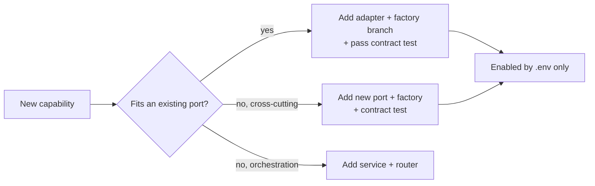
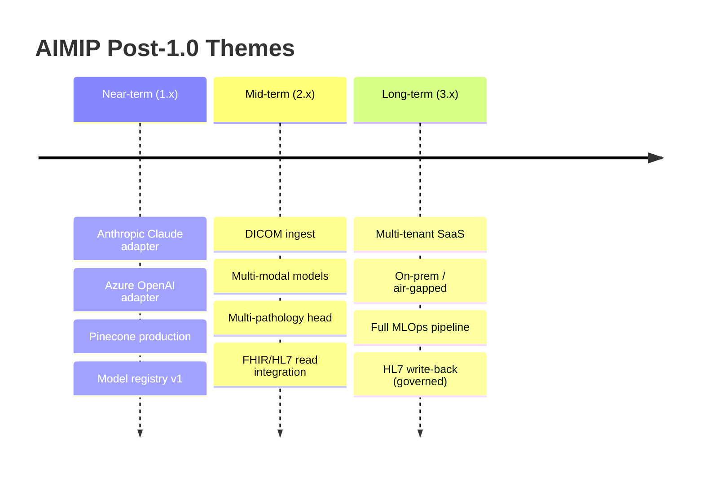
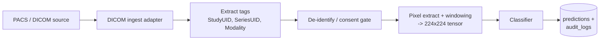
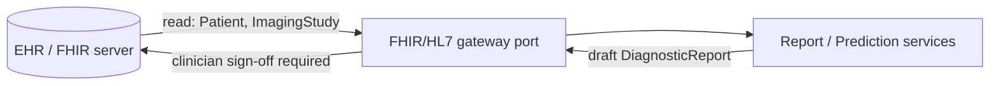
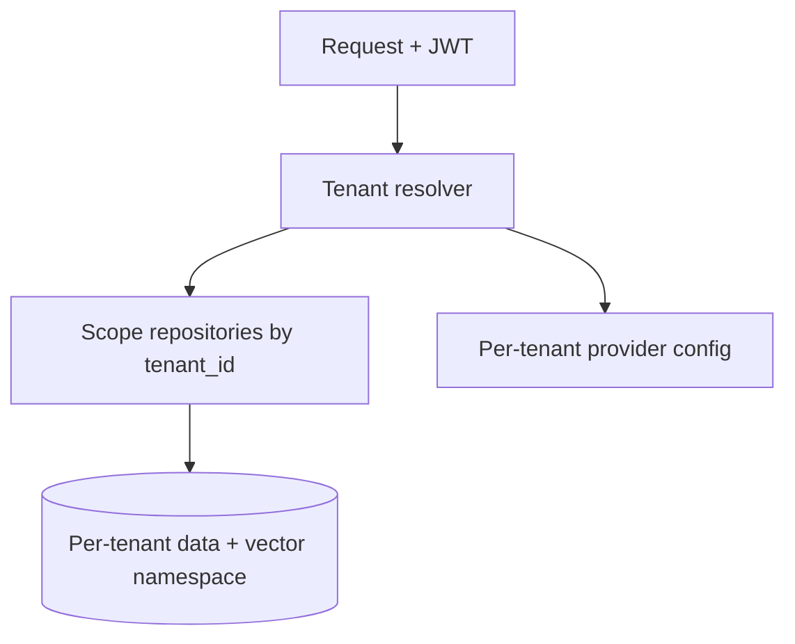
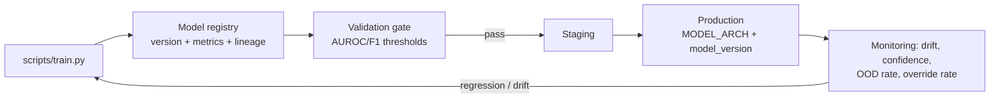
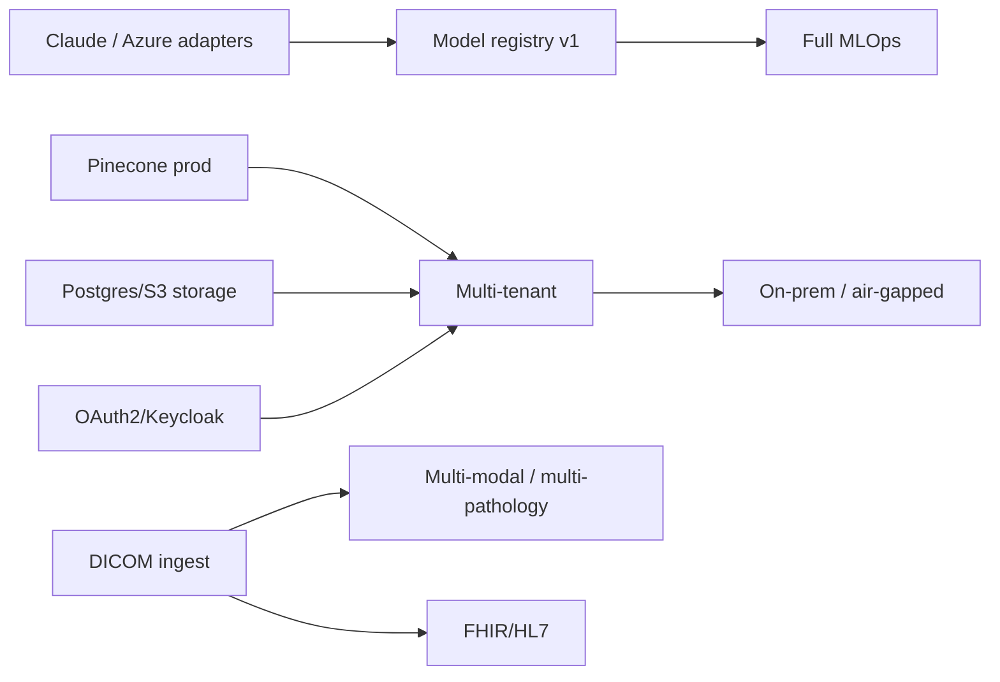

# 37 — Future Roadmap

This document sets out the post-1.0 direction for the **Advanced AI Medical Intelligence Platform (AIMIP)**. Where the [Project Roadmap](00_Project_Roadmap.md) delivers the shipping product, this roadmap describes how AIMIP grows *after* release: new AI/vector providers, multi-modal and multi-pathology models, native DICOM support, FHIR/HL7 interoperability, multi-tenancy, on-premise deployment, a model registry with MLOps, and a disciplined technical-debt backlog. The central thesis is unchanged from the [CANON](_CANON.md): because business logic depends only on ports, nearly every item below is a new **adapter** or an additive service, not a rewrite.

> **Clinical disclaimer.** Everything in this roadmap preserves AIMIP's posture as clinical **decision-support**: outputs are informational, not a diagnosis; a licensed clinician must review all results; no PHI is uploaded without consent; and the platform is **not** FDA/CE cleared and is **not** a medical device. Regulatory clearance, if ever pursued, is a distinct program outside this document.

Related documents: [Project Roadmap](00_Project_Roadmap.md) · [Project Vision](01_Project_Vision.md) · [Software Requirements Specification](02_Software_Requirements_Specification.md) · [Database Design](17_Database_Design.md) · [API Design](18_API_Design.md) · [Authorization & RBAC](20_Authorization_RBAC.md) · [Environment Configuration](31_Environment_Configuration.md) · [Project Report](33_Project_Report.md).

---

## 1. Extensibility model — why growth is cheap

AIMIP's Clean/Hexagonal design means a new capability usually attaches at one of three seams:

| Seam | How it extends | Examples in this roadmap |
|------|----------------|--------------------------|
| **New adapter behind an existing port** | Implement the port ABC, add a branch in `get_<x>_provider(settings)`, pass the shared contract test in `tests/contract/`. | Anthropic Claude (`AIProvider`), Azure OpenAI (`AIProvider`/`EmbeddingProvider`), Pinecone prod (`VectorStore`), Postgres/S3 (`StorageProvider`), Keycloak/OAuth2 (`AuthProvider`). |
| **New port** | Introduce a new ABC in `domain/ports/` with its own factory and contract test, wired via the composition root. | DICOM store, FHIR/HL7 gateway, tenant resolver, model registry. |
| **New service / router** | Add an application service and an `/api/v1` router without touching existing ports. | Multi-pathology reporting, model-registry admin, tenant admin. |

Every provider swap remains an `.env` change validated by an automated test — no business-logic edits.

---

## 2. Future themes at a glance

| Horizon | Focus | Representative outcomes |
|---------|-------|-------------------------|
| **Near-term (1.x)** | Provider breadth & registry | Claude + Azure OpenAI adapters, Pinecone prod vector store, model registry v1 |
| **Mid-term (2.x)** | Modalities & interoperability | DICOM ingest, multi-modal/multi-pathology models, FHIR/HL7 read |
| **Long-term (3.x)** | Scale & deployment topology | Multi-tenant, on-prem/air-gapped, full MLOps, governed HL7 write-back |

---

## 3. New AI & vector providers

### 3.1 Anthropic Claude (`AIProvider`)

| Aspect | Plan |
|--------|------|
| Port | `AIProvider` (`generate`, `stream`) — no change to `ReportService` or `RagService`. |
| Selector | Extend `LLM_PROVIDER` to accept `anthropic` alongside `openai` · `gemini` · `mock`. |
| Config | New `ANTHROPIC_API_KEY`; `LLM_MODEL` carries the provider-specific model id. |
| Factory | Add an `anthropic` branch to `get_llm_provider(settings)`; keep fail-fast validation (empty key raises). |
| Tests | Reuse the `AIProvider` shared contract test; add the swap to the `.env`-swap suite. |

### 3.2 Azure OpenAI (`AIProvider` and `EmbeddingProvider`)

| Aspect | Plan |
|--------|------|
| Rationale | Enterprise/health customers needing data-residency and Azure governance. |
| Selectors | `LLM_PROVIDER=azure_openai`, `EMBEDDING_PROVIDER=azure_openai`. |
| Config | `AZURE_OPENAI_API_KEY`, `AZURE_OPENAI_ENDPOINT`, `AZURE_OPENAI_DEPLOYMENT`, `AZURE_OPENAI_API_VERSION`. |
| Note | Deployment-name indirection is confined to the adapter; services stay vendor-agnostic. |

### 3.3 Pinecone in production (`VectorStore`)

| Aspect | Plan |
|--------|------|
| Status | `pinecone` already an optional `VECTOR_DB` adapter; promote to a supported production tier. |
| Selector | `VECTOR_DB=pinecone` with existing `PINECONE_API_KEY`; add index/namespace env as needed. |
| Behavior | Preserve `add`, `search(k, filter)`, `persist`, `load`; map `embeddings_metadata` filters to Pinecone metadata filters. |
| Migration | Provide a re-index path from `faiss`/`chroma` via `scripts/ingest_docs.py` re-embedding. |

### 3.4 Provider matrix (current → future)

| Port | Today | Future additions |
|------|-------|------------------|
| `AIProvider` | `openai`, `gemini`, `mock` | `anthropic`, `azure_openai` |
| `EmbeddingProvider` | `openai`, `gemini`, `sentence_transformer` | `azure_openai`, on-prem embedding server |
| `VectorStore` | `faiss`, `chroma`, `pinecone` (optional) | Pinecone prod-tier, pgvector |
| `AuthProvider` | `jwt` | `oauth2`, `keycloak` |
| `StorageProvider` | `mongodb` | `postgres`, `s3` (blobs) |
| `CacheProvider` | `memory`, `redis` | clustered Redis / managed cache |
| `TaskQueue` | `inprocess`, `celery` | managed broker / KEDA-scaled workers |

---

## 4. Multi-modal & multi-pathology models

### 4.1 Beyond two-class pneumonia

| Direction | Plan |
|-----------|------|
| Multi-pathology head | Extend the `Classifier` port output from `[NORMAL, PNEUMONIA]` to a multi-label head (e.g. effusion, cardiomegaly, opacity), keeping `predict(tensor) -> logits`. |
| New architectures | Add adapters under `MODEL_ARCH` (e.g. `convnext`, `vit_b_16`) beside `densenet121` · `efficientnet_b0`; `target_layer` still exposed for Grad-CAM. |
| Report impact | `sections.possible_condition` and `risk_level` generalize to multi-finding narratives via the Builder. |

### 4.2 Multi-modal inputs

| Modality | Approach |
|----------|----------|
| Image + text (report context) | Vision-language models fronted by the same `Classifier`/`AIProvider` seams; structured findings feed the report Builder. |
| CT / MRI (future) | New modality-specific classifier adapters; DICOM series handling (see §5); explicitly beyond v1.0 non-goals in the [Vision](01_Project_Vision.md). |
| Explainability | Extend Grad-CAM to per-class attention maps; keep original/heatmap/overlay artifacts under `GRADCAM_PATH`. |

---

## 5. DICOM support

Native DICOM is a mid-term capability that widens ingest beyond `image/png, image/jpeg`.

| Aspect | Plan |
|--------|------|
| Ingest | New `DicomStore`/ingest port; parse tags (StudyUID, SeriesUID, Modality) and pixel data. |
| Types | Extend `ALLOWED_IMAGE_TYPES` handling to accept `application/dicom` behind a feature flag. |
| Windowing | Convert modality LUT / window-level to the 224×224 ImageNet-normalized tensor the classifier expects. |
| Governance | De-identification and consent gating before persistence; every access recorded in `audit_logs`. |
| Interop | Optional DICOMweb (WADO-RS/STOW-RS) endpoints under `/api/v1` for PACS integration. |

---

## 6. FHIR / HL7 integration

Interoperability lets AIMIP participate in clinical systems without becoming the record of truth.

| Capability | Scope | Governance |
|------------|-------|-----------|
| FHIR read | Pull `Patient`, `ImagingStudy`, `DiagnosticReport` context to enrich a prediction. | Read-only first; consent-gated; audited. |
| FHIR write (governed) | Publish AIMIP's report as a draft `DiagnosticReport`/`Observation` for clinician sign-off. | Human-in-the-loop; never auto-final; flagged as decision-support output. |
| HL7 v2 | ADT/ORU messaging bridge for legacy environments via an interface engine. | Adapter-isolated; mapped to internal entities. |
| Terminology | Map findings to SNOMED CT / LOINC / ICD-10 in the report metadata. | Coded fields additive to existing `reports` schema. |

All write-back is explicitly draft-only and requires clinician sign-off — consistent with the decision-support, not-a-medical-device posture.

---

## 7. Multi-tenancy

Turning AIMIP into a multi-tenant SaaS lets many organizations share infrastructure with strict isolation.

| Dimension | Plan |
|-----------|------|
| Tenant model | Introduce a `tenant_id` on tenant-scoped collections (`users`, `predictions`, `reports`, `documents`, `embeddings_metadata`, `chat_*`, `audit_logs`) with a tenant resolver dependency. |
| Isolation | Row-scoping by `tenant_id` in every repository query; per-tenant vector namespaces (Pinecone) or indexes. |
| RBAC | Extend the matrix in [Authorization & RBAC](20_Authorization_RBAC.md) with a tenant-admin scope above `admin`. |
| Config | Per-tenant provider overrides (e.g. tenant A on `anthropic`, tenant B on `azure_openai`) resolved at request time. |
| Quotas | Per-tenant rate limits, upload limits (`MAX_UPLOAD_SIZE`), and cost budgets. |
| Data residency | Tenant-pinned storage/vector regions to satisfy locality requirements. |

---

## 8. On-premise & air-gapped deployment

For customers who cannot send data to third-party clouds, AIMIP supports a fully local topology using its existing local adapters.

| Concern | On-prem answer |
|---------|----------------|
| LLM | `LLM_PROVIDER=mock` for CI, plus a self-hosted model server adapter behind `AIProvider`; no external calls. |
| Embeddings | `EMBEDDING_PROVIDER=sentence_transformer` (local) — already supported. |
| Vector store | `VECTOR_DB=faiss` or `chroma` on local disk at `VECTOR_INDEX_PATH`. |
| Cache / queue | `CACHE_PROVIDER=redis`, `TASK_QUEUE=celery` on in-cluster Redis. |
| Storage | `STORAGE_PROVIDER=mongodb` on a self-managed cluster; future `postgres`/`s3`-compatible object store. |
| Delivery | `docker-compose.yml` for single-node; Helm/Kubernetes for HA; nginx reverse proxy retained. |
| Updates | Offline model and image bundles; signed artifacts pulled through an internal registry. |

Because provider selection is already `.env`-driven, an air-gapped install is a configuration profile, not a fork.

---

## 9. Model registry & MLOps

A model registry formalizes how models are trained, versioned, validated, and promoted — extending today's `MODEL_PATH` checkpoint flow.

| Capability | Plan |
|------------|------|
| Registry | Track model artifacts with `model_arch`, `model_version` (already on `predictions`), metrics, dataset lineage, and training config. |
| Promotion gates | Automated AUROC/F1/confusion-matrix thresholds before staging→production promotion. |
| Reproducibility | Pinned dataset splits (Kaggle Kermany et al.), seeds, and hyperparameters recorded per version. |
| Serving | Hot-swap `MODEL_PATH`/version without downtime; canary a new `MODEL_ARCH` behind a flag. |
| Monitoring | Track prediction-confidence distribution, `ood_flag` rate, and clinician override rate for drift detection. |
| Feedback loop | Clinician overrides feed a curated retraining set (consented/de-identified). |
| Experiment tracking | Runs, params, and metrics logged for audit and comparison. |

---

## 10. Technical-debt backlog

A living register of known debt to retire as capacity allows. None of these block v1.0; each is scoped to keep the architecture clean as it scales.

| ID | Item | Area | Impact | Priority |
|----|------|------|--------|----------|
| TD1 | Promote `pinecone` from optional to first-class with migration tooling | Vector store | Prod scalability | High |
| TD2 | Add `postgres` and `s3` `StorageProvider` adapters (blobs off MongoDB) | Storage | Cost, blob scale | High |
| TD3 | Implement `oauth2`/`keycloak` `AuthProvider` adapters | Auth | Enterprise SSO | High |
| TD4 | Harden OOD guard from heuristic to a learned detector | ML safety | Fewer misfires | High |
| TD5 | Formalize model registry (retire bare `MODEL_PATH` promotion) | MLOps | Governance | Medium |
| TD6 | Multi-label classifier head + Grad-CAM per class | ML | Multi-pathology | Medium |
| TD7 | DICOM ingest + DICOMweb endpoints | Interop | New modality intake | Medium |
| TD8 | FHIR/HL7 gateway (read, then governed write-back) | Interop | EHR integration | Medium |
| TD9 | Tenant scoping across repositories and vector namespaces | Multi-tenant | SaaS scale | Medium |
| TD10 | Clustered Redis + KEDA-scaled celery workers | Infra | Elasticity | Medium |
| TD11 | Reranker upgrade (cross-encoder) in the RAG pipeline | RAG quality | Better grounding | Low |
| TD12 | Streaming responses end-to-end for chat and report | UX | Perceived latency | Low |
| TD13 | Helm charts + Kubernetes manifests alongside compose | Deploy | On-prem HA | Low |
| TD14 | Per-tenant cost/usage metering and budgets | FinOps | Cost control | Low |

---

## 11. Sequencing & dependencies

| Future capability | Depends on |
|-------------------|-----------|
| Multi-tenant | Postgres/S3 storage (TD2), OAuth2/Keycloak (TD3), per-tenant vector namespaces (TD1) |
| On-prem / air-gapped | Local adapter profile (present), multi-tenant isolation for enterprise deals |
| Full MLOps | Model registry v1 (TD5), monitoring signals from production |
| Multi-modal / multi-pathology | DICOM ingest (TD7), registry for versioned model families |
| FHIR/HL7 write-back | Read integration first; clinician sign-off workflow; terminology mapping |

---

## 12. Guardrails carried forward

Every future capability inherits the platform's non-negotiables from the [CANON](_CANON.md) and [Project Vision](01_Project_Vision.md):

- **Ports first.** New vendors are adapters chosen by `.env`, validated by shared contract tests; business logic never calls a vendor SDK directly.
- **Fail fast.** New config (e.g. `ANTHROPIC_API_KEY`, `AZURE_OPENAI_ENDPOINT`) validates at startup.
- **Governed by default.** Consent-gated ingest, RBAC, and append-only `audit_logs` extend to every new data path (DICOM, FHIR, tenants).
- **Decision-support only.** No feature crosses into autonomous diagnosis or unclearanced medical-device claims; the mandatory disclaimer remains everywhere.
- **Quality gates.** `ruff`, `mypy`, `pytest` (≥ 80% coverage), and the `.env`-swap contract test continue to gate every merge.

For the shipping plan that precedes all of this, see the [Project Roadmap](00_Project_Roadmap.md); for the evaluation-panel summary, the [Project Report](33_Project_Report.md).
